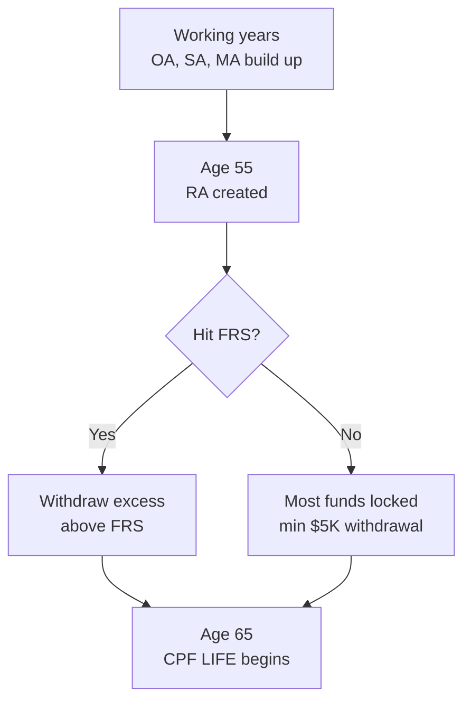

# Day 33 - Understanding CPF and CPF LIFE: The Singapore Foundation

> **The one idea for today:** Every Singaporean client's plan starts with CPF - young or old. A 28-year-old wants to know "when can I buy my BTO?". A 58-year-old wants to know "how much will I get from CPF LIFE?". Same system, two questions. If you can't answer either, you can't recommend anything on top.

## What you'll walk away with

By the end of today you should be able to:

1. **Recite from memory** the contribution rates and the OA allocation for a young adult.
2. **Estimate** how long it takes a young adult to fund a BTO/HDB/condo downpayment from OA alone.
3. **Explain** the 4 CPF accounts, key milestone ages (55, 65), and the 3 CPF LIFE plans.

---

## 1. CPF in one paragraph

The Central Provident Fund is Singapore's mandatory savings system. Both employee and employer contribute every month. Money is split across four accounts. Younger members contribute the most (37% combined) and the bulk goes to OA for housing. As a member ages, total rates fall and a larger share is redirected to retirement and healthcare. At 55, a Retirement Account (RA) is created. At 65, CPF LIFE starts paying out for life.

For an FC: CPF is the floor every plan stands on. Quote it before you quote any product.

## 2. The 4 accounts (memorise the rates)

| Account | Used for | Interest (current) |
|---|---|---|
| **OA - Ordinary** | Housing, insurance, education, investment | 2.5% floor, up to 3.5% |
| **SA - Special** | Retirement-related investments | 4% floor, around 4-5% |
| **MA - MediSave** | Hospitalisation, approved medical insurance | 4% floor, around 4-5% |
| **RA - Retirement** | Created at 55; funds CPF LIFE payouts | Around 4-5% |

**Extra interest:** +1% on the first $60,000 of combined balances (OA portion capped at $20,000). Members 55+ get another +1% on the first $30,000. Maximum extra: $600/year before 55, $900/year after.

---

## 3. Contribution rates and caps (memorise these)

**Total CPF rate by age (employer + employee, % of monthly salary):**

| Age band | Employer | Employee | Total |
|---|---:|---:|---:|
| 55 and below | 17% | 20% | **37%** |
| Above 55 - 60 | 13% | 13% | 26% |
| Above 60 - 65 | 9% | 7.5% | 16.5% |
| Above 65 | 7.5% | 5% | 12.5% |

**Contribution caps (drill these):**

- **Monthly Ordinary Wage ceiling: $6,800.** Anything above $6,800 a month is taken home in full, no CPF.
- **Annual cap (salary + bonus): $102,000.** Once year-to-date wages hit $102,000, no more CPF that year.
- **Maximum CPF per year per job: $37,740** ($102,000 x 37%).
- Future: monthly ceiling rises to $8,000 post-2026; annual cap will eventually become $136,000, max contribution $50,320.

---

## 4. For young adults: where does your CPF money go each month?

**The number to memorise (under-35 band):**

> Total CPF = 37% of gross salary.
> Of that 37%, about **62% goes to OA, 16% to SA, 22% to MA**.
> Net: **about 23% of your gross salary lands in OA every month.**

**Quick mental math (under 35):**

> **Monthly OA contribution = gross salary x 23%.**

| Gross salary | Monthly OA | Annual OA |
|---:|---:|---:|
| $3,500 | $805 | $9,660 |
| $4,500 | $1,035 | $12,420 |
| $6,000 | $1,380 | $16,560 |
| $6,800 (ceiling) | $1,564 | $18,768 |

(Salaries above $6,800 a month don't add more CPF - the ceiling caps it.)

### How long until you can buy a BTO / HDB / condo?

Singapore property downpayment rules of thumb:

- **HDB BTO with HDB loan:** 20% downpayment, can be 100% from CPF OA.
- **HDB resale with bank loan:** 25% downpayment, 5% cash + up to 20% from CPF OA.
- **Private condo with bank loan:** 25% downpayment, 5% cash + up to 20% from CPF OA.

**Worked example - 25-year-old earning $4,500/month, eyeing a $550K BTO at age 30:**

- Monthly into OA: $4,500 x 23% = $1,035.
- 5 years of contribution: $1,035 x 60 months = $62,100 (excludes interest).
- With 2.5% OA interest compounding: closer to $66,000.
- BTO downpayment needed (HDB loan, 20%): $110,000.
- **Verdict:** OA alone gets him to about 60% of the downpayment by 30. The gap (around $44K) needs cash savings, parents' help, or a longer runway.

**Worked example - 28-year-old couple, combined gross $9,000, eyeing a $700K resale flat at age 32:**

- Combined monthly OA: $9,000 x 23% = $2,070.
- 4 years of contribution: $2,070 x 48 = $99,360 (around $104K with interest).
- Downpayment needed (HDB loan, 20%): $140,000.
- **Verdict:** Around 75% of the downpayment from CPF OA alone. Gap is $36K - achievable with $750/month combined cash savings.

**Use this in conversation.** When a 25-year-old says "I have no idea when I can afford a BTO," you can run the math live in 60 seconds and turn it into a plan.

### For young adults: the CPF mistakes to flag

1. **Don't assume your OA is your "deposit account."** Money in OA can pay for the flat but stops compounding at 2.5%. Cash savings beat OA only if you have a higher-yielding alternative.
2. **MediSave fills first, then overflows.** Once MA hits the Basic Healthcare Sum, the overflow goes to SA - more retirement savings without you doing anything.
3. **CPFIS is rarely worth it for a young adult.** Most CPFIS investors underperform OA's 2.5% floor. Don't move money out of OA into funds unless the case is overwhelming.

---

## 5. The CPF timeline - key ages

### Age 55 - the first decision point

A **Retirement Account (RA)** is created automatically. SA and OA transfer in up to the Retirement Sum.

| Tier | What it does |
|---|---|
| **Basic Retirement Sum (BRS)** | Lower payout. Member can pledge property to keep only BRS in RA. |
| **Full Retirement Sum (FRS)** | Default payout. Roughly 2x BRS. |
| **Enhanced Retirement Sum (ERS)** | Highest payout. Roughly 3x BRS. |

**At 55 you can withdraw:**
- The excess above FRS in OA + SA, OR
- $5,000 minimum if you don't have FRS (the rest stays locked).

### Age 65 - CPF LIFE begins

CPF LIFE is a **lifelong annuity**. Three plans:

| Plan | Payout profile | Best for |
|---|---|---|
| **Basic** | Lower monthly payout, larger bequest | Members who want to leave more behind |
| **Standard** (default) | Moderate payout, moderate bequest | Most members |
| **Escalating** | Starts lower, +2% p.a. for life | Members worried about inflation |

**Key insight:** CPF LIFE pays for life. The member cannot outlive the payout. That solves the single biggest retirement risk: longevity.

### Two things to know about CPF LIFE that surprise clients

1. **CPF LIFE pays more than a commercial annuity** for the same premium, because the +1%/+2% extra interest keeps accruing on RA balances above $60K right up to age 65 - the actuary prices that in.
2. **BRS / FRS / ERS payouts are NOT proportional.** Doubling the sum doesn't double the payout, because the same fixed extra interest ($900/yr) is spread across different bases. Don't tell clients "BRS is better value" - the math is non-linear, all three are sound.

### CPF LIFE plan choice - advisory rule

Before age 64-65: assume Standard for all planning. Only discuss plan choice when the client is approaching 65. When the time comes, send them to CPF Board for a consultation first, listen to what they decide, and only intervene if the choice contradicts their situation.

---

## 6. The client conversation frame (works for any age)

Walk them through their CPF in this order:

1. **"Do you know how much goes into your CPF every month?"** Most don't. Share the 37% rule.
2. **"Do you know your balance?"** Half don't. Get them to log in.
3. **(If under 40) "Do you know how much OA you'll have when you want to buy a flat?"** Use the 23% rule.
4. **(If 40+) "Do you know what your CPF will pay you at 65?"** Use the CPF calculator.
5. **"Is that enough?"** Compare to the goal. There's almost always a gap.
6. **"Let's plan how to close the gap."** This is where your products fit in.

The wrong move: skip CPF, pitch a product. Clients see through it. The right move: educate first, recommend second.

---

## 7. Common CPF questions (one-line answers)

- **"Should I top up SA for tax relief?"** Up to $8K personal RSTU and $8K family. Good for high-income clients who can wait until 55+.
- **"Should I invest OA via CPFIS?"** Only if you can consistently beat OA's 2.5% floor net of fees. Most can't.
- **"Should I use OA to pay my mortgage?"** Compare mortgage rate vs OA rate. If mortgage < 2.5%, paying with cash and letting OA grow often wins.
- **"Is CPF mine when I die?"** Yes - distributed by CPF nomination, not your will. Every client should confirm their nomination is current.

---

## 8. Why a CPF top-up is often the best "product" you can recommend

For many clients, the best advice is **"top up your SA."**

- Guaranteed 4% floor.
- Tax relief up to $8K personal RSTU.
- Forced saving until 55.
- Compounding on a locked base.

You earn no commission for that advice. Which is exactly why it builds trust. The client who hears "top up SA before you let me sell you anything" remembers - and stays for 20 years.

---

## Quick quiz

1. **Under age 35, the share of a young adult's gross salary that lands in OA each month is closest to:**
 - A) 13%
 - B) 23% (correct)
 - C) 37%
 - D) 6%

 **Why:** Total CPF is 37%. For the under-35 band, around 62% of that goes to OA (the rest to SA and MA), so 37% x 62% is about 23% of gross salary into OA. 13% (A) is closer to the SA + MA combined share. 37% (C) is the total CPF rate, not OA alone. 6% (D) is roughly the SA share.

2. **The Monthly Ordinary Wage ceiling for CPF contributions is currently:**
 - A) $6,000
 - B) $6,300
 - C) $6,800 (correct)
 - D) $8,000

 **Why:** As of September 2024 the ceiling is $6,800. $6,000 (A) was the ceiling up to 2022. $6,300 (B) was the 2023 figure. $8,000 (D) is the announced post-2026 ceiling.

3. **A 26-year-old earning $4,500/month wants to buy a $550K BTO at 30. From OA alone, by age 30 he will have about:**
 - A) $25,000
 - B) $40,000
 - C) $66,000 (correct)
 - D) $110,000

 **Why:** OA contribution is $4,500 x 23% = $1,035/month. Over 5 years that is around $62,100 in contributions, growing to roughly $66K with 2.5% OA interest. The full downpayment ($110K) is option D - twice what OA alone delivers, which is the gap the FC needs to surface.

4. **At age 55, what happens?**
 - A) All CPF becomes accessible
 - B) The Retirement Account is created; excess above FRS can be withdrawn (correct)
 - C) CPF LIFE starts paying out
 - D) CPF rates increase

 **Why:** The RA is created automatically and SA + OA transfer in up to the Retirement Sum; only excess above FRS can be withdrawn. (A) is wrong because most stays locked if FRS is unmet. (C) CPF LIFE begins at 65, not 55. (D) Rates fall with age, not rise.

5. **A client worried about inflation eroding her retirement income should choose which CPF LIFE plan?**
 - A) Basic
 - B) Standard
 - C) Escalating (correct)
 - D) None - CPF LIFE has no inflation feature

 **Why:** Escalating starts lower and rises 2% per year for life - the only plan with a built-in inflation step-up. Basic prioritises bequest. Standard pays the highest initial amount but is fixed. (D) is false: Escalating exists precisely for inflation risk.

6. **Why would an FC recommend a CPF SA top-up even though there is no commission?**
 - A) MAS regulations require it before any sale
 - B) It demonstrates that the FC's incentives align with the client, which builds long-term trust (correct)
 - C) It guarantees referrals
 - D) It is a tax loophole

 **Why:** Recommending an action that costs the FC commission proves the advice is for the client's benefit - this is the foundation of a 20-year relationship. (A) MAS does not mandate this. (C) Referrals may follow but aren't guaranteed. (D) RSTU is a legitimate tax relief, not a loophole.

7. **The annual CPF contribution cap (salary + bonus combined) is currently:**
 - A) $37,740
 - B) $81,600
 - C) $102,000 (correct)
 - D) $136,000

 **Why:** The annual cap is $102,000 (17 x $6,000, kept at $102K even after the monthly ceiling rose). $37,740 (A) is the maximum CPF per year per job (102,000 x 37%). $81,600 (B) is 12 x $6,800, the annual ordinary wage ceiling, not the total cap. $136,000 (D) is the announced future cap once the monthly ceiling reaches $8,000.

---

## Related

- Previous: [[day-32|Day 32 - Rule of 72 Applied]]
- Next: [[day-34|Day 34 - What Are Investments?]]
