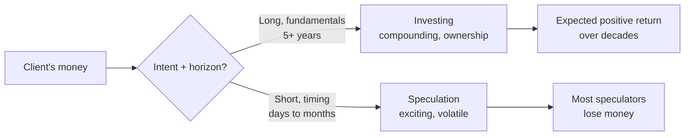
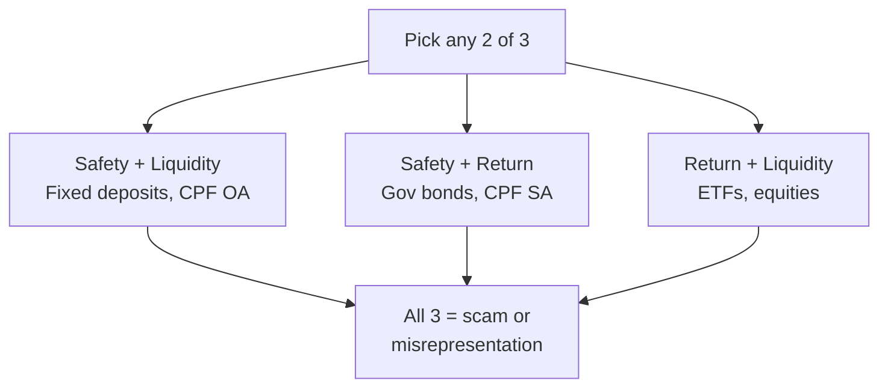

# Day 34 - What Are Investments?

> **The one idea for today:** Most clients say "I invest" but what they're doing is speculating - chasing short-term moves without a plan. Your job is to know the difference, and teach it. A portfolio built on investing compounds. A portfolio built on speculation gets washed out.

## What you'll walk away with

By the end of today you should be able to:

1. **Distinguish** investing from speculation, and identify which your client is actually doing.
2. **Describe** the 5 common investment product categories in 60 seconds each.
3. **Match** an investment type to a client's risk tolerance, time horizon, and goal.
4. **Run** a long-term growth illustration live using the Long-Term Investment Illustrator.

---

## 1. What is an investment?

**Formal definition:** An investment is an **asset or item acquired with the goal of generating income or appreciation.**

- **Generating income** - dividends, interest, rent, coupons.
- **Appreciation** - the asset's value rises over time.

**Not investments:**
- Buying a new car ("it's an investment in mobility") - no, it's a depreciating liability.
- Buying a watch ("it'll hold value") - usually no, unless you're a serious collector with an exit plan.
- Buying a handbag, a phone, or a designer item - no, these are consumption goods.

**The test:** does holding this asset produce income or rise in value over time, on average? If yes, investment. If no, consumption.

## 2. Investing vs Speculation - the critical distinction

| | **Investing** | **Speculation** |
|---|---|---|
| Time horizon | Long (5+ years typical) | Short (days to months) |
| Goal | Ownership, compounding | Capture short-term price moves |
| Method | Fundamentals, research, diversification | Timing, momentum, news |
| Emotional profile | Boring, steady | Exciting, volatile |
| Typical outcome | Positive expected return over decades | Most speculators lose money |

**Example - investing:** Buying a broad-market ETF and holding for 20 years. Rebalancing annually. Reinvesting dividends.

**Example - speculation:** Buying a "hot" cryptocurrency because a YouTube influencer said it would 10x. Selling when it drops 20%.

**What clients usually do:** mix both, believe they're investing, and get hurt by the speculation part.

**Your job with clients:** help them **separate** their two pots. "This pot is for long-term compounding. This pot is your 'fun money' for speculation - cap it at 5% of your portfolio." Most people haven't made this separation explicit.

## 3. The 5 common investment product categories

### Shares / Stocks
**What they are:** Equity ownership in a company, bought via a stock exchange.

**Return sources:**
- **Capital gains** - if the share price rises.
- **Dividend income** - if the company distributes profits.

**Risk:**
- Price fluctuations (short-term can be severe).
- If the company fails (winds up), shareholders can lose everything.

**Best for:** clients with long time horizons and stomach for volatility. Individual stocks are high-risk; diversified holdings lower the risk.

### Exchange-Traded Funds (ETFs)
**What they are:** Funds listed on a stock exchange that track an index (e.g., S&P 500, STI).

**Return sources:**
- Broad market exposure - rises as the underlying index rises.
- Some ETFs pay dividends.

**Risk:**
- Price fluctuations (but diversified across many companies, so single-company risk is absorbed).
- Passive structure - no one is trying to outperform the index.

**Best for:** most retail investors who want diversified exposure with low fees. The default recommendation for many new investors.

> **A word on the S&P 500 specifically - plant this seed early.** The S&P 500 is the single most popular ETF target for Singaporean retail investors, and it has been the best-performing major index for around 15 years. That doesn't make it default-safe for a Singaporean. Four quiet costs sit on top of the market return: (1) a **30% US dividend withholding tax** on US-domiciled ETFs (VOO, SPY, VTI - Irish-domiciled like CSPX or VWRA drops this to 15%); (2) **USD/SGD currency risk** - DBS is forecasting SGD parity with USD by 2040, around 35% headwind on USD assets; (3) **40% US estate tax** above a $60K exemption for non-US persons on US-situs holdings; (4) **concentration risk** - from 2000 to 2010 the S&P 500 returned -9% while international small-cap value returned +191%. None of these make the S&P 500 a bad index. They make it a more complicated holding than most DIY prospects realise. You'll unpack the full conviction stack in [[day-52|Day 52 - Retirement Step-by-Step CST]] and [[day-57|Day 57 - Investment-Linked Plans]]; for now, file it away as "there is no such thing as a free 10-year S&P bet for a Singaporean."

### Unit Trusts / Mutual Funds
**What they are:** Money pooled from many investors, managed by a **fund manager** according to a specific mandate.

**Return sources:**
- Capital gains + income from the portfolio.
- Potentially outperforms (or underperforms) the relevant benchmark.

**Risk:**
- Market risk.
- **Fund manager risk** - active management means a poor manager can drag returns.
- Fees are higher than ETFs.

**Best for:** clients who want professional active management, or access to specialist strategies (sector funds, emerging markets, thematic).

### Bonds
**What they are:** Debt issued by governments or companies. You lend them money; they pay you interest (coupons) and return your principal at maturity.

**Return sources:**
- Coupon payments (fixed or variable).
- Capital gain if held and sold before maturity (bond prices change with interest rates).

**Risk:**
- Default risk (issuer fails to pay).
- Interest rate risk (bond prices drop if rates rise).
- Inflation risk (fixed coupons lose real value).

**Best for:** conservative clients, pre-retirees needing stable cash flow, or for balancing a portfolio's volatility.

### Property (direct ownership)
**What it is:** Owning a property (usually residential or commercial) for rental income or capital appreciation.

**Return sources:**
- Rental income (minus all costs - tax, maintenance, vacancy).
- Capital appreciation over the long term.

**Risk:**
- Illiquid (can't sell quickly).
- High transaction costs.
- Concentrated - one property is one bet.
- Tenant / vacancy risk.

**Best for:** clients with significant capital, strong cash flow, long horizons, and willingness to deal with operational complexity.

## 4. The trade-off truth

> **An investment that is guaranteed, offers extremely high returns, and has a short time horizon - does not exist.**

There is always a trade-off between **safety, return, and liquidity.** You can get two out of three - never all three.

| Safety | Return | Liquidity | Example |
|---|---|---|---|
| High | Low | High | Fixed deposits |
| High | Low | Low | Government bonds |
| Medium | Medium | High | ETFs |
| Medium | Medium | Low | Property |
| Low | High | Medium | Individual stocks |
| Low | High | Low | Private equity |

**When a client says "I want something that pays 10% with no risk, and I need access next year" - educate them on why that doesn't exist.** Anyone promising it is selling you a scam.

## 5. AIA's investment solutions - a brief map

You'll encounter these primarily through AIA's product set:

### Investment-Linked Plans (Wealth Focus)
- Insurance policy **structure**, money inside is invested in fund options.
- Low protection component; most of the premium goes into funds.
- Usually has bonus units and a lock-in period.
- **Best for:** clients who want tax-advantaged wrapping + forced savings discipline.

### Investment-Linked Plans (Protection Focus)
- Insurance policy focused on protection - the fund investment is secondary.
- Cash value grows from the funds, but insurance costs eat into growth.
- **Best for:** clients who want coverage + some growth, less for pure investment.

### Direct Funds
- Clients purchase AIA funds directly, outside an ILP wrapper.
- Simpler structure, lower costs than ILPs.
- **Best for:** clients who already have sufficient insurance protection and want pure investment exposure.

### Source of funds
Clients can invest using:
- **Cash.**
- **CPF OA/SA** via CPFIS (see Day 33 for cautions).
- **SRS (Supplementary Retirement Scheme)** - tax-deferred.

## 6. The risk-profile-first rule

Before recommending anything, match investment type to the client's risk profile:

| Risk tolerance | Portfolio example |
|---|---|
| Conservative | 80% bonds / cash, 20% equity |
| Moderate | 50% bonds, 50% equity |
| Balanced | 30% bonds, 70% equity |
| Growth | 10% bonds, 90% equity |
| Aggressive | 100% equity, with sector concentration |

**Risk profiling tools (questionnaires)** are used by all advisors. Use them. Never recommend investments above the client's assessed risk tolerance without a documented conversation about *why* the client is comfortable going higher.

### The failure pattern

Recommending aggressive portfolios to conservative clients gives you the standard tragedy: they panic on the first market drop, sell at the bottom, and distrust you and the industry forever.

**Match profile to product.** Always.

## 7. Common client misconceptions to correct

**"I don't trust the market, I'll just keep it in the bank."**
> Show them the Total Wealth Concept (Day 14): cash isn't safe - inflation erodes it, while passive income covering expenses is the real freedom number.

**"I'll start investing once I have more money."**
> Show them the early-start math (Day 29). Waiting is expensive.

**"Investing is gambling."**
> No - that's speculation. Investing over 20+ years in a diversified portfolio has never historically lost money.

**"My friend made 40% in crypto, I want to do that."**
> Speculation. For every friend who made 40%, ten quietly lost money and don't post about it.

**"I want something that guarantees 8%."**
> Doesn't exist. Educate. Offer a realistic alternative (diversified portfolio targeting 5-7% over long horizon).

---

## 8. Hands-on: the Long-Term Investment Illustrator

Numbers don't land until a client *sees* them. Spend the next 10 minutes inside the Long-Term Investment Illustrator and learn to drive it - this is the tool you'll pull up in front of clients to show how their money grows (or doesn't) over decades.

**Open it now:** [Long-Term Investment Illustrator](https://present.financeillustrator.com/long-term-investment-illustrator)

(Root URL: [present.financeillustrator.com](https://present.financeillustrator.com) - the suite has other calculators too. We'll only use this one today.)

### What it does

A 5-tab illustrator that takes an age, a monthly contribution (or a target lump sum), a return assumption, and a horizon - and plots the projected growth on a chart with a results sidebar. It also lets you stress-test the plan with premium holidays, withdrawals, dividend mode, and competitor charge structures.

### The 5 tabs in plain language

| Tab | What you put in | What you see |
|---|---|---|
| **Premium** | Age, monthly contribution, investment period, return rate | The growing balance year by year - the "if I save $X/month from age Y, what do I get?" view |
| **Financial Goal** | Age, target amount, retirement age, return rate | Back-solves the required monthly premium - the "I want $1M at 65, what does it take?" view |
| **Education Planning** | Child's age, age funds are needed, return rate | Inflation-adjusted university costs (local, overseas, med school, MBA) and what to set aside |
| **Competitor Illustrator** | Initial charge rate, perpetual charge rate, charge period | Compares your plan vs. a competitor structure - the gap caused by fees over 20-30 years |
| **Other Details** | Notes, scenario notes, summary | Wraps the result for client handover |

### The 4 reps to do today (do all four)

**Rep 1 - "Save $500/month from 30 to 65 at three return rates."**
- Tab: Premium.
- Age 30, monthly $500, period 35 years (to age 65), return 4%.
- Note the final number. Re-run at 6% and 8%. Note how the gap between 4% and 8% grows non-linearly.
- *Lesson for clients:* small differences in return create huge differences in outcome.

**Rep 2 - "I want $1M at 65, I'm 35 today."**
- Tab: Financial Goal.
- Age 35, target $1,000,000, retirement age 65, return 6%.
- Note the required monthly amount. Then change return to 8% and 4%. Compare.
- *Lesson for clients:* the goal is the same; the path depends on what return you assume. Realistic > optimistic.

**Rep 3 - "Overseas university for a 5-year-old."**
- Tab: Education Planning.
- Child age 5, target age 19, return 6%.
- Note the inflation-adjusted overseas figure. Show the gap between local ($50K today) and overseas ($200K today).
- *Lesson for clients:* education inflation is real - the headline figure is much larger when the kid actually goes.

**Rep 4 - "Stress-test the plan."**
- Open Advanced Options on Premium tab.
- Add a **premium holiday** (no contribution from age 45 to 50 - simulating a job loss or career break). Re-run. Note how much it costs.
- Add **regular withdrawals** (e.g., $2,000/month from age 60). See the balance deplete.
- Toggle **dividend mode** to flip from total-return view to "live off the dividends."
- *Lesson for clients:* the projection assumes nothing goes wrong. Show them the cost of the things that usually do.

### How to use it in a client meeting

1. **Open it on your laptop in front of them.** Don't email a screenshot - run it live.
2. **Use their numbers.** Their actual age, their actual savings rate, the return assumption you're comfortable defending.
3. **Run two scenarios side by side.** Conservative vs. their stated goal. The gap is the conversation.
4. **Save the result.** Use the Other Details tab for the summary they take home.
5. **Don't over-promise.** The chart is only as honest as the assumptions. Anchor the return assumption in a defensible number (e.g., 5-6% for a balanced portfolio over 20 years), not the eye-popping S&P 500 last-decade figure.

**Pass criteria for today:** you can pull up the illustrator, complete Rep 1 to Rep 4, and explain the chart out loud in under 90 seconds per scenario. If you can't, drill it again before tomorrow.

---

## Quick quiz

1. **The core difference between investing and speculation:**
 - A) Amount invested
 - B) Time horizon and intent - ownership/compounding vs short-term timing (correct)
 - C) Type of asset
 - D) Tax treatment

 **Why:** Investing is defined by long time horizons, fundamental research, and ownership for compounding; speculation is defined by short-term price timing regardless of underlying value. The same asset (e.g., an equity) can be either, depending on why and how long you hold it. Amount (A) and tax treatment (D) are irrelevant to the definition. Type of asset (C) can overlap - you can speculate on bonds and invest in equities.

2. **An investment promising guaranteed high returns with short time horizon:**
 - A) Is rare but exists
 - B) Exists for accredited investors only
 - C) Doesn't exist - trade-offs between safety, return, and liquidity are unavoidable (correct)
 - D) Requires deep market expertise to find

 **Why:** The trade-off triangle between safety, return, and liquidity is a fundamental constraint - you can get two of the three, never all three simultaneously. Any product claiming otherwise is either a scam or misrepresenting one of the three dimensions. It does not become available to accredited investors (B) - the laws of finance apply equally at all wealth levels. Expertise (D) cannot manufacture risk-free high returns; it can only improve probability of good risk-adjusted returns.

3. **The default recommendation for a moderate-risk retail investor is often:**
 - A) Individual stocks
 - B) Direct property
 - C) Diversified ETFs or balanced funds (correct)
 - D) Unit trusts only

 **Why:** Diversified ETFs or balanced funds give moderate-risk retail investors broad market exposure, low fees, and single-company risk absorption - the right tool for the profile. Individual stocks (A) carry concentrated company risk that mismatches a moderate risk profile. Direct property (B) is illiquid, capital-intensive, and operationally complex - not a default for retail investors. Unit trusts (D) are one valid option but their higher fees and active manager risk make them not universally preferred over passive ETFs.

4. **A client says "I made 40% in crypto last year - I want to put my whole retirement fund into it." As their advisor, you should:**
 - A) Comply - the client's risk tolerance overrides all other considerations
 - B) Recommend the highest-returning fund in your product range as a compromise
 - C) Explain the distinction between speculation and investing, separate the "fun money" pot, and cap speculative exposure at a small percentage (correct)
 - D) Decline to advise further until the client has passed a financial literacy test

 **Why:** Your role is to educate and advise, not simply comply - especially when a client is confusing speculation with investing. Compliance (A) abdicates the advisory duty; the client is not qualified to override a retirement-critical decision without understanding the risk. Recommending a high-return product (B) is just a different form of speculation-chasing that still skips the education step. Declining to advise (D) is unhelpful and not required by any regulatory standard.

5. **Which combination of attributes is impossible to find in a single investment product?**
 - A) High safety and low liquidity
 - B) High return and low safety
 - C) Guaranteed high returns, very short time horizon, and full liquidity (correct)
 - D) Low return and high safety

 **Why:** C combines all three desirable properties at once - guaranteed high return (safety + return), short horizon (liquidity in time), and full liquidity. The trade-off framework says you can only have two of the three. High safety and low liquidity (A) is achievable - government bonds are an example. High return and low safety (B) describes equities or private equity. Low return and high safety (D) describes cash and fixed deposits.

6. **A conservative client is placed into an aggressive 100%-equity portfolio because the projected returns look better. What is the most likely negative outcome?**
 - A) The client earns too much and triggers additional tax
 - B) The client panics on the first market drop, sells at the bottom, and permanently distrusts the advisor and the industry (correct)
 - C) MAS issues a compliance warning against the advisor
 - D) The portfolio underperforms a balanced fund over 20 years

 **Why:** The day explicitly names this as the failure pattern: a mismatch between risk profile and portfolio leads to panic selling at the worst moment, locking in losses and destroying the relationship. Earning too much and triggering tax (A) is not a realistic risk for equity portfolios in Singapore's tax environment. A MAS compliance issue (C) is possible but the more immediate and human consequence is the client outcome described in B. Underperformance (D) is possible but secondary - the bigger harm is behavioural, not statistical.

7. **The key difference between a Wealth Focus ILP and a Protection Focus ILP is:**
 - A) Only Wealth Focus ILPs allow CPF OA/SA as the funding source
 - B) Wealth Focus ILPs direct most of the premium into funds with minimal insurance; Protection Focus ILPs prioritise coverage, with insurance costs reducing fund growth (correct)
 - C) Protection Focus ILPs carry no market risk because returns are guaranteed
 - D) Wealth Focus ILPs cannot be surrendered before maturity

 **Why:** The structural difference is in how the premium is split between insurance charges and fund investment - Wealth Focus minimises the insurance component so more money compounds, while Protection Focus makes insurance coverage the primary objective. Both types of ILP can potentially use CPF OA funding through CPFIS (A is false). Protection Focus ILPs still invest in funds and carry full market risk (C is false). Both ILP types can generally be surrendered, subject to surrender charges (D is false).

8. **In the Long-Term Investment Illustrator, the Financial Goal tab is best for answering which question?**
 - A) "What inflation-adjusted figure do I need for my child's overseas university in 14 years?"
 - B) "If I save $500/month from 30 to 65 at 6%, what do I end up with?"
 - C) "I want $1M at 65 and I'm 35 today - what monthly contribution does that take?" (correct)
 - D) "How much does the competitor's plan cost me in fees over 30 years?"

 **Why:** The Financial Goal tab back-solves the required monthly contribution given a target amount, age, retirement age, and return rate - exactly the question in C. (A) is the Education Planning tab. (B) is the Premium tab (target unknown, contribution known). (D) is the Competitor Illustrator tab.

---

## Related

- Previous: [[day-33|Day 33 - Understanding CPF]]
- Next: [[day-35|Day 35 - Inflation: The Silent Wealth Killer]]
