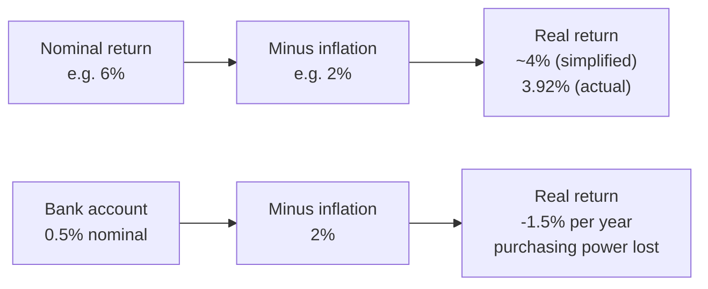
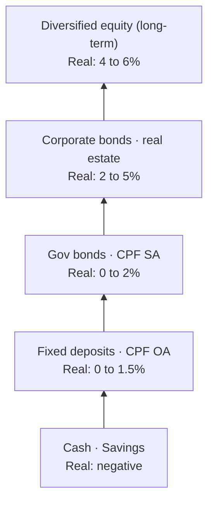

# Day 35 — Inflation: The Silent Wealth Killer

> **The one idea for today:** Inflation doesn't show up as a "loss" on anyone's statement. Which is exactly why it destroys wealth. Every plan you build must account for it — or you're planning your client to run out of money 15 years into retirement.

## What you'll walk away with

By the end of today you should be able to:

1. **Calculate** the future cost of today's expenses with inflation adjustment.
2. **Explain** the difference between nominal and real returns — and why clients need real returns.
3. **Address** the most common client misconceptions about inflation.

---

## 1. What inflation actually does

Inflation is the rate at which **prices rise** over time. In Singapore, long-term averages are around **2% p.a.** (general inflation), higher for specific categories (education: 5–8%, healthcare: 4–6%).

**The silent part:** inflation doesn't subtract money from your account. It subtracts **what your money can buy.**

- Your bank account shows $100,000 today.
- Your bank account shows $100,000 in 10 years.
- But that $100,000 buys roughly **what $82,000 buys today.**

Nothing has "disappeared" from your statement. You've just lost **purchasing power** — silently.

## 2. The 20-year impact

Using Rule of 72 (Day 32):
- 2% inflation → prices double every 36 years.
- 3% inflation → prices double every 24 years.
- Over 20 years at 2%, prices rise about **1.5×**.
- Over 20 years at 3%, prices rise about **1.8×**.

### The client example

**Jane, age 25, yearly expenses = $24,000 today.**
**Target retirement age: 55.** (30 years away.)
**Assume 2% inflation.**

**At 55, Jane's equivalent expenses will be:**
- $24,000 × (1.02)^30 = **~$43,473/year**
- Or about **$3,600/month** (vs $2,000/month today).

Same lifestyle. Nearly double the monthly expense in future dollars.

**The question clients don't ask:** "When I plan for retirement, am I planning for $2,000/month in today's dollars, or $3,600/month in future dollars?" Most plan for the today number. Then run out.

## 3. Nominal vs Real returns

This is the single most important distinction in investment education.

**Nominal return:** the actual % growth of your money.
**Real return:** the growth *after* subtracting inflation. This is what actually matters for your purchasing power.

### Simplified formula

> **Real return ≈ Nominal return − Inflation rate**

### Actual formula (more precise)

> **Real return = (1 + nominal) / (1 + inflation) − 1**

### Examples

| Scenario | Nominal | Inflation | Real (simplified) | Real (actual) |
|---|---:|---:|---:|---:|
| Bank account | 0.5% | 2% | −1.5% | −1.47% |
| Fixed deposit | 2% | 2% | 0% | 0% |
| Endowment | 4% | 2% | 2% | 1.96% |
| Balanced portfolio | 6% | 2% | 4% | 3.92% |
| Aggressive portfolio | 8% | 2% | 6% | 5.88% |
| Bank during high inflation | 0.5% | 5% | −4.5% | −4.29% |

**The killer insight:** a client whose "savings" earn 0.5% in the bank during 2% inflation is **losing purchasing power by 1.5% every year.** Over 30 years, this compounds to ~35% of their wealth **silently gone.**

No statement ever shows this. But it's real.

## 4. Why clients under-react to inflation

**Behavioural reasons:**
- Prices rise gradually. Humans don't notice slow change.
- Paychecks often rise too, masking the effect.
- Most products are invisibly re-sized (smaller chocolate bars, "shrinkflation").

**Educational gap:**
- Schools don't teach inflation.
- Most people have never calculated the real impact on their own finances.

**Your job:** make inflation **visible** with concrete numbers. $5 kopi today → $9 kopi in 30 years isn't abstract — it's a number they can feel.

## 5. The hierarchy of "inflation beaters"

Different assets beat inflation at different rates:

| Asset | Typical long-term return | Real return (vs 2% inflation) |
|---|---|---|
| Cash / Savings | 0.5–1% | **Negative** |
| Fixed deposits | 2–3% | 0 to 1% |
| CPF OA | 2.5–3.5% | 0.5–1.5% |
| Government bonds | 2–4% | 0–2% |
| CPF SA / MA | 4% | 2% |
| Corporate bonds | 4–6% | 2–4% |
| Diversified equity (long-term) | 6–8% | 4–6% |
| Real estate (long-term) | 4–7% | 2–5% |

**The asset allocation implication:** for a plan to grow **real wealth**, at least part of the portfolio must be in assets returning above inflation. For a retirement plan with 25+ year horizon, that usually means some equity exposure.

100% cash portfolios guarantee a real loss over any reasonable retirement horizon. This is why "keeping it in the bank" is one of the worst long-term decisions a client can make.

## 6. Category-specific inflation

**Warning:** general inflation (CPI) is ~2% in Singapore, but specific categories inflate faster.

| Category | Typical annual inflation |
|---|---|
| General CPI | 2% |
| Food | 2–3% |
| Housing | 2–4% |
| **Healthcare / Medical** | **4–6%** |
| **Education** | **5–8%** |
| **Private hospital care** | **6–10%** |

**The implication for planning:**

- **Healthcare plans** must inflate faster than general CPI. A $200K hospital plan today may feel inadequate in 20 years.
- **Education plans** must use education-specific inflation (Day 32's 8% example).
- **Retirement living** should assume general CPI unless the client has specific high-inflation expense categories.

**The best planning practice:** match the inflation assumption to the expense category. Don't use 2% across everything.

## 7. What to tell clients who are "keeping it safe"

The classic client line: **"I don't want to risk my money. I'll just keep it in the bank."**

**Your response:**

> "I understand the instinct. But let's look at the math. Your $100,000 in the bank today will still show $100,000 in 20 years. But with 2% annual inflation, it'll buy what $67,000 buys today. You've silently lost $33,000 of purchasing power — without a single bad statement to show for it.
>
> The risk isn't market volatility. The risk is **not keeping up with inflation.** It's slower, quieter, and more certain than market losses.
>
> Let me help you build a portfolio that matches your real risk tolerance while at least keeping pace with inflation. You'll sleep better knowing the purchasing power is protected."

**Most clients have never heard this reframe.** It often changes the conversation.

## 8. Inflation-aware product recommendations

Certain products handle inflation better than others. Keep this in mind:

- **CPF LIFE Escalating Plan** — 2% annual payout increase. Built for inflation.
- **Participating endowments with non-guaranteed returns** — historically have kept up with inflation via bonuses.
- **ILPs with growth-oriented funds** — equity exposure gives real return potential.
- **Fixed payouts on 30-year plans** — danger zone. $3,000/month sounds great today; in 30 years, it's $1,650/month in real terms.

**When presenting a product:** always illustrate the **future dollars AND today's purchasing power.** Clients need both numbers to evaluate properly.

## Quick quiz

1. **The simplified formula for real return is:**
 - A) Nominal × inflation
 - B) Nominal + inflation
 - C) Nominal − inflation ✓
 - D) Inflation / nominal

 **Why:** Real return is what remains of your nominal growth after inflation has taken its share of purchasing power — a subtraction, not a multiplication, addition, or division. Multiplying (A) would produce an astronomically large number with no financial meaning. Adding (B) would give a higher number than nominal, which is logically wrong — inflation reduces, not enhances, real return. Dividing (D) produces a dimensionless ratio, not a return percentage.

2. **A client earning 2% in a fixed deposit with 2% inflation has a real return of:**
 - A) 2%
 - B) 0% ✓
 - C) 4%
 - D) −2%

 **Why:** 2% nominal − 2% inflation = 0% real return; the client's purchasing power is perfectly flat — they are neither growing nor losing real wealth. 2% (A) is the nominal return, ignoring inflation entirely. 4% (C) would result from adding rather than subtracting. −2% (D) would occur if inflation exceeded nominal return, which is not the case here.

3. **For retirement planning of $3,000/month in today's dollars, 30 years out at 2% inflation, the future dollar need is approximately:**
 - A) $3,500/month
 - B) $4,500/month
 - C) $5,400/month ✓
 - D) $8,000/month

 **Why:** $3,000 × (1.02)^30 ≈ $3,000 × 1.811 ≈ $5,433/month; the day's example rounds this to ~$5,400. $3,500 (A) implies only trivial inflation over 30 years. $4,500 (B) is roughly 20 years of 2% inflation — correct time period is 30, not 20. $8,000 (D) would require roughly 3.5% inflation sustained for 30 years, not 2%.

4. **A client insists "my money is safe in the bank." The most accurate reframe is:**
 - A) Banks are riskier than they appear because of counterparty risk
 - B) The nominal balance is safe, but purchasing power erodes silently at the inflation rate each year ✓
 - C) Bank interest is taxable, making it inferior to all other assets
 - D) The government guarantee only covers the first $75K

 **Why:** The bank's nominal safety is real — the number on the statement doesn't fall — but purchasing power declines invisibly at the inflation rate every year, which is the actual risk for long-term wealth. Counterparty risk (A) is theoretically true for any institution but not the primary planning concern for SDIC-covered deposits. Bank interest in Singapore is not subject to income tax (C is incorrect). The government guarantee threshold (D) is a factual detail that does not address the inflation risk the client needs to understand.

5. **Jane keeps $100,000 in a savings account earning 0.5% while inflation runs at 2%. After 30 years, the real purchasing power of her account (in today's dollars) is closest to:**
 - A) $100,000
 - B) $85,000
 - C) $65,000 ✓
 - D) $45,000

 **Why:** The real return is 0.5% − 2% = −1.5% p.a.; $100,000 × (0.985)^30 ≈ $64,000 in today's purchasing power. $100,000 (A) assumes zero inflation impact, which is incorrect. $85,000 (B) implies only about a decade of 1.5% real loss, not 30 years. $45,000 (D) would require a larger negative real return (closer to −2.5% per year) than the actual −1.5%.

6. **When building an education savings plan, why is it wrong to use the general CPI rate of 2% as the inflation assumption?**
 - A) The CPI rate is a nominal figure and must be converted to a real rate first
 - B) Education inflation historically runs at 5–8% p.a. — using 2% will severely underestimate the future cost ✓
 - C) CPI only covers food and housing, not education
 - D) Education costs are fixed by government regulation and do not inflate

 **Why:** Education is a high-inflation category running at 5–8% p.a. — using the general 2% CPI will leave the plan 50–70% short of the actual future cost, a potentially mortgage-sized miscalculation. CPI is already an inflation rate — it does not need conversion to a real rate (A conflates concepts). CPI does cover a basket of goods including education (C is factually wrong). Education costs in Singapore are not frozen by regulation and have risen substantially (D is false).

7. **A product illustration shows a fixed payout of $3,000/month for 30 years starting at retirement. The main inflation risk of this structure is:**
 - A) The payout may be reduced if investment returns disappoint
 - B) The fixed $3,000 will represent only about $1,650/month in real purchasing power by year 30 at 2% inflation ✓
 - C) Fixed payouts trigger higher income tax in retirement
 - D) The insurer may convert the fixed payout to a variable one during the policy term

 **Why:** $3,000 × (1/1.02)^30 ≈ $1,655 in today's purchasing power — the payout is nominally stable but real value decays by roughly 45% over 30 years, which the client will feel as a gradually worsening retirement standard of living. A variable return reducing the payout (A) is a different risk — investment-linked, not inflation-linked — and fixed payouts by definition are not subject to return variability. Fixed annuity income in Singapore is not typically subject to income tax (C). An insurer converting fixed payouts to variable payouts mid-policy (D) would be a contract breach, not a standard inflation risk.

---

## Related

- Previous: [[day-34|Day 34 — What Are Investments?]]
- Next: [[day-36|Day 36 — TVM & Investment Practice Problems]]
