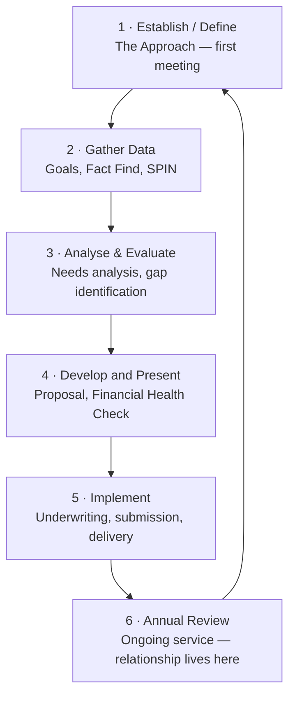
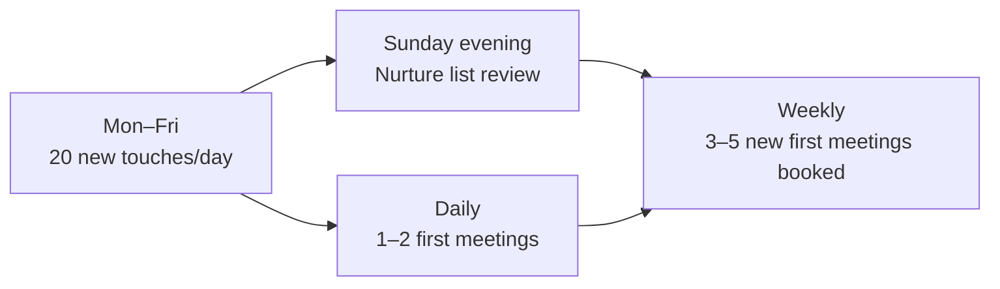

# Day 37 — The Approach: Cold, Warm, Follow-Up & Nurture

> **The one idea for today:** The Approach is not the first step to a sale — it's the first step to a **lifetime relationship.** Cold, warm, and referred prospects each need a different opener, a different follow-up rhythm, and a nurture plan that keeps them alive long after "not now."

## What you'll walk away with

By the end of today you should be able to:

1. **Open** a warm, cold, or referred conversation using a script you'd actually say out loud.
2. **Run** a 7-touch follow-up sequence after a first meeting — without feeling pushy.
3. **Nurture** a "not now" prospect for 6–12 months until they're ready.
4. **Structure** a weekly prospecting rhythm that generates 3–5 first meetings every week.

---

## 1. The 6-step Financial Planning Process — where the Approach sits

**The trap:** treating the Approach as "selling." It's relationship-building — the permission and trust that unlock Steps 2–6. Rush Step 1 and everything downstream breaks.

## 2. The CLV math that should govern every first meeting

- Year 1 commission on a typical client: **~$1,000.**
- Cross-sells + upgrades over 30 years: **20–30× the initial commission.**
- Average Client Lifetime Value: **~$25,000 per client.**
- 300 well-serviced clients over a career = **$7.5M in total lifetime value.**

**Implication:** a "small" first policy is the start of a 20-year relationship. You don't oversell the first meeting. You recommend the **one or two highest-priority gaps** and earn the right to return.

**"No one buys everything at one go."** Year 1: hospital + basic term. Year 3: CI after a scare. Year 5: regular savings. Year 8: ILP for the kid. Year 12: retirement top-ups. Year 25: estate planning. Same client, 7+ sales events.

## 3. Three prospect types — three different approaches

You cannot use the same opener on all three. The rest of today is the playbook for each.

---

## 4. Why warm comes before cold — the conviction test

Before any playbook, settle this: **if you can't do warm, you can't do cold either.**

*"I don't want to sell to my friends"* sounds humble. It isn't. It means you don't have conviction in what you do yet — because if what you do is genuinely valuable, helping your friends is not selling. It's being the best consultant they'll ever have.

Cold is rejection at scale. Volume. Brutality. Without conviction, you fold by week two. A purpose-driven advisor wants to serve their friends *and* stays standing through 100 rejections from strangers. **Same engine. Same belief. Different audience.**

So yes, the agency helps you with cold. But if you're skipping warm because it feels uncomfortable, cold will break you faster.

Warm prospecting is not *"hey, let's chat about insurance."* Warm is **being present.** Showing up. Being the person your friends already trust, so when life happens, you're the first call.

> The worst feeling in this job is finding out your friend bought from some random advisor who got there first. Don't let that be you.

### The Taxi Cab Theory — applied to insurance

Borrowed from *Sex and the City*: the right person catches you when you're in the right cab. Apply it here — **when your friend is finally ready to buy insurance, save for retirement, plan for their kids — they should be flagging down *your* cab, not a stranger's.**

That doesn't happen because you "closed" them. It happens because you stayed in their orbit. You called. You sent the article. You showed up at the wedding, the birthday, the funeral. You were the person they already trusted on the topic — long before they needed it.

Practical implications:
- Reach out to everyone in your warm circle and tell them you're doing this work. Don't pitch. Just inform.
- *"If they want to buy, they'd better buy from you first"* — that's the bar. If a friend bought from somebody else, it's because you weren't visible enough, not because they didn't trust you.
- Every warm case in early years can run **~$5K FYC at zero acquisition cost.** The "cost" people imagine is just ego — *"I don't want to sell to friends."* That ego costs you the relationship and the income.
- Done well, warm clients **stay with you for decades.** They call you for everything finance-related. You call them every year for a chit-chat. Both sides feel good. The work feels aligned, not transactional.

If reading this still feels uncomfortable, **the discomfort isn't about the prospects — it's about your own conviction.** Fix the conviction. Then read Section 5.

---

## 5. Warm approach playbook (Type A)

**The problem:** friends and family already have opinions about you. Push too hard and you destroy the relationship. Be too soft and they never take you seriously.

### The "market survey" opener

Don't pitch. Ask for feedback.

> "Hey — I've moved into financial advisory and I'm building up my skill. I'm doing **market surveys** with 20 people I trust, just to understand what people actually care about when it comes to money. It's 30 minutes, no product talk. I'd love your honest feedback — can I buy you coffee next Tuesday or Thursday?"

**Why it works:**
- It's true. You are learning.
- It removes the sales pressure — they're helping you, not the reverse.
- It earns permission for a real conversation without needing to "sell" them.
- 8 out of 10 warm contacts will say yes to this.

### The 3 things you do in a warm first meeting

1. **Ask about them** — career, family, what's on their mind financially, what they worry about.
2. **Share your "why"** — 90 seconds on why you left your old career for this one.
3. **Soft ask at the end** — "Based on what you shared, I think there are 1–2 things worth a proper look. Would you be open to a follow-up where I put some numbers together?"

**What NOT to do:**
- Show up with brochures.
- Pitch insurance in the first 10 minutes.
- Ask for a sale before they've asked you a question.

### The transition line you must memorise

When a warm contact asks *"So what do you do now?"* — the moment everyone fumbles:

> "I help people make sense of their money — protection, savings, retirement. Most of my work is sitting down with people, understanding their situation, and showing them what's actually working and what's leaking. I'd love to do that for you one day — no pressure, just a fresh pair of eyes."

Practice this out loud until it sounds like you, not a script.

---

## 6. Referred approach playbook (Type B)

**The rule:** referred prospects arrive with borrowed trust. Don't waste it.

### How to ask for the referral (from an existing client)

Do this at the end of a claim paid out, annual review that went well, or after any "thank you" moment:

> "I'm glad I could help. One favour — I grow my practice through introductions, not cold calls. Is there 1 or 2 people in your life — family, a colleague, a close friend — who you think would benefit from the same conversation we had? No pressure. If someone comes to mind, I'd be grateful for a warm intro."

**Don't:**
- Ask for "anyone you know." Vague = zero names.
- Ask for names before you've delivered real value.
- Accept a phone number without an intro — warm intros close 3× more than cold referrals.

### How the intro should happen

Ask the client to send **one message on your behalf** in front of you:

> "Hey [name], this is Leo — he's my financial advisor and he helped me sort out my protection last month. I thought of you because you mentioned [specific thing]. He's going to reach out — worth 30 minutes, trust me."

Once the client hits send, **you message the referred prospect within 24 hours.**

### Your opening message to the referred prospect

> "Hi [name] — [referrer] just introduced us. He mentioned you were thinking about [specific thing they mentioned]. I helped him with exactly that last month. Happy to grab a coffee or do a 30-min video call — no pitch, just a conversation. Which week works better for you?"

**Why this works:** the referrer has done the trust transfer. You only need to confirm the topic and propose a time.

---

## 7. Cold approach playbook (Type C)

**The challenge:** no pre-existing trust. You build it **before** the first meeting, not in it.

### The 3-step pre-frame sequence

Cold prospects don't agree to meetings. They agree to meetings **with people who seem credible**. Build credibility first:

**Step 1 — Make yourself findable.** LinkedIn + Instagram + one content platform. Three posts a week on a specific topic (CPF, retirement, protection for young families — pick one). The goal: when someone Googles your name, they see a professional, not a stranger.

**Step 2 — Engage before you ask.** When a cold prospect posts something about money, kids, career change, a house purchase — comment thoughtfully. Three interactions over two weeks before any DM.

**Step 3 — The DM that doesn't sound like a pitch.**

> "Hey [name] — saw your post about [topic] last week. I work with quite a few people in a similar spot and noticed [specific observation]. Not pitching anything — just thought you might find [a specific article / calculator / CPF quirk] useful. Want me to send it over?"

**Why this works:** you're offering value, not asking for time. The reply rate is 5–10× higher than a cold "I'm an FC, want to meet?"

### From DM → first meeting

Once they reply and engage with the resource:

> "Glad it was useful. If you ever want a proper walk-through of how it applies to your situation — 30 mins, no pitch — I'm happy to do that. No rush, just keep me in mind."

Many say yes in that moment. Those who say "not now" go into your **nurture list** (Section 9).

### Cold sources that actually work in Month 1–6

| Source | Time to first meeting | Notes |
|---|---|---|
| LinkedIn DMs (warm-commented first) | 2–4 weeks | Best for working professionals |
| Instagram content + DMs | 3–6 weeks | Best for young families, lifestyle |
| Public events, talks, volunteer work | Same day–2 weeks | Face-to-face trust builds fastest |
| Your content (post → inbound DM) | 6–12 weeks | Slowest to start, biggest compounding |

---

## 8. The 7-touch follow-up sequence (after any first meeting)

Most first meetings don't close. That's normal. What kills conversion isn't the meeting — it's the **dropped follow-up**.

| # | Timing | Channel | Purpose |
|---|---|---|---|
| 1 | Within 2 hours | WhatsApp | Thank-you + recap of what they shared |
| 2 | Day 2 | Email | Proposal / Financial Health Check attached |
| 3 | Day 4 | WhatsApp | "Any questions on what I sent over?" |
| 4 | Day 7 | WhatsApp or call | Propose the second meeting |
| 5 | Day 14 | WhatsApp | Share one relevant resource (not a pitch) |
| 6 | Day 21 | Short call | Check-in — no pressure, relationship-first |
| 7 | Day 30 | WhatsApp | Final "open door" message — then move to nurture |

### The "open door" message (touch #7)

> "Hey [name] — totally understand the timing's not right. I won't keep chasing. Just know my door's open whenever you're ready — even if it's 6 months or a year from now. I'll keep sending you the occasional useful thing, and when you're ready to talk, just message me."

**Why 7 and not 3:** industry data consistently shows 60%+ of sales happen after touch 5. Most new FCs quit at touch 2 or 3. The follow-up is the sale.

---

## 9. The nurture system (keeping "not now" prospects alive)

After touch #7, every prospect who didn't convert goes into a **nurture list**. The goal: stay top-of-mind for 6–12 months without being annoying.

### The 1-1-1-1 nurture cadence

- **Monthly**: one piece of non-sales value (article, chart, CPF update, market snapshot).
- **Quarterly**: one personal check-in message ("How are the kids? How's the new job?").
- **Per life event**: birthday, promotion, baby, house move → a short personal note.
- **Annually**: offer a free review — "It's been a year since we spoke, want a quick refresh?"

### A nurture-list tracker you can set up today

Use a simple Google Sheet or Notion table with columns:
- Name
- How we met (warm / referred / cold + source)
- Last meeting date
- Last touch date
- Next scheduled touch
- Key personal details (kids' names, job, interests)
- Status: `hot` / `warm` / `nurture` / `dormant`

**Every Sunday evening (Day 37 homework):** open this sheet, schedule the week's touches, move status where needed.

### What to never send in nurture

- Generic marketing broadcasts.
- Anything that looks like a mass forward.
- Product promos. (Once you're in nurture, you are not selling.)

**The goal of nurture is to be the name they remember when life changes.** When their baby arrives, they get a job offer, their parent gets sick — **you are the first call.**

### The Taxi Cab Theory — the mental model behind nurture

There's a useful piece of pop-culture shorthand that explains *why* nurture works the way it does. It's called the **Taxi Cab Theory**, and once you see it, you'll never pitch a cold prospect the same way again.

> **The metaphor:** every prospect is a taxi driving around the city. When they're not available to pick up a passenger, their **light is off**. When they're available — when something in their life has shifted and they're ready to engage — their **light is on**.
>
> **The person who gets picked up is not the best-matched passenger in the entire city. It's whoever happens to be standing on the corner when the light switches on.**

### What this means for prospecting

Three implications that quietly change how you work:

1. **You cannot force the light on.** A prospect who isn't ready won't buy no matter how good your pitch is, how tight your illustration is, or how many times you follow up aggressively. The light is an *internal* switch — flipped by a life event (marriage, baby, job change, parent's diagnosis, bonus landing, mortgage approved), not by your persuasion.

2. **You *can* be the one on the corner when it turns on.** This is the entire job of nurture. The 1-1-1-1 cadence isn't about closing — it's about being *visible, casually, non-commercially* so that when their light flips, your name is the one they wave down. Not because you're the perfect fit — because you're *present*.

3. **"Not now" is not a rejection — it's a light-off signal.** A prospect who says *"not now"* is telling you their light is off today. Your job is not to argue them into switching it on. Your job is to stay in their peripheral vision — through one monthly piece of value, one quarterly check-in, one life-event note — so that the day it flips on, you're right there.

### The receipt — why this holds up

Research on relationship commitment shows the same pattern: commitment doesn't build gradually and then tip over. It **jumps sharply within a short window** — often triggered by the perceived cost of *continuing to search* outweighing the cost of *committing to what's in front of them.* The same is true in financial-advisory buying. Most clients don't buy because you convinced them — they buy because life changed, the problem suddenly felt urgent, and you were the person they already knew.

### What this changes about your weekly rhythm

- **Stop measuring by close rate on first meeting.** That's a light-already-on metric. Most of your closes will come 3–18 months after first contact. Measure by *touches retained* and *names in nurture*.
- **Reframe follow-up anxiety.** When the 7-touch sequence feels pushy, it's not — you're just still trying to flip the light. The moment you move someone to nurture, the pressure is off. You're no longer selling; you're staying visible.
- **Respect the "not now".** A polite, confident *"totally understand — I'll keep in touch, and if anything changes just let me know"* is worth more than a forced second pitch. The former preserves the option; the latter burns it.
- **Prioritise life-event touches over calendar touches.** A two-line note when their kid gets into university, when they post a new job on LinkedIn, when their parent's medical news surfaces — those are *worth more* than three generic monthly articles. Life events are the moments the light flips; that's the moment to be there.

### The single-line crib

> *"You're not trying to make them buy. You're trying to be the one on the corner when their light turns on."*

Write that somewhere you'll see it on days when prospecting feels slow. It is the job.

---

## 10. Weekly prospecting rhythm

The pipeline only works if prospecting is a **habit**, not a mood. The weekly rhythm for a Month 1–6 FC:

**The baseline numbers (from the Next 60 Days block):**
- 20 dials/day → 1 appointment booked.
- 100–140 touches a week → 5–7 first meetings.
- ~100+ "not nows" across the full journey → 1 closed sale.

Do not treat a "no" as a failure. Each "not now" becomes nurture — and nurture becomes Year 2, 3, 5 revenue.

---

## 11. The Approach mindset — what you're actually doing

**You're not:**
- Trying to close in the first meeting.
- Selling insurance.
- Extracting data.
- Giving a finance lecture.

**You are:**
- Earning the right to ask harder questions later.
- Demonstrating you're trustworthy, knowledgeable, not pushy.
- Making the prospect feel heard.
- Building a nurture relationship that generates Year 1, 3, 5, and 10 revenue.

**The emotional target of the first meeting:** the prospect walks away thinking, *"That was actually useful. They listened. They didn't pressure me. I want to meet again."*

If they think that, you've won — regardless of whether anything was sold.

---

## Today's homework

1. **Write your warm-market opener** in your own words — the "market survey" framing, customised to how you actually speak. Say it out loud 10 times.
2. **Build your nurture-list tracker** (Google Sheet or Notion) with the 7 columns above.
3. **Draft your follow-up sequence templates** (touches #1–#7) and save them where you can reuse them.
4. **List 20 warm contacts** you will open the market-survey conversation with this week.

Do all four before Day 38.

---

## Quick quiz

1. **The core opener for a warm-market first meeting is:**
 - A) A direct pitch for term insurance
 - B) A product brochure walkthrough
 - C) A market-survey conversation asking for honest feedback ✓
 - D) A price comparison against competitors

 **Why:** the warm market already has opinions about you. The market-survey framing is true, removes sales pressure, and earns a real conversation. Direct pitches and brochures trigger the defensive reflex that kills warm relationships.

2. **A referred prospect closes fastest because:**
 - A) They have more money to spend
 - B) The referrer has already transferred trust ✓
 - C) They respond better to cold scripts
 - D) They are more financially literate

 **Why:** the trust advantage comes from the referrer, not from the prospect's wealth or literacy. Borrowed trust shortens the journey from skepticism to decision, which is why referred leads convert 3× more than cold.

3. **The correct sequence for a cold prospect is:**
 - A) DM → meeting → content
 - B) Content + credibility → warm engagement → value-first DM → meeting ✓
 - C) Cold call → brochure → meeting
 - D) Event → business card → email blast

 **Why:** cold prospects don't agree to meetings with strangers. They agree to meetings with people who seem credible. Credibility is built via public content and thoughtful engagement *before* any ask is made. A cold DM without pre-frame gets ignored.

4. **Most first meetings that convert do so after:**
 - A) Touch 1 or 2
 - B) Touch 3 or 4
 - C) Touch 5 or later ✓
 - D) The first phone call

 **Why:** industry data consistently shows over 60% of sales happen after the fifth follow-up touch. Most new FCs quit at touch 2 or 3 and attribute the loss to the prospect — when the real cause is a dropped follow-up.

5. **A "not now" prospect should go into:**
 - A) A deletion list
 - B) A nurture list with a monthly value touch and quarterly personal check-in ✓
 - C) A re-pitch list every week
 - D) The same pipeline as "hot" prospects

 **Why:** "not now" rarely means "never." A structured nurture cadence (monthly value + quarterly personal + life-event touches) keeps you top-of-mind for 6–12 months so you become the first call when circumstances change. Deleting discards future revenue. Weekly re-pitches burn the relationship.

6. **The "open door" message (touch #7) is designed to:**
 - A) Force a decision
 - B) Close the door if they don't reply
 - C) Release pressure and reposition for a long-term nurture relationship ✓
 - D) Automatically enroll them in an email sequence

 **Why:** touch #7 is the transition from active follow-up to nurture. It signals respect for the prospect's timeline, removes pressure, and keeps the door open so you remain the person they message when they're ready — which may be 6 or 12 months later.

7. **The weekly baseline for a Month 1–6 FC to sustain a pipeline is roughly:**
 - A) 5 touches a week, 1 meeting
 - B) 20 touches a week, 2 meetings
 - C) 100–140 touches, 5–7 first meetings ✓
 - D) 500 touches, 30 meetings

 **Why:** the ratio from the Next 60 Days block is ~20 dials per appointment. Sustaining 5–7 first meetings weekly requires 100–140 touches. Lower volumes don't generate enough pipeline for Year 1 production; dramatically higher volumes aren't realistic for a single advisor.

8. **The emotional target of a first meeting is that the prospect feels:**
 - A) Pressured to decide today
 - B) Overwhelmed by the amount of information
 - C) Heard, unpressured, and willing to meet again ✓
 - D) Obligated because of the relationship

 **Why:** the first meeting is a relationship opener, not a close. If the prospect walks away feeling listened to and unpressured, the door stays open for Steps 2–6 of the financial planning process — where the real value (and CLV) is built.

---

## Related

- Previous: [[../week-6/day-36|Day 36 — TVM Practice Problems]]
- Next: [[day-38|Day 38 — Natural Market vs Referred Leads]]
