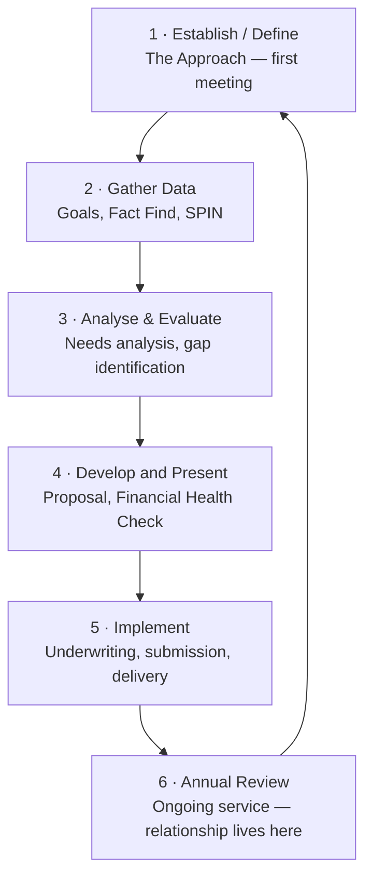
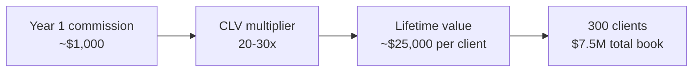
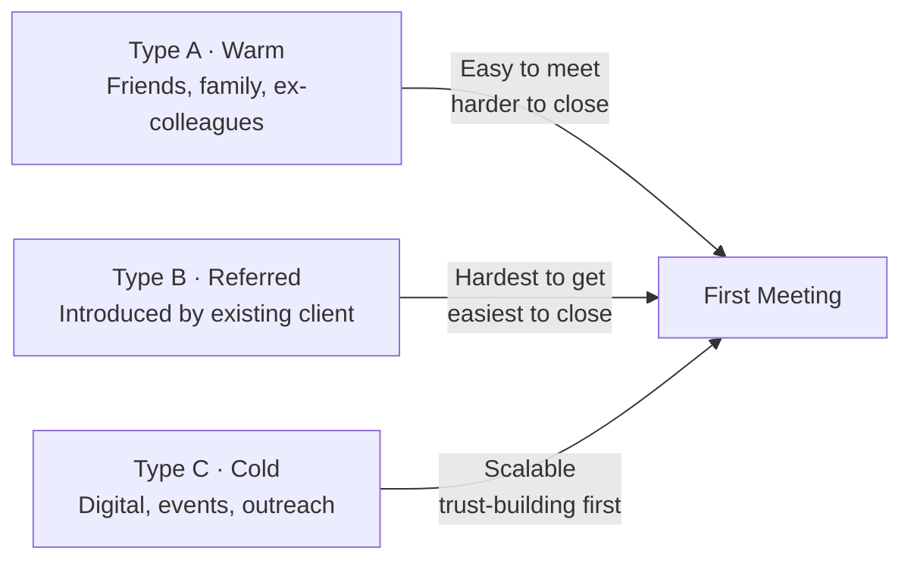

# Day 37 — The Approach: Why It Matters

> **The one idea for today:** Most of the financial planning process happens *after* the first sale. The Approach is not the first step to a sale — it's the first step to a **lifetime relationship.** Frame it accordingly and your Year 5 book reflects the difference.

## What you'll walk away with

By the end of today you should be able to:

1. **Situate** The Approach within the 6-step Financial Planning Process.
2. **Explain** the concept of Client Lifetime Value — and why a $1,000 first sale is a fraction of what the relationship can produce.
3. **Adopt** the "no one buys everything at one go" mindset, which shapes every meeting you'll ever run.

---

## 1. The 6-step Financial Planning Process

Every client relationship, from first meeting to 20 years later, follows the same 6 steps:

**The trap most new FCs fall into:** treating the Approach as "selling." It's not. The Approach is establishing the *relationship* — the permission and trust to do Steps 2–6.

**Rush Step 1 and you damage everything downstream.** A forced first meeting that feels like a pitch destroys the trust needed for Step 2's honest fact-finding.

## 2. "No one buys everything at one go"

One of the most important mental frames in this career:

> **No one buys everything at one go.**

A typical well-served client might:
- Year 1: Start with a hospital plan + basic term life.
- Year 3: Add critical illness coverage after a scare.
- Year 5: Start a regular savings plan when income stabilises.
- Year 8: Review and increase CI coverage; start an ILP for their kid.
- Year 12: Consolidate retirement planning; top up SA; begin estate planning.
- Year 18: Review annuity options; set up CPF LIFE optimally.
- Year 25: Estate/will review; help an ageing parent.

**Same client. 7+ sales events over 20+ years.**

If you try to close all of that in meeting #1, you destroy the 20-year relationship for a 2-year commission.

**The discipline:** in the first meeting, recommend the **one or two highest-priority gaps.** Leave the rest for future meetings. The relationship and the trust are worth more than one oversized first sale.

## 3. Client Lifetime Value (CLV)

Here's the math that should govern how you treat every first meeting.

**Typical numbers for a well-serviced FC's book:**

- Average client: **~$1,000** of commission in Year 1.
- Cross-sells + upgrades over 30-year relationship: **~20–30× the initial commission.**
- Average CLV: **~$20,000–$30,000 per client** over the relationship.

**On 300 clients over a career:**
- 300 × $1,000 = **$300,000** in first-year commissions.
- 300 × $25,000 (average CLV) = **$7,500,000** in total lifetime value.

**Different scale entirely.**

**The implication:** what feels like a "small" first sale is the start of a relationship that can produce 20–30× the initial amount. A $1,000 first-year commission is a $25,000 lifetime commitment — if you service it properly.

**How this changes behaviour:**
- You say no to oversold first meetings (they don't produce CLV).
- You invest in service after the first sale (annual reviews, birthday calls, claim help).
- You ask for referrals earlier and more confidently (each referral can be another $25K CLV).
- You treat a "small" first policy as the foundation of a lifetime book, not a disappointing sale.

## 4. The three audiences for the Approach

You won't use the same Approach script for everyone. There are three types of first conversations:

### Type A — Warm market (existing relationship)
- Friends, family, ex-colleagues, classmates.
- **Easy to meet, harder to sell.** They already have opinions about you.
- **Approach angle:** "I'm in a new career — would love your honest feedback on what I'm doing."
- Leads to **market survey** conversations (Day 38).

### Type B — Referred (introduced by an existing client)
- Someone your Year-1 client recommended.
- **Hardest to get, easiest to close.** The referrer has already transferred trust.
- **Approach angle:** "[Referrer] mentioned you were looking into ___ and thought we should talk."
- Leads to warm first meetings.

### Type C — Cold (no prior relationship)
- Digital inbound, events, cold outreach.
- **Slowest route but scalable.** Requires pre-framing and trust-building before the first meeting.
- **Approach angle:** "I saw your post/comment about ___. I help people in that situation. Would a 20-min call be useful?"

**Most new FCs focus exclusively on Type A** (warm) in Month 1. That's fine for Month 1. By Month 6, you need at least one of Type B or C running to sustain a pipeline — because your warm market is finite.

## 5. The honest limits of your warm market

Most new FCs think their warm market is **300–500 people.** In practice:

- 100 close connections you'd happily call.
- 50 of those will actually say yes to a first meeting.
- 25 of those will become clients.
- 10 of those will give referrals.
- **The remaining 475 are imaginary.**

**The math:** 25 clients × $1,000 = $25,000 in FYC from pure warm market. Then you've exhausted it.

For a career — and even for Year 1's full quota — you need **additional sources:** referrals, digital, natural market, agency leads.

Building the Approach skill for cold and referred leads is what separates Year-1 FCs from Year-5 FCs.

## 6. The Approach mindset — what you're actually doing

**You're not:**
- Trying to close in the first meeting.
- Selling insurance.
- Extracting data.
- Giving a finance lecture.

**You are:**
- Earning the right to ask harder questions later.
- Demonstrating that you're trustworthy, knowledgeable, and not pushy.
- Making the prospect feel heard and understood.
- Establishing the **relationship** that enables Steps 2–6.

**The emotional target of the first meeting:** the prospect walks away thinking, *"That was actually useful. They listened. They didn't pressure me. I want to meet again."*

If they think that, you've won — regardless of whether anything was sold.

## 7. Why this chapter is psychological, not tactical

Many new FCs want scripts, frameworks, and bulletproof openers. You'll get them tomorrow (Day 38 onwards).

Today was psychological because **most Approach failures are not tactical.** They are:

- Rushing the timeline (closing in meeting #1 instead of building for meeting #3).
- Overestimating the first sale's importance (focusing on FYC instead of CLV).
- Underestimating warm-market exhaustion (not building cold/referred pipelines).
- Treating the meeting as a pitch instead of a relationship opener.

Fix these four mental errors before learning a single script — and everything downstream gets easier.

## Quick quiz

1. **The first step of the Financial Planning Process is:**
 - A) Gather data
 - B) Present a recommendation
 - C) Establish / Define the Client–Planner Relationship ✓
 - D) Implement a solution

 **Why:** Step 1 is Establish / Define — building the client-planner relationship before anything else. Gathering data is Step 2, which only works once trust is established. Presenting a recommendation is Step 4. Implementing a solution is Step 5. Rushing past Step 1 damages everything downstream.

2. **Typical CLV of a well-serviced client is what multiple of first-year commission?**
 - A) 2–3×
 - B) 5–10×
 - C) 20–30× ✓
 - D) 50–100×

 **Why:** The lesson states that cross-sells and upgrades over a 30-year relationship produce roughly 20–30x the initial first-year commission, translating to $20,000–$30,000 per client over their lifetime. 2–3x and 5–10x dramatically understate the long-term value and would lead FCs to under-invest in service. 50–100x is aspirational but not the realistic benchmark cited in the material.

3. **"No one buys everything at one go" means:**
 - A) Clients are indecisive
 - B) You need more meetings to close
 - C) The first meeting should focus on 1–2 highest-priority gaps; the rest unfolds over years ✓
 - D) Clients should be educated before they buy

 **Why:** The principle is about disciplined sequencing — address the one or two most urgent gaps first, then return for future meetings as needs evolve over 20+ years. It is not a commentary on client decisiveness (A), which misreads the mindset. Needing "more meetings to close" (B) implies the same sale is dragged out, not that different products are sold across different life stages. Education (D) is a tactic, not what this principle is about.

4. **A new FC who oversells the first meeting — recommending every gap at once — risks:**
 - A) Earning more commission upfront
 - B) Destroying the trust needed for honest fact-finding in Step 2 ✓
 - C) Skipping directly to Step 5 (implementation)
 - D) Getting a faster referral

 **Why:** Overselling the first meeting signals that the FC is chasing commission, not genuinely helping — this breaks the trust required for the candid data-sharing needed in Step 2. A is what the FC thinks they're gaining, but it sacrifices the CLV that makes a long-term book valuable. Skipping to Step 5 (C) is a different error. A forced, over-pitched first meeting actually reduces referral likelihood (D), not increases it.

5. **Your warm market of 300 contacts realistically yields roughly how many clients?**
 - A) 150–200
 - B) 50–75
 - C) 25 ✓
 - D) 5–10

 **Why:** The funnel works as follows: 300 contacts → 100 close connections → 50 willing to meet → 25 become clients → 10 give referrals. The other 275 are "imaginary." 150–200 and 50–75 overestimate conversion at each stage. 5–10 is too pessimistic and would undercut planning. 25 is the realistic baseline, which is why warm-market-only pipelines exhaust around Year 1.

6. **A Type B (referred) prospect is described as "hardest to get, easiest to close" because:**
 - A) They have more money to spend
 - B) The referrer has already transferred trust to you ✓
 - C) They respond better to cold scripts
 - D) They are more financially literate

 **Why:** Referred prospects arrive with pre-built trust transferred from the person who introduced you, which dramatically shortens the journey from skepticism to decision. Wealth (A) is not the reason — the source of the trust advantage is the referrer, not the prospect's income. Referred leads don't need cold scripts (C); they need warm conversation. Financial literacy (D) is irrelevant to why referrals close faster.

7. **Which behaviour does the CLV mindset most directly change for a new FC?**
 - A) Quoting higher premiums to maximise first-year commission
 - B) Treating a small first policy as the start of a $25K lifetime relationship ✓
 - C) Rushing prospects to sign before they change their mind
 - D) Avoiding annual reviews to reduce workload

 **Why:** When you internalise that a $1,000 first-year commission represents roughly $25,000 of lifetime value, you invest in post-sale service and annual reviews rather than chasing the biggest first sale. A and C reflect the FYC-first mindset that CLV thinking is designed to replace. D is the opposite of what CLV demands — annual reviews are how the 20–30x multiple gets realised.

---

## Related

- Previous: [[../week-6/day-36|Day 36 — TVM Practice Problems]]
- Next: [[day-38|Day 38 — Natural Market vs Referred Leads]]
