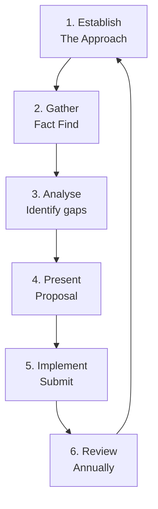
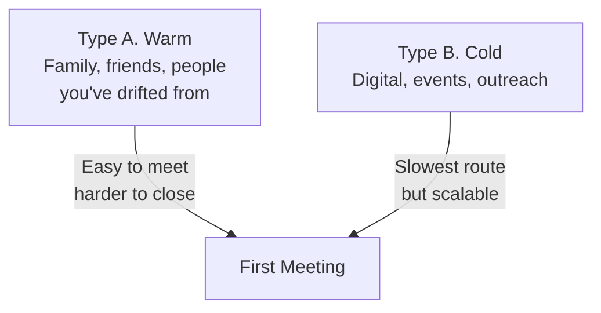
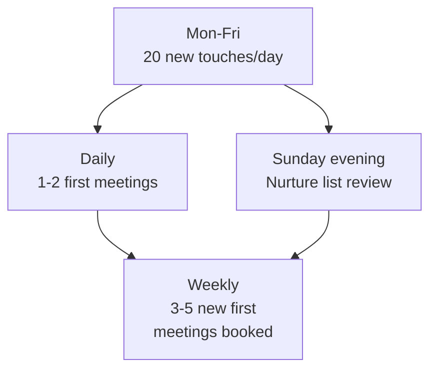
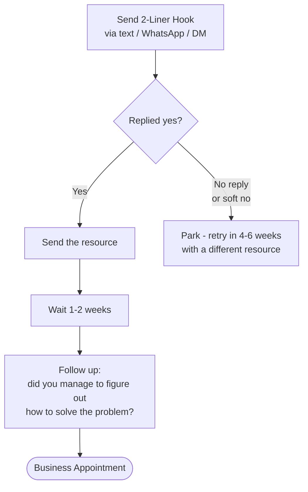

# Day 37 - The Approach: Cold, Warm, Follow-Up & Nurture

> **The one idea for today:** The Approach is not the first step to a sale - it's the first step to a **lifetime relationship.** Warm and cold prospects each need a different opener, a different follow-up rhythm, and a nurture plan that keeps them alive long after "not now." (Referred prospects come once you're post-RNF with a client base - that's a Next 60 Days topic.)

## What you'll walk away with

By the end of today you should be able to:

1. **Open** a warm or cold conversation using a script you'd actually say out loud.
2. **Run** a 7-touch follow-up sequence after a first meeting - without feeling pushy.
3. **Nurture** a "not now" prospect for 6-12 months until they're ready.
4. **Structure** a weekly prospecting rhythm that generates 3-5 first meetings every week.

> **Why no referrals lesson today:** before RNF you don't have clients yet, so referred prospects aren't a working channel for you. Referral-asking, the FACT method, the 4 angles, intro scripts and the borrowed-trust window are all covered properly in [[../../next-60-days/week-5/README|Next 60 Days - Week 5: Referrals From Day One]] once you're licensed and have closed first cases.

> **For the social-first warm path:** the full 10-step funnel (Instastory -> Casual Meet -> 2-Liner Hook -> Business Appointment) lives in the canonical [Warm Market Funnel](../warm-market-funnel.md) reference. Use that doc when the relationship is genuinely warm and the contact is a Project 100 name; use the cold-call flow on Day 43 for everyone else.

---

## 1. The 6-step Financial Planning Process - where the Approach sits

```mermaid
flowchart TD
    A["1. Establish<br/>The Approach"] --> B["2. Gather<br/>Fact Find"]
    B --> C["3. Analyse<br/>Identify gaps"]
    C --> D["4. Present<br/>Proposal"]
    D --> E["5. Implement<br/>Submit"]
    E --> F["6. Review<br/>Annually"]
    F --> A
```

**The trap:** treating the Approach as "selling." It's relationship-building - the permission and trust that unlock Steps 2-6. Rush Step 1 and everything downstream breaks.

## 2. The CLV math that should govern every first meeting

- Year 1 commission on a typical client: **~$1,000.**
- Cross-sells + upgrades over 30 years: **20-30x the initial commission.**
- Average Client Lifetime Value: **~$25,000 per client.**
- 300 well-serviced clients over a career = **$7.5M in total lifetime value.**

**Implication:** a "small" first policy is the start of a 20-year relationship. You don't oversell the first meeting. You recommend the **one or two highest-priority gaps** and earn the right to return.

**"No one buys everything at one go."** Year 1: hospital + basic term. Year 3: CI after a scare. Year 5: regular savings. Year 8: ILP for the kid. Year 12: retirement top-ups. Year 25: estate planning. Same client, 7+ sales events.

## 3. Two prospect types you have today - two different approaches

```mermaid
flowchart TD
    A["Type A. Warm<br/>Family, friends, people<br/>you've drifted from"]
    C["Type B. Cold<br/>Digital, events, outreach"]
    A -->|"Easy to meet<br/>harder to close"| M["First Meeting"]
    C -->|"Slowest route<br/>but scalable"| M
```

> **Referred leads come later.** Once you have closed clients (post-RNF), referrals become the highest-converting channel - borrowed trust closes 3x more than cold. That whole playbook is in [[../../next-60-days/week-5/README|Next 60 Days - Week 5]]. For now, your two real channels are warm and cold, and you cannot use the same opener on both. The rest of today is the playbook for each.

---

## 4. Why warm comes before cold - the conviction test

Before any playbook, settle this: **if you can't do warm, you can't do cold either.**

*"I don't want to sell to my friends"* sounds humble. It isn't. It means you don't have conviction in what you do yet - because if what you do is genuinely valuable, helping your friends is not selling. It's being the best consultant they'll ever have.

Cold is rejection at scale. Volume. Brutality. Without conviction, you fold by week two. A purpose-driven advisor wants to serve their friends *and* stays standing through 100 rejections from strangers. **Same engine. Same belief. Different audience.**

So yes, the agency helps you with cold. But if you're skipping warm because it feels uncomfortable, cold will break you faster.

Warm prospecting is not *"hey, let's chat about insurance."* Warm is **being present.** Showing up. Being the person your friends already trust, so when life happens, you're the first call.

> The worst feeling in this job is finding out your friend bought from some random advisor who got there first. Don't let that be you.

### People are waiting - the part nobody tells new FCs

The reason warm prospecting feels disingenuous isn't because it *is* disingenuous. It's because the new FC hasn't internalised this yet: **most of your warm contacts are quietly waiting for someone they trust to help them get started.**

They know they should sort out protection. They know they should look at their CPF. They know retirement isn't going to plan itself. What they don't have is a person - someone they trust, who actually knows them, who isn't going to pitch off a script. They've been delaying because the only options in front of them are strangers off Google or that one school friend who became an agent and immediately got pushy.

Read that again. Some of your friends are *literally* waiting for someone to start the conversation properly. You showing up - gently, without an agenda, just naming that you're now the person who can help - is a gift, not an imposition.

The reverse is also true: **people smell intentions from a mile away.** If you message a friend with the silent goal of *closing a sale*, they'll feel it. The wording on screen will read fine and still land wrong. You don't fix that with better copy - you fix it by sorting out the question of *"do I genuinely want to help this person, or do I want their commission?"* before you hit send.

Once the answer is the first one, there's nothing awkward about reaching out. You're a friend offering to be useful. That's it.

> A consultant with genuine intent reaching out to friends should feel **proud**, not embarrassed. The embarrassment most new FCs feel is a signal that they haven't sorted their own intent yet - not that the reach-out itself is wrong.

### The Taxi Cab Theory - applied to insurance

Borrowed from *Sex and the City*: the right person catches you when you're in the right cab. Apply it here - **when your friend is finally ready to buy insurance, save for retirement, plan for their kids - they should be flagging down *your* cab, not a stranger's.**

That doesn't happen because you "closed" them. It happens because you stayed in their orbit. You called. You sent the article. You showed up at the wedding, the birthday, the funeral. You were the person they already trusted on the topic - long before they needed it.

Practical implications:
- Reach out to everyone in your warm circle and tell them you're doing this work. Don't pitch. Just inform.
- *"If they want to buy, they'd better buy from you first"* - that's the bar. If a friend bought from somebody else, it's because you weren't visible enough, not because they didn't trust you.
- Every warm case in early years can run **~$5K FYC at zero acquisition cost.** The "cost" people imagine is just ego - *"I don't want to sell to friends."* That ego costs you the relationship and the income.
- Done well, warm clients **stay with you for decades.** They call you for everything finance-related. You call them every year for a chit-chat. Both sides feel good. The work feels aligned, not transactional.

If reading this still feels uncomfortable, **the discomfort isn't about the prospects - it's about your own conviction.** Fix the conviction. Then read Section 5.

---

## 5. Warm approach playbook (Type A)

**The problem:** friends and family already have opinions about you. Push too hard and you destroy the relationship. Be too soft and they never take you seriously.

### Widen the net first - warm has 3 rings, not just family and besties

Before you write your warm-market list, fix the misconception that derails most new FCs: **warm doesn't mean only the people you message every week.** That's the Hot ring - and it's tiny. It exhausts in the first 4-6 weeks of activity, and then new FCs panic, decide warm "isn't working", and jump to cold prospecting before they've actually mined the warm pool.

The warm market has three concentric rings, and the real career lives in the middle one:

| Ring | Who's in it | What's true about it |
|---|---|---|
| **Hot** (small, ~10-25 people) | Parents, siblings, partner, best friends, the 5 people in your closest WhatsApp group | Will pick up immediately. Will say yes out of love. **Exhausts fastest.** Often kept *off* the early list out of awkwardness, then jumped at last when nothing else is working. |
| **Semi-Warm / Lukewarm** (the real market, 50+ people) | Ex-colleagues, secondary-school alumni, JC / poly / uni classmates, sports / church / community groups, people from old hobbies, your spouse's circle, neighbours you wave at, the wedding guest list, the LinkedIn connections you actually remember meeting | **This is where the long-term pipeline lives.** Largest pool, lowest competition (almost no one reconnects with them first), real relationship equity from prior shared context. The "haven't spoken in years" people are not lost contacts - they're the most under-mined asset on your phone. |
| **Cold** (strangers) | Pure inbound leads, ad-funnel contacts, roadshow scans, referrals you've never met | Rejection at scale. Volume game. Lowest conversion per touch. Necessary later, but skipping past warm to land here is the fastest way to burn out. |

**Cast wide before you cast deep.** A practical test: scroll your full WhatsApp contact list, your full LinkedIn connections, and your full Instagram following list - all of them, not the favourites tab. Anyone you can place a memory to (their wedding, a project at work, a class in school, a holiday) belongs on the Project 100 list. **Most new FCs underestimate this number by 5-10x.** They count maybe 30 names; their actual reachable warm pool is closer to 300.

The Day 39 - Project 100 page treats this in full, with the priority quota (<=25 Hot, >=40 Semi-Warm, rest cold/referred) and the mining technique for finding the missing semi-warm names. Skim it before you write your list, not after. See [[day-39|Day 39 - Project 100]].

> **Worth saying twice:** the friend you haven't spoken to in 7 years is more valuable than the cousin you message every day. The cousin will say yes once. The drifted friend has untouched relationship equity, no other FC has reconnected with them yet, and the reconnect itself is a gift to both sides.

### Asking for a favour the right way — a transferable life skill

Several of the openers below are framed as *"can you help me out?"* That's the asking-for-a-favour move, and most FCs do it badly because they only learned it under pressure. The pattern below works for almost any favour ask — survey, intro, feedback, time:

1. **Courtesy** — open with politeness and acknowledgement that you're asking for time. *"Quick one"*, *"small favour"*, *"sharing only"*, *"if you're around"*.
2. **Empathy** — name that you understand they're busy / this is unsolicited / you don't expect them to drop everything. *"No pressure"*, *"only if it's easy for you"*, *"totally understand if not"*.
3. **What's-in-it-for-them** — give them a real reason they'd want to say yes. With a market survey, the WIIFT is *"you'd actually be helping me get reps in"* (true) or *"I'll do up a one-page summary of all your policies"* (concrete value). Without a WIIFT, the ask is one-sided and lands as a chore.
4. **Cheat code: pre-empt their objection.** If you know they'll think *"this is going to take forever"* — say *"I just need 5 minutes"*. If you know they'll think *"is this a sales pitch in disguise"* — say *"no pitching, no products, promise"*. Naming the objection before they raise it kills 80% of the resistance.

Profile-tune the speed: D and DC profiles want the favour ask short and to the point — courtesy + ask + WIIFT, in 2-3 sentences. S and I profiles want a softer build — small talk first, *then* the ask. Don't lead with a favour to a D ("get to the point") or skip the warmth with an S ("transactional").

This pattern shows up again in cold-call openers (Day 43), the FACT method for referrals (Day 28 of next-60), and any time you ask a client for an introduction. Learn it once, use it forever.

### Make these scripts your own before you send anything

Every script below is a starting point, not a script to read off. Two rules:

1. **Read each one out loud.** If it doesn't sound like something *you* would actually say to a friend, rewrite the wording until it does. Keep the structure and the disclaimers ("no pitch", "no agenda", "no need to reply") — those are doing real work — but the rest should land in your voice.
2. **Match the relationship.** A best friend gets a more casual version. An ex-colleague you respect gets a slightly more formal version. The script doesn't dictate the register; the relationship does.

The mistake to avoid: copying these verbatim and sending them as-is. The friend will read the message, sense it was scripted, and the warmth dies in the first line.

### The "market survey" opener

Don't pitch. Ask for help.

> "Hey [name] - quick one. I'm joining AIA as a Financial Consultant soon, quite excited. Part of training is I need to do a short market survey with people I trust - just to understand what people actually care about when it comes to money. No pitching, no products, promise. 5 minutes on the phone or 30 over coffee, your call. Would you be able to help me out?"

**Why it works:**
- It's true. You are learning, and you do need the reps.
- It flips the frame — they're helping you, not the other way round.
- "No pitching, no products" is the line that drops their guard. Most people brace for a sales pitch the moment you say "financial". Take that off the table early.
- 8 out of 10 warm contacts will say yes — saying yes to *"help me out for 5 minutes"* is much easier than saying yes to *"let me sell you something"*.

**The seeking-help angle** (use if a straight survey feels too formal):

> "Hey [name] - small favour. I'm joining AIA as a Financial Consultant soon, and need to practise a few pitches with friends before I start meeting actual prospects. Need to clear 5 by end of the month. Quick Zoom or coffee, whichever's easier for you - I just want your honest feedback so I know what's working and what isn't. Could you help?"

**The policy summary angle** (works really well for friends with multiple policies):

> "Hey [name] - sharing only, I'm becoming a Financial Consultant soon. As part of training, I'm doing a market survey to understand what plans people actually have. The bonus for you: if you let me practise on yours, I'll put together a one-page summary of all your existing policies so you can finally see what you're covered for in one place. No pitching anything. Keen?"

### Lower-pressure angles - when "training reps" framing feels too forced

The three openers above ask the friend to do *you* a favour (help with a survey, let you practise, give feedback). That works for ~70% of contacts. For the other 30% - the close friends who'd see through a "favour" framing, the distant friends where formality fits better, the proud friends who don't want to be your guinea pig - drop the training reps angle entirely and just be straight about why you're messaging.

The honest reason is the strongest reason: you'd rather it be you than a stranger when life shifts.

**The "first call" angle** (close friends who respect honesty over scripts):

> "Hey [name] - sharing only, I've recently joined AIA as a Financial Consultant. Not messaging to pitch you anything today. But if anything financial ever comes up - CPF, protection, savings, retirement - it would be my privilege to be the person you turn to. Rather you have someone you actually know than start from scratch with a stranger. Would love to grab a coffee soon anyway and catch up properly - free this weekend?"

**The "privilege to serve" angle** (friends you respect, where sincere phrasing lands well):

> "Hey [name] - sharing only, I've recently joined AIA as a Financial Consultant. I know most of my friends already have someone, which is great. But if there's ever a financial question you'd rather ask someone you trust over someone random, it would be my privilege and pleasure to service any of your financial needs. No pitch, no agenda - just let me know whenever something comes to mind."

**The "right person, right time" angle** (distant warm — old classmates, ex-colleagues, drifted friends):

> "Hey [name] - long time! Sharing only, I've recently started as a Financial Consultant with AIA. Not chasing anything from you today. The honest reason I'm messaging: most people only end up sorting their CPF or first plan when life shifts - a job change, a baby, a parent's diagnosis, a house. When that day comes for you, I'd rather you message me than start with a stranger. Either way, would love to catch up properly - it's been too long. Free for a coffee sometime?"

**The "rather it be me than a stranger" angle** (close-but-not-best friends):

> "Hey [name] - I've recently joined AIA as a Financial Consultant. Since this kind of thing comes up for everyone at some point, I'd rather you have someone you actually know and trust handling it than whoever happens to be in front of you at the moment. If you ever want a second opinion on anything money-related - even just a quick CPF question - drop me a note anytime. Would also be glad to grab coffee and catch up if you're around."

**The "quietly here" angle** (very distant warm — haven't spoken in years):

> "Hey [name] - long time, hope you're well! Just sharing, I've recently moved into financial consulting. Not messaging to sell you anything - honestly, half the people I tell already have things sorted, which is great. Mainly wanted to reconnect properly though - it's been way too long. If you're around in the next few weeks, would love to grab a coffee and catch up."

**Why these work better than "training reps" framing for some contacts:**

- They don't ask the friend for a favour. Asking a busy friend to "help me practise" can feel like a chore, especially for older or more senior contacts.
- They name the real reason out loud: you'd rather it be you than a stranger when their light turns on.
- They lower the response cost. The friend doesn't have to commit to a meeting, a survey, or a coffee. They just have to acknowledge they know who you are now. Many will respond with their own opening *"actually, can I ask you something..."*
- They sound sincere, not scripted. Read each one out loud and ask: *"would I send this to a friend if I weren't an FC?"* If the only reason it sounds odd is the AIA mention, it's good.
- They are honest. Honesty is the only frame that doesn't decay - the survey/practice angles have a half-life because the friend eventually realises you're past training.

### Most of them already have an agent - and most of those agents have ghosted them

A common reason new FCs hold back from warm market: *"they probably already have an agent."* They might. The reality on the ground is messier, and once you understand it, the conversation gets a lot easier.

What you'll actually find when you have a casual catch-up:

- The agent they bought from years ago has stopped contacting them entirely. No annual review, no birthday message, no follow-up after a job change or new baby.
- The "agent" is their *parents'* agent - someone in their fifties or sixties who sold the parents a plan in the 1990s and never built a relationship with the kid. The kid took over the policies by inheritance, not choice. They've never even met this person.
- The agent has left the industry but nobody told the client. The policy is still in force, but service is now a phone tree at the insurer.
- The client is technically "serviced" but feels invisible - *"yeah I have someone, but I haven't heard from them in two years."*

You don't surface any of this by asking *"do you have an agent?"* (the answer is almost always yes). You surface it by spending 30 minutes on a normal coffee catch-up and letting the topic come up naturally - *"oh, when did you get that plan? Who handled it for you?"* or *"hospital plan - yeah, who's your guy for that?"*

When you hear *"actually I haven't spoken to him in years"* or *"that's my dad's agent, I've never even met him"*, you've found the opening. The friend isn't bound to that agent in any meaningful way - they just hadn't been given a reason to switch. You being present, accessible, and actually their friend *is* the reason.

#### What this sounds like, from the client's side

The frustration on the client side is bigger than most new FCs realise. Spend any time on this and you'll hear the same complaint, almost verbatim:

> *"To me it's crazy - who's going to service me when they pass away? When I need to make claims the most at 50 years old, they're no longer around. Agents should grow up and grow old together with you."*

That's the unmet need sitting underneath every warm conversation. The client isn't shopping for a better illustration. They're looking for someone who'll still be there in 30 years - when their parent has a stroke, when their own CI claim happens, when they're sorting out their kids' policies. **You being 25-35, just starting your career, planning to be in this for the long run - that is the strongest possible value proposition for warm contacts in the same age bracket.**

#### How to surface it in conversation (without sounding pitchy)

You don't have to pitch this. You just have to ask honestly:

> "Random question - when was the last time your agent actually sat down with you for a proper review? A real one, not just the standard Christmas broadcast?"

Or:

> "Out of curiosity - if you suddenly needed to make a claim or update a beneficiary, would you know who to call?"

8 out of 10 times you'll hear something between *"honestly, no idea"* and *"haven't heard from him in years."* That's not your invitation to pitch. It's your invitation to say something like:

> "Honestly, that's part of why I joined this industry. So many people are just floating - their existing agent stopped contacting them, or they inherited their parents' agent and have never even met the person. Whenever you want someone who's actually going to be around for the next 30 years and not the next 3, I'm here. No rush."

#### Why this isn't poaching

A common mental block: *"isn't it wrong to take a friend away from their existing agent?"* If the existing agent is genuinely servicing the client, yes - that's not a relationship to disrupt. But:

- **Servicing means servicing.** Annual review, regular contact, claim support, life-event check-ins. If none of that is happening, the agent has effectively ended the relationship without telling the client. You're not poaching; you're filling a vacuum.
- **The client owns the decision.** Switching is the client's call, not yours. You don't have to convince them. You just have to be visible and competent so that when they decide *"actually, I want someone who's around"*, you're the obvious option.
- **It's genuinely better for them.** A 50-year-old client whose 70-year-old agent has retired is in a worse position than a 50-year-old client with a 45-year-old consultant who'll still be active when their CI claim hits at 65. You being there longer is the upgrade - not a marketing line, a structural fact.

The friend isn't yours to take. But if their existing agent has already left the room, your job is to walk in.

### The 3 things you do in a warm first meeting

1. **Ask about them** - career, family, what's on their mind financially, what they worry about.
2. **Share your "why"** - 90 seconds on why you left your old career for this one.
3. **Soft ask at the end** - "Based on what you shared, I think there are 1-2 things worth a proper look. Would you be open to a follow-up where I put some numbers together?"

**What NOT to do:**
- Show up with brochures.
- Pitch insurance in the first 10 minutes.
- Ask for a sale before they've asked you a question.

### The transition line you must memorise

When a warm contact asks *"so what do you do now?"* — the moment everyone fumbles:

> "I help people make sense of their money - protection, savings, retirement, the full picture. Most of my work is sitting down with someone, understanding what they already have, and showing them what's actually working and what's leaking money. It would be my privilege to do that for you one day - no pressure, just a second opinion on your situation."

Practise this out loud until it sounds like you, not a script. The test: can you say it after two beers without sounding stiff? If yes, it's ready.

---

## 6. Cold approach playbook (Type B)

**The challenge:** no pre-existing trust. You build it **before** the first meeting, not in it.

### The 3-step pre-frame sequence

Cold prospects don't agree to meetings. They agree to meetings **with people who seem credible**. Build credibility first:

**Step 1 - Make yourself findable.** LinkedIn + Instagram + one content platform. Three posts a week on a specific topic (CPF, retirement, protection for young families - pick one). The goal: when someone Googles your name, they see a professional, not a stranger.

**Step 2 - Engage before you ask.** When a cold prospect posts something about money, kids, career change, a house purchase - comment thoughtfully. Three interactions over two weeks before any DM.

**Step 3 - The DM that doesn't sound like a pitch.**

> "Hey [name] — saw your post on [topic] last week. I work with a few people in a similar spot and noticed [specific observation]. Not pitching anything — just thought [specific article / calculator / CPF quirk] might be useful for you. Want me to send it over?"

**Why this works:** you're offering value, not asking for time. Reply rate is 5-10x higher than a cold "I'm an FC, can we meet?"

### From DM to first meeting

Once they've replied and engaged with the resource:

> "Glad it was useful. If ever you want a proper walk-through of how it applies to your own situation — 30 mins, no pitch, just a chat — happy to do that. No rush, just keep me in mind."

Many say yes in that moment. Those who say "not now" go into your **nurture list** (Section 8).

### Cold sources that actually work in Month 1-6

| Source | Time to first meeting | Notes |
|---|---|---|
| LinkedIn DMs (warm-commented first) | 2-4 weeks | Best for working professionals |
| Instagram content + DMs | 3-6 weeks | Best for young families, lifestyle |
| Public events, talks, volunteer work | Same day-2 weeks | Face-to-face trust builds fastest |
| Your content (post -> inbound DM) | 6-12 weeks | Slowest to start, biggest compounding |

---

## 7. The 7-touch follow-up sequence (after any first meeting)

Most first meetings don't close. That's normal. What kills conversion isn't the meeting - it's the **dropped follow-up**.

| # | Timing | Channel | Purpose |
|---|---|---|---|
| 1 | Within 2 hours | WhatsApp | Thank-you + recap of what they shared |
| 2 | Day 2 | Email | Proposal / Financial Health Check attached |
| 3 | Day 4 | WhatsApp | "Any questions on what I sent over?" |
| 4 | Day 7 | WhatsApp or call | Propose the second meeting |
| 5 | Day 14 | WhatsApp | Share one relevant resource (not a pitch) |
| 6 | Day 21 | Short call | Check-in - no pressure, relationship-first |
| 7 | Day 30 | WhatsApp | Final "open door" message - then move to nurture |

### The "open door" message (touch #7)

> "Hey [name] - all good, the timing isn't right and I won't keep chasing. Whenever you're ready - whether that's 6 months from now or a year - I'd love to talk it through with you properly. I'll send the occasional useful thing along the way; whenever something resonates, just drop me a message."

**Why 7 and not 3:** industry data consistently shows 60%+ of sales happen after touch 5. Most new FCs quit at touch 2 or 3. The follow-up is the sale.

### Closed door vs open door - the line that decides Year 3 revenue

Most "no" responses sit somewhere between *"not now"* and *"never."* What kills the future relationship isn't the no - it's how **you** end the conversation.

Two failure modes silently shut the door:

- **The polite-final close.** *"Ok, no worries."* Read by the prospect as: *the conversation is over and reaching out again would be awkward.* You've told them you don't want to be bothered.
- **The ghost.** No reply at all when they say "not interested." Same effect, even harsher: future contact now feels like ambushing a closed channel.

What an open-door close sounds like instead:

> "Totally fair - appreciate you being straight with me. If anything changes down the road, or there's ever a financial question you'd like a second opinion on, please don't hesitate to drop me a note. Either way, would love to stay in touch and grab a coffee whenever you're around. And if anyone you know happens to come up in conversation - new baby, job change, parent's health, anything - it would mean a lot if you remembered me."

What this line is doing:

1. **Acknowledges the no without arguing it.** No reframe attempt, no second pitch.
2. **Names the future scenario explicitly** - "if anything changes." This gives the prospect *permission* to reach out months later when life shifts. Without that permission, most people feel awkward initiating.
3. **Plants the referral seed without an ask.** "If someone comes to mind naturally" is *not* a request - it's an invitation. Years later, when their friend mentions a baby on the way, your name surfaces because you told them you'd want to know.
4. **Removes the obligation.** "No follow-up needed from your side" - the lighter you make the relationship feel, the more likely they reactivate it.

**The seed-and-fruit math:** every door you leave open is a future inbound message. *"Hey - remember you said to reach out if anything changed? My dad just got a CI diagnosis."* That conversation, three years later, came from one well-handled "no" today. Multiply that across the 100+ "not now"s a working FC accumulates and you've built the inbound pipeline that defines Year 3 onwards.

**The single rule:** never let a no end the relationship. End every "no" with the door visibly propped open and a future scenario named.

---

## 8. The nurture system (keeping "not now" prospects alive)

After touch #7, every prospect who didn't convert goes into a **nurture list**. The goal: stay top-of-mind for 6-12 months without being annoying.

### The 1-1-1-1 nurture cadence

- **Monthly**: one piece of non-sales value (article, chart, CPF update, market snapshot).
- **Quarterly**: one personal check-in message ("How are the kids? How's the new job?").
- **Per life event**: birthday, promotion, baby, house move, then a short personal note.
- **Annually**: offer a free review - "It's been a year since we spoke, want a quick refresh?"

### A nurture-list tracker you can set up today

Use a simple Google Sheet or Notion table with columns:
- Name
- How we met (warm / referred / cold + source)
- Last meeting date
- Last touch date
- Next scheduled touch
- Key personal details (kids' names, job, interests)
- Status: `hot` / `warm` / `nurture` / `dormant`

**Every Sunday evening (Day 37 homework):** open this sheet, schedule the week's touches, move status where needed.

### What to never send in nurture

- Generic marketing broadcasts.
- Anything that looks like a mass forward.
- Product promos. (Once you're in nurture, you are not selling.)

**The goal of nurture is to be the name they remember when life changes.** When their baby arrives, they get a job offer, their parent gets sick - **you are the first call.**

### The Taxi Cab Theory - the mental model behind nurture

There's a useful piece of pop-culture shorthand that explains *why* nurture works the way it does. It's called the **Taxi Cab Theory**, and once you see it, you'll never pitch a cold prospect the same way again.

> **The metaphor:** every prospect is a taxi driving around the city. When they're not available to pick up a passenger, their **light is off**. When they're available - when something in their life has shifted and they're ready to engage - their **light is on**.
>
> **The person who gets picked up is not the best-matched passenger in the entire city. It's whoever happens to be standing on the corner when the light switches on.**

### What this means for prospecting

Three implications that quietly change how you work:

1. **You cannot force the light on.** A prospect who isn't ready won't buy no matter how good your pitch is, how tight your illustration is, or how many times you follow up aggressively. The light is an *internal* switch - flipped by a life event (marriage, baby, job change, parent's diagnosis, bonus landing, mortgage approved), not by your persuasion.

2. **You *can* be the one on the corner when it turns on.** This is the entire job of nurture. The 1-1-1-1 cadence isn't about closing - it's about being *visible, casually, non-commercially* so that when their light flips, your name is the one they wave down. Not because you're the perfect fit - because you're *present*.

3. **"Not now" is not a rejection - it's a light-off signal.** A prospect who says *"not now"* is telling you their light is off today. Your job is not to argue them into switching it on. Your job is to stay in their peripheral vision - through one monthly piece of value, one quarterly check-in, one life-event note - so that the day it flips on, you're right there.

### The receipt - why this holds up

Research on relationship commitment shows the same pattern: commitment doesn't build gradually and then tip over. It **jumps sharply within a short window** - often triggered by the perceived cost of *continuing to search* outweighing the cost of *committing to what's in front of them.* The same is true in financial-advisory buying. Most clients don't buy because you convinced them - they buy because life changed, the problem suddenly felt urgent, and you were the person they already knew.

### What this changes about your weekly rhythm

- **Stop measuring by close rate on first meeting.** That's a light-already-on metric. Most of your closes will come 3-18 months after first contact. Measure by *touches retained* and *names in nurture*.
- **Reframe follow-up anxiety.** When the 7-touch sequence feels pushy, it's not - you're just still trying to flip the light. The moment you move someone to nurture, the pressure is off. You're no longer selling; you're staying visible.
- **Respect the "not now".** A polite, confident *"totally understand - I'll keep in touch, and if anything changes just let me know"* is worth more than a forced second pitch. The former preserves the option; the latter burns it.
- **Prioritise life-event touches over calendar touches.** A two-line note when their kid gets into university, when they post a new job on LinkedIn, when their parent's medical news surfaces - those are *worth more* than three generic monthly articles. Life events are the moments the light flips; that's the moment to be there.

### The single-line crib

> *"You're not trying to make them buy. You're trying to be the one on the corner when their light turns on."*

Write that somewhere you'll see it on days when prospecting feels slow. It is the job.

---

## 9. Weekly prospecting rhythm

The pipeline only works if prospecting is a **habit**, not a mood. The weekly rhythm for a Month 1-6 FC:

```mermaid
flowchart TD
    A["Mon-Fri<br/>20 new touches/day"]
    A --> B["Daily<br/>1-2 first meetings"]
    A --> C["Sunday evening<br/>Nurture list review"]
    B --> D["Weekly<br/>3-5 new first<br/>meetings booked"]
    C --> D
```

**The baseline numbers (from the Next 60 Days block):**
- 20 dials/day -> 1 appointment booked.
- 100-140 touches a week -> 5-7 first meetings.
- ~100+ "not nows" across the full journey -> 1 closed sale.

Do not treat a "no" as a failure. Each "not now" becomes nurture - and nurture becomes Year 2, 3, 5 revenue.

---

## 10. The Approach mindset - what you're actually doing

**You're not:**
- Trying to close in the first meeting.
- Selling insurance.
- Extracting data.
- Giving a finance lecture.

**You are:**
- Earning the right to ask harder questions later.
- Demonstrating you're trustworthy, knowledgeable, not pushy.
- Making the prospect feel heard.
- Building a nurture relationship that generates Year 1, 3, 5, and 10 revenue.

**The emotional target of the first meeting:** the prospect walks away thinking, *"That was actually useful. They listened. They didn't pressure me. I want to meet again."*

If they think that, you've won - regardless of whether anything was sold.

---

## Today's homework

1. **Pick the warm-market opener that fits your voice** - market survey, seeking-help, policy summary, or one of the lower-pressure angles ("first call", "privilege to serve", "right person right time", "rather it be me than a stranger", "quietly here"). Customise the wording to how you actually speak. Say it out loud 10 times.
2. **Build your nurture-list tracker** (Google Sheet or Notion) with the 7 columns above.
3. **Draft your follow-up sequence templates** (touches #1-#7) and save them where you can reuse them.
4. **List 20 warm contacts** you will open a conversation with this week.

Do all four before Day 38.

---

## 2-Liner Hook (Warm Prospecting Flow)

A low-pressure, text-first warm opener that uses a useful resource as the bridge to a business appointment. Sits to the left of the cold-call script - lighter, slower, and built for contacts where a phone call would feel heavy but a text feels honest.

**Use this when** you've identified a warm contact (someone from your Project 100 list or a friend you haven't spoken business with yet) and want a soft opener that doesn't feel like the first move toward a sale.

### The flow

```mermaid
flowchart TD
    A["Send 2-Liner Hook<br/>via text / WhatsApp / DM"] --> B{"Replied yes?"}
    B -- "Yes" --> C["Send the resource"]
    B -- "No reply<br/>or soft no" --> X["Park - retry in 4-6 weeks<br/>with a different resource"]
    C --> D["Wait 1-2 weeks"]
    D --> E["Follow up:<br/>did you manage to figure out<br/>how to solve the problem?"]
    E --> F(["Business Appointment"])
```

### The script

> **Line 1.** Recently I have been helping my friends/clients with [common problem]. Can I help you with this also?
>
> **Line 2.** I have a [resource] that I/my team created, to help [common group] solve [common problems] to [measurable outcome]. You want it? I send you.

What goes in the blanks:

- **[common problem]** - what you've actually been helping clients with this week (CPF allocation review, hospital plan gap, first investment plan).
- **[resource]** - a guide, checklist, calculator, comparison table, or short Loom you (or your team) put together.
- **[common group]** - the segment your contact obviously belongs to (young parents, fresh grads, dual-income couples).
- **[common problems]** - the headline pains that group recognises in themselves.
- **[measurable outcome]** - what they get if they actually use the resource (clarity in 15 minutes, a number they can act on).

### The follow-up that earns the appointment

1-2 weeks after they receive the resource, send one short message:

> Hey [name], been a couple of weeks since I sent you the [resource]. Did you manage to figure out [the specific problem]? Happy to help fill in any gaps if not.

The phrasing matters - "did you figure it out" is binary. If the answer is "sort of, but I have questions" or "no, didn't get round to it", that's the appointment:

> Easiest way is a 30-minute Zoom - I can answer the specific questions and show you what most people in your situation actually do. Tuesday 7pm or Thursday lunch?

The agenda is *their* question. The product comes downstream of the conversation, not upstream.

### Where this fits in today's lesson

This is the lightest entry point in the warm-market half of the Approach. If a Market Survey phone call is too heavy for the contact, the 2-Liner is what you reach for first. Both flows end at the same place - a 30-minute meeting built around the prospect's question.

---

## Quick quiz

1. **The core opener for a warm-market first meeting is:**
 - A) A direct pitch for term insurance
 - B) A product brochure walkthrough
 - C) A market-survey conversation asking for honest feedback (correct)
 - D) A price comparison against competitors

 **Why:** the warm market already has opinions about you. The market-survey framing is true, removes sales pressure, and earns a real conversation. Direct pitches and brochures trigger the defensive reflex that kills warm relationships.

2. **When a warm contact says they "already have an agent", the real question to ask is:**
 - A) Whether the agent's commission is higher than yours
 - B) When the agent last actually checked in or did a review (correct)
 - C) Whether their existing policies can be cancelled
 - D) Which insurer the agent represents

 **Why:** "having an agent" and "being serviced" are not the same thing. A large share of warm contacts are technically attached to an agent who has stopped contacting them, retired, or is their parents' agent they've never met. Surfacing the *actual* level of service - via a casual question, not a pitch - reveals whether there's a real relationship to respect or a vacuum you can step into.

3. **The correct sequence for a cold prospect is:**
 - A) DM -> meeting -> content
 - B) Content + credibility -> warm engagement -> value-first DM -> meeting (correct)
 - C) Cold call -> brochure -> meeting
 - D) Event -> business card -> email blast

 **Why:** cold prospects don't agree to meetings with strangers. They agree to meetings with people who seem credible. Credibility is built via public content and thoughtful engagement *before* any ask is made. A cold DM without pre-frame gets ignored.

4. **Most first meetings that convert do so after:**
 - A) Touch 1 or 2
 - B) Touch 3 or 4
 - C) Touch 5 or later (correct)
 - D) The first phone call

 **Why:** industry data consistently shows over 60% of sales happen after the fifth follow-up touch. Most new FCs quit at touch 2 or 3 and attribute the loss to the prospect - when the real cause is a dropped follow-up.

5. **A "not now" prospect should go into:**
 - A) A deletion list
 - B) A nurture list with a monthly value touch and quarterly personal check-in (correct)
 - C) A re-pitch list every week
 - D) The same pipeline as "hot" prospects

 **Why:** "not now" rarely means "never." A structured nurture cadence (monthly value + quarterly personal + life-event touches) keeps you top-of-mind for 6-12 months so you become the first call when circumstances change. Deleting discards future revenue. Weekly re-pitches burn the relationship.

6. **The "open door" message (touch #7) is designed to:**
 - A) Force a decision
 - B) Close the door if they don't reply
 - C) Release pressure and reposition for a long-term nurture relationship (correct)
 - D) Automatically enroll them in an email sequence

 **Why:** touch #7 is the transition from active follow-up to nurture. It signals respect for the prospect's timeline, removes pressure, and keeps the door open so you remain the person they message when they're ready - which may be 6 or 12 months later.

7. **The weekly baseline for a Month 1-6 FC to sustain a pipeline is roughly:**
 - A) 5 touches a week, 1 meeting
 - B) 20 touches a week, 2 meetings
 - C) 100-140 touches, 5-7 first meetings (correct)
 - D) 500 touches, 30 meetings

 **Why:** the ratio from the Next 60 Days block is ~20 dials per appointment. Sustaining 5-7 first meetings weekly requires 100-140 touches. Lower volumes don't generate enough pipeline for Year 1 production; dramatically higher volumes aren't realistic for a single advisor.

8. **The emotional target of a first meeting is that the prospect feels:**
 - A) Pressured to decide today
 - B) Overwhelmed by the amount of information
 - C) Heard, unpressured, and willing to meet again (correct)
 - D) Obligated because of the relationship

 **Why:** the first meeting is a relationship opener, not a close. If the prospect walks away feeling listened to and unpressured, the door stays open for Steps 2-6 of the financial planning process - where the real value (and CLV) is built.

---

## Related

- Previous: [[../week-6/day-36|Day 36 - TVM Practice Problems]]
- Next: [[day-38|Day 38 - Natural Market vs Referred Leads]]
