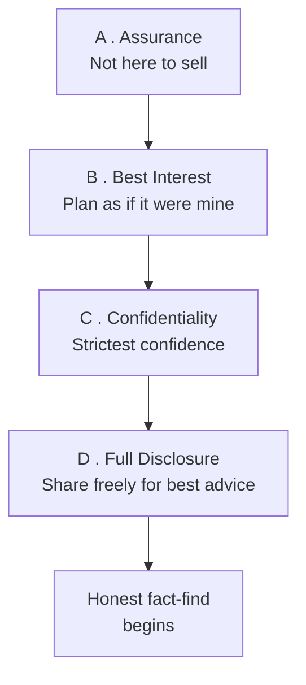
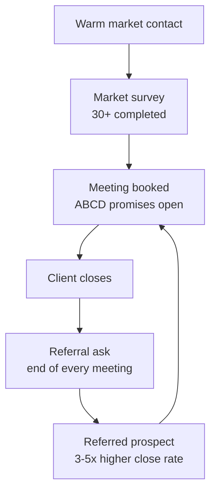

# Day 38 - Natural Market vs Referred Leads

> **The one idea for today:** Your natural (warm) market is the launchpad. Referrals are the rocket. New FCs who master referrals in Month 2 scale to MDRT by Year 3; those who never learn to ask stay in warm-market-only mode forever.

## What you'll walk away with

By the end of today you should be able to:

1. **Differentiate** your natural market from your referred market - and understand why one runs out and the other doesn't.
2. **Conduct** a proper market survey call using the script below.
3. **Ask** for referrals at the end of every meeting - using a consistent language pattern.

---

## 1. Natural market vs referred - the difference

### Natural market
The 100-300 people you already have some relationship with.

- **Pros:** trust pre-exists. They'll take your call.
- **Cons:** finite. Once you've worked through them, it's gone.
- **Timeline:** most new FCs exhaust it by Month 6-9.

### Referred market
People introduced to you by existing clients or contacts.

- **Pros:** trust is **transferred** from the referrer. Close rates are typically **3-5x higher** than cold.
- **Cons:** requires skill to ask for them, and a reason for clients to give them.
- **Timeline:** scales indefinitely. A client with 3 referrals becomes 3 new clients with 3 referrals each, then 9 new. Compounds.

**The math:** if every client you serve well produces 2 referrals on average, your business scales geometrically. Most new FCs produce 0.2 referrals per client and wonder why growth stalls at Year 2.

## 2. The Market Survey - what it is, why it works

For new FCs, the **market survey** is the textbook warm-market Approach. It's designed to:

- Get you **real practice** doing prospect conversations - without the pressure of "selling."
- Give you **3-5 minutes** of honest conversation with 30+ people in your warm market.
- Naturally generate **appointments** (via a built-in transition in the script).
- Build your **prospect list** with people who've opted-in.

**Target:** minimum **30 market surveys** completed before you move into the next phase (typically Month 2-3).

**Don't skip this.** Many new FCs try to jump straight to "selling" and skip market surveys. They learn painful lessons their surveyed peers already internalised.

## 3. The market survey script (memorise this)

This is the proven opening. Practise until it's natural.

### Opening
> "Hello, good morning, is this John?
>
> John, this is [your name]. Do you have a moment to speak?"

*[If yes, continue. If no, book a time.]*

> "How are you doing? [Rapport build - natural catch-up, 30-60 seconds]"

### Agenda
> "As you may have learned, I'm **intending to embark on a career as a Financial Advisor** (or: **currently interning with a Financial Services Agency**) and I'm tasked with doing a simple market survey with the people I know.
>
> Would you be able to help me out by just giving me 5 minutes of your precious time?"

*[Proceed with Market Survey Questions 1, 2, 3 - these vary by agency; typically questions about financial priorities.]*

### Setting the appointment (using Q4)
> "Thanks [name]. By the way, **when I'm officially licensed to start my practice** (or: **let's say if I decide to embark on this career**), one of my priorities is to extend my service to my closest friends. You are one of those whom I highly regard.
>
> Till then, may I get in touch with you for a 30-minute session to share with you the type of solutions I can offer? You have my assurance that during our meeting, I will not ask you to do anything you don't want to, and any future meetings will depend entirely on whether you feel my services would be of help to you.
>
> Will that be good with you?"

*[If yes:]*

> "Good. Would it be best to get together at your office, your home, or via Zoom? Would weekdays or weekends be better for you? Office hours or evenings? Could I see you on [day] at [time], or would [alternate] be better?"

### Closing off
> "Really appreciate your help. Will it be alright if I keep you posted on any AIA promotions that are relevant to you?
>
> May I have your email address and date of birth so I can connect better with you?
>
> (Optional:) Last but not least, may I have your permission to add you on Instagram or Facebook so we can keep each other updated?"

**Memorise. Internalise. Naturalise.** In that order.

## 4. Handling common objections in the Approach

These show up constantly. Memorise the responses.

> **Diagnostic before you respond — Type 1 or Type 2?** Most "objections" actually fall into two very different camps, and using the wrong response on the wrong type backfires:
>
> - **Type 1 — concept dismissal.** *"Not interested"*, *"not in the market"*, *"don't believe in insurance"*. The prospect is rejecting the *idea*, not your specific ask. Counter-arguing here deepens the dismissal. Lead with a curious question instead — *"Fair, quick one before I respond — what shaped that view for you?"* — and let them tell you what they're actually rejecting before you reframe.
> - **Type 2 — specific concern.** *"Too busy"*, *"no money"*, *"post it out"*, *"what's the idea?"*. The prospect accepts the concept; they're objecting to *this conversation right now*. The ART pattern (Acknowledge / Relate / Turn around to the appointment ask) is what the table below applies.

| Objection | Type | Response |
|---|---|---|
| **"Not interested"** | 1 | *Soft prefix — "Fair, and quick one before I respond — what shaped that for you?"* (Listen.) Then: "I can understand you're not interested in something you haven't had an opportunity to see. So that you can judge for yourself, would you be free for a short time on...?" |
| **"Not in the market"** | 1 | "I would've been surprised if you said you were in the market for life insurance right now. However, I do have some ideas that will be handy for you when you're ready. Would you be free...?" |
| **"No money"** | 2 | "I can understand you trying to hold down unnecessary expenses. However, I do think you'd find what I have to say of interest - and of course, you'd be under no obligation. Would you be free...?" |
| **"No need"** | 2 | "Of course, you'd be the sole judge of whether this idea would be of value. Since it'll take only a short time for me to explain, would you be free...?" |
| **"Too busy"** | 2 | "I guessed you'd be busy - that's why I phoned for an appointment rather than drop by unannounced. Would you be free...?" |
| **"What's the idea?"** | 2 | "To explain it properly, I'll need to show you some illustrations and discuss them in person. Would you be free...?" |
| **"Is it insurance?"** | 2 | "It's about the protection of your family / a savings plan with a difference. With some illustrations I'm sure you'll find interesting, I can explain it in a brief interview. Would you be free...?" |
| **"Post it out"** | 2 | "I'd be happy to, but what I have in mind will be useful only if it's tailored to your individual needs. That's why I'd like to see you in person. Would you be free...?" |

**Pattern (Type 2 — ART):** acknowledge the objection, reframe it, then **return to asking for the appointment.** The core ask is the same every time.

**Pattern (Type 1 — curious-question first):** ask before you reframe. *"What shaped that view?"* / *"Was there a specific experience behind that, or more of a general feeling?"* Listen to what they actually say. Then reframe to the part they raised, not the generic version of the objection.

Most objections are not rejections — they're **reflexes**. Don't take them personally. Respond calmly, and ask for the appointment again.

## 5. The ABCD Four Promises

Before starting the Financial Health Review (first real meeting), open with these four statements. They set the emotional tone and protect the relationship.

### A - Assurance / Promise
> "This meeting is not to sell you anything. I'm here to find out more about you and your goals. If we should proceed with proposing any solution, it's because I had shared something that was of value to you and that you felt comfortable with me."

### B - Best Interest
> "In the event that I am able to proceed with the proposal stage, you can have my promise that what I plan for you will be exactly what I'd do for myself if I were in your shoes."

### C - Confidentiality Clause
> "I'd like to assure you that whatever we share today will be kept in the strictest confidence."

### D - Full Disclosure
> "With that in mind, I hope you can provide me with as much information as you can, so I can make my best recommendation to meet your needs."

**Memorise. Internalise. Naturalise.**

These 4 sentences flip the meeting frame from "I'm being sold to" to "someone is here to help me." Most prospects have never experienced this opening - it's a subtle differentiator.

## 6. Asking for referrals - the habit that changes everything

The best time to ask for a referral is **at the end of every meeting**, especially meetings where the prospect was warm and engaged - whether they bought or not.

### The standard referral ask
> "[Name], I really enjoyed our conversation today, and appreciate you being so generous with your time. The way I grow this practice is mostly through introductions from clients like yourself. Can you think of 2-3 friends who would benefit from the same kind of conversation we just had?"

### If they say yes
> "Great. Quick context so I approach them right - is it more *they're at a similar life stage as you* (career, family, money questions you both have), or *something specific from our conversation today made you think of them* (like the CI piece, or the CPF point)? [Listen.] Got it. Would you be comfortable sending them a quick message right now - I can draft it for you so you don't have to think about it."

The *"is it A or B"* shape forces a specific answer instead of a vague *"yeah, she's nice"* — two distinct options always beat an open-ended *"tell me about them"*. The *"I can draft it for you"* is the move that lifts conversion meaningfully — clients give names but freeze when asked to write the intro.

### If they say no or "let me think about it"
> "No pressure. If any names come to mind later, please let me know."

**Rule:** ask every time. The worst answer is "no." The best answer is 3 names. You'll be surprised how often you get 1-2 names when you simply ask.

> **The referral ask is an Right-question.** "Can you think of 2-3 friends who would benefit..." passes all three right-question gates - it leads to the objective (specific names), it's specific (a *number*, "2-3," not "anyone"), and it's logical and indisputable (a generous client who just had a useful meeting can't reasonably say no one would benefit). A weaker version - *"Do you know anyone who might be interested?"* - fails Gate 2 (vague) and Gate 1 (yes/no answer goes nowhere). Day 47 covers the [3-point right-question checklist](../week-8/day-47.md#the-3-point-arq-checklist---is-this-a-right-question) and the [referral-ask question family](../_source-scripts/right-question-database.md) is in the right-question database.

### Names vs endorsements — the distinction that decides conversion

A name without an endorsement is a cold lead with extra steps. The client tossing you *"oh, my colleague Sarah might be interested"* and walking away is not a referral — it's a contact with no warmth transferred. Sarah, if you call her, has no idea who you are.

A real referral has three layers:
1. **The name.**
2. **The why** — what specifically about your conversation made the client think of Sarah.
3. **An endorsement Sarah will see *before* you reach out** — a short text from the client to Sarah, sent in front of you.

Coach the client to do layers 2 and 3 in the moment:

> "Great - and just so I do this properly, what about today's conversation made you think of Sarah specifically? [Listen.] Perfect, that's exactly what I'd want her to know. Would you be comfortable sending her a quick message right now — something like: *'Hey, just had a really useful chat with [your name] about [the thing]. Mind if she reaches out? I think you'd find it useful.'*"

The text goes out *while you're still in the room*. If the client demurs on sending the text, that's a useful signal — the relationship may not be strong enough to refer yet, and pushing harder now will burn the thread. Park it. Send a polite *"thanks for considering"* and ask again at the next review.

### What this matures into — the FACT method

The basic ask above is the floor — appropriate for your first 6 months. Once you have closed clients and a real practice, the ask gets more structured. The framework taught in Week 5 of the Next 60 Days is **FACT** — Favour / Angle / Connect / Timeline. The Timeline part is the failure point most FCs skip — committing to *when* you'll follow up with the referrer, in front of the referrer.

Full version covered in [Next 60 Days - Day 28: Referral Scripts](../../next-60-days/week-5/day-28.md). For now, the basic ask plus the names-vs-endorsements move is enough to build the muscle.

## 7. The "natural to referred" transition

Most new FCs follow this arc:

- **Months 1-3:** ~90% natural market.
- **Months 4-6:** ~60% natural market, 30% referred.
- **Months 7-12:** ~30% natural, 50% referred, 20% cold/digital.
- **Year 2+:** ~10% natural (exhausted), 70%+ referred, 20% cold/digital.

If you're in Month 8 and still 90% natural market, **something is wrong.** Either your referral asks aren't happening, or your service quality isn't producing referrals.

**Diagnostic:** how many referral asks have you made in the last 30 days? If it's under 10, that's the fix.

## Scripts Library

Here are the canonical scripts for warm-market openers, market-survey rapport, and referral asks. Practise them out loud, then make them yours.

> **Tools:** [Outreach Builder](/learning-track/pre-rnf/assignments/outreach-playbook/tool) helps draft your first 100 messages with audience and life-stage hooks already wired in. Full list at [/tools](/tools).

_Note: at this stage you're not licensed yet. The "appointment" you book here runs the canned Insurance CST or Investing CST as practice - see [Day 43](../week-8/day-43) for the full framing._

### Warm Market - Conversation Openers (by Life Stage)

**Use this when** the warm contact is at a specific life moment (just married, just graduated, BTO process, considering investing). Match the opener to the moment.

**Investment / returns angle (for friends who might invest):**

> "Hmmm actually I want to show you how I've been doing investment planning for our [mutual group] friends - especially now when the markets are CRAZY. If we do the right things right, we can potentially earn good money over the next few years.
>
> BUTTTT like that you say sometimes I also tell some people not to invest at all because they're not financially ready.
>
> Catch you for 20 mins then you decide for yourself? HEHEH"

**BTO / couples angle (getting married, buying flat):**

> "Are y'all gonna BTO?", which leads to a BTO planning and budgeting conversation.
>
> Or: "Hey! Since you're getting married soon - have you guys started looking at how to budget for the flat + wedding + insurance together? A lot of my clients in the same stage found it super helpful to map it all out."

**Fresh graduate angle:**

> "You graduated already? Have you finished your investment and insurance planning? Why not I show you what I do for my other clients?"

**Reprospecting / second attempt (friends who rejected you before):**

> "You know a few years ago I tried to talk to you about financial planning, right? Honestly, I was a stupid noob back then who didn't know anything. So it's a good thing you said no. BUT over the years - especially these last 2 - I've been planning for many couples to have a proper roadmap towards financial freedom. After your wedding, can I show you what I usually do? No pressure either way."

The reprospecting one is gold - self-deprecating humour disarms them, acknowledges they were right to say no the first time, shows growth, ends with no pressure.

_Source: Academy scripts library._

### Warm Outreach - Soft Approach (community / church / social circle)

**Use this when** the contact is from a shared community - same church, same uni group, same hobby - someone you know but haven't spoken to professionally before.

> "Hi [Name]! Hope all is well on your end.
>
> I just thought of asking - are you currently working with any financial consultant for your planning needs?
>
> If not, or if you are open to exploring, I'd be happy to see if we can work together. I have been working with some of our [community/group] friends for years now. They have entrusted me with their financial planning and I am truly blessed to be part of their journey.
>
> No pressure at all - I just thought of dropping you a note to see if you'd be open to a quick conversation."

The genius: starts with a question, not a pitch. Asking "are you currently working with anyone?" is non-threatening. Social proof from the shared community lands without name-dropping.

_Source: Academy scripts library._

### Warm Outreach - Curiosity Approach (DIY investors / has existing FA)

**Use this when** the contact is financially savvy, manages their own investments, or already has an FA. Don't compete - offer a second opinion.

> "I get you, and I honestly respect that you're very hands-on with your finances. That shows how intentional you are with your financial planning - especially with insurance, tax-saving plans, and dividend investing.
>
> Do you have someone helping you with all of these?
>
> What I usually do in situations like this is a one-time portfolio assessment - just to spot any blind spots, overlaps, or things that might be worth a second look. No harm in checking.
>
> If it sounds useful, we can have a chill chat over coffee or tea. Up to you."

The reframe: not a sales pitch, an offer to check if everything is optimised. "Blind spots" implies gaps without insulting them. "Up to you" returns control and reduces resistance.

_Source: Academy scripts library._

### Texting EQ - The 11 Rules for Warm Outreach

**Use this when** you're about to send a warm-market text and want to sanity-check it before hitting send. The three non-negotiables (1, 2, 3) apply to every text.

1. **Start the convo by linking it back to a previous conversation.** Don't sound random. *"Hey bro the other time you were saying you work in Tanjong Pagar right? Exactly where is your office?"*
2. **Create enough interest with every text.** Every text gives the prospect more reason to meet. *"I've been wanting to show you how I helped some of my clients increase their investment returns with their existing portfolio."*
3. **End every text with an easy-to-answer question.** *"Are you working from home or office?"*
4. **Make them feel SAFE for the upcoming consultation.** *"At the end of the day, sometimes I advise people not to invest at all if we see no need - when we meet we can discuss and you can decide for yourself."*
5. **Talk about common ground to encourage the conversation.** *"Some of my clients are also doctors and I help them with their investments since they usually work long hours."*
6. **Actively follow up.** 90% of the time people fail to reply. Bump them by name: *"Hi Sarah!"*
7. **Reply quickly** (within 3-4 hours). It shows reliability and service.
8. **Be casual.** Don't use jargon. Don't say "Optimisation". Use emojis and "Hahaha" if it sounds like you.
9. **Texting works best after a few engagements/touchpoints first.** Touchpoints warm up the prospect.
10. **Never use the word FREE.** Instead: *"When is a better time for a 30-min call? Would next Thursday or Friday be better?"*
11. **Minimise the prospect's thinking when setting CTA.** *"For next month I have 10th Jan 6pm and 23rd Jan 8pm, which is better for you?"*

_Source: Academy scripts library._

### Warm Market Outreach Flow (the seed-and-yes sequence)

**Use this when** you have time before you're licensed (or even after) and want a no-pressure way to get a yes for a future meeting now. This is the long game, and it works.

> **Step 1 - Plant the seed (before you start).** "I will become a FA soon" - just share casually, no ask yet.
>
> **Step 2 - Make a soft ask for the future.** "When I become a FA, can I... practise my pitch on you / share what I do / have a coffee session with you to share what I do?"
>
> **Step 3 - Get a yes for something in the future.** They agree to something *later*, not now. No pressure on either side.
>
> **Step 4 - Follow up when the time comes.** "Hey! Remember I mentioned I'd love to share what I do? I'm ready now - when works for you?"
>
> By the time you actually message them, they've already said yes once. The meetup feels natural, not salesy.

_Source: Academy scripts library._

## Quick quiz

1. **The minimum number of market surveys typically recommended before moving to the next phase:**
 - A) 10
 - B) 30 (correct)
 - C) 50
 - D) 100

 **Why:** 30 surveys is the stated minimum to get enough real practice and build a solid prospect list before moving to the next phase. 10 is too few to generate sufficient appointments and internalise the script. 50 and 100 are excessive for the warm-up phase and would delay progression unnecessarily. The 30-survey floor also ensures you've heard the most common objections and learned to handle them.

2. **When a prospect says "I'm not interested," the correct response is:**
 - A) Apologise and hang up
 - B) Send them information to change their mind
 - C) Acknowledge, reframe, and ask again for the appointment (correct)
 - D) Move on to the next person

 **Why:** The objection-handling pattern is always: acknowledge, reframe, return to the appointment ask. "Not interested" is described as a reflex, not a rejection - the prospect hasn't seen the idea yet, so they can't be genuinely uninterested. Apologising and hanging up (A) surrenders the conversation immediately. Sending information (B) delays the meeting and removes your ability to tailor the conversation. Moving on (D) wastes a contact who may simply need a calm reframe.

3. **The ABCD Four Promises are used:**
 - A) At the end of the sale
 - B) In the Approach call
 - C) Before starting the Financial Health Review (correct)
 - D) After the proposal

 **Why:** The four promises are the opening frame for the first real meeting (Financial Health Review) - they flip the tone from "being sold to" to "someone is here to help me" before data is gathered. Using them at the end of a sale (A) or after the proposal (D) is too late; the emotional frame needs to be set before questions are asked. The Approach call (B) is earlier, lighter contact - the promises are too formal for that stage.

4. **A prospect says "What's the idea?" Your correct response is:**
 - A) Explain the full product over the phone to save time
 - B) Tell them it is about insurance and give a quote
 - C) Say you need illustrations in person and ask for an appointment (correct)
 - D) Send a brochure and follow up next week

 **Why:** The script specifically says: "To explain it properly, I'll need to show you some illustrations and discuss them in person." The goal of every Approach call is to book the appointment - not to explain the product. Explaining over the phone (A) eliminates the reason for the meeting. Giving a quote unsolicited (B) introduces price before value. A brochure (D) gives the prospect a reason to say no without ever meeting you.

5. **The referred market has close rates 3-5x higher than cold because:**
 - A) Referred prospects are wealthier on average
 - B) Trust is pre-transferred from the person who introduced you (correct)
 - C) FCs are more confident when calling referred leads
 - D) Referred leads have already bought from someone else

 **Why:** The referred market's advantage is entirely about trust transfer - the referrer has already vouched for you, so the prospect arrives with their skepticism partially resolved. Wealth (A) is not a consistent pattern in referrals - it depends on the referrer's network. FC confidence (C) may be a secondary benefit, but it's not the cause of the higher close rate. Referred leads have not necessarily bought before (D) - they are new prospects, just warm ones.

6. **An FC in Month 8 is still sourcing 90% of meetings from their natural market. The most likely root cause is:**
 - A) Their service quality is excellent
 - B) They have not been asking for referrals consistently (correct)
 - C) Their natural market is unusually large
 - D) They are not old enough to have a referred market

 **Why:** By Month 7-12, a healthy pipeline should be roughly 30% natural, 50% referred, 20% cold. Staying at 90% natural at Month 8 almost always means referral asks are not happening - the diagnostic is to count how many asks were made in the last 30 days. Good service (A) is necessary but not sufficient without actually asking. An unusually large warm market (C) delays the problem but doesn't explain the stalled transition. Age (D) is irrelevant - referred markets are built by asking, not by age.

7. **The "D" in the ABCD Four Promises asks the prospect for:**
 - A) Their date of birth and income
 - B) Full disclosure of personal information so the FC can make the best recommendation (correct)
 - C) A decision on whether to proceed
 - D) Details of their existing insurance policies

 **Why:** D stands for Full Disclosure - the FC explains that the more information the prospect shares, the better the recommendation can be tailored to their actual needs. Date of birth and income (A) are data points collected during fact-finding, not what the promise itself is about. Asking for a decision (C) is premature at the opening of the first meeting. Existing policies (D) are part of the fact-find, not the promise frame.

---

## Related

- Previous: [[day-37|Day 37 - The Approach: Why It Matters]]
- Next: [[day-39|Day 39 - Building the Prospect List (Project 100)]]
