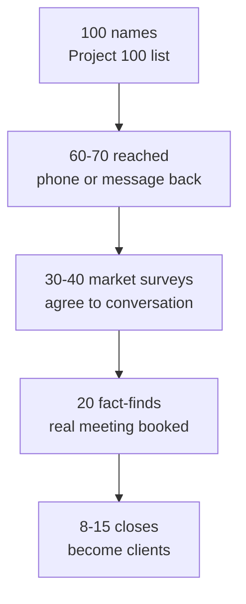
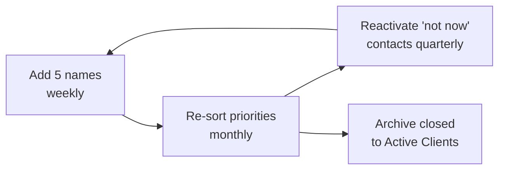

# Day 39 — Building the Prospect List: Project 100

> **The one idea for today:** Your prospect list is the single most valuable asset in your new business. A disciplined list of 100 names, worked systematically, produces more business than a chaotic pile of 500 half-remembered contacts.

## What you'll walk away with

By the end of today you should be able to:

1. **Build** your first Project 100 list — names, context, priority.
2. **Segment** prospects into the right buckets for the right activity.
3. **Maintain** the list as a living asset, not a one-time exercise.

---

## 1. What is Project 100?

**Project 100:** the structured process of identifying **100 warm-market names** and systematically working through them in your first 3–6 months as an FC.

The target:
- **100 names** in the initial list.
- **30–50 market surveys** completed from those 100 names.
- **20 Fact-Find interviews** from the market surveys.
- **8–15 closed clients** from the fact-finds.

**Why 100?** It's the sweet spot. Under 50 is too few to sustain a pipeline. Over 200 is unmanageable and mentally exhausting. 100 is the Goldilocks number.

## 1b. Market temperature — where the real market lives

Before you start listing names, understand the three rings your contacts sit in. Most new FCs exhaust the **hot** ring in 6 weeks and conclude "I've run out of people" — when in reality they've never touched the largest ring.

| Ring | Who | Why it matters |
|---|---|---|
| **Hot** | Parents, siblings, best friends — the 5 to 15 people closest to you | Easiest to meet, open, and close. Burns fast. Month 1–2 territory. |
| **Semi-Warm** | Friends, ex-colleagues, relatives you see sometimes, old classmates you message once a year | This is **where most of your career lives**. Largest ring, lowest competition, real relationship equity. |
| **Cold** | Strangers from ads, roadshows, cold calls, referrals | Lower conversion, transactional — but infinite supply. Day 40–42 territory. |

**The mistake:** most people look for names in the Hot ring only, then stall when it's depleted. The actual mining work happens in Semi-Warm — and the whole reason Project 100 is set at *100* is to force you out of Hot and into the Semi-Warm ring where the long-term pipeline lives.

**Rule of thumb for your Project 100:** ≤25 Hot, ≥40 Semi-Warm, rest Cold leads or referrals.

## 2. How to build your 100

Start with a blank spreadsheet. Use these 10 categories to get you to 100.

| Category | Typical # of names |
|---|---:|
| Immediate family + extended family | 10–15 |
| Close friends (WhatsApp contacts you talk to weekly) | 10–20 |
| Best friends from school (primary, secondary, uni) | 15–25 |
| Former colleagues (present + past employers) | 10–15 |
| University / CCA group members | 10–15 |
| Neighbours, church / temple / mosque members | 5–10 |
| Professional connections (clients, vendors, partners from past roles) | 5–10 |
| Social connections (gym, hobbies, sports teams) | 5–10 |
| Friends-of-friends you've met a few times | 10–15 |
| People you've met at events in the past 2 years | 5–10 |

**Total:** comfortably 100+.

**The trick:** don't stop at your "usual suspects." Many new FCs only list the top 20 they know well, then get stuck. **Go wide.** Old classmates you haven't spoken to in 5 years count. Former colleagues count. That person you met at a wedding and exchanged numbers with counts.

## 3. The spreadsheet columns

A functional Project 100 list has these columns:

| # | Name | Relationship | Last contact | Phone | Priority (A/B/C) | Status | Notes |
|---|---|---|---|---|---|---|---|
| 1 | Jane Lim | University friend | 3 months ago | +65... | A | To call | Just had baby, might need CI review |
| 2 | David Chen | Ex-colleague at XYZ | 2 years ago | +65... | B | Cold | Good time? Reconnect first |
| 3 | Uncle Raj | Family | Last week | +65... | A | Called, meeting booked | Hospitalised last year |
| ... |

### Priority codes

- **A:** Warm, accessible, likely to take a meeting within 30 days. Start here.
- **B:** Cooler, need reconnection first before asking for a meeting.
- **C:** Cold — haven't spoken in years. May require a low-pressure "catch up" as a reactivation.

### Status codes

- **To call** — in the pipeline.
- **Called, pending response.**
- **Called, meeting booked.**
- **Met, in fact-find.**
- **Met, closed.**
- **Met, not proceeding.**
- **Reconnecting (warming up for later).**

## 4. The 100 to 30 funnel

Not everyone on your list of 100 will become a prospect. That's expected.

**Expected conversion funnel:**

- **100 names** → reach out.
- **60–70 reach** — actually get on the phone or message back.
- **30–40 market surveys completed** — agree to a quick conversation.
- **20 fact-finds** — agree to a real meeting.
- **8–15 closes** — become clients.

**The math:** ~8–15 clients from 100 names is a good Year-1 benchmark. **Each client = $1,000+ FYC + CLV that compounds.**

**Don't be discouraged by the drop-off.** It's the normal shape. The point of the 100 is to get *enough at the top* so the 8–15 at the bottom actually materialise.

## 5. The natural market profile check

Not all warm-market contacts are equally valuable. Use this quick scoring to prioritise.

| Factor | Good sign | Bad sign |
|---|---|---|
| Age | 25–50 (prime planning years) | Very young, very old |
| Income stability | Employed, steady | Unstable, between jobs |
| Life stage | Getting married, having kids, buying home | Already retired, settled |
| Financial savvy | Somewhat informed, open to advice | Hostile to finance, conspiracy-minded |
| Relationship warmth | You feel comfortable calling them | You dread the call |

**Scoring:** 4–5 green checkboxes → Priority A. 2–3 → Priority B. 0–1 → Priority C.

**Don't skip the C's entirely.** They're slower but not worthless. A Priority C warmed up over 6 months can become a client — or give a great referral.

## 6. Keeping the list alive

The biggest mistake new FCs make: **treating Project 100 as a one-time exercise.**

You build the list in Week 1. By Week 10, you've contacted everyone. What now?

**The answer:** Project 100 is a **living document.** It should be:

- **Added to weekly.** Every new person you meet gets added. Target: 5 new names per week.
- **Re-sorted monthly.** Warmth changes. Priorities shift.
- **Archived when closed.** Closed clients go to a separate "Active Clients" list.
- **Reactivated quarterly.** People who said "not now" 6 months ago may be ready today.

**After Year 1**, your Project 100 evolves into a continuous prospect pipeline of 200–500+ names across warm, referred, and cold tiers.

## 7. A note on digital-first prospect lists

If you're starting in the 2026 era, some of your Project 100 may come from **digital connections** rather than pure warm market:

- LinkedIn connections with meaningful engagement history.
- Instagram DM contacts who've asked you finance questions.
- Telegram/WhatsApp group members you've interacted with.
- Commenters on your content who've shown genuine interest.

These count. But they're **lower-priority than real warm market** for your first 30 meetings. Digital-first prospecting is Week 7 Days 40–42 territory. Use Project 100 first for its intended purpose (warm launch), then layer digital on top.

## 8. The psychological trap

Building the list of 100 is easy. **Calling them is the hard part.**

The trap:
- Week 1: You list 100 names. Feels productive.
- Week 2: You've called 3. Start inventing reasons to delay.
- Week 3: You call 2 more, both reject you awkwardly. You avoid the list for a week.
- Week 4: You tell yourself you need "a better approach" and start researching scripts again.
- Week 5: The list is untouched.

**The reality:** the list is not your problem. **The calling is your problem.** See Day 26 on the 10X Rule in Daily Action and Day 19 on counting rejections.

**Goal for Week 7:** call **at least 20 people from your Project 100 list.** Not "prepare to call." Actually call.

## 9. The Marketing Kit — what to bring to every first meeting

Project 100 is the *who*. The Marketing Kit is the *what you show them when you're across the table*. Without it, your first appointment leans on talk only. With it, every prospect leaves with a tangible artefact and a clear sense of who you are.

### What it is, in one line

A printed or digital deck (PDF / iPad / physical booklet) that introduces **you**, your **services**, and **AIA** as a company — in the order that matters.

### The sales hierarchy it serves

> **Sell yourself → sell the company → sell your services → product is "by the way".**

Clients buy because they trust you and believe you'll act in their interest. Products across major Singapore insurers are largely similar — tight MAS regulation and competitive pressure converges feature sets. The differentiator is the human across the table.

(One exception: high-C, detail-oriented personality types will want a feature-by-feature breakdown. Be adaptable — but lead with you, not features.)

### The components of a complete Marketing Kit

| Section | Content |
|---|---|
| **Cover page** | Professional photo, your name, designation |
| **Self-introduction** | One paragraph on **why you chose this career** (your story, not generic) |
| **Service proposition** | What you offer — risk management, wealth accumulation, retirement, estate planning |
| **Testimonials** | Client quotes, screenshots of referral messages, a real signed photo if you have one |
| **Life journey** | The stages of life you walk clients through (JC → adulthood → marriage → kids → retirement) |
| **Philosophy / values** | Your personal values (integrity, relationships, long-term thinking, etc.) |
| **AIA Professional Pledge** | The pledge you learned in foundation class |
| **Sell the company** | AIA corporate info — vision, size, claims paid, regional presence |
| **Sell the agency** | Win Financial Group info, website screenshot |
| **Product info** | Par fund returns, ED fund performance, plan-level summaries |
| **AIA fund managers** | The Elite fund partners (BlackRock, Wellington, Baillie Gifford, Capital Group) |
| **Claims experience** | Real claim stories + statistics (a single claim story does more than 10 features) |

### Integration with the CST

Some FCs build the **CST (Why / What / How Much) directly into the same deck** — so the Marketing Kit doubles as the presentation tool. Same artefact, two purposes: introduces you AND walks the prospect through the financial planning concept.

### The referral seed

Plant the seed during the first appointment, not the second. One line, casually delivered:

> *"When you become my client, I hope you'll feel comfortable enough to recommend me to one or two of your friends — that's how I built most of my practice."*

That sentence, dropped early, sets the expectation. By the time you close (meeting two or three), referrals are already pre-framed as a normal part of working with you — not an awkward ask at the end.

### Why this is in Day 39 specifically

A great list (Project 100) and a great Marketing Kit are the two halves of being *ready for week 7's calls*. The list answers *who do I call?* The kit answers *what do I show them when they say yes?* Building the list without the kit — or vice versa — leaves the other half of the loop broken.

## Quick quiz

1. **The target number for Project 100 is:**
 - A) 30
 - B) 100 ✓
 - C) 300
 - D) 500

 **Why:** 100 is explicitly described as the Goldilocks number — large enough to produce a working funnel, small enough to manage systematically. 30 (A) is the market-survey floor, not the list size. 300 and 500 are mentally exhausting to manage and push beyond the warm-market sweet spot into contacts that are effectively strangers. The discipline of 100 ensures each name gets proper attention.

2. **A typical conversion funnel from 100 names is:**
 - A) 50 meetings, 25 closes
 - B) 30–40 market surveys, 20 fact-finds, 8–15 closes ✓
 - C) 100 meetings, 50 closes
 - D) 10 meetings, 5 closes

 **Why:** The stated funnel is: 100 names → 60–70 reached → 30–40 market surveys → 20 fact-finds → 8–15 closes. Option A overstates how many people agree to a meeting. Option C assumes everyone on the list becomes a meeting, which ignores normal drop-off at each stage. Option D undershoots the expected outcome and would make the whole exercise seem not worth the effort.

3. **Your Project 100 list should be:**
 - A) Built once in Week 1 and worked through
 - B) A living document — added to weekly, re-prioritised monthly ✓
 - C) Discarded after Year 1
 - D) Shared with your team

 **Why:** Project 100 is explicitly a living document: add 5 names weekly, re-sort monthly as warmth changes, archive closed clients, and reactivate contacts who said "not now" every quarter. Treating it as a one-time build (A) is called out as the biggest mistake new FCs make. Discarding it after Year 1 (C) throws away the compounding asset. Sharing the list with your team (D) is not part of the process described and would conflict with client confidentiality.

4. **A contact aged 28, recently married, steadily employed, and open to financial advice scores as:**
 - A) Priority C — too young to have real needs
 - B) Priority B — needs reconnection first
 - C) Priority A — warm, in a prime planning life stage, likely to meet within 30 days ✓
 - D) Priority B — finances may not be stable yet

 **Why:** The natural market profile check scores this contact green on all five factors — age in the 25–50 prime planning window, stable income, a triggering life event (marriage), open attitude to advice, and presumably warm enough to call. Priority C (A) misreads the age bracket. Priority B for reconnection (B) applies to cooler contacts, not someone you'd "happily call." Finances being unstable (D) contradicts the "steadily employed" condition in the question.

5. **The primary reason the Project 100 target is 100 names rather than 500 is:**
 - A) It takes too long to find 500 warm contacts
 - B) 100 is the Goldilocks number — large enough to sustain a pipeline, small enough to manage ✓
 - C) AIA policy caps the list at 100
 - D) Digital tools cannot handle more than 100 contacts

 **Why:** The lesson explicitly calls 100 the "Goldilocks number" — under 50 starves the funnel, over 200 becomes unmanageable and mentally exhausting. There is no AIA policy cap (C). Most FCs can find 200–300 warm contacts if they go wide (D is a red herring). The real constraint is cognitive and operational manageability, not time or technology.

6. **An FC lists 100 names in Week 1 but has called only 5 by Week 4. What does Day 39 identify as the real problem?**
 - A) The script is not good enough
 - B) The list has too many C-priority contacts
 - C) The calling itself — avoidance behaviour, not list quality ✓
 - D) The market survey questions need updating

 **Why:** Day 39 directly names the trap: the list is not the problem, the calling is. The FC is inventing reasons to delay — researching better scripts, questioning list quality, anything but picking up the phone. Script quality (A) and list composition (B) are surface justifications for avoidance. Updating survey questions (D) is another delay tactic. The Day 26 reference to the 10X Rule and Day 19 on counting rejections are the prescribed antidotes.

7. **What is the recommended weekly addition target to keep Project 100 alive?**
 - A) 1 new name
 - B) 5 new names ✓
 - C) 20 new names
 - D) No set target — add whenever you meet someone new

 **Why:** The lesson specifies 5 new names per week as the target to keep the list growing steadily. 1 name per week (A) is too slow to replace closed or exhausted contacts over time. 20 per week (C) is more than most FCs can meaningfully add with proper context and notes. "No set target" (D) is the approach that lets the list go stale — a specific weekly number creates a habit, not an aspiration.

---

## Related

- Previous: [[day-38|Day 38 — Natural Market vs Referred Leads]]
- Next: [[day-40|Day 40 — Digital Influence: Setting Up Your Presence]]
