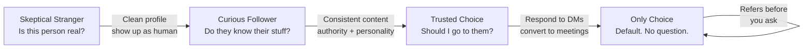
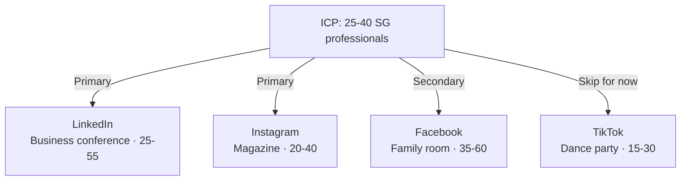

# Day 40 — Digital Influence: Setting Up Your Presence

> **The one idea for today:** Every prospect starts as a Skeptical Stranger — even your closest friends. Your social media isn't a billboard; it's a **journey** you take strangers on, from skepticism to curiosity to trust to choice. The modern FC builds that journey intentionally.

## What you'll walk away with

By the end of today you should be able to:

1. **Describe** the 4-stage Social Media Journey (Skeptical Stranger → Curious Follower → Trusted Choice → Only Choice).
2. **Audit** which platform fits which audience segment.
3. **Set up** a basic professional social presence on at least one platform this week.

---

## 1. Why digital influence is non-negotiable now

The old FC playbook: stand in a mall, knock on doors, call cold leads. Those methods still exist but they're **slow, inefficient, and increasingly ignored.**

The new playbook: **be discoverable, trustworthy, and influential in the digital spaces where your prospects already live.**

**The math that forces the shift:**
- ~90% of Singaporeans under 50 are active on at least one social platform.
- Most purchase research (including financial services) starts online.
- An FC who is invisible online is invisible to an entire generation of future clients.

**The reframe:** you're not choosing to "do social media." You're choosing whether to **exist** in the arenas where your prospects' decisions form.

## 2. The Social Media Journey — 4 stages

Every person who will ever hire you goes through these 4 stages.

### Stage 1 — Skeptical Stranger
- They don't know you.
- They probably found you via a mutual friend, a post, or a comment.
- **Their question:** "Is this person real? Worth my time?"
- **Your job:** be findable. Have a clean, professional profile. Show up as a real human, not a sales bot.

### Stage 2 — Curious Follower
- They followed you. Now they're watching.
- They're consuming your posts occasionally, deciding if you're worth more attention.
- **Their question:** "Does this person know what they're talking about? Is it useful?"
- **Your job:** publish consistently. Mix authority content (teaching) with social content (personality). Build familiarity.

### Stage 3 — Trusted Choice
- They've seen enough. They trust you.
- They might DM you with a question. They might share your posts.
- **Their question:** "When I need help, should I go to this person?"
- **Your job:** be consistently useful. Respond to DMs. Engage genuinely. Convert some interactions into first meetings.

### Stage 4 — Only Choice
- You're the default. They wouldn't consider anyone else.
- They refer friends to you before you ask.
- **Their question:** No question. Just action.
- **Your job:** protect the trust. Keep serving. Don't betray the brand.

**Most new FCs try to jump from Stage 1 to Stage 4** — via a direct pitch. It doesn't work. The journey has to be walked, not skipped.

## 3. Platform positioning — which lives where

Each platform has a "personality." Using the wrong one for the wrong message produces low engagement.

| Platform | Analogy | Primary audience | Content type |
|---|---|---|---|
| **Facebook** | Family living room | Adults 35–60+ (and families) | Life updates, milestone posts, local groups |
| **Instagram** | Magazine, reality TV | Young adults 20–40 | Visual stories, aspiration, behind-the-scenes |
| **LinkedIn** | Business conference | Professionals 25–55 | Thought leadership, industry commentary, career stories |
| **TikTok** | Dance party, club | Teens + young adults 15–30 | Short-form video, humour, trends |
| **YouTube** | Network TV | All ages | Longer-form education, interviews, tutorials |
| **X (Twitter)** | Family TV + forum | News-curious, professionals | Quick takes, threads, real-time conversation |

**Rule:** your ideal client profile dictates your platform. If your prospects are 25–40 Singaporean professionals, **LinkedIn + Instagram** is the core combo. Don't try to be everywhere.

## 4. The two-prong content strategy — Social + Authority

Your content has to split into two types, roughly 50/50:

### Social content
- Who you are outside of work.
- Hobbies, travels, family, humour.
- **Purpose:** humanise you. Build likability.
- **Risk of too much:** you look like a lifestyle blogger, not an advisor.

### Authority content
- What you know.
- Insights on CPF, insurance, investments, taxes, SG-specific rules.
- Simple explanations of complex topics.
- **Purpose:** establish competence. Build credibility.
- **Risk of too much:** you look like a textbook. No one connects.

**The 50/50 mix is a starting point.** Adjust based on feedback.

**Example — Instagram feed for an FC:**
- Post 1 (authority): "3 things you didn't know about CPF SA top-ups"
- Post 2 (social): A behind-the-scenes photo from a client meeting (client permission required)
- Post 3 (authority): "Job A vs Job B — a 60-second explainer"
- Post 4 (social): Weekend hike photo
- Post 5 (authority): "What I'd tell my younger self about insurance"

## 5. The basic setup (this week)

If you don't have a professional presence yet, here's the minimum for Week 7:

### Profile photo
- Clear, well-lit, professional but approachable.
- Same photo across platforms (for recognition).
- No distracting backgrounds.

### Bio / About section
- Who you help + how.
- Format: "I help [audience] achieve [outcome] through [framework]."
- Example: "Helping young Singaporean professionals build freedom through Total Wealth Planning | AIA Financial Adviser"
- Include: email, a soft CTA ("DM me for a 30-min review"), location.

### Cover / header image
- Visual that reflects you or your mission.
- Could be a relevant photo, a clean graphic, or a banner with your tagline.

### Connections
- Connect with Facebook friends on Instagram (via the "Discover People" feature).
- Connect with work contacts on LinkedIn.
- Accept follow-back requests promptly.

**Time needed:** 2 hours to do all three platforms reasonably. Do it this weekend.

## 6. The reconnection move

Once your presence is set up, reconnect with your warm market **through the platform**, not just through the phone.

**The message:**
> "Hey [name], just updated my profile and cleaning up who I'm connected with. I'm in financial advisory now — happy to chat if you ever need advice. No pressure; just wanted to reconnect properly."

Send this to 20 people per week. Out of 20, usually:
- 15 will acknowledge.
- 5 will follow back / re-engage.
- 1–2 will ask a question.
- Occasional: 1 will want a meeting.

It's low-pressure, low-yield — but free and continuous. Over 6 months, 500 reconnections = 25+ meetings. Good supplement.

## 7. The hygiene rules

A few non-negotiables for a professional FC's social media:

- **No political hot takes.** You lose half your market instantly.
- **No religious proselytising** (your own faith is fine in a biographical post, not pushed).
- **No drunken / inappropriate photos.** Prospects look you up.
- **No complaining about clients or the industry.** Even in "private" posts — screenshots exist.
- **No other financial advisors' content without attribution.**

**Your social media is a professional asset.** Treat it accordingly.

## 8. A reminder — real relationships beat follower counts

This chapter is about digital as a **channel**, not as a substitute for real connection.

A 10,000-follower FC with shallow relationships underperforms a 500-follower FC with 30 deep client relationships.

**Follower growth is a leading indicator.** But the **quality of conversion** (DM to meeting to close) matters far more than the raw number.

## Quick quiz

1. **The 4 stages of the Social Media Journey are:**
 - A) Follower → Engager → Customer → Promoter
 - B) Skeptical Stranger → Curious Follower → Trusted Choice → Only Choice ✓
 - C) Stranger → Friend → Prospect → Client
 - D) Cold → Warm → Hot → Client

 **Why:** The four-stage journey as stated is Skeptical Stranger, Curious Follower, Trusted Choice, Only Choice — each with a distinct question the prospect is asking and a distinct job for the FC. Options A, C, and D are plausible-sounding frameworks but don't match the lesson's named stages or the specific questions attached to each stage. Using the wrong framework leads to wrong tactics at each stage.

2. **The correct balance of Social vs Authority content is roughly:**
 - A) 100% Authority
 - B) 50/50 ✓
 - C) 80% Social, 20% Authority
 - D) 100% Social to be likable first

 **Why:** 50/50 is the starting point — too much authority and you look like a textbook with no human behind it; too much social and you look like a lifestyle blogger, not a credible advisor. 100% authority (A) produces credibility without warmth, which doesn't convert. 80% social (C) may build likeability but won't generate inbound finance questions. 100% social (D) directly undermines the trust-building that converts followers to clients.

3. **LinkedIn is analogous to which physical space?**
 - A) Dance party
 - B) Family living room
 - C) Business conference ✓
 - D) Reality TV

 **Why:** LinkedIn is described as a "business conference" — the platform for professionals where thought leadership, industry commentary, and career stories belong. A dance party is TikTok's analogy. A family living room is Facebook's analogy. Reality TV is Instagram's analogy. Posting the wrong content type for the platform's personality produces low engagement regardless of content quality.

4. **A prospect in Stage 2 (Curious Follower) is primarily deciding:**
 - A) Whether to buy a product
 - B) Whether to give a referral
 - C) Whether the FC knows what they are talking about and is worth more attention ✓
 - D) Whether the FC's prices are competitive

 **Why:** At Stage 2, the prospect's core question is "Does this person know what they're talking about? Is it useful?" — they're deciding whether to keep watching, not whether to buy. Buying decisions happen at Stage 3–4. Referrals come from Stage 4 (Only Choice). Price comparisons are irrelevant at the awareness stage and signal the FC is rushing the journey.

5. **An FC whose ideal clients are 25–40 Singaporean professionals should prioritise which platform combination?**
 - A) TikTok + YouTube
 - B) Facebook + X (Twitter)
 - C) LinkedIn + Instagram ✓
 - D) Facebook + TikTok

 **Why:** LinkedIn targets professionals aged 25–55 and Instagram targets young adults 20–40 — together they cover the full 25–40 professional audience. TikTok (A) skews younger (15–30) and is short-form video-dominant, not suited to professional financial content. Facebook (B, D) is primarily 35–60+ and families. The platform choice should follow the ideal client profile, not personal preference.

6. **The hygiene rule about political hot takes exists because:**
 - A) MAS regulations prohibit political commentary
 - B) Taking a political position can alienate roughly half your potential market instantly ✓
 - C) LinkedIn's algorithm penalises political content
 - D) Clients only want to see finance content

 **Why:** Political positions divide audiences — an FC who takes a strong public stance immediately loses segments of their potential market who hold opposing views. This is not a MAS rule (A); it's a business judgment about market access. Algorithm penalties (C) are platform-specific and not the stated reason. The rule isn't that clients only want finance content (D) — social content is encouraged — it's specifically about divisive topics that narrow your addressable market.

7. **An FC has 10,000 Instagram followers but zero DM conversations last month. What does Day 40 say about this?**
 - A) They need more followers to generate DMs
 - B) They should switch platforms
 - C) Follower count is a vanity metric; conversion quality matters far more than raw numbers ✓
 - D) They should post more authority content

 **Why:** The lesson directly states that a 10,000-follower FC with shallow relationships underperforms a 500-follower FC with 30 deep client relationships — follower count is a leading indicator, but conversion quality (DM to meeting to close) is what actually produces revenue. More followers (A) without better content or CTAs would just give more reach to posts that already aren't converting. Switching platforms (B) doesn't fix the underlying conversion problem. More authority content (D) alone doesn't generate DMs if posts lack CTAs inviting interaction.

---

## Related

- Previous: [[day-39|Day 39 — Building the Prospect List]]
- Next: [[day-41|Day 41 — Digital Influence: Content & Engagement]]
