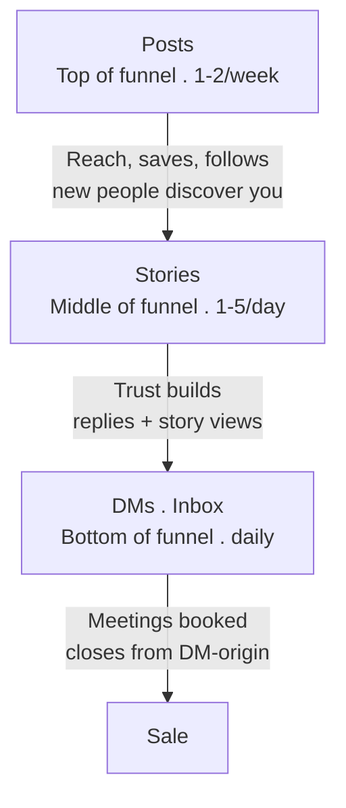
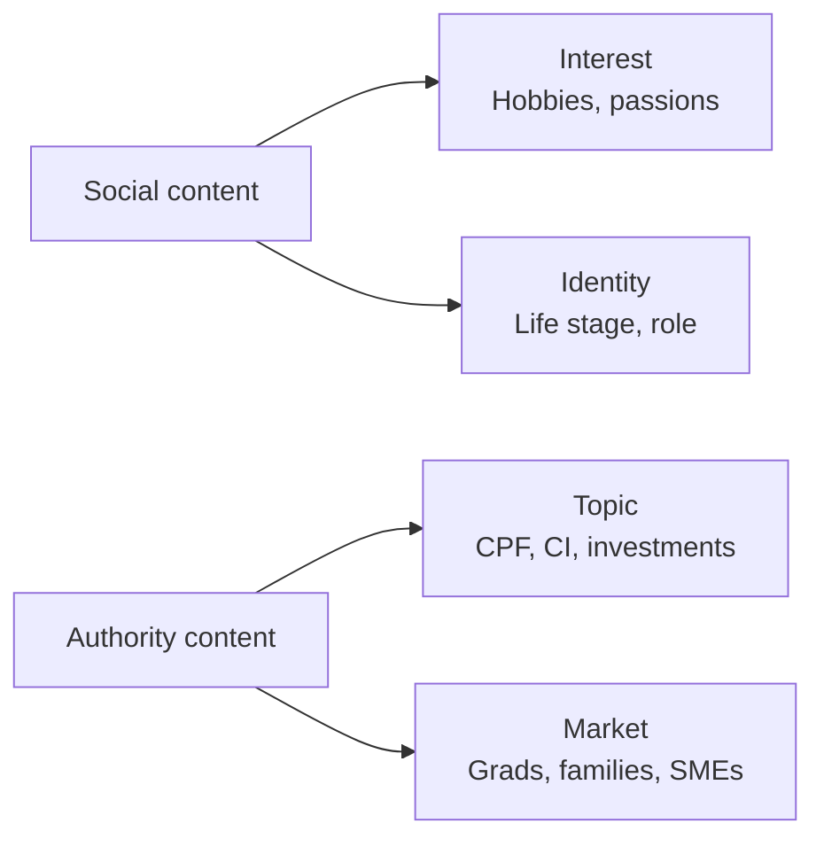
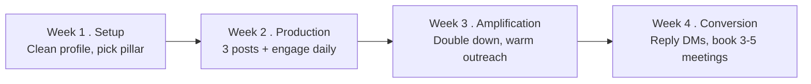

# Day 42 - Digital Influence: Lead-Gen Playbook

> **The one idea for today:** Posts produce leads. Stories produce trust. DMs produce sales. All three happen on every platform - but only if you use them together. The lead-gen machine works when all three components are running, not when you optimise one in isolation.

## What you'll walk away with

By the end of today you should be able to:

1. **Map** the 3-channel digital funnel: Posts -> Stories -> DMs.
2. **Produce** content centred around Interest, Identity, Topic, or Market.
3. **Run** a monthly lead-gen push - a structured 30-day experiment.

---

## 1. The 3-channel funnel

Every social platform (especially Instagram) has three content layers. Each has a job.

### Layer 1 - Posts (top of funnel)
- **Purpose:** generate **leads** - new people discovering you.
- **Content type:** evergreen, shareable, teaching.
- **Frequency:** 1-2 per week.
- **Metric:** reach, saves, follows.

### Layer 2 - Stories (middle of funnel)
- **Purpose:** build **trust** with people who already follow you.
- **Content type:** daily life, behind-the-scenes, quick tips.
- **Frequency:** 1-5 per day.
- **Metric:** replies, DMs, story views.

### Layer 3 - DMs / Inbox (bottom of funnel)
- **Purpose:** convert to **sales** - offline relationships, then meetings.
- **Content type:** direct conversation, personal, responsive.
- **Frequency:** daily check + replies within 24 hours.
- **Metric:** meetings booked, closes from DM-origin.

**The trap:** most new FCs post (Layer 1) and ignore stories and DMs. Layer 1 alone produces low returns. The three layers **multiply** each other.

## 2. Content centred around - the 4 pillars

Your content, regardless of format, should centre on one of these four pillars.

### Social content centred on:

**1. Interest**
- A hobby, activity, or passion of yours.
- Examples: gaming, photography, reading, sports, travel.
- **Why it works:** humanises you. Attracts similar-interest prospects.

**2. Identity**
- A life-stage or role you share with your audience.
- Examples: fresh graduate, mother of two, career-switcher, Gen Z professional.
- **Why it works:** people identify, engage, trust you because "you get them."

### Authority content centred on:

**3. Topic**
- A specific financial area you explain.
- Examples: budgeting, investments, protection, CPF, estate planning.
- **Why it works:** you become known for *that* topic. Prospects tag friends when the topic comes up.

**4. Market**
- A specific client segment you serve.
- Examples: fresh graduates, families, single parents, retirees, teachers, SME owners.
- **Why it works:** prospects in that segment self-select. Competition narrows.

**The strongest FC brand combines 1-2 pillars.** Example:
- "I'm a mum of two (identity) who helps other Singapore mums plan for their kids' education (market + topic)."

**The weakest FC brand:** no clear pillar, just random posts. No one remembers you.

## 3. Good content structure - for authority posts

For authority-focused posts (where lead-gen happens), use this structure:

### The headline (1-2 lines)
- Curiosity hook or direct benefit.
- "3 CPF mistakes that cost most Singaporeans $100K+ in retirement."
- "What I wish I knew about ILPs before I was 30."

### Emotion-evoking visual
- Photo or graphic that stops the scroll.
- Not a stock photo. Not a generic quote card. Something arresting or specific.

### The teaching (3-5 sentences or 5-10 slides)
- Solve a specific question.
- Use numbers, names, concrete scenarios.
- Not abstract principles - specific moves.

### Call to Action slide / line
- "DM me 'GUIDE' for the full CPF top-up guide."
- "Comment 'REVIEW' to get a free plan check."
- "Save this post so you don't forget."

**The CTA is mandatory.** Without it, your content produces zero leads even if it gets engagement.

## 4. Online conversation secrets

The DMs are where real money is made. A few subtle moves that separate good DMs from bad:

### Match their tone
- They use voice notes -> you use voice notes.
- They use emojis -> you use emojis.
- They're brief -> you're brief.
- They're chatty -> you're chatty.

### Ask before advising
- "Before I share thoughts, can I ask a couple of questions about your situation?"
- This shows you don't give generic advice.

### Use their name
- Not "hey" or "hi." "Hey, John."
- Singapore-appropriate: "Hi John, hope you had a good week!"

### End with an open question
- Never a one-word reply.
- Always keep the door open for the next message.

### Escalate to phone when appropriate
- After 4-6 messages, if there's real engagement, move to a call.
- "This might be easier on a quick 15-min call - want to grab time this week?"

### Respect the platform
- Don't send links to your website in the first message.
- Don't ask for phone numbers too early.
- Let the conversation build trust.

## 5. The monthly lead-gen push

If your digital lead-gen is flat, run a **30-day push.** This is a structured experiment.

### Week 1 - Setup
- Clean up profile (Day 40).
- Identify one pillar (Interest, Identity, Topic, or Market - Section 2).
- Plan 10-12 content pieces around that pillar.

### Week 2 - Production
- Publish 3 posts + 1 carousel + 10-15 stories.
- Engage on 10 other people's posts daily.

> **Tools:** [Content Studio](https://content-studio-beige-eta.vercel.app) generates the 10-12 pillar drafts so production week doesn't stall - then you rewrite into your voice and swap in real client moments before posting. Full list of tools at [/tools](/tools).

### Week 3 - Amplification
- Double down on what's working.
- Reach out to 20 warm-market contacts: "Just started posting more - if you find any of this useful, sharing would help."
- Start DMing people who've liked multiple posts: "Noticed you've been engaging with my posts - anything specific you'd like me to cover next?"

### Week 4 - Conversion
- Reply to every DM within 24 hours.
- Book 3-5 first meetings from digital-origin conversations.
- Do a post-mortem: what posts worked? What didn't? What DMs converted? What didn't?

**Target outcomes after one 30-day push:**
- 5-10 new inbound DMs from prospects.
- 2-3 first meetings booked from digital.
- Clarity on which content pillar works best for you.

## 6. Common mistakes that kill digital lead-gen

### Posting and ghosting
Publish a post, don't check it for 48 hours. By the time you see comments, engagement is cold.
**Fix:** check within 2 hours of posting, reply to all early comments.

### Generic content
"Investment is important for your future." -> means nothing, produces nothing.
**Fix:** concrete, specific, story-driven.

### Aggressive sales in DMs
Lead with "can I schedule a call?" to a stranger who didn't ask. Instant block.
**Fix:** answer their question first. Earn the call.

### No CTA
Teaching posts with no invitation. You informed them but didn't invite action.
**Fix:** every post needs a soft ask.

### Inconsistency
Post 3 times in Week 1, disappear for 3 weeks, post again.
**Fix:** the weekly system (Day 41). 1 post a week, every week, for 6 months.

### Copying competitors
Using another FC's exact templates, tone, content.
**Fix:** your uniqueness is the product. Your voice, your stories, your takes.

## 7. A note on paid lead-gen

Our agency also runs Facebook Ads to help you acquire clients. This works but has specific requirements:

- **Budget:** typically $500-2,000/month for meaningful volume.
- **Skill:** converting cold paid leads is harder than warm social leads. Expect 10-20% conversion vs 30-50% warm.
- **Compliance:** MAS rules on representations and claims apply.

**For your first 60 days: don't buy leads.** Master organic lead-gen via your natural market first. Paid becomes cost-effective once you know your close rate and CLV.

## Quick quiz

1. **The 3-channel digital funnel is:**
 - A) Ads -> Website -> Email
 - B) Posts -> Stories -> DMs (correct)
 - C) Cold -> Warm -> Hot
 - D) Awareness -> Consideration -> Decision

 **Why:** The three layers are Posts (top of funnel - generate leads), Stories (middle - build trust with existing followers), and DMs (bottom - convert to meetings and sales). Most new FCs only use Posts and ignore Stories and DMs, which is why their returns are low - the three channels multiply each other. Options A, C, and D describe generic marketing frameworks, not the specific platform-layer model taught in this lesson.

2. **Authority content should centre on:**
 - A) Interest or Identity
 - B) Topic or Market (correct)
 - C) Hobbies or lifestyle
 - D) Personal opinions

 **Why:** The lesson splits the four pillars by content type - Interest and Identity are social content pillars (humanise you), while Topic and Market are authority content pillars (establish competence and attract a specific audience). Authority content is where lead generation happens, so it needs to signal expertise in a financial topic or a client segment. Hobbies and lifestyle (C) belong to the social pillar. Personal opinions (D) are not one of the four named pillars at all.

3. **The most common DM mistake is:**
 - A) Replying too quickly
 - B) Aggressive sales immediately ("can I schedule a call?") to a stranger (correct)
 - C) Using emojis
 - D) Asking too many questions

 **Why:** Leading with a meeting request before building any rapport is listed as an "instant block" - it skips every trust-building step and signals that you're interested in the sale, not the person. Replying quickly (A) is actually encouraged - within 24 hours is the standard, 12 hours is ideal. Emojis (C) are fine and the lesson says to match the prospect's tone. Asking questions (D) is explicitly recommended as a way to show you give personalised advice.

4. **Stories (Layer 2) serve a different purpose than Posts (Layer 1). What is it?**
 - A) Generate new leads who do not follow you yet
 - B) Build trust with people who already follow you (correct)
 - C) Convert warm DM conversations into booked meetings
 - D) Boost reach through the algorithm

 **Why:** Stories are the middle-of-funnel layer - daily life, behind-the-scenes, quick tips - designed to build trust with people who already follow you, deepening the relationship between discovery and decision. Generating new leads (A) is Posts' job because posts are discoverable by non-followers. Converting DM conversations (C) is the DM layer's job. Algorithm reach (D) is a secondary benefit, not the stated purpose of stories.

5. **An FC posts a well-researched CPF carousel but includes no CTA. What is the predictable outcome?**
 - A) High saves and shares, but zero direct leads generated (correct)
 - B) Reduced organic reach due to missing keywords
 - C) The post will be flagged as financial advice by the platform
 - D) Comments will replace DMs as the lead channel

 **Why:** The lesson states that a CTA is mandatory - without it, content produces zero leads even if it gets strong engagement. A no-CTA educational post can earn saves and shares (which signal future reference value) but provides no mechanism for prospects to take action. Organic reach (B) is not dependent on CTAs. Platform flagging (C) is not how social platforms work for FC content. Comments replacing DMs (D) is not a documented substitution - both require a CTA to generate.

6. **During Week 3 of a 30-day lead-gen push, the recommended action toward warm-market contacts is:**
 - A) Ask them directly for a meeting
 - B) Send the contacts a cold DM with a product explainer
 - C) Message them saying you have started posting more and ask them to share if useful (correct)
 - D) Pause outreach and focus entirely on producing new content

 **Why:** Week 3 is the amplification phase - the specific script is: "Just started posting more - if you find any of this useful, sharing would help." This is low-pressure, provides a reason to reach out, and can generate organic reach at no cost. Asking directly for a meeting (A) is too forward at this stage of the push. Sending a product explainer (B) is the aggressive DM approach the lesson explicitly warns against. Pausing outreach entirely (D) kills the momentum the first two weeks built.

7. **Why does Day 42 advise against buying paid leads in the first 60 days?**
 - A) Facebook Ads are too expensive for new FCs
 - B) MAS does not allow paid digital advertising for new advisors
 - C) Converting cold paid leads is harder; the FC should master organic first and know their close rate before spending on ads (correct)
 - D) Paid leads are lower quality than organic leads in all situations

 **Why:** Cold paid leads convert at 10-20% versus 30-50% for warm organic leads - and without knowing your own close rate and CLV, you cannot assess whether the ad spend is cost-effective. Mastering organic lead-gen first gives you the benchmarks to run paid ads profitably. Cost alone (A) is not the stated reason - the lesson cites skill and conversion rate, not budget. There is no MAS rule banning paid ads for new advisors (B). D overstates the case - paid leads can become effective once the FC has mastered organic conversion, they are just not appropriate in the first 60 days.

---

## Scripts Library

Here are the canonical DM and text-first scripts for the digital funnel - inbound replies, no-reply nudges, and meeting asks. Practise them out loud, then make them yours.

_Note: at this stage you're not licensed yet. The "appointment" you book here runs the canned Insurance CST or Investing CST as practice - see [Day 43](../week-8/day-43) for the full framing._

### Texting EQ - The 11 Rules for DM/Text Outreach

**Use this when** you're about to send any DM or follow-up text. Rules 1, 2, 3 are non-negotiable.

1. **Link back to the previous conversation** - no random openers. *"Hey bro the other time you were saying you work in Tanjong Pagar right? Exactly where is your office?"*
2. **Every text creates more reason to meet.** *"I've been wanting to show you how I helped some clients increase their investment returns with their existing portfolio."*
3. **End every text with an easy-to-answer question.** *"Are you working from home or office?"*
4. **Make them feel SAFE.** *"Sometimes I advise people not to invest at all if there's no need - we can discuss when we meet and you decide for yourself."*
5. **Common ground that keeps the convo going.** *"Some of my clients are also doctors and I help them with investments since they work long hours."*
6. **Actively follow up.** 90% of the time people don't reply first round. Bump them by name.
7. **Reply quickly** - within 3-4 hours. Signals reliability.
8. **Be casual.** No jargon. No "Optimisation". Use emojis and "Hahaha" if it sounds like you.
9. **Texting works best after 2-3 touchpoints.** Warm them up first - story replies, post comments, congrats messages.
10. **Never use the word FREE.** Use a specific 30-min ask instead.
11. **Minimise the prospect's thinking when setting CTA.** *"For next month I have 10th Jan 6pm and 23rd Jan 8pm, which works?"*

_Source: Academy scripts library, audience=warm-market, category=tips._

### Initial DM - Qualified Lead (Young Adult, Non-Voucher)

**Use this when** someone has DM'd you a finance question or commented on your post showing real interest. They're warm, not just lurking.

> "Hey [name]! Thanks for the DM - happy to help.
>
> Quick one before I share - just so I can give you the most useful answer, can I check: how old are you, and are you currently working / NSF / studying?
>
> Also, when you mentioned [their question topic], are you trying to figure out a specific situation - or more general financial planning curiosity?"

The two-question move qualifies them without sounding like a quiz. By the time they answer, you've earned permission to give a tailored reply rather than a generic one.

_Source: Academy scripts library, audience=young-adult, category=initial-text._

### Post-Call / Post-DM Text (Young Adults, All Angles)

**Use this when** you've had a phone or video call from a digital lead and want to land the relationship immediately after.

> "Hey [name] - really enjoyed our chat just now. As promised, here's [the resource you said you'd send].
>
> A few of the things you mentioned [specific 1-2 things] are pretty common - want me to put together a quick plan walkthrough for you? 30 mins, on Zoom, fully tailored to your situation. No pitch.
>
> Tuesday 7pm or Thursday lunch?"

The post-call text is where most digital-origin leads die. Don't let yours.

_Source: Academy scripts library, audience=young-adult, category=post-call-text._

### No-Reply Nudge (Day 1 / Day 3 / Day 7)

**Use this when** a DM lead has gone cold after the initial reply. Three nudges, spaced - then they go to the long-tail nurture list.

**Day 1 (4 hours after no reply to your first message):**

> "Hey [name] - just bumping this up in case it got buried "

**Day 3:**

> "[Name] - no rush at all, just don't want you to miss this. Whenever's good for you "

**Day 7:**

> "Hey [name] - going to stop chasing on this one  if it's still on your radar, I'm here. Otherwise no stress, will keep an eye out for anything else useful to send your way."

The Day 7 nudge is the open-door close - it explicitly stops the chase, which paradoxically reopens the door. Many replies come *because* you removed the pressure.

_Source: Academy scripts library, audience=young-adult, category=follow-up._

### Reschedule / Reminder (D-7, D-1, Day Of)

**Use this when** a digital-origin meeting is on the calendar and you want it to actually happen. Digital leads no-show at higher rates than warm leads - confirm them properly.

**D-7 reminder:**

> "Hey [name] - looking forward to our chat next [day]. Just to confirm - we said [time], on Zoom. I'll send the link a day before."

**D-1 reminder + Zoom link:**

> "Hey [name]! Tomorrow [time] still good? Here's the Zoom link: [link]. See you then!"

**Day-of reminder (2 hours before):**

> "Hi [name] - see you in 2 hours at [time]. Same Zoom link as yesterday's message. Excited to chat!"

Three-touch confirmation drops no-shows by roughly 50% on digital-origin meetings. It's worth the 30 seconds per touch.

_Source: Academy scripts library, audience=young-adult, category=confirmation._

---

## Related

- Previous: [[day-41|Day 41 - Digital Influence: Content & Engagement]]
- Next: [[../week-8/day-43|Day 43 - Scripting Your Approach]]
- Week 7 summary: [[README|Week 7 - The Approach & Digital Prospecting]]
