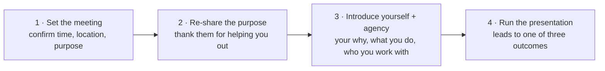
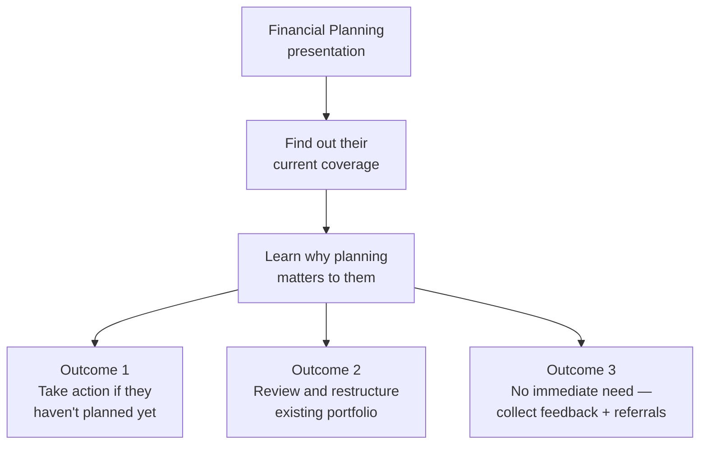

# Day 43 — Scripting Your Approach

> **The one idea for today:** Improvised prospecting calls fail. Scripted prospecting calls succeed, then become natural over reps. A good script isn't a crutch — it's scaffolding. Master the scaffolding, then walk freely.

## What you'll walk away with

By the end of today you should be able to:

1. **Structure** a prospecting call using the 6-part Telephone Technique.
2. **Deliver** a 30-second elevator pitch using the AIDA framework.
3. **Sell the appointment**, not the product — the only outcome you're chasing on a prospecting call.

---

## 1. Why new FCs fail at tele-prospecting

Six common failure patterns — every new FC hits at least 3:

1. **Not taking it seriously.** Treating calls as an afterthought.
2. **Not doing it enough.** 5 calls a week isn't activity, it's window-shopping.
3. **Not getting enough leads.** Empty Project 100 → no calls → no pipeline.
4. **Recycling calls.** Same 20 people, called repeatedly. No new names.
5. **No structured script.** Every call reinvented on the fly. Exhausting and inconsistent.
6. **No follow-up system.** Contacts made once and forgotten.

**The fix for all six:** structured activity + structured scripts + a CRM.

## 2. The 6-part Telephone Technique

A prospecting call has six phases. Memorise them in this order.

### 1. Preparation
- Know your list for the session (10–20 names).
- Have scripts open. Have responses to top 5 objections ready.
- Phone on do-not-disturb for incoming; schedule a specific window.
- Mental state: calm, curious, not desperate.

### 2. Greeting
> "Hello, is this John?"

Direct, confirms identity, invites response.

### 3. Introduction
> "John, this is [your name]. Do you have a moment to speak?"

Get permission. Respect their time. If they say no, **book a time** instead of pushing.

### 4. Purpose (the "by the way" call)
The most important part — this is where you earn (or lose) the next 30 seconds.

Don't open with: "I wanted to talk to you about insurance."
Do open with: "I'm in a new career and doing a simple market survey — would appreciate 5 minutes of your time."

The purpose is framed as a request for *their help*, not a sale.

### 5. Rapport building
Brief — under 60 seconds. Reference a recent shared event, ask how they've been, comment genuinely on something you know about them.

### 6. Summary / Setting the appointment
Close with a **specific time ask**. Not "when's good?" — give two specific options.

> "Would Tuesday 3pm or Thursday 7pm work better for you?"

## 3. Sell the appointment, not the product

The single most common mistake: **trying to sell the policy on the phone.**

You can't. You shouldn't try. The only goal of a prospecting call is **to book a meeting.**

**What you sell on the phone:**
- Your time (why 30 minutes of yours is worth 30 minutes of theirs).
- The outcome of the meeting (clarity, not commitment).
- Yourself (why they should meet you vs anyone else).

**What you DON'T sell on the phone:**
- Products.
- Prices.
- Detailed financial advice.
- Complex concepts.

**The rule:** if the conversation strays into product or advice, gently redirect:
> "That's a great question — the honest answer depends on your situation, which I'd rather understand properly before answering. Can we find 30 minutes this week?"

## 4. When the meeting is booked — the 4-step introduction

Booking the meeting is half the work. The other half is running the meeting itself with structure, so you're never improvising in front of a prospect. Every first meeting follows four steps in this order.

### Step 1 — Set the meeting
Confirm time, place, and purpose the day before. Short message:
> "Looking forward to tomorrow 3pm at Starbucks Raffles Place. I'll run through the financial planning survey we spoke about — takes ~30 mins. Any questions, let me know!"

### Step 2 — Re-share the purpose
Open the meeting by restating why you're there and thanking them. Low pressure, humble. This is the frame-setting that stops them from treating you as a salesperson.

### Step 3 — Introduce yourself and the agency
Three artefacts you walk them through:
- **Your write-up** — your *why*, your *what*, and the kind of people you help
- **The agency philosophy** — what the team stands for
- **The ecosystem** — the community, partners, and support the prospect is plugging into when they work with you

These exist precisely so you don't have to improvise credibility. Build them once; reuse them with every prospect.

### Step 4 — Run the presentation → three outcomes

There is **no fourth outcome**. Even the "no immediate need" case is still productive — the referral ask is the way this industry's top performers compound. A meeting that ends with 5 names in your notebook is a meeting that paid for itself.

**The mental shift:** stop judging a meeting by whether they bought. Judge it by whether it ended in one of these three outcomes cleanly.

## 5. The "by the way" call

One of the most elegant prospecting techniques:

You're already meeting someone (for lunch, coffee, a non-work purpose). Casually, you raise the career by transition:

> "By the way, I recently started in financial advisory. I'd love to chat about it over a proper coffee sometime — no pressure, just want to share what I'm doing."

**Why it works:**
- Low pressure (you're already together for other reasons).
- No "sales call" framing.
- Natural curiosity often kicks in — they ask questions.
- Easy to transition to a future dedicated meeting.

**A specific variant — "lunch aimai":**
> "I'm around the area, lunch aimai?"

During lunch, friends naturally ask "what are you doing these days?" — and you have a natural 10-minute window to share your career, the people you help, and ask if they'd want a proper conversation later.

**Lunch is showmanship.** You're not pitching; you're being a friend with a new chapter they want to know about.

## 6. Cold call ≠ only FCs do this

Many new FCs feel cold calling is "beneath them." Everyone does it:

| Role | Cold calls to... |
|---|---|
| Bankers / Wealth managers | Sell insurance, equities, accounts |
| Supply chain managers | Procure materials, source projects |
| Entrepreneurs | Sell products, pitch ideas, raise capital |
| Recruitment managers | Recruit talent, fill open roles |
| Real estate agents | Source listings, reach buyers |
| Journalists | Source stories, interview subjects |

**Cold calling is a universal business skill.** Anyone who claims to "not do it" is either very established or lying. Owning this skill gives you leverage for your entire career, not just this one.

## 7. Your elevator pitch — AIDA framework

When a prospect asks "what do you do?", you have ~20–30 seconds. Use the AIDA framework.

### A — Attention (1–2 sentences)
Capture attention. Often via a stat, a question, or a specific pain.
> "Most Singaporeans I meet don't know what their CPF will pay them at 65 — and by then it's often too late to fix."

### I — Interest (1 sentence)
What's different about you.
> "I help young professionals understand what they actually need to save, so they're not trying to catch up at 45 with 20× the effort."

### D — Desire (1 sentence)
How the outcome looks.
> "The people I work with get to retire earlier, with more choice, knowing exactly where they stand."

### A — Action (1 sentence)
The CTA.
> "If you're open to a 30-min coffee where I'd ask you a few questions and share what I'd recommend — no obligation — happy to set one up."

**Total: ~30 seconds.** Practise until it flows naturally.

## 8. Structuring your elevator pitch — the 5 questions

Before writing, answer:

1. **Who is your target prospect?** (Young professional? Pre-retiree? Small business owner?)
2. **What do you want them to know or do?**
3. **Why should they care? Why should they pay attention?**
4. **Where can they get more information?**
5. **When / how can they take action or respond?**

A pitch built from these 5 answers will always feel specific and useful. A pitch that skips them feels generic.

## 9. The "you are the product" mindset

New FCs focus pitches on AIA, policies, or products. That's wrong at the Approach stage.

**At the Approach stage: YOU are the product.**

The prospect is deciding if they like *you.* Products come later.

When pitching yourself, emphasise:
- Your genuine reason for joining the career.
- Your service orientation, not commissions.
- Your commitment to keep learning.
- Your values, not just your technical knowledge.

People want to work with **people**, not products. The Approach phase is where you establish that you're worth working with.

---

## Reflection worksheet

**1. Draft your 30-second AIDA elevator pitch. Say it aloud 5 times tonight.**
> Record yourself. Listen back. Does it sound natural or robotic?

**2. Map the 6-part Telephone Technique to your last 3 prospecting calls.**
> Which part did you skip? That's your weak link.

**3. Plan a "by the way" call this week — a social lunch/coffee where you naturally raise the career.**
> Who? When? What's the transition line?

---

## Quick quiz

1. **The only goal of a prospecting call is to:**
 - A) Sell a policy
 - B) Give financial advice
 - C) Book an appointment ✓
 - D) Build a long relationship

2. **The AIDA framework stands for:**
 - A) Action, Interest, Desire, Approach
 - B) Attention, Interest, Desire, Action ✓
 - C) Ask, Inform, Deliver, Ask
 - D) Attention, Intent, Decision, Action

3. **When a prospect asks product questions on a prospecting call, you should:**
 - A) Answer in detail
 - B) Redirect gently — "Let me understand your situation first in a proper 30-min meeting" ✓
 - C) Refuse to answer
 - D) Send them collateral instead

---

## Related

- Previous: [[../week-7/day-42|Day 42 — Digital Influence: Lead-Gen Playbook]]
- Next: [[day-44|Day 44 — Handling Resistance & Objections]]
