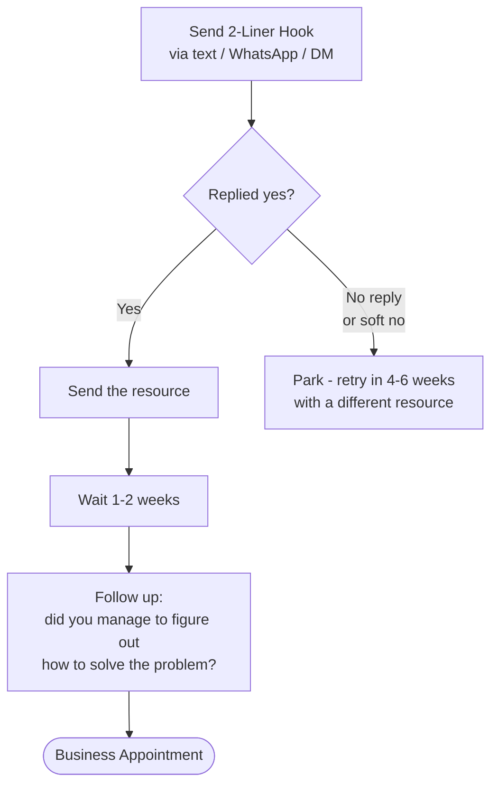

# Day 43 - The Approach: Warm Market Survey & Cold Calls

> **The one idea for today:** The approach has two completely different psychological setups. **Warm** is "I need your help with a quick survey" - friends and people you already know. **Cold** is "we don't know each other, here's why this 60 seconds is worth it" - referrals, leads, strangers. Master both, plus a follow-up system, plus the emotional skill to keep dialling after a no.

> **Important context - you are not licensed yet.** At Day 43 you don't have CMFAS / M9 / M9A / HI / RES5 in hand. You **cannot** sell, recommend, or bind anything - and that's exactly why today is purely practice. The "appointment" your survey leads to is a rehearsal, not a sale. What you actually walk your friend through in that meeting is the canned sales track - either the **Insurance CST** or the **Investing CST**, your pick based on what fits the prospect. That makes the survey framing literally accurate: "I'm in training, would you help me practise?" - because you are, and they would. When you pass licensing, you revisit them with real recommendations. For now: reps on the survey, reps on the CST, reps on the binary close.

## What you'll walk away with

By the end of today you should be able to:

1. **Run the warm-market survey** so confidently you can text or call any friend without freezing.
2. **Run a cold-call flow** that books appointments without selling the product.
3. **Follow up** the 60-80% of contacts who don't say yes immediately - so they don't leak out of your pipeline.
4. **Face rejection** with a math-based mindset that lets you keep going for 100+ calls in a week.

---

## Part 1 - Warm market: the Market Survey approach

This is the approach for **anyone you already know**. Friends, ex-colleagues, classmates, family contacts, your Project 100 list. They will pick up the phone because of who you are - not because of what you're offering.

> **Phone-first vs social-first.** This Market Survey is the **phone-first** warm path - good for contacts you've spoken to recently or who'd answer a ring. For contacts you've drifted from but who you still see on Instagram or LinkedIn, run the social-first [Warm Market Funnel](../warm-market-funnel.md) instead - same destination (a 30-min business appointment), softer doorway through Instastory engagement and casual meet-ups. Pick by channel, not preference.

### When you use it

- Your Project 100 list (Day 19).
- The "by the way" call when meeting friends socially.
- Texting a friend who never picks up the phone.

**Volume target before your RNF clears:** 30 completed market surveys. That's the floor, not a ceiling. Below 30, you don't yet have the reps for your tonality and pace to settle - and you'll carry that stiffness into your real, post-licensed warm market. The licensing window (CMFAS / M9 / M9A / HI / RES5 study and exams) is exactly when you put these reps in. Full practice ladder + log template + failure modes in [Assignment 2 - Part C](../assignments/assignment-02.md).

### The mindset shift that unlocks the warm call

You are NOT selling. You are NOT pitching products. You are **asking for help with a survey** as a new FC who's required to do them.

That framing matters. The prospect's brain hears "help me out for 5 minutes" and not "another sales call." Your friends will say yes to "help me out" almost every time.

**Internal reframe:** the survey isn't a sales tool. It's a **practice tool** for you - and a way to legitimately reconnect with people you've drifted from. The appointments come naturally as a by-product, not as the point.

### The 3 Cs of Communication — what's running underneath the script

Before you read the script versions below, the IBCT framework that makes any of them land:

- **Connect (5 sub-skills)** — smile (audible in your voice on the phone), eye contact (in person), pay a sincere compliment (see *Sincere compliment* sidebar below), ask about *them*, listen and acknowledge what they say.
- **Convince (1 sub-skill)** — match their logic. A D-profile prospect wants the bottom line in 60 seconds; an S wants relationship and reassurance first. Same script, different pacing.
- **Comfort (4 sub-skills)** — tonality (warm, not flat), pace (slightly faster than conversational), body language (open, in person), choice of words (no jargon, no Solutions / Needs).

The script you pick below is the *what*. The 3 Cs are the *how*. Without Connect, the prospect doesn't open up. Without Convince, the appointment ask falls flat. Without Comfort, you sound scripted even when you aren't.

### Sincere compliment — the four-rule micro-skill

Almost every market-survey call lands or dies on the first 30 seconds, and the first 30 seconds usually contain a compliment. Most new FCs get this wrong because they over-rehearse and the line comes out generic.

The four rules:

1. **Sincere — don't rush it.** A compliment fired off in the first three seconds reads as scripted. Slow down. Make it the third or fourth thing you say, not the first.
2. **Compliment the subject, not the object.** Bad: *"Wow, your house is so nice."* Good: *"You really put a lot of thought into how you set up the place — it shows."* The first compliments the *thing*; the second compliments *them*.
3. **Personalised, not generic.** Cut *"quite friendly"*, *"approachable"*, *"easygoing"* — these read as filler. Use something only this person would recognise: *"You always had the most thought-out answers in tutorial — I remember that"* or *"You handled the [specific situation] way better than I would've."*
4. **Profile-tailored.** D and DC profiles want recognition of *what they did* (results, decisions, calls they made). I and IS profiles want recognition of *who they are* (energy, warmth, the kind of friend they are). S profiles want recognition of *consistency* (showing up, being there, dependability). C profiles want recognition of *thinking* (the rigour, the analysis, the care taken).

A sincere, personalised, profile-tailored compliment in the first 30 seconds drops the prospect's guard more than any script line will. Without it, the survey ask works mechanically; with it, the conversation opens.

### The script - pick the version that fits the relationship

You don't memorise one rigid script. You learn the **shape** - greeting, reason, three questions, ask for the meeting, time close - and pick the variation that fits your actual relationship with this person. A line that works on a close friend you saw last month sounds fake on a uni-mate you haven't spoken to in three years, and vice versa.

The four versions below run on the same skeleton. Choose by how recently you've spoken and how this person prefers to talk.

#### Version A - The "haven't spoken in a while but we're still close" call

**Use when:** You'd still consider this person a friend even if it's been a few months. They'll pick up.

> "Eh [name] - it's [your name]. You free for a bit?
>
> Cool. So I've just started training to become an FC - financial advisor track - and one of the things they make us do is run a short survey with people we know. Three questions, takes about 5 minutes. Mostly so I get reps in talking about money stuff without sounding weird. You willing to help me out?"

The shift: no "good morning is this John," no "intending to embark on the career." You sound like the person they remember.

#### Version B - The "we drifted, but it'd be nice to reconnect" call

**Use when:** You haven't spoken in 1+ years. Old colleague, uni friend, ex-classmate. The call is partly the reconnection.

> "Hey [name], it's [your name] - long time ah! Hope life's been good.
>
> Random one - I made the switch into financial advisory recently, and part of the training is running a short market survey with people I know. Three questions, about 5 minutes. Honestly partly an excuse to catch up with you - happy to do it over coffee if a call's a hassle. Down for it?"

The *"honestly partly an excuse to catch up"* is the move. You're naming the subtext instead of pretending the call is purely about a survey. Friends respect that.

#### Version C - The voice-note (for friends who screen calls)

**Use when:** You know they don't pick up unknown rings, or they're a chat-not-call type. Send as a 30-60 second voice note, not a typed message - voice carries warmth that text can't.

> "Hey [name], voice note instead of a call because I know you hate cold ringing.
>
> So I've started training as an FC and they have us run a short market survey with people we know - three questions, 5 minutes. You'd actually be helping me get reps in. Reply when you've got a sec - we can do it over a quick call, or honestly even on voice notes here. No pressure either way."

Voice notes work because tonality lands. Same words typed feel formal; spoken, they feel like you.

#### Version D - The piggyback (you're already seeing them)

**Use when:** You've already got lunch / coffee / a hangout booked, or you bump into them naturally. Don't make a separate phone call - just drop it mid-conversation.

> "Oh by the way - I started training in financial advisory recently. Part of it is running these short surveys with people we know - three questions, like 5 minutes. Mind if I ran it on you while we're here?"

Run the questions right there. The appointment ask happens naturally over dessert. No follow-up call needed.

---

### The three questions - same content, lighter touch

The "Q1 / Q2 / Q3" framing makes it feel like a clipboard study. Same data, but spoken like a friend curious about their life:

1. **"What insurance or financial stuff have you got going on, if any?"** *(If nothing - what's the reason? Cost, never got round to it, didn't know where to start?)*
2. **"When was the last time you actually sat down and looked at it?"**
3. **"And how do you feel about the person who set it up for you - if there is one?"**

Let them ramble. Don't react. Don't sell. Don't recommend. Take notes. The data isn't the point; the *practice of running a structured 5-minute conversation about money* is the point.

---

### Setting the meeting - two cleaner asks

The Academy version of the appointment ask reads like 1990s sales training. Two ways to ask that don't feel scripted:

**The honest framing:**
> "Cool, that's the survey done. So once I'm officially licensed - probably [month] - I'd want to come back and properly sit down with you for 30 minutes. Not to sell you anything, more like a free second opinion on what you've already got. You'd be one of the first I'd want to do it with. Sound good?"

**The lighter framing:**
> "Done with the survey. Honestly, if any of that made you go 'hmm, I should look at this properly' - let me come back when I'm licensed and we do it together. 30 minutes, no products on the table that day, just you walking me through what you've got and me telling you what I'd flag. Fair?"

Both end in a yes. Both drop the "may I get in touch with you" formality.

### The time close - one ask, two specific options

Skip the three-step funnel ("weekdays or weekends? office or evening? day 1 or day 2?"). Combine into one line:

> "Easiest for you - Tuesday around 7pm, or Saturday morning say 10ish?"

Two specific options. They pick one. If neither works, *they* counter-offer. You're done in one sentence instead of four.

### Closing off - rolling the contact ask into the goodbye

Asking for email and DOB at the end of a call feels like form-filling. Roll it into the wrap-up so it sounds like organisation, not data-collection:

> "Cool, locked in. Drop me your email - I'll send the calendar invite and Zoom link. Oh and quick one - DOB? Some of the planning stuff needs it, and I'd rather have it in my notes now than ask you again next month."

Optional, only if it's natural for the relationship:
> "Mind if I add you on IG? Easier than texting if I want to share something useful between now and then."

The *"I'd rather have it in my notes now"* is the move - it frames the ask as efficiency for them, not collection for you.

### The 30-meeting practice rule (the RNF gate)

> Do **30 of these warm market surveys before your RNF goes through.** It's a hard floor for a reason - covered below.

Why 30? Because:
- The first 5 will feel awkward. Your tonality is stiff. You over-apologise.
- Surveys 6-15 are when the script starts feeling natural.
- Surveys 16-30 are where you actually become **good** at it - tonality, pace, rapport, the binary close.

By Survey 30, you can call any friend without freezing. That's the goal.

**The reps are the practice. The practice is what makes you confident enough to call your real warm market.**

### Texting friends who never pick up - the typed-text version

For the friend who's allergic to phone calls and prefers chat. Use this if voice notes (Version C) feel too much for the relationship:

> "Eh [name] - random one. I just started training as an FC and part of it is running a short market survey with people I know. Three questions, 5 minutes max. You game? Can do it over a quick call, or honestly even on text if calls aren't your thing. Lemme know."

For a slow texter:
> "Hey [name] - poke me when you've got 5 mins. New chapter for me - started in financial advisory. Need to run a short market survey on a few friends as part of training. Three questions. No rush if it's a busy week."

Same destination, less LinkedIn-formal.

---

## Part 2 - Cold market: the cold-call flow

This is the approach for **people you don't know personally**. Referrals you've never met, online leads, social-media inbound DMs, lists. Zero existing trust. Different rules.

### When you use it

- A name passed to you by a current client.
- A lead from a Facebook/Instagram inbound message.
- Anyone outside your warm market.

### The 4-second rule - what they decide before you finish your first sentence

The prospect decides three things about you in roughly **4 seconds** of hearing your voice. Get these right and you have control of the call. Miss any one and they take over - cutting you off, hitting reflex objections, ending the call.

**The three perceptions you need:**
1. **Sharp** - on the ball, won't waste their time, gets to the point.
2. **Enthusiastic** - what you have is worth hearing. Quiet, confident, *bottled* enthusiasm - not loud.
3. **Expert** - you know what you're talking about. Not a junior reading off a card.

**How it shows up in the first 4 seconds:**
- **Tonality, not words.** Your words are about 10% of the signal. Pace, pitch, confidence, warmth do the rest.
- **Pace.** Slightly faster than conversational - signals "I respect your time." Not rushed.
- **Pitch variation.** Flat = cold caller. Lilt and rise-fall = real person with real purpose.
- **No apology.** Cut "Sorry to bother you" and "I'll be quick." Both signal you don't believe you deserve the call.

**The opener that does all three in one line:**

> Hey - it's [your name]? Calling from [firm]? How are you today?

Each clause ends with a slight upward lilt - phrased as a question, not a declaration. The prospect's brain hears "do I know this person? have I heard of this firm?" and starts searching instead of rejecting. By the time they're done searching, you're into your real line:

> The reason for the call today...

*(Lower your voice here - mystery tonality. They lean in.)*

### The pinpoint-driven cold-call script (the one that lifts conversion 10x)

A district producer who closed 12 cases in one month switched from a generic AIDA-style script to a **pinpoint-driven** one and went from "1 hour of dialling = 1 appointment" to **"1 hour of dialling = 10 appointments."**

The thesis is simple. Every prospect has one specific problem they're already half-thinking about. **Find it. Make that the agenda for the meeting. Don't pitch anything else.**

> **ARQ in action.** This whole section is **ARQ — Asking the Right Questions** applied to cold calls. The "find their pinpoint" step is literally Day 47's ARQ principle in 60 seconds: ask the question that surfaces the problem they already half-know they have, then make *that* the agenda. Day 47 covers the underlying principle and SPIN as the long-form version of this same move.

#### Why generic scripts under-convert

The "we help a lot of people with insurance planning, do you think you'd be interested to talk to me?" opener gets the same answer almost every time: *"No."* The prospect isn't refusing your help - they're refusing a generic ask. There's nothing in your sentence that maps to a problem in their head.

| Script type | What the prospect hears |
|---|---|
| Generic | "Random person wants to sell me something I haven't asked about." -> No |
| Pinpoint | "Someone wants to help me with the exact thing I've been worrying about." -> Maybe |

#### The 4-step pinpoint script

**Step 1 - Position yourself by who you serve, not what you sell.**

Don't open with "I'm an insurance / financial advisor." Open with *who you specifically help and what they typically struggle with.*

> Hey [name], I work with a lot of [your-target-group - e.g. fresh grads, young parents, SME owners] on [the problem they typically have - e.g. growing their first $X, structuring retirement, getting their kids' education funded].

For a fresh-grad audience, the typical pinpoint isn't "do you have insurance?" - it's "how do I grow my money" / "how do I retire well" / "I want a side hustle." Lead with that.

**Step 2 - Probe for the pinpoint with a binary question.**

> Quick one - currently, are you investing already, or is your money still sitting in the bank?

Two answers. Each opens a different pinpoint:

| Answer | Their actual pinpoint |
|---|---|
| "Still in the bank" | Lack of confidence / don't know where to start / fear of losing money |
| "Already investing" | Probably overconcentrated in one thing - fear of underperformance / volatility |

The same logic works for retirement ("done any retirement planning?"), kids ("started planning for the kids' education?"), or any topic - pick a binary that exposes the gap.

**Step 3 - Drill one level deeper to make the pinpoint specific.**

If they say "I'm investing already, but only $300/month - I'm scared to lose it" -> the pinpoint is **fear of loss**, not lack of capital.

If they say "I haven't started - don't know where to begin" -> the pinpoint is **starting friction**, not affordability.

**Whatever they tell you is the agenda for the Zoom.** Not what you wish were the agenda. Not what your product solves best. *Their* answer.

**Step 4 - Offer a low-friction Zoom with the pinpoint as the agenda.**

> Got it - sounds like the main thing on your mind is reducing risk while still growing the money. I can share a couple of strategies on how people in your situation diversify and reduce single-stock risk. Quick 30-min Zoom - would [day/time] work?

Notice what's NOT in the close:
- No "insurance"
- No product name
- No "let me give you a financial review"
- No "I'd love to help you plan"

What IS in the close: **their pinpoint, restated, plus a specific time.**

#### The universal pattern

> **Pinpoint** = the problem they already half-know they have -> make THAT the agenda -> they show up.

Whatever pinpoint you surface IS the reason they say yes. They show up *because the meeting is about their problem* - not your product. The product becomes relevant inside the meeting once you've earned the time.

### Setting a cold appointment - the binary time close

Same as warm market - never ask "when are you free?" That creates decision fatigue and invites delay. Always offer two specific options:

> Tuesday 3pm or Thursday 7pm work better?

Then **confirm 24 hours before** with a short message:
> Looking forward to tomorrow 3pm on Zoom - I'll send the link an hour before. Anything specific you'd like me to prepare?

### When to abandon a cold call

Three hard refusals = move on. Don't argue, don't push, don't try to "win" the call. Sometimes "no" means "not now." Mark them for follow-up in 30 days. Move to the next name.

---

## Part 3 - Following up - the system that keeps your pipeline alive

> **80% of conversions come from the 5th-12th touchpoint.** Most new FCs give up after 1-2.

A follow-up system means you don't have to remember. The system remembers for you.

### The 3-7-30 follow-up rule

| Outcome | Follow up after |
|---|---|
| No answer / no callback | **3 days** - send a short text |
| "Maybe later" / "Let me think about it" | **7 days** - reference the survey, ask to find a time |
| Met but no immediate need | **30 days** - share something useful, no pitch |
| Met and asked for referrals only | **90 days** - check in genuinely, share a tip |

Track every contact in a CRM - or a simple Google Sheet with five columns: name, last contact, next follow-up date, status, notes.

### What to send in a follow-up

- **Short** - 2-3 sentences, never paragraphs.
- **Reference the previous conversation** - "Following up on our chat last Tuesday..."
- **Open with curiosity, not a pitch** - "Wondered how that CPF question was sitting with you."
- **Soft CTA** - "No rush - just thought of you." Or: "Free for a 15-min call this week?"

**Sample texts:**

After a "no answer":
> Hey [name], couldn't reach you on Tuesday. Hope all's well. Still keen to do that 5-min market survey when you have a moment. Free Thursday around 7pm?

After a "maybe later":
> Hey [name], following up on our chat last week - you mentioned wanting to think about the retirement piece. No pressure, but happy to grab 30 mins this week or next if it's useful. Tuesday 3pm or Thursday 7pm?

After a "no immediate need" meeting:
> Hey [name], hope work has been good. Saw this article on the new CPF changes and thought of you - it's relevant to what we discussed. Link below. No need to reply, just sharing.

### When to remove someone from the list

- 3 ignored follow-ups in a row.
- Direct "please stop contacting me."
- They explicitly say no for the third time.

Don't take it personally. Mark them "closed - revisit in 12 months" and move on. The list is a long game.

---

## Part 4 - Facing rejection - the FC's emotional skill

The single biggest reason new FCs quit is not lack of skill. It's that **they take rejection personally.** Reframe this and you can outlast 90% of the cohort.

### The math of rejection - believe these numbers

| Activity | Realistic outcome |
|---|---|
| 100 cold calls | 70-85 no answer / not interested |
| 100 cold calls | 15-30 engaged conversations |
| 100 cold calls | 5-10 booked appointments |
| 100 booked appointments | 30-50 actually show up |
| 30 actually-met prospects | 5-10 close as clients |

**End-to-end:** roughly 100 attempts to make 1 sale. That's the industry average.

**Implication:** every "no" you collect is **closer to a yes**, not further from it. Reframe rejection as **inventory** - you're working through your no's to get to the yes's.

### The 5 reflex refusals - quick responses (full handling on Day 44)

Day 44 covers objection handling in depth. For prospecting, here are the standard reflex refusals and the one-line reframes that buy you another sentence:

| Refusal | Quick reframe |
|---|---|
| "Not interested." | "I can understand you're not interested in something you haven't seen. Just so you can judge for yourself, would you be free for a short time on...?" |
| "Not in the market." | "I'd have been surprised if you said you were. I have ideas that'll be handy when you're ready - would you be free for...?" |
| "No money." | "I understand wanting to hold down expenses. What I have to share is no obligation - would you be free for...?" |
| "No need." | "Of course, you'd be the sole judge of whether this is of value. Since it'll only take a short time - would you be free for...?" |
| "Too busy." | "I guessed you'd be busy - that's why I called for an appointment rather than dropping by. Would you be free for...?" |

**Memorise these.** Reflex objections are not real refusals - they're social defences. The reframe acknowledges the defence and asks again. Most reframes earn you the next 30 seconds of conversation, which is all you need.

(Day 44 goes deep on real vs reflex objections, smoke-screen objections, and the uncertainty-driven pattern that appears later in the funnel.)

### The mental reset between calls

After every "no" - especially the rude ones - do this in 60 seconds:

1. **Stand up.** Don't dial the next number sitting in the same posture.
2. **Drink water.** Reset your throat and your physiology.
3. **One sentence in your head:** "That was the no. The next one's closer to a yes."
4. **Don't analyse the no.** Don't replay the call. Move.
5. **Dial the next name.**

The FCs who burn out are the ones who let one no infect the next ten calls.

### Track activity, not outcome

In your first 60 days, the only metric that matters is **calls made**. Not closes. Not appointments. Not referrals.

| Period | Activity target |
|---|---|
| Daily | 20 calls (cold + warm combined) |
| Weekly | 100 calls |
| Monthly | 400 calls |

If you hit 400 calls a month for 3 months, the math is on your side. The closes will come. If you don't hit it, no script in the world will save you.

> **The FC's emotional skill is to hit the activity number regardless of how the previous call went.** That's the whole game.

---

## 5. The "by the way" call (works for both warm and cold)

One of the most elegant prospecting techniques - sits between warm and cold:

You're already meeting someone (lunch, coffee, a non-work reason). Casually, you raise the career transition:

> By the way, I recently started in financial advisory. I'd love to chat about it over a proper coffee sometime - no pressure, just want to share what I'm doing.

**Why it works:**
- Low pressure (you're already together for other reasons).
- No "sales call" framing.
- Natural curiosity - they ask questions.
- Easy to transition to a future dedicated meeting.

**Lunch is showmanship.** You're not pitching; you're being a friend or new contact with a chapter they want to know about.

---

## 6. Cold calling is universal

Many new FCs feel cold calling is "beneath them." Everyone in business does it:

| Role | Cold calls to... |
|---|---|
| Bankers / Wealth managers | Sell insurance, equities, accounts |
| Supply chain managers | Procure materials, source projects |
| Entrepreneurs | Sell products, pitch ideas, raise capital |
| Recruitment managers | Recruit talent, fill open roles |
| Real estate agents | Source listings, reach buyers |
| Journalists | Source stories, interview subjects |

**Cold calling is a universal business skill.** Anyone who claims to "not do it" is either very established or lying. Owning this skill gives you leverage for your entire career, not just this one.

---

## 7. The elevator pitch - AIDA framework

When a prospect asks "what do you do?" - in person or on the phone - you have ~20-30 seconds. AIDA structures it.

**A - Attention** *(1-2 sentences)*
> Most Singaporeans I meet don't know what their CPF will pay them at 65 - and by then it's often too late to fix.

**I - Interest** *(1 sentence)*
> I help young professionals understand what they actually need to save, so they're not trying to catch up at 45 with 20x the effort.

**D - Desire** *(1 sentence)*
> The people I work with get to retire earlier, with more choice, knowing exactly where they stand.

**A - Action** *(1 sentence)*
> If you're open to a 30-min coffee where I'd ask you a few questions and share what I'd recommend - no obligation - happy to set one up.

**Total: ~30 seconds.** Practise until it flows naturally.

### The 5 questions to build your pitch

1. **Who is your target prospect?** (Young professional? Pre-retiree? SME owner?)
2. **What do you want them to know or do?**
3. **Why should they care?**
4. **Where can they get more information?**
5. **When / how can they take action or respond?**

---

## 8. Sell the appointment, not the product

The single most common mistake on a prospecting call: **trying to sell the policy on the phone.**

You can't. You shouldn't try. The only goal of a prospecting call is **to book a meeting.**

**What you sell on the phone:**
- Your time (why 30 minutes of yours is worth 30 minutes of theirs).
- The outcome of the meeting (clarity, not commitment).
- Yourself (why they should meet you vs anyone else).

**What you DON'T sell:**
- Products. Prices. Detailed advice. Complex concepts.

**If they push for product detail, redirect:**
> That's a great question - the honest answer depends on your situation, which I'd rather understand properly before answering. Can we find 30 minutes this week?

---

## 9. The 2-Liner Hook (Warm Prospecting Flow)

The Market Survey in Part 1 is the phone-first warm opener. The 2-Liner Hook is the text-first cousin - same destination (a 30-minute appointment), different doorway. Use it when the contact is semi-warm, prefers text, or when a phone call would feel heavier than the relationship can carry.

**Use this when** you've scripted your warm-market approach and need a softer text-based opener that bridges through a useful resource instead of a phone ask.

### The flow

```mermaid
flowchart TD
    A["Send 2-Liner Hook<br/>via text / WhatsApp / DM"] --> B{"Replied yes?"}
    B -- "Yes" --> C["Send the resource"]
    B -- "No reply<br/>or soft no" --> X["Park - retry in 4-6 weeks<br/>with a different resource"]
    C --> D["Wait 1-2 weeks"]
    D --> E["Follow up:<br/>did you manage to figure out<br/>how to solve the problem?"]
    E --> F(["Business Appointment"])
```

### The script

> **Line 1.** Recently I have been helping my friends/clients with [common problem]. Can I help you with this also?
>
> **Line 2.** I have a [resource] that I/my team created, to help [common group] solve [common problems] to [measurable outcome]. You want it? I send you.

What goes in the blanks:

- **[common problem]** - what you've actually been helping clients with this week (CPF allocation review, hospital plan gap, first investment plan).
- **[resource]** - a guide, checklist, calculator, comparison table, or short Loom you (or your team) put together.
- **[common group]** - the segment your contact obviously belongs to (young parents, fresh grads, dual-income couples, business owners).
- **[common problems]** - the headline pains that group recognises in themselves.
- **[measurable outcome]** - what they get if they actually use the resource (clarity in 15 minutes, a number they can act on, a checklist they can tick this weekend).

### The follow-up that earns the appointment

1-2 weeks after they receive the resource, send one short message:

> Hey [name], been a couple of weeks since I sent you the [resource]. Did you manage to figure out [the specific problem]? Happy to help fill in any gaps if not.

The phrasing matters. "Did you figure it out" is binary. Most replies fall into three buckets:

- **Yes, I sorted it.** Park them as a relationship contact. No appointment ask.
- **Sort of, but I have questions.** That's the appointment.
- **No, didn't get round to it.** That's the appointment too - "want to do it together?"

The appointment ask:

> Easiest way is a 30-minute Zoom - I can answer the specific questions and show you what most people in your situation actually do. Tuesday 7pm or Thursday lunch?

### Worked example - new parent

Friend just had a baby. You send:

> Hey Sarah! Hope you and bub are doing well. Recently I have been helping a few of my friends with new babies do a quick protection check - mostly figuring out whether their hospital plan and term cover are actually enough for the kid's first 5 years. Can I help you with this also?
>
> I have a one-page checklist my team put together for new parents - covers the 5 things to check before baby's 6-month mark and a rough number for income protection. You want it? I send you.

Sarah replies *"yes please send"*. You send the checklist with one line setting up the follow-up:

> Here you go. The first section on hospital plan upgrades is the part most new parents find useful first - takes 5 minutes to check. I'll check back in a couple of weeks.

12 days later, you message:

> Hey Sarah, did you manage to figure out the hospital plan and income piece? Happy to help fill in any gaps if not.

Sarah: *"Tried to but the income protection number confused me."*

You: *"Easiest way is a 30-minute Zoom - I can walk through your numbers. Tuesday 7pm or Thursday lunch?"*

You're at the appointment, agenda is her question, and you haven't pitched a single product.

### Where this fits with the Market Survey

| Choose this | If the contact is... |
|---|---|
| Market Survey (phone, Part 1) | Genuinely warm, would pick up your call, you want to practise tonality |
| 2-Liner Hook (text, this section) | Semi-warm (haven't spoken in 6+ months), prefers text, you have a resource that obviously fits their life stage |

Both end at the same 30-minute appointment. The choice is about the contact's preferred channel, not about which is "better".

---

## Quick quiz

1. **The warm-market survey approach is positioned to the prospect as:**
 - A) A free financial review
 - B) A 5-minute market survey to help you, a new FC, with required training (correct)
 - C) An insurance pitch
 - D) A product introduction

 **Why:** The survey is framed as a request for the prospect's help with a 5-minute market survey - friends almost always say yes to "help me out" when they wouldn't say yes to a sales pitch. Framing as a free financial review (A), insurance pitch (C), or product introduction (D) reverts to the very framing the warm-market script is designed to avoid - which collapses conversion.

2. **The minimum number of warm market surveys to complete before moving into the application/proposal phase is:**
 - A) 5
 - B) 10
 - C) 30 (correct)
 - D) 100

 **Why:** 30 surveys is the floor - the first 5 feel awkward, surveys 6-15 the script starts feeling natural, and 16-30 is where you actually become good at tonality, pace, rapport, and the binary close. Below 30, you don't have enough reps for confidence on the phone. 100 (D) is excellent practice but not the stated minimum.

3. **In a cold call, the 4-second rule says the prospect decides three things about you almost instantly. Those three are:**
 - A) Polite, clear, prepared
 - B) Sharp, enthusiastic, expert (correct)
 - C) Friendly, knowledgeable, professional
 - D) Calm, informed, organised

 **Why:** The prospect's brain judges sharp (on the ball, respects their time), enthusiastic (worth hearing), and expert (knows the field) almost instantly - mostly from tonality, not words. Miss any of the three and the prospect takes control. The other options describe positive qualities but none capture the specific 4-second signal.

4. **The pinpoint-driven cold-call script works because:**
 - A) It's shorter than a generic script
 - B) It surfaces the specific problem the prospect already half-knows they have, then offers a meeting about THAT problem (correct)
 - C) It uses the AIA brand to build credibility
 - D) It pitches a product directly so the prospect knows what's on offer

 **Why:** The pinpoint script positions the meeting around the prospect's actual problem - not the FC's product - which is why prospects show up. Generic scripts get rejected because nothing in them maps to a problem in the prospect's head. Length (A) is irrelevant. Brand credibility (C) doesn't fix a generic ask. Pitching the product directly (D) is the exact mistake the script is designed to avoid.

5. **The 3-7-30 follow-up rule says: a prospect who answered "maybe later" should be followed up in:**
 - A) 1 day
 - B) 3 days
 - C) 7 days (correct)
 - D) 30 days

 **Why:** "Maybe later" is the 7-day follow-up window - long enough to give the prospect space, short enough that the original conversation is still fresh. 3 days (B) is the no-answer / no-callback window. 30 days (D) is for a met prospect with no immediate need. 1 day (A) is too aggressive and breaks the spirit of "later."

6. **The math of rejection says roughly how many cold-call attempts produce one sale, end-to-end?**
 - A) 10
 - B) 25
 - C) 100 (correct)
 - D) 500

 **Why:** Industry average is roughly 100 attempts to make 1 sale - 100 calls produce 5-10 booked appointments, of which 30-50% actually meet, of which 30-50% close. The exact ratio varies by FC and segment but 100:1 is the reliable mental anchor. 10 (A) and 25 (B) underestimate and produce false expectations. 500 (D) overestimates and is demoralising without basis.

7. **The metric a new FC should track in their first 60 days is:**
 - A) Closes per month
 - B) Appointments booked per week
 - C) Calls made per day (correct)
 - D) Premium written per month

 **Why:** Activity is the only metric the FC fully controls. Closes (A), appointments (B), and premium (D) are downstream outcomes of activity - they cannot be optimised directly. Tracking calls made per day (target: 20/day, 100/week, 400/month) is what produces the downstream outcomes mathematically. New FCs who track outcomes get demoralised by variance; those who track activity stay in motion.

8. **A prospect cuts you off with "Not interested" four seconds into a cold call. The most effective immediate response is to:**
 - A) Acknowledge they wouldn't be interested in something they haven't seen yet, then ask again for a short slot to show them what it actually is (correct)
 - B) Pause and ask "what specifically aren't you interested in?" - getting them to articulate the no often reveals it's a misunderstanding
 - C) Drop the call ask, offer to text them a one-pager instead, and let them come back to you on their own time
 - D) Treat the "not interested" as a clear no, thank them, and end the call - respecting it now keeps the door open for a different FC later

 **Why:** "Not interested" inside the first 4 seconds is almost always a reflex objection - a social defence triggered by the format of the call, not a considered judgement on your offer. The reframe (A) names the defence ("you haven't seen it yet") and re-asks - it earns you the next 30 seconds, which is all you need to get to the real conversation.
 - **B is plausible but backfires.** Asking "what specifically aren't you interested in?" forces the prospect to *defend* the no out loud. A soft reflex becomes a firm position. You've made the call adversarial.
 - **C feels considerate but converts at zero.** Sending a one-pager replaces a verbal commitment with a passive read - prospects who couldn't say yes to 5 minutes on the phone will not read your PDF. It's the FC's pacifier, not the prospect's path forward.
 - **D treats every reflex as a real refusal.** If you accept the first "no" at face value on every cold call, you cannot hit the activity numbers - the math (100 calls -> 1 sale) assumes you handle reflex objections, not just real ones. Day 44 covers how to tell the difference between a reflex and a real no.

9. **Setting a cold or warm appointment, the correct close is:**
 - A) Open-ended: "When are you free?"
 - B) One option: "How about Tuesday 3pm?"
 - C) Two specific options: "Tuesday 3pm or Thursday 7pm work better?" (correct)
 - D) Leave it to the prospect to suggest a time

 **Why:** Two specific options create a binary decision - the prospect chooses between Tuesday and Thursday, not between "yes" and "no." Open-ended asks (A) create decision fatigue and invite delay. A single option (B) feels like a demand and removes their sense of control. Leaving it to them (D) gives them an easy way to defer indefinitely.

---

## Scripts Library

The warm-market survey, cold-call flow, and objection handling are already inlined above. Here are two extra scripts from the Academy library that round out the day - the post-call text after a survey-led appointment, and the meeting confirmation sequence.

### Post-Call Text - Working Adult Consultation Confirmed

**Use this when** you've finished a market-survey call and the prospect agreed to a follow-up meeting. Send within 30 minutes of hanging up.

> "Hey [name] - really enjoyed our chat just now. As we discussed, we'll meet on [day, date, time] over [Zoom / your office / coffee shop].
>
> Two things to bring along: (1) any existing policy docs you've got - either a screenshot or PDF is fine, doesn't have to be neat; (2) a rough mental note of what your monthly cash inflows / outflows look like. We don't need exact numbers, just ballpark.
>
> Anything you want me to prep on my end before we meet, just text me. See you on [day]!"

The two-things-to-bring framing primes them for the fact-find without making it sound like homework.

_Source: Academy scripts library, audience=working-adult, category=confirmation._

### Pre-Zoom Confirmation Text (Fact-Finding, All Audiences)

**Use this when** the meeting is on Zoom and you want it to actually happen. Three touches: D-1 evening, morning of, 30 minutes before.

**D-1 evening:**

> "Hey [name] - looking forward to our chat tomorrow at [time]. Here's the Zoom link: [link]. See you then!"

**Morning of:**

> "Morning [name]! Just confirming we're still on for [time] today. Same Zoom link from yesterday's message."

**30 minutes before:**

> "Hi [name] - jumping into the Zoom in a bit. See you at [time]!"

No-show rate drops by roughly half when all three confirmations land. Worth the 90 seconds it takes to send them.

_Source: Academy scripts library, audience=general, category=confirmation._

---

## Related

- Previous: [[../week-7/day-42|Day 42 - Digital Influence: Lead-Gen Playbook]]
- Next: [[day-44|Day 44 - Handling Resistance & Objections]]
- Practice tool: [Content Studio](https://aia-content-studio.vercel.app) for digital prospecting drafts
- All training tools: [/tools](/tools)
- Week 8 summary: [[README|Week 8 - The Approach & First Meetings]]
