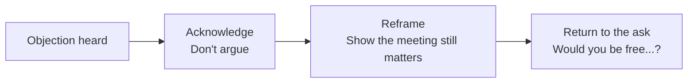
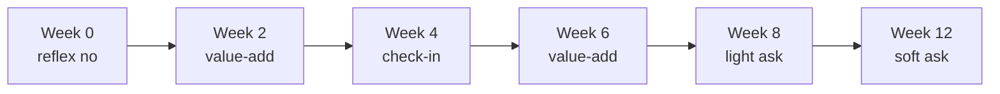

# Day 44 - Handling Resistance & Objections

> **The one idea for today:** Most objections aren't rejections - they're reflexes. The prospect hasn't actually said no; they've just given you a standard social defence. Your job is to acknowledge, reframe, and return to the ask. Calmly.

## What you'll walk away with

By the end of today you should be able to:

1. **Recognise** the 10 most common prospecting objections and respond to each in under 15 seconds.
2. **Distinguish** a genuine "no" from a reflex "no" - and handle each differently.
3. **Stay calm** in the moment when an objection feels personal (it almost never is).

---

## 1. Reflex vs real objections

### Reflex objection
A social defence. The prospect isn't really saying no to you - they're saying, "I don't have the energy to engage right now; please go away." Reflex objections can be reopened with a well-placed reframe.

**Examples:**
- "Not interested."
- "No money."
- "Too busy."
- "No need."
- "I'll think about it."

### Real objection
A specific concern that, if addressed, would open a meeting. A real objection contains *content* about the prospect's actual situation.

**Examples:**
- "My hospital plan ends next month and I'm worried - can you help?"
- "My kid is starting university next year and I want to make sure I've saved enough."
- "I already have [specific product] through [other advisor]."

**The distinction matters:**
- Reflex -> respond with a reframe + ask again.
- Real -> slow down, ask more, then offer a meeting.

**The rookie mistake:** treating every objection as a real one -> over-justifying -> losing the prospect.

### A third pattern you'll meet later - uncertainty-driven objections

Once you're past prospecting and into actual pitching (post-fact-find, post-recommendation), a third pattern appears. The prospect raises objection after objection - *"too expensive"* -> you rebut cleanly -> *"need to speak to my wife"* -> you rebut -> *"let me compare a bit more"* -> you rebut -> *"bad timing"* -> and so on.

Every rebuttal lands. Nothing closes.

**This isn't a reflex and it isn't a real objection.** It's a smoke screen for **uncertainty** - the prospect isn't yet confident enough on one of three things:
1. The product is right for them.
2. You are trustworthy.
3. The firm behind the product is reliable.

Because they can't say *"I don't trust you yet"* out loud, they keep inventing new objections. Rebutting each one is whack-a-mole.

The fix is called **looping** - you stop rebutting and go back into mini-presentation mode to rebuild certainty on all three before asking again. Full technique is covered in Next 60 Days Day 40. For now, know that:

- In Week 8 (prospecting): almost every objection you hear is a **reflex**. Use the scripts below.
- In Week 10+ (post-pitch): if objections keep moving after clean rebuttals, it's **uncertainty**. That's when you'll reach for looping.

Don't confuse the two - applying a prospecting reframe during a post-pitch objection wastes the moment, and looping during a prospecting reflex is overkill.

## 2. The 10 standard objection responses (memorise)

These are battle-tested and work.

### "Not interested"
> "I can understand you're not interested in something you haven't had an opportunity to see. So that you can judge for yourself, would you be free for a short time on...?"

### "Not in the market"
> "I would've been surprised if you said you were in the market for life insurance right now. However, I do have some ideas that will be handy for you when you're ready. Would you be free...?"

### "No money"
> "I can understand you trying to hold down unnecessary expenses. However, I do think you'd find what I have to say of interest - and of course, you'd be under no obligation. Would you be free...?"

### "No need"
> "Of course, you'd be the sole judge of whether this particular idea would be of value to you. Since it'll take only a short time for me to explain it, would you be free...?"

### "Too busy"
> "I guessed you'd be busy - that's why I phoned for an appointment rather than dropping by unannounced. Would you be free...?"

### "Wasting your time"
> "On the chance that you'll see value in the idea, I'd be happy to spend the time with you. Would you be free for a short time on...?"

### "What's the idea?"
> "To explain it properly, I'd need to show you some illustrations and discuss them personally with you. Would you be free...?"

### "Is it insurance?"
> "It's about the protection of your family / a savings plan with a difference that I'd like to talk to you about. With some illustrations I'm sure you'll find interesting, I can explain it in a brief interview. Would you be free...?"

### "Post it out"
> "I'd be happy to, but what I have in mind will be useful only if it's tailored to your individual needs. That's why I'd like to see you in person. Would you be free...?"

### "For the obstinate objector"
> "Could we leave it this way: I'd like to meet you, and if I'm in your neighbourhood during the next few months, I'd like to drop in and say hello. If you have a few moments at that time, I'll be glad to show you what I have in mind."

**The pattern in every response:**
1. **Acknowledge** - don't argue.
2. **Reframe** - show that the objection is precisely why the meeting matters.
3. **Return to the ask** - "Would you be free...?"

Same structure, 10 variations. Memorise. Internalise. Naturalise.

## 3. The psychology of rejection

Most new FCs quit prospecting in Month 1-2 because **rejection feels personal.**

It isn't.

Consider: when a call comes in from a salesperson you don't know, what's your reflex response? Usually some variation of the 10 above. You're not evaluating them. You're defending your afternoon.

Your prospects are doing the same thing when you call. **Their reflex is about their energy, not about you.**

### How to internalise this:
- Track rejections as **reps** (Day 19).
- After each rejection, write one sentence: "What could I have said differently?" Usually the answer is nothing.
- At end of day, review: you made 20 calls, got 17 reflex objections, booked 2 meetings. **Normal.** Celebrate.

## 4. When "no" actually means "no"

Some objections are final. Respect them:

- **"I've already got someone I work with and I'm happy."**
- **"Please don't contact me again."**
- **"Take me off your list."**

**Rule:** when a prospect explicitly asks not to be contacted, honour it immediately. Don't:
- Argue.
- Send follow-up messages "just in case."
- Try to reach them via another channel.
- Add them to a marketing email list.

Singapore's PDPA regulations require consent for ongoing contact. Beyond legality - it's a matter of respect and reputation. A client who felt harassed will tell 10 friends.

## 5. The follow-up strategy for "soft no"

Not all no's are final. Many are "not right now."

For these, use a **6-touch follow-up sequence** over 12 weeks:

- **Week 0:** Initial call. Reflex no. Offer to reconnect in a few months.
- **Week 2:** Short value-add message - an article, a post, a useful tip relevant to them. No ask.
- **Week 4:** Brief check-in. "Hey [name], saw [trigger event - their promotion, new kid, etc.]. Just wanted to check in - genuinely no agenda."
- **Week 6:** Another value-add. Maybe a quick question they'd find interesting.
- **Week 8:** Light ask - "Would it be useful to grab 15 minutes this month?"
- **Week 12:** Final soft ask. If still no -> move to quarterly touch or archive.

**Why this works:**
- You stay memorable without being pushy.
- Life circumstances change - at Week 2 they weren't open, at Week 8 they had a health scare.
- Many clients sign 3-6 months after the first contact.

**What doesn't work:**
- Weekly pestering. That's harassment.
- "Just checking in!" every 10 days. Empty.
- Pretending to be busy / important. Transparent.

## 6. The "no" that was actually a "not yet"

Real story frequently repeated across the industry:

> "I called a prospect in Month 2. He said he wasn't interested. I checked in every 2 months with something useful - an article, a check-in. No ask.
>
> Month 9, his wife got diagnosed with early-stage cancer. He called me the next day. We met that week. I helped him sort out his family's protection in 3 meetings.
>
> If I'd pushed too hard in Month 2, I would've lost him. If I'd given up after Month 2, he wouldn't have thought of me when it mattered."

The pattern repeats across careers. **The relationship matters more than the month-2 conversion.**

## 7. The emotional hygiene rule

Rejection is cumulative. 50 no's in a week will feel heavier than 5 no's a day - even if the math is the same. The fix is **structured recovery**, not a low call ceiling. Power-hour blocks of 30-50 dials are normal and necessary if you want to hit 100 calls/week.

**Protect yourself:**
- **Batch calls into 60-90 minute power blocks**, then take a real break - 15-30 minutes off the phone. The block length matters more than the call count inside it. Some FCs do 20 dials in a block, some do 50 - both are fine if the *recovery between blocks is real*.
- **Watch the warning signs, not the call count.** The signal to stop a block isn't "I've hit 15" - it's: your voice has gone flat, you've started apologising at the opener, you're skipping the time close, or you're catching yourself hoping they don't pick up. Any one of those = stop the block, walk away, reset.
- **Between blocks, do something restorative** - not another call. Walk. Coffee. Quick chat with a peer. Don't fill the gap with admin "just to stay productive" - your nervous system needs the break, not a different task.
- **End the day on a win,** not a rejection. Finish with a warm follow-up, a content task, or a study block - something with a guaranteed completion. The last thing your brain logs is what it carries into tomorrow morning's first dial.

FCs who ignore this get burned out by Month 4 and quit. The ones who last build rejection into their emotional planning - and they hit volume, because volume is the only metric that actually compounds.

## Quick quiz

1. **The structure of every objection response is:**
 - A) Argue, persuade, push
 - B) Acknowledge, reframe, return to the ask (correct)
 - C) Deflect, change topic, rebook
 - D) Apologise, send info, follow up

 **Why:** Every standard objection response follows the same three-beat pattern - acknowledge the prospect's position so they feel heard, reframe to show why the meeting is still worth having, then return cleanly to the appointment ask. Arguing (A) creates resistance; deflecting (C) abandons the ask; apologising and sending info (D) removes your own credibility and gives the prospect a way to stall indefinitely.

2. **"Not interested" is most likely:**
 - A) A real final no
 - B) A reflex objection - a social defence (correct)
 - C) A sign of deeper issues
 - D) A legal notice

 **Why:** "Not interested" is the most common reflex objection - the prospect is defending their afternoon, not evaluating your offer. They have no information to base a real decision on, so what they are really saying is "I don't want to engage right now." A real final no (A) contains specific content, such as an existing advisor or explicit instruction to stop contact. Signs of deeper issues (C) and legal notices (D) are not what "not interested" signals.

3. **When a prospect says "please don't contact me again":**
 - A) Follow up in 2 weeks to confirm
 - B) Respect the request immediately - stop all contact (correct)
 - C) Send one more message with value
 - D) Remove from your active list but re-add in 6 months

 **Why:** An explicit "do not contact" request is a real final no, not a reflex. Continuing contact after this point violates Singapore's PDPA and, more importantly, damages your professional reputation - a client who felt harassed will tell ten friends. Following up in two weeks (A), sending one last message (C), or re-adding in six months (D) all disregard the stated boundary and compound the harm.

4. **A prospect says "Post it out." The correct response is:**
 - A) Email them the brochure and wait for a reply
 - B) Agree and follow up in two weeks
 - C) Explain that the material only works when tailored to their situation - request a meeting (correct)
 - D) Ask them to review the company website instead

 **Why:** The "post it out" objection is a polite dismissal - the prospect expects generic material they can ignore. The correct reframe is that any useful material needs to be personalised, which requires a short conversation. Sending the brochure (A) or agreeing and following up later (B) hands the prospect a way to say "read it, not for me" without ever meeting. Redirecting to the website (D) removes you from the equation entirely.

5. **An FC receives 17 reflex objections in one session. The healthiest interpretation is:**
 - A) The pitch needs a complete rewrite
 - B) This week's list is poor quality
 - C) Normal - reflex objections reflect the prospect's energy, not a verdict on you (correct)
 - D) Time to take a break from prospecting for a few days

 **Why:** Reflex objections are a baseline feature of prospecting, not a signal about your pitch quality or list quality. The prospect's "not interested" is about their energy and attention at that moment, not an evaluation of you. Rewriting the pitch (A) or blaming the list (B) misattributes a social defence as personal feedback. Taking a multi-day break (D) compounds the emotional response instead of processing it as normal activity data.

6. **The 6-touch follow-up sequence is designed to:**
 - A) Pressure a prospect into a decision within 12 weeks
 - B) Stay memorable and catch prospects when life circumstances change (correct)
 - C) Replace in-person meetings with digital contact
 - D) Qualify prospects before spending time on a meeting

 **Why:** Life circumstances change - a prospect who was not open at Week 0 may have had a health scare, a new baby, or a job change by Week 8 that makes them receptive. The sequence is built around staying present and useful without pressure, so you are the person they think of when the moment arrives. Pressuring a decision (A) is exactly what the value-add messages are designed to avoid. The sequence supplements meetings (C) rather than replacing them, and it is not a qualification filter (D).

7. **What makes the "obstinate objector" response unique compared to the others?**
 - A) It argues back with facts and logic
 - B) It withdraws the meeting ask entirely and reframes contact as casual and low-pressure (correct)
 - C) It offers a discount to change the prospect's mind
 - D) It asks a clarifying question to surface the real objection

 **Why:** All other objection responses end with "Would you be free...?" - they maintain the meeting ask. The obstinate objector response is different because it drops the ask entirely and replaces it with a casual "if I'm in your neighbourhood" framing, removing all pressure and keeping a door open without forcing it. There are no facts or arguments (A), no discounts (C), and no clarifying questions (D) - just a graceful exit that preserves the relationship for a future approach.

---

## Objection-Handling Library

Here are the canonical objection scripts for the situations that come up most. Practise them out loud, then make them yours - the words matter less than the rhythm of acknowledge -> reframe -> ask again.

### Objection taxonomy at a glance

The Academy library has 11 dedicated objection scripts. They cluster into 5 families:

| Family | When you hear it | Scripts in this family |
|---|---|---|
| **Push-away / "not interested"** | First 30 seconds, reflex defence | "Not interested in insurance"; Young Adults all-objections; NSF all-objections |
| **"I already have someone"** | Existing advisor, family advisor, employer cover | "Already have an advisor" objection script |
| **Format / channel pushback** | "Send me an email", "video off please", "don't want a call" | Video-Off objection (Zoom), texting-EQ 4-step framework |
| **Cost-of-delay / time vs money** | "Let me think", "not the right time", pre-retirees especially | Cost of Delay (Pre-Retirees) - paying with time vs money |
| **Format-specific (recruitment)** | Used when prospecting recruits, not clients | Recruitment objection handling (telemarketer angle) |

Use the family to pick the right script. A "send me an email" objection answered with a cost-of-delay frame will miss; a cost-of-delay objection answered with a 4-step text framework will land short.

### "Not interested in insurance"

**Use this when** a prospect throws this in the first 60 seconds of a call - it is almost always a reflex, not a real position.

**Version 1 - redirect to planning**

> Q: "I'm not interested in insurance."
>
> A: "I understand where you're coming from. Most people I speak to feel exactly the same and don't want to dig into this until much later. But most people also agree that financial planning is important and worth doing regularly. That's why I'd love to grab a quick 30-minute Zoom call - just to look at your situation and see if there's anything worth planning for. Is [date, time] or [date, time] better for you?"

**Version 2 - pivot to investing**

> Q: "Not interested in insurance."
>
> A: "I see - do you do your own investing?"
>
> If yes: "What do you invest in? What are some of the struggles or challenges you're facing right now?"
>
> If no: "Are you keen to learn more about investments?"

If they're still not interested after both pivots: "I see - can I ask why? No pressure, I just want to understand." Then move them into nurture - send useful resources, keep the relationship warm.

_Source: Academy scripts library, audience=general, category=objection-handling._

### "Already have an advisor"

**Use this when** the prospect mentions an existing advisor - especially if it's a family member or close friend.

**The script (acknowledge -> common ground -> different perspective -> safety valve)**

When the prospect says: "My advisor is my aunt so I usually go to her. I have bad experiences with friends as advisors so I tend to stay away. Just being honest. If I ever need to approach someone else, I'll let you know."

> "Something my clients have shared with me is that they wanted an advisor who'd be there for them for the next 4-5 decades, in the same life stage as them - while an older advisor can stay on as a concurrent mentor at the same time. Anyway, I'm really hoping we can have a super casual chat about this, so moving forward I can communicate and advise my own friends better in the same situation."

**The reframe:** you can have *two* advisors. Position yourself as the relatable, same-life-stage one. Position the existing advisor as a mentor. Don't try to replace - complement.

_Source: Academy scripts library, audience=warm-market, category=objection-handling._

### Texting EQ 4-Step Framework (for DM/text objections)

**Use this when** the objection arrives via text or DM - phone scripts feel too heavy in writing.

90% of warm outreaches get an objection on the first text. An objection is not a rejection.

**The 4 steps:**

> **Step 1 - Casually acknowledge.** "Hahaha YES I expected you to be not interested - if you were, you would have already texted me first."
>
> **Step 2 - Common ground.** "Actually most of my clients also met me without feeling interested, because they didn't know how I plan prior to meeting me."
>
> **Step 3 - Different perspective.** "So I want to show you how I improve my clients' returns to complement what you already have."
>
> **Step 4 - Make them feel safe (safety valve).** "Then from there you can decide for yourself if it's relevant to you. Sometimes the conclusion is to keep your portfolio unchanged - which is also a valid outcome."

Then add an easy question ("Which days are you usually in the office?") and a personal element ("I haven't seen you in so long anyway, would be fun to catch up").

_Source: Academy scripts library, audience=warm-market, category=objection-handling._

### Cost of Delay (Pre-Retirees / Working Adults)

**Use this when** a prospect is delaying a decision, especially in their 40s-50s and the conversation is about retirement or savings. This is a longer, conversational walk - use it when you have the time and rapport.

> "Mr. Prospect, would you agree that retirement in Singapore isn't exactly cheap?" (Yes)
>
> "That said, if we're aiming for a comfortable lifestyle in our retirement years, would you say it makes sense that we'll probably need to set aside quite a bit to get there?" (Yes)
>
> "Over the years, working with many clients, I've noticed something quite consistent when it comes to building wealth. It really boils down to just two main ingredients - would you like to guess what they might be?" (Let them reply.)
>
> "They're time and money. Let me explain - we've seen and built many retirement portfolios over the years. For clients who started saving or investing early, say in their 20s or 30s, they didn't need to set aside a lot each year. A few thousand dollars annually added up over time into six-figure portfolios.
>
> "But for those who only started planning later, they had to contribute much more - sometimes tens of thousands - just to catch up.
>
> "So in a way, to reach our goals, we're always 'paying' - either with time or with money. The real question is: how much of each are we willing or able to commit today?
>
> "And I completely understand if you're still exploring your options - that's perfectly normal. But could it also be that, perhaps without realising, we've already been paying with time by waiting or postponing this? And if that continues, do you think it's possible we might end up needing to contribute even more down the road - or potentially compromise on the lifestyle we're working towards?"

The genius of this one is the binary: time or money, you're paying either way. Most prospects who "want to think" haven't realised they're already paying.

_Source: Academy scripts library, audience=working-adult, category=objection-handling._

### Young Adults / NSF - All Objections Bundle

**Use this when** prospecting young-adult or NSF leads (typically Facebook ad opt-ins or telemarketer-set appointments). Each row is a stock objection with the right reply.

**"Not interested"**

> "I understand you may have some concerns. My main intention here is just to help you get a financial headstart. Don't worry - it's a short Zoom session to help you understand more about financial literacy concepts, just 20 mins out of your 24 hours a day. So would [date and time] work?"

**"Is this compulsory?"**

> "No, however most ORD personnel and students who attended this session found it really beneficial right after. It would be useful for you to attend now that you've finished NS. We can set a tentative date - say [date and time]. Which is more convenient for you? Time slots are specially allocated for you so do try to make it."

**"What is the session about?"**

> "It's a session to learn ways you can grow your money faster, so you can gain a headstart in your career compared to your peers. Would [date and time] work better for you?"

**"How did you get my number?"**

> "You actually signed up for an interest form about 2 years back, either during your enlistment or nearing your ORD. Do you still recall? (If they say no:) Oh, many of the other guys do remember signing up for this - but no worries haha." Then go back to setting the time.

**"Which organisation are you calling from?"**

> "I'm calling from AIA - one of the largest financial institutions in Singapore and Asia. We've been in financial services for almost 100 years."

**"Can you send me more details first?"**

> "No worries. I'll send you some info through WhatsApp after this call - just help me reply to the WhatsApp to confirm the timing, okay? Alright, so one last thing - this session is just for you to learn more, and I'm just doing my job..." (Continue with the rest of your script.)

_Source: Academy scripts library, audience=young-adult, category=objection-handling._

### Handling ghosting and non-replies

**Use this when** a warm-market contact has gone silent after agreeing to meet, or hasn't replied to your follow-up.

**Playful bump (when they ghost you):**

> "Eh bro... don't ignore me leh HAHA don't like FA just say..."

Usually they reply: "Paiseh bro HAHA damn busy with work."

You: "Me too" - then schedule for a few weeks/months later when both are more free.

**Taking the ball back (when they say "not now"):**

> Prospect: "Not at the moment bro. Maybe when I am on long leave."
>
> You: "Okay no worries! Check in with you around November!"

**The principle:** always take the ball back. The right to reschedule stays with you, not the prospect. Set a specific follow-up month so the next move is on your calendar, not their goodwill.

**Gentle re-engage (when they forgot to reply):**

> "Hehe let's catch up and review soon! Next sat/sun we go for a meal?"
>
> Then later: "OH YA - actually I just spent an hour studying your case just now. And I wanna show you something my clients were sharing with me. Catch you before the month ends?"

_Source: Academy scripts library, audience=warm-market, category=follow-up._

---

## Related

- Previous: [[day-43|Day 43 - Scripting Your Approach]]
- Next: [[day-45|Day 45 - Storytelling: The Hook]]
