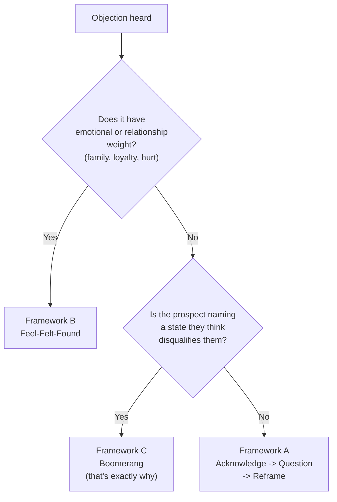
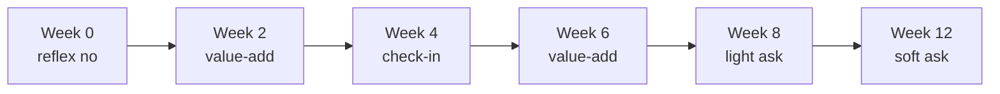

# Day 44 - Handling Resistance & Objections

> **The one idea for today:** Most objections aren't rejections - they're reflexes. The prospect hasn't actually said no; they've just given you a standard social defence. Your job is to acknowledge, reframe, and return to the ask. Calmly.

## What you'll walk away with

By the end of today you should be able to:

1. **Recognise** the 10 most common prospecting objections and respond to each in under 15 seconds.
2. **Distinguish** a genuine "no" from a reflex "no" - and handle each differently.
3. **Stay calm** in the moment when an objection feels personal (it almost never is).

> **Tools:** [Scripts Database](/scripts) for the canonical objection-handling scripts. [Roleplay](/roleplay) to practise your responses. Full list at [/tools](/tools).

---

## 1. Reflex vs real objections

### Reflex objection
A social defence. The prospect isn't really saying no to you - they're saying, "I don't have the energy to engage right now; please go away." Reflex objections can be reopened with a well-placed reframe.

**Examples:**
- "Not interested."
- "No money."
- "Too busy."
- "No need."
- "I'll think about it."

### Real objection
A specific concern that, if addressed, would open a meeting. A real objection contains *content* about the prospect's actual situation.

**Examples:**
- "My hospital plan ends next month and I'm worried - can you help?"
- "My kid is starting university next year and I want to make sure I've saved enough."
- "I already have [specific product] through [other advisor]."

**The distinction matters:**
- Reflex -> respond with a reframe + ask again.
- Real -> slow down, ask more, then offer a meeting.

**The rookie mistake:** treating every objection as a real one -> over-justifying -> losing the prospect.

### A finer cut: Type 1 vs Type 2 paradigm-shift

Within reflex objections. Right-question distinguishes two further patterns that need different responses. Day 38 introduced this — read it again here because it's the single biggest determinant of whether the response lands:

- **Type 1 — concept dismissal.** *"I don't believe in insurance"*, *"not in the market"*, *"insurance companies just want my money"*. The prospect is rejecting the *idea*, not your specific ask. **Counter-arguing here deepens the dismissal.** Lead with a curious-question instead — *"Fair, quick one before I respond — what shaped that view for you?"* — and let them tell you what they're actually rejecting before you reframe to the part they raised.
- **Type 2 — specific concern.** *"Too busy"*, *"no money"*, *"post it out"*, *"already have policies"*. The prospect accepts the concept; they're objecting to *this conversation right now*. The three frameworks below (skip-Q, Feel-Felt-Found, Boomerang) all assume Type 2.

**The diagnostic in one move:** when the objection lands, ask yourself *"are they rejecting the whole industry or just my specific ask?"* If the whole industry, run Type 1 (curious-right-question first, reframe second). If just your ask, run Type 2 (cushion + framework + ART back to the appointment ask).

### Cushion-first — the move that runs under every framework

Before any of the three frameworks below, **acknowledge before you reframe**. The cushion is what separates a script that lands from a script that grates. New FCs default to content-first because they're nervous; trained advisors do cushion-first reflexively.

Cushion lexicon (any of these works as the opening half-sentence of any objection response):

- *"That makes complete sense"*
- *"That's totally fair"*
- *"Honestly, fair — and..."*
- *"I appreciate you sharing that"*
- *"You're not the first person to feel that way"*
- *"Totally respect that"* / *"I get it"*
- *"I'd probably feel the same way in your shoes"*

If you're about to say *"however"*, *"but"*, *"actually"*, or any reframe word — there must be a cushion line before it. The cushion can be one short sentence; it's the *presence* of the acknowledgement that matters, not the length. Full treatment in [docs/_voice-canon-scripts.md §3](../../_voice-canon-scripts.md).

### A third pattern you'll meet later - uncertainty-driven objections

Once you're past prospecting and into actual pitching (post-fact-find, post-recommendation), a third pattern appears. The prospect raises objection after objection - *"too expensive"* -> you rebut cleanly -> *"need to speak to my wife"* -> you rebut -> *"let me compare a bit more"* -> you rebut -> *"bad timing"* -> and so on.

Every rebuttal lands. Nothing closes.

**This isn't a reflex and it isn't a real objection.** It's a smoke screen for **uncertainty** - the prospect isn't yet confident enough on one of three things:
1. The product is right for them.
2. You are trustworthy.
3. The firm behind the product is reliable.

Because they can't say *"I don't trust you yet"* out loud, they keep inventing new objections. Rebutting each one is whack-a-mole.

The fix is called **looping** - you stop rebutting and go back into mini-presentation mode to rebuild certainty on all three before asking again. Full technique is covered in Next 60 Days Day 40. For now, know that:

- In Week 8 (prospecting): almost every objection you hear is a **reflex**. Use the scripts below.
- In Week 10+ (post-pitch): if objections keep moving after clean rebuttals, it's **uncertainty**. That's when you'll reach for looping.

Don't confuse the two - applying a prospecting reframe during a post-pitch objection wastes the moment, and looping during a prospecting reflex is overkill.

## 2. The three frameworks every objection response uses

Every script in this day - and every Academy script in the Library at the bottom - is built on one of three named frameworks. Once you know which framework matches which objection, the words come naturally and you stop sounding like you're reading a card.

### Framework A - The Acknowledge -> Question -> Reframe pattern (the default)

This is the **workhorse** for prospecting objections. The pattern is three beats:

1. **Acknowledge.** Don't argue. "Fair," "Totally get it," "Most people say the same."
2. **Question (Asking the Right Question).** Before you respond, surface what the prospect actually means. The Q is what separates this pattern from a generic reframe - it stops you from arguing against the wrong objection. The right-question principle is the parent move here, fully covered on [Day 47](day-47.md).
3. **Reframe.** Show why the objection is exactly why the meeting matters - then close on the time ask. "Tuesday 7pm or Saturday 10am?"

**Why the Q step matters:** "Not interested" can mean "not interested in insurance," "not interested in advisors," or "not interested *right now* because of timing." All three need different reframes. Skip the Q and you'll reframe against the wrong objection roughly 30% of the time.

**Right-question move in practice on this pattern:**

> Prospect: "Not interested."
>
> You (Acknowledge): "Totally fair."
>
> You : "Just so I respect your time - is that not interested in insurance specifically, not interested in talking to advisors at all, or not the right timing? Any of those is fine, I just want to know which."

About 70% of the time the real answer is **timing or trust** - both of which reopen. The other 30% will tell you cleanly that it's a real no, and you stop wasting their time and yours.

**The skip-Q exception.** When the objection is unmistakably a 1-second stock reflex ("too busy", "no money", "what's the idea?"), asking the right question adds friction the prospect doesn't want. Go Acknowledge -> Reframe directly and trust the reframe to do the diagnostic work. The 10 stock responses below are skip-Q examples.

> **Rule of thumb:** if you can predict the objection 5 seconds before they say it, skip Q. If the objection caught you off-guard or sounded vague, **always run the right-question diagnostic first**.

### Framework B - Feel, Felt, Found (the empathy frame)

For objections with **emotional or relationship weight** - loyalty, family, prior bad experience.

1. **Feel:** "I understand how you feel."
2. **Felt:** "Many of my clients felt the same when I first reached out."
3. **Found:** "What they found was - having a same-life-stage second pair of eyes didn't replace what they already had, it added to it."

**Use for:** "I already have an advisor and we're family," "I had a bad experience with an FA before," "I don't believe in insurance after watching my parents."

The "felt" line is what disarms - you're naming a peer group the prospect can compare themselves to, not arguing with them. **Watch out:** Feel-Felt-Found tips into manipulative when overused on small reflex objections. Reserve it for the genuinely emotional ones; default to AQR otherwise.

### Framework C - Boomerang (the "that's exactly why" frame)

Turn the objection into the **reason** to meet. Works when the prospect names a state they think disqualifies them - and you flip it so the state is the qualifier.

| Objection | Boomerang |
|---|---|
| "I'm too busy." | "That's exactly why - busy people without a plan compound their problems. 30 minutes now saves the 3 hours of admin you'll need later." |
| "I don't have money to plan." | "That's exactly why - when there's no buffer, the wrong $50/month decision costs you more. The plan is what frees up the buffer." |
| "I'm not the spending type." | "That's exactly why - disciplined savers without structure leak money to inflation. The structure protects the discipline you already have." |
| "I already have policies." | "That's exactly why - most people who already have cover don't actually know what it does day-to-day. The 30 minutes is what turns the policy you own into a plan you understand." |

**Use carefully.** Boomerang done badly sounds glib. The acknowledge step ("Totally get it - and") still has to land first. Skip it and the prospect feels manipulated.

### Picking the right framework

**Default to Framework A.** Most prospecting objections fall here. Use B for emotional weight; use C when the prospect's objection literally describes why they think they're not a fit. **A fourth pattern - looping for uncertainty - lives at the post-pitch stage and is covered in Next 60 Days Day 40, not here.**

> **The principle that powers all three frameworks:** **Asking the Right Questions.** Framework A names it explicitly in the Q step; Framework B's "Felt" beat is a question disguised as a statement (it asks the prospect to compare themselves to a peer group); Framework C's Boomerang assumes you've already asked enough to know what the prospect thinks disqualifies them. Day 47 is the deep-dive on right-questions as a meta-skill - SPIN is its grammar for fact-finding, the Q step here is its grammar for objections.

## 3. The 10 standard reflex objections (skip-Q applied)

These are battle-tested skip-Q responses - the reflex is so unambiguous that asking the right question would slow the call down. The reframe itself does the diagnostic work. Memorise the rhythm; the exact words can flex with your voice.

### "Not interested"
> "Fair - wouldn't expect you to be interested in something you haven't seen yet. Just so you can judge for yourself, would Tuesday 7pm or Saturday 10am work?"

### "Not in the market"
> "Honestly I'd have been surprised if you said you were. I do have ideas that'll be useful for you when you're ready, though - quicker to share them now than from scratch later. Tuesday 7pm or Saturday 10am?"

### "No money"
> "Totally fair - and that's actually a good reason to talk, not a reason to skip it. What I'd cover is more about what you already pay for than adding new expenses. Free 20 minutes - Tuesday 7pm or Saturday 10am?"

### "No need"
> "Fair, and you'd be the only person who can call that. Since it's only 20 minutes, would Tuesday 7pm or Saturday 10am work to let you make that call for yourself?"

### "Too busy"
> "I guessed you would be - that's why I called to schedule rather than just showing up. 20 minutes on Tuesday 7pm, or Saturday 10am?"

### "Wasting your time"
> "Worst case it's 20 minutes and you walk away with one or two takeaways - that's still better than where most people start. Tuesday 7pm or Saturday 10am?"

### "What's the idea?"
> "Honestly the worst thing I could do is summarise it badly over the phone. Give me 20 minutes to walk you through it properly with the actual numbers - Tuesday 7pm or Saturday 10am?"

### "Is it insurance?"
> "Could be, depending on your situation. For some people it's insurance, for others it's actually just rearranging what they already pay for. Easier to figure out in 20 minutes than over the phone - Tuesday 7pm or Saturday 10am?"

### "Post it out / send me info"
> "Happy to - but anything I send blind will either be too generic to use or too long to read. Quicker if I see your situation first, then I send the relevant 2 pages after. Tuesday 7pm or Saturday 10am?"

### "For the obstinate objector" (the soft fallback)
> "Could we leave it this way - I'd like to meet you, and if I'm in your neighbourhood over the next few months, I'd like to drop in and say hello. If you have a few moments at that time, I'll be glad to share what I have in mind."

This last one **drops the time ask entirely** - it's the only response in the set that does. Use it as your soft exit when the prospect is genuinely closing the door but you want to keep it cracked open.

## 4. The psychology of rejection

Most new FCs quit prospecting in Month 1-2 because **rejection feels personal.**

It isn't.

Consider: when a call comes in from a salesperson you don't know, what's your reflex response? Usually some variation of the 10 above. You're not evaluating them. You're defending your afternoon.

Your prospects are doing the same thing when you call. **Their reflex is about their energy, not about you.**

### How to internalise this:
- Track rejections as **reps** (Day 19).
- After each rejection, write one sentence: "What could I have said differently?" Usually the answer is nothing.
- At end of day, review: you made 20 calls, got 17 reflex objections, booked 2 meetings. **Normal.** Celebrate.

## 5. When "no" actually means "no"

Some objections are final. Respect them:

- **"I've already got someone I work with and I'm happy."**
- **"Please don't contact me again."**
- **"Take me off your list."**

**Rule:** when a prospect explicitly asks not to be contacted, honour it immediately. Don't:
- Argue.
- Send follow-up messages "just in case."
- Try to reach them via another channel.
- Add them to a marketing email list.

Singapore's PDPA regulations require consent for ongoing contact. Beyond legality - it's a matter of respect and reputation. A client who felt harassed will tell 10 friends.

## 6. The follow-up strategy for "soft no"

Not all no's are final. Many are "not right now."

For these, use a **6-touch follow-up sequence** over 12 weeks:

- **Week 0:** Initial call. Reflex no. Offer to reconnect in a few months.
- **Week 2:** Short value-add message - an article, a post, a useful tip relevant to them. No ask.
- **Week 4:** Brief check-in. "Hey [name], saw [trigger event - their promotion, new kid, etc.]. Just wanted to check in - genuinely no agenda."
- **Week 6:** Another value-add. Maybe a quick question they'd find interesting.
- **Week 8:** Light ask - "Would it be useful to grab 15 minutes this month?"
- **Week 12:** Final soft ask. If still no -> move to quarterly touch or archive.

**Why this works:**
- You stay memorable without being pushy.
- Life circumstances change - at Week 2 they weren't open, at Week 8 they had a health scare.
- Many clients sign 3-6 months after the first contact.

**What doesn't work:**
- Weekly pestering. That's harassment.
- "Just checking in!" every 10 days. Empty.
- Pretending to be busy / important. Transparent.

## 7. The "no" that was actually a "not yet"

Real story frequently repeated across the industry:

> "I called a prospect in Month 2. He said he wasn't interested. I checked in every 2 months with something useful - an article, a check-in. No ask.
>
> Month 9, his wife got diagnosed with early-stage cancer. He called me the next day. We met that week. I helped him sort out his family's protection in 3 meetings.
>
> If I'd pushed too hard in Month 2, I would've lost him. If I'd given up after Month 2, he wouldn't have thought of me when it mattered."

The pattern repeats across careers. **The relationship matters more than the month-2 conversion.**

## 8. The emotional hygiene rule

Rejection is cumulative. 50 no's in a week will feel heavier than 5 no's a day - even if the math is the same. The fix is **structured recovery**, not a low call ceiling. Power-hour blocks of 30-50 dials are normal and necessary if you want to hit 100 calls/week.

**Protect yourself:**
- **Batch calls into 60-90 minute power blocks**, then take a real break - 15-30 minutes off the phone. The block length matters more than the call count inside it. Some FCs do 20 dials in a block, some do 50 - both are fine if the *recovery between blocks is real*.
- **Watch the warning signs, not the call count.** The signal to stop a block isn't "I've hit 15" - it's: your voice has gone flat, you've started apologising at the opener, you're skipping the time close, or you're catching yourself hoping they don't pick up. Any one of those = stop the block, walk away, reset.
- **Between blocks, do something restorative** - not another call. Walk. Coffee. Quick chat with a peer. Don't fill the gap with admin "just to stay productive" - your nervous system needs the break, not a different task.
- **End the day on a win,** not a rejection. Finish with a warm follow-up, a content task, or a study block - something with a guaranteed completion. The last thing your brain logs is what it carries into tomorrow morning's first dial.

FCs who ignore this get burned out by Month 4 and quit. The ones who last build rejection into their emotional planning - and they hit volume, because volume is the only metric that actually compounds.

## Quick quiz

1. **The default structure of Framework A (the workhorse for prospecting objections) is:**
 - A) Argue, persuade, push
 - B) Acknowledge, ask the right question , reframe and close on the time ask (correct)
 - C) Deflect, change topic, rebook
 - D) Apologise, send info, follow up

 **Why:** The Acknowledge -> Question -> Reframe pattern adds an explicit right-question step (Asking the Right Question) step between acknowledge and reframe, because "Not interested" can mean three different things and each needs a different reframe. Arguing (A) creates resistance; deflecting (C) abandons the ask; apologising and sending info (D) removes your credibility. The Q step can be skipped only when the objection is unmistakably a stock reflex - the 10 standard responses on Day 44 are the skip-Q examples.

2. **"Not interested" is most likely:**
 - A) A real final no
 - B) A reflex objection - a social defence (correct)
 - C) A sign of deeper issues
 - D) A legal notice

 **Why:** "Not interested" is the most common reflex objection - the prospect is defending their afternoon, not evaluating your offer. They have no information to base a real decision on, so what they are really saying is "I don't want to engage right now." A real final no (A) contains specific content, such as an existing advisor or explicit instruction to stop contact. Signs of deeper issues (C) and legal notices (D) are not what "not interested" signals.

3. **When a prospect says "please don't contact me again":**
 - A) Follow up in 2 weeks to confirm
 - B) Respect the request immediately - stop all contact (correct)
 - C) Send one more message with value
 - D) Remove from your active list but re-add in 6 months

 **Why:** An explicit "do not contact" request is a real final no, not a reflex. Continuing contact after this point violates Singapore's PDPA and, more importantly, damages your professional reputation - a client who felt harassed will tell ten friends. Following up in two weeks (A), sending one last message (C), or re-adding in six months (D) all disregard the stated boundary and compound the harm.

4. **A prospect says "Post it out." The correct response is:**
 - A) Email them the brochure and wait for a reply
 - B) Agree and follow up in two weeks
 - C) Explain that the material only works when tailored to their situation - request a meeting (correct)
 - D) Ask them to review the company website instead

 **Why:** The "post it out" objection is a polite dismissal - the prospect expects generic material they can ignore. The correct reframe is that any useful material needs to be personalised, which requires a short conversation. Sending the brochure (A) or agreeing and following up later (B) hands the prospect a way to say "read it, not for me" without ever meeting. Redirecting to the website (D) removes you from the equation entirely.

5. **An FC receives 17 reflex objections in one session. The healthiest interpretation is:**
 - A) The pitch needs a complete rewrite
 - B) This week's list is poor quality
 - C) Normal - reflex objections reflect the prospect's energy, not a verdict on you (correct)
 - D) Time to take a break from prospecting for a few days

 **Why:** Reflex objections are a baseline feature of prospecting, not a signal about your pitch quality or list quality. The prospect's "not interested" is about their energy and attention at that moment, not an evaluation of you. Rewriting the pitch (A) or blaming the list (B) misattributes a social defence as personal feedback. Taking a multi-day break (D) compounds the emotional response instead of processing it as normal activity data.

6. **The 6-touch follow-up sequence is designed to:**
 - A) Pressure a prospect into a decision within 12 weeks
 - B) Stay memorable and catch prospects when life circumstances change (correct)
 - C) Replace in-person meetings with digital contact
 - D) Qualify prospects before spending time on a meeting

 **Why:** Life circumstances change - a prospect who was not open at Week 0 may have had a health scare, a new baby, or a job change by Week 8 that makes them receptive. The sequence is built around staying present and useful without pressure, so you are the person they think of when the moment arrives. Pressuring a decision (A) is exactly what the value-add messages are designed to avoid. The sequence supplements meetings (C) rather than replacing them, and it is not a qualification filter (D).

7. **What makes the "obstinate objector" response unique compared to the others?**
 - A) It argues back with facts and logic
 - B) It withdraws the meeting ask entirely and reframes contact as casual and low-pressure (correct)
 - C) It offers a discount to change the prospect's mind
 - D) It asks a clarifying question to surface the real objection

 **Why:** All other objection responses end with "Would you be free...?" - they maintain the meeting ask. The obstinate objector response is different because it drops the ask entirely and replaces it with a casual "if I'm in your neighbourhood" framing, removing all pressure and keeping a door open without forcing it. There are no facts or arguments (A), no discounts (C), and no clarifying questions (D) - just a graceful exit that preserves the relationship for a future approach.

8. **The "Question" step in the Acknowledge -> Question -> Reframe pattern  exists primarily to:**
 - A) Stretch the call so the prospect can't hang up quickly
 - B) Surface which version of the objection the prospect actually means - so the reframe targets the right one (correct)
 - C) Force the prospect to defend their objection out loud so they back down
 - D) Buy the FC time to think of a comeback

 **Why:** "Not interested" can mean not interested in insurance, not interested in advisors generally, or wrong timing - three different objections needing three different reframes. Right-question is the diagnostic that prevents reframing against the wrong one (which happens roughly 30% of the time without it). Stretching the call (A) is irrelevant to conversion; making the prospect defend their no (C) converts a soft reflex into a firm position - the opposite of what you want; thinking time (D) is a side benefit, not the purpose.

9. **A prospect says "I already have policies." The most useful first move is:**
 - A) Tell them their existing policies probably have gaps and offer a review
 - B) Ask which sub-flavour they mean - old/never reviewed, parent or employer-bought, or recently reviewed - and adapt the reframe to match (correct)
 - C) Pivot the conversation to investments since insurance is already covered
 - D) Acknowledge politely and disengage - respect the no

 **Why:** "I already have policies" is three different objections in one phrasing, and each opens with a different reframe (free second opinion for an old plan; parent-vs-current life stage for parent-bought; one-tweak validation for recently reviewed). Telling them their policies have gaps without knowing which sub-flavour (A) is presumptuous and burns trust. Pivoting to investments (C) abandons the family they actually need help on. Disengaging (D) treats a soft reflex as a firm no - this objection is a Boomerang opportunity, not a real refusal.

10. **The "Already have an advisor" objection is best handled with:**
 - A) Direct comparison showing why you're the better choice
 - B) Feel-Felt-Found - acknowledge the loyalty, name a peer group who felt the same, reframe to "complement, don't replace" (correct)
 - C) A list of products you offer that the existing advisor probably doesn't
 - D) Asking who the existing advisor is so you can call them later

 **Why:** "Already have an advisor" carries emotional and relationship weight - especially when the existing advisor is family. Feel-Felt-Found is the framework built for that exact load - it acknowledges the loyalty (Feel), names a peer group of clients who shared the same instinct (Felt), and reframes around adding a same-life-stage second pair of eyes rather than replacing anyone (Found). Direct comparison (A) attacks the existing advisor and burns the relationship; product listing (C) does the same; asking for the existing advisor's name (D) is unprofessional and risks being read as predatory.

---

## Objection-Handling Library

Here are the canonical objection scripts for the situations that come up most. Practise them out loud, then make them yours - the words matter less than the rhythm of acknowledge -> reframe -> ask again.

### Objection taxonomy at a glance

The Academy library covers six objection families. Pick the family first; the script second.

| Family | When you hear it | Default framework | Scripts in this family |
|---|---|---|---|
| **Push-away / "not interested"** | First 30 seconds, reflex defence | Framework A (skip-Q or the full right-question diagnostic) | "Not interested in insurance"; Young Adults all-objections; NSF all-objections |
| **"I already have policies"** | Coverage already in place - basic cover, parent-bought, "comprehensive" | Framework C (Boomerang) | "Already have policies" - free second opinion script (below) |
| **"I already have someone"** | Existing advisor, family advisor, employer cover | Framework B (Feel-Felt-Found) | "Already have an advisor" objection script |
| **Format / channel pushback** | "Send me an email", "video off please", "don't want a call" | Framework A (the full right-question diagnostic) | Video-Off objection (Zoom), texting-EQ 4-step framework |
| **Cost-of-delay / time vs money** | "Let me think", "not the right time", pre-retirees especially | Framework A (the full right-question diagnostic) | Cost of Delay (Pre-Retirees) - paying with time vs money |
| **Format-specific (recruitment)** | Used when prospecting recruits, not clients | Framework A (the full right-question diagnostic) | Recruitment objection handling (telemarketer angle) |

Use the family to pick the right framework, then the right script. A "send me an email" objection answered with a cost-of-delay frame will miss; a cost-of-delay objection answered with a 4-step text framework will land short.

### "Not interested in insurance"

**Use this when** a prospect throws this in the first 60 seconds of a call - it is almost always a reflex, not a real position.

**Version 1 - redirect to planning**

> Q: "I'm not interested in insurance."
>
> A: "I understand where you're coming from. Most people I speak to feel exactly the same and don't want to dig into this until much later. But most people also agree that financial planning is important and worth doing regularly. That's why I'd love to grab a quick 30-minute Zoom call - just to look at your situation and see if there's anything worth planning for. Is [date, time] or [date, time] better for you?"

**Version 2 - pivot to investing**

> Q: "Not interested in insurance."
>
> A: "I see - do you do your own investing?"
>
> If yes: "What do you invest in? What are some of the struggles or challenges you're facing right now?"
>
> If no: "Are you keen to learn more about investments?"

If they're still not interested after both pivots: "I see - can I ask why? No pressure, I just want to understand." Then move them into nurture - send useful resources, keep the relationship warm.

_Source: Academy scripts library, audience=general, category=objection-handling._

### "I already have policies"

**Use this when** the prospect says they're already covered - "I have something from when I was younger," "my parents bought one for me," or "I'm fully covered already." Framework C (Boomerang) is the default. Right-question surfaces which sub-flavour you're dealing with.

**Step 1 - Acknowledge + right-question to surface the sub-flavour:**

> "Smart - most people I respect already have something in place. Quick one before I assume - when you say 'already have,' is it: (a) something from when you were younger and you haven't checked it in a while, (b) a plan a parent or employer set up for you, or (c) something you reviewed recently and feel solid about? Just so I don't talk over what you've got."

The Right-question buys you 5 seconds to pick the right reframe. Each sub-flavour gets a different one.

**Step 2 - Reframe by sub-flavour:**

| Sub-flavour | The reframe |
|---|---|
| **(a) Old plan, never reviewed** | "Quick one - if you had to draw your current cover from memory right now, could you? Most people can't, and that's not carelessness, it's just that policies pile up over time. The 30 minutes I'm asking for is exactly that - you walk me through what you've got, I tell you what I'd flag if it were my own family. **No products on the table that day. Just a free second opinion.** Worth doing?" |
| **(b) Parent or employer-bought** | "Got it - and you'd be surprised how often the cover that made sense at 25 isn't the cover that makes sense at 32. Parents tend to buy the plan they would've wanted at *your* age, which is usually conservative. Employer cover dies the day you change jobs. Both are good starting points; neither is the finish line. 30 minutes to map yours - Tuesday 7pm or Saturday 10am?" |
| **(c) Comprehensive, recently reviewed** | "Honestly - then you're already ahead of 80% of the people I speak to. Just one ask: a same-life-stage second opinion never costs you anything, and even on solid plans I usually find one tweak worth $3-5k of value over the lifetime. If I find nothing, you've validated your own work. If I find something, you've made $4k off a coffee. 30 minutes - worth it?" |

**The principle:** never tell the prospect their existing policy is bad. Tell them they own a *policy* and you'd help them turn it into a *plan*. The 30 minutes is positioned as a free second opinion, not a sales conversation.

**The deliverable for the free second opinion** is the canonical Policy Summary deck - the [template](https://docs.google.com/presentation/d/1jSd8ItG4iYoqG15vNucdznF6ui7NbsQj/edit) + a [sample completed summary](https://docs.google.com/presentation/d/1CHEgyoSgNfo7TSARzF75UnlPjHoyUtcy/edit) live in Google Slides. [Day 58](../week-10/day-58.md) covers how to read any insurer's policy docs and build the summary; pre-licence FCs should be running this on 3-5 friends' policies as the highest-leverage practice rep.

_Source: Academy script bank + right-question adaptation. Audience=warm-market or cold; category=objection-handling._

### "Already have an advisor"

**Use this when** the prospect mentions an existing advisor - family member, long-time agent, employer-tied advisor. Framework B (Feel-Felt-Found) is the default; **never attack the existing advisor.**

**The principle:** complement, don't replace. You're not asking the prospect to fire their aunt; you're offering a same-life-stage second opinion that the existing advisor can't give.

**Script - the family/loyalty version:**

When the prospect says: "My advisor is my aunt so I usually go to her" / "I've been with my advisor for 10 years, all good."

> "Honestly - totally respect that, especially if it's family or someone you've trusted for years. **(Feel)** I get it - swapping advisors can feel like a loyalty thing, and I'd never ask you to do that. **(Felt)** A lot of my clients felt exactly the same when we first met. **(Found)** What they found was that keeping their existing advisor *and* adding me as a same-life-stage second pair of eyes was the actual win - your aunt has the long view of your family, which is irreplaceable. What I bring is a different angle: I'm in your life stage, watching the same products and CPF changes coming out for our generation, and that perspective fades a bit once an advisor is 20 years ahead of you. So no replacement, just a coffee where I share what I'm seeing - and you take what's useful back to your aunt for action. Sound reasonable?"

**Shorter version when rapport is good:**

> "Totally fair. My honest take: most of my clients in your situation kept their existing advisor and added me as a same-life-stage second pair of eyes. They stay the long-view person; I'm the 'what's the new product this year' person. 30-min coffee, no pressure, you walk away with one or two takeaways for whoever you work with. Open to it?"

**The reframe in one line:** you can have *two* advisors. Position yourself as the relatable, same-life-stage one. Position the existing advisor as the long-view mentor. Don't try to replace - complement.

**Watch out:** if the prospect says "my advisor is my best friend's father and we're really close," **drop the ask**. Use the obstinate-objector exit ("if I'm in your neighbourhood I'd love to drop in for a coffee") and walk away with the relationship intact. Forcing this one burns the door.

_Source: Academy scripts library, audience=warm-market, category=objection-handling. Reworked from the Academy original to use Feel-Felt-Found explicitly and drop the awkward "I want to advise my own friends better" framing - that line made the FC sound like they were using the prospect for practice rather than helping them._

### Texting EQ 4-Step Framework (for DM/text objections)

**Use this when** the objection arrives via text or DM - phone scripts feel too heavy in writing.

90% of warm outreaches get an objection on the first text. An objection is not a rejection.

**The 4 steps:**

> **Step 1 - Casually acknowledge.** "Hahaha YES I expected you to be not interested - if you were, you would have already texted me first."
>
> **Step 2 - Common ground.** "Actually most of my clients also met me without feeling interested, because they didn't know how I plan prior to meeting me."
>
> **Step 3 - Different perspective.** "So I want to show you how I improve my clients' returns to complement what you already have."
>
> **Step 4 - Make them feel safe (safety valve).** "Then from there you can decide for yourself if it's relevant to you. Sometimes the conclusion is to keep your portfolio unchanged - which is also a valid outcome."

Then add an easy question ("Which days are you usually in the office?") and a personal element ("I haven't seen you in so long anyway, would be fun to catch up").

_Source: Academy scripts library, audience=warm-market, category=objection-handling._

### Cost of Delay (Pre-Retirees / Working Adults)

**Use this when** a prospect is delaying a decision, especially in their 40s-50s and the conversation is about retirement or savings. This is a longer, conversational walk - use it when you have the time and rapport.

> "Mr. Prospect, would you agree that retirement in Singapore isn't exactly cheap?" (Yes)
>
> "That said, if we're aiming for a comfortable lifestyle in our retirement years, would you say it makes sense that we'll probably need to set aside quite a bit to get there?" (Yes)
>
> "Over the years, working with many clients, I've noticed something quite consistent when it comes to building wealth. It really boils down to just two main ingredients - would you like to guess what they might be?" (Let them reply.)
>
> "They're time and money. Let me explain - we've seen and built many retirement portfolios over the years. For clients who started saving or investing early, say in their 20s or 30s, they didn't need to set aside a lot each year. A few thousand dollars annually added up over time into six-figure portfolios.
>
> "But for those who only started planning later, they had to contribute much more - sometimes tens of thousands - just to catch up.
>
> "So in a way, to reach our goals, we're always 'paying' - either with time or with money. The real question is: how much of each are we willing or able to commit today?
>
> "And I completely understand if you're still exploring your options - that's perfectly normal. But could it also be that, perhaps without realising, we've already been paying with time by waiting or postponing this? And if that continues, do you think it's possible we might end up needing to contribute even more down the road - or potentially compromise on the lifestyle we're working towards?"

The genius of this one is the binary: time or money, you're paying either way. Most prospects who "want to think" haven't realised they're already paying.

_Source: Academy scripts library, audience=working-adult, category=objection-handling._

### Young Adults / NSF - All Objections Bundle

**Use this when** prospecting young-adult or NSF leads (typically Facebook ad opt-ins or telemarketer-set appointments). Each row is a stock objection with the right reply.

**"Not interested"**

> "I understand you may have some concerns. My main intention here is just to help you get a financial headstart. Don't worry - it's a short Zoom session to help you understand more about financial literacy concepts, just 20 mins out of your 24 hours a day. So would [date and time] work?"

**"Is this compulsory?"**

> "No, however most ORD personnel and students who attended this session found it really beneficial right after. It would be useful for you to attend now that you've finished NS. We can set a tentative date - say [date and time]. Which is more convenient for you? Time slots are specially allocated for you so do try to make it."

**"What is the session about?"**

> "It's a session to learn ways you can grow your money faster, so you can gain a headstart in your career compared to your peers. Would [date and time] work better for you?"

**"How did you get my number?"**

> "You actually signed up for an interest form about 2 years back, either during your enlistment or nearing your ORD. Do you still recall? (If they say no:) Oh, many of the other guys do remember signing up for this - but no worries haha." Then go back to setting the time.

**"Which organisation are you calling from?"**

> "I'm calling from AIA - one of the largest financial institutions in Singapore and Asia. We've been in financial services for almost 100 years."

**"Can you send me more details first?"**

> "No worries. I'll send you some info through WhatsApp after this call - just help me reply to the WhatsApp to confirm the timing, okay? Alright, so one last thing - this session is just for you to learn more, and I'm just doing my job..." (Continue with the rest of your script.)

_Source: Academy scripts library, audience=young-adult, category=objection-handling._

### Handling ghosting and non-replies

**Use this when** a warm-market contact has gone silent after agreeing to meet, or hasn't replied to your follow-up.

**Playful bump (when they ghost you):**

> "Eh bro... don't ignore me leh HAHA don't like FA just say..."

Usually they reply: "Paiseh bro HAHA damn busy with work."

You: "Me too" - then schedule for a few weeks/months later when both are more free.

**Taking the ball back (when they say "not now"):**

> Prospect: "Not at the moment bro. Maybe when I am on long leave."
>
> You: "Okay no worries! Check in with you around November!"

**The principle:** always take the ball back. The right to reschedule stays with you, not the prospect. Set a specific follow-up month so the next move is on your calendar, not their goodwill.

**Gentle re-engage (when they forgot to reply):**

> "Hehe let's catch up and review soon! Next sat/sun we go for a meal?"
>
> Then later: "OH YA - actually I just spent an hour studying your case just now. And I wanna show you something my clients were sharing with me. Catch you before the month ends?"

_Source: Academy scripts library, audience=warm-market, category=follow-up._

---

## Related

- Previous: [[day-43|Day 43 - Scripting Your Approach]]
- Next: [[day-45|Day 45 - Storytelling: The Hook]]
