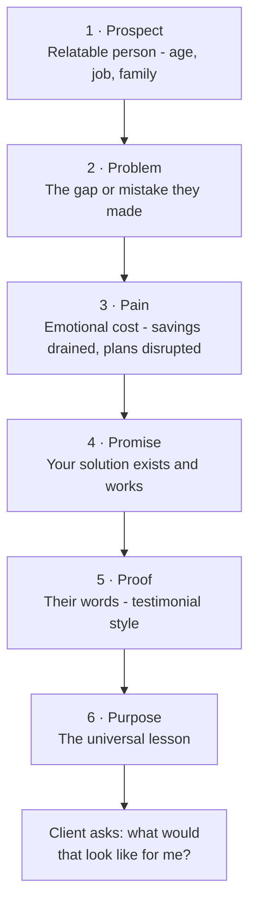

# Day 45 — Storytelling: The Hook

> **The one idea for today:** Facts tell. Stories sell. A client who *understands* your explanation through a well-told story buys from you. A client who sits through 15 minutes of product features stops listening after 3.

## What you'll walk away with

By the end of today you should be able to:

1. **Apply** the **6P storytelling method** to any financial concept.
2. **Deliver** a concept story in under 90 seconds.
3. **Know** when storytelling is the right move — and when it isn't.

---

## 1. Why stories work (the neuroscience, briefly)

When someone hears a list of facts, their brain activates language-processing regions. That's it.

When someone hears a **story**, their brain activates:
- Language regions (they process the words).
- Sensory regions (they imagine the scene).
- Motor regions (they feel themselves inside it).
- Emotional regions (they form a memory attachment).

**Result:** stories are **6–8× more memorable** than raw facts. This is why:
- You remember your grandma's cautionary tale from childhood.
- You remember a cartoon plot from 10 years ago.
- You forget your insurance policy's exact clauses.

**The implication for sales:** clients remember the *story* you told them long after they've forgotten the product name.

## 2. Why stories work (the emotional reason)

Facts engage the **analytical brain** — which says "let me think about this and get back to you."

Stories engage the **emotional brain** — which says "yes, that's me" or "no, not me."

**Decisions are mostly emotional.** The analytical brain then builds a justification after the emotion has chosen. This isn't manipulation — it's how all human decisions work, including the important ones.

The FC who only does facts gets "I'll think about it" 90% of the time. The FC who does facts + stories gets "yes" or "no" — which is what you want, because "no" is still progress.

## 3. The 6P Storytelling Method

A robust, memorisable framework.

### 1. The Prospect (setup)
Who is this story about? Make it relatable to the person in front of you.

**Example:** "I had a client last year — Marcus, 34, married with two kids, similar income to yours, working in tech..."

### 2. The Problem
The technical or financial issue they faced.

**Example:** "...who had been putting off his CI coverage for years because his company 'had him covered.' He'd never checked the details."

### 3. The Pain
The emotional consequence. This is where stories diverge from dry case studies.

**Example:** "In Q4 last year, his wife was diagnosed with early-stage cancer. They assumed they'd be fine because he had company coverage. Turns out the company plan only paid $30K — nowhere near enough for the specialist treatment they wanted. They had to dip into savings they'd earmarked for their kids' education."

### 4. The Promise
What you offer — without turning it into a pitch.

**Example:** "When we finally did a proper review, the adjustment took about 2 hours across 2 meetings. We closed the coverage gap with a plan that fit his budget. Took off that worry entirely."

### 5. The Proof
How others in similar situations benefited.

**Example:** "Marcus later told me: 'I was an idiot to delay. This is the conversation I should've had 5 years ago. It cost me maybe $600/month — which is less than we spend on eating out — and it gave us peace of mind I didn't realise we needed.'"

### 6. The Purpose
The lesson — the moral of the story.

**Example:** "The thing is, no one looks at CI insurance until they need it. And when you need it, it's usually too late to get. What Marcus learned — the hard way — is that 'covered by company' often means underinsured in the scenarios that matter most."

**Total length: 60–120 seconds.** Practise compressing without losing emotional punch.

## 4. The 6P story structure — visual map

```
1. PROSPECT "Marcus, 34, tech, two kids..." [who we're talking about]
 ↓
2. PROBLEM "Never bothered to review CI..." [the mistake]
 ↓
3. PAIN "Wife diagnosed. Gap in coverage..." [the emotional hit]
 ↓
4. PROMISE "A 2-hour review fixed it..." [your solution exists]
 ↓
5. PROOF "Marcus told me later..." [testimonial-style]
 ↓
6. PURPOSE "Don't wait until you need it..." [the universal lesson]
```



**The payoff:** after the story, the client is primed to ask "so what would that look like for me?" — which is precisely the transition you want.

## 5. Where to use storytelling

Storytelling isn't for every moment. It's a tool, not a constant mode.

**Use storytelling when:**
- Explaining **why** a gap matters (emotional layer).
- Introducing a concept they've dismissed before (they don't argue with stories as fast).
- Closing a meeting where they're on the fence.
- Explaining the consequences of inaction (CI, death, disability).

**Don't use storytelling when:**
- Giving a specific product specification (use facts).
- Running TVM calculations (use the calculator + clear explanation).
- Responding to compliance questions (stick to the policy document).
- The client is C-profile (Day 46) — they prefer data.

**The rule:** stories amplify emotional points. Don't use them for technical points.

## 6. Building your personal story library

Every FC should have a rotating library of 10–15 personal stories. Build yours over time:

| Story type | Purpose |
|---|---|
| "Client who bought too late" | Urgency (CI, hospital) |
| "Client who started saving early" | Compounding, time value |
| "Client who was underinsured" | Gap analysis |
| "Client whose plan paid out" | Validation, trust |
| "Client who almost bought the wrong product" | Fit vs features |
| "Client who referred 5 friends" | Referral asks |
| "Client who retired on time" | Retirement planning |
| "Client whose kid needed emergency surgery" | Hospitalisation |
| "Young client who prioritised lifestyle over protection" | Priorities |
| "Older client who said 'I wish I had started at 25'" | Early-start premium |

**Source for stories:**
1. Your own clients (anonymised).
2. Your mentor's clients (ask for stories, credit them).
3. Industry-known cases (publicised with permission).
4. Your own life (your parents, siblings, friends).

**Do NOT fabricate stories.** Clients can sense fiction. And once trust is broken, the whole career model collapses.

## 7. The compression drill

Most new FCs tell stories that are too long. The compression drill:

**Step 1:** Write a full version of a 6P story (300–400 words).
**Step 2:** Compress to 200 words without losing the emotional arc.
**Step 3:** Compress to 100 words.
**Step 4:** Compress to 60 seconds of spoken word.

Each compression forces clarity. By version 4, you have a story tight enough to use in a live meeting without losing the prospect.

**Sample compression target (60 sec version):**

> "Last year I had a client, Marcus, 34, two kids, tech job. Always said his company plan covered him. In November, his wife got a cancer diagnosis. The company CI plan paid $30K — not enough for the specialist treatment they wanted. They drained the kids' education savings to cover the gap. A $600/month plan — same budget as their eating-out — would've made that completely unnecessary. Marcus told me: 'This is the conversation I should've had 5 years ago.'"

**72 seconds. Everything important. Nothing extra.**

## 8. The emotional discipline

Storytelling is powerful. It's also easy to misuse.

**Avoid:**
- Stories designed to **scare** (fear-based selling collapses long-term trust).
- Stories that **manipulate** (false urgency, invented details).
- Stories that **sound like marketing** (clients spot them immediately).
- Stories told **to every client the same way** (they feel formulaic).

**Aim for:**
- Stories that **educate** (here's what happened, here's the lesson).
- Stories that **empathise** (your situation sounds like theirs).
- Stories that **inform** (what real options look like).
- Stories adapted to **the person in front of you** (same skeleton, different details).

The best storyteller FCs sound like friends telling you about someone you both know. Not salespeople performing.


## Quick quiz

1. **The 6P storytelling method is:**
 - A) Prospect, Problem, Pain, Promise, Proof, Purpose ✓
 - B) Person, Place, Problem, Plan, Proposal, Payoff
 - C) Prospect, Product, Pitch, Price, Proof, Purchase
 - D) Problem, Pain, Product, Plan, Price, Promise

 **Why:** The 6P framework is Prospect, Problem, Pain, Promise, Proof, Purpose — in that exact order because each step sets up the next. Prospect grounds the listener in a relatable person; Problem names the gap; Pain gives it emotional weight; Promise shows a solution exists; Proof validates it with a testimonial; Purpose delivers the universal lesson. Options B, C, and D all substitute product or pitch elements that shift the story from a client's journey into a sales presentation.

2. **When should you NOT use storytelling?**
 - A) When introducing an emotional concept
 - B) When the client is a C-profile (analytical, wants data) ✓
 - C) When closing
 - D) When handling objections

 **Why:** C-profile clients are skeptical of anything that sounds like a pitch and prefer data, illustrations, and comparisons — a story will feel manipulative to them rather than educational. Storytelling is well suited for emotional concepts (A), closing moments when a client is on the fence (C), and objections that repeat despite facts (D), where a narrative is harder to argue against than a statistic. Matching the tool to the audience is the discipline.

3. **Stories are more memorable than facts because:**
 - A) They're longer
 - B) They activate sensory, motor, and emotional brain regions, not just language ✓
 - C) They're funnier
 - D) They come from personal experience

 **Why:** When a listener hears a story, their brain fires in language, sensory, motor, and emotional regions simultaneously — creating a richer memory trace than facts alone, which only activate language processing. This is why clients remember the Marcus story long after they have forgotten the product name. Length (A) is a weak explanation and long stories are often less memorable; humour (C) and personal origin (D) may help in specific cases but are not the neurological reason for higher recall.

4. **An FC is meeting a prospect who has already dismissed CI insurance twice before. The best move is:**
 - A) Present the product features again with updated numbers
 - B) Use storytelling — a client story is harder to argue with than a repeated fact ✓
 - C) Skip CI and focus on a product the prospect hasn't rejected
 - D) Ask the prospect to explain their objection in detail

 **Why:** Prospects argue with facts and numbers, but they find it much harder to dismiss a story about someone just like them facing real consequences. Repeating product features (A) has already failed twice and will likely fail a third time. Skipping CI (C) avoids the coverage gap rather than addressing it. Asking the prospect to explain their objection (D) can surface useful insight but does not overcome the emotional barrier the way a well-chosen story does.

5. **In the 6P framework, the "Pain" element is:**
 - A) The product limitation the client should know about
 - B) The emotional consequence of the problem, not just the technical fact ✓
 - C) The premium cost the client will pay
 - D) The risk rating of the product

 **Why:** Pain is where the story moves from a dry case study into something emotionally felt — it is the human cost: savings drained, plans disrupted, a family caught off-guard. Without Pain, the story stays analytical and the emotional brain does not engage. Product limitations (A), premium costs (C), and risk ratings (D) are compliance and product-stage information that belong in a fact-find or proposal, not in the emotional arc of a 6P story.

6. **Which of the following violates the emotional discipline rules for storytelling?**
 - A) Adapting the same story skeleton to match the client in front of you
 - B) Using a real anonymised client case
 - C) Fabricating details to make the story more dramatic ✓
 - D) Keeping the story to under 90 seconds

 **Why:** Fabrication is explicitly forbidden — clients can sense fiction, and a story that is later contradicted or exposed destroys the trust the entire career model depends on. Adapting the skeleton to the client (A) is encouraged; using real anonymised cases (B) is the recommended source; and keeping stories under 90 seconds (D) is good compression discipline. Only fabrication crosses the ethical line.

7. **After a well-told 6P story, the ideal client response is:**
 - A) "Can you email me the policy document?"
 - B) "I'll think about it."
 - C) "So what would that look like for me?" — transitioning into their own planning ✓
 - D) "That's a sad story — I hope they're okay."

 **Why:** A well-structured 6P story is designed to prime the client to ask how the situation applies to their own life — that question is the natural transition from the story into your fact-find or recommendation. Asking for a policy document (A) skips fact-finding. "I'll think about it" (B) means the story stayed abstract and did not personalise enough. Sympathising with the story character (D) shows the client was listening but remained a spectator rather than inserting themselves into the scenario.

---

## Related

- Previous: [[day-44|Day 44 — Handling Resistance & Objections]]
- Next: [[day-46|Day 46 — Identifying DISC]]
