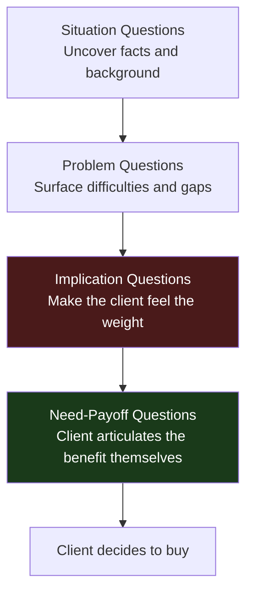

# Day 47 — SPIN: The Framework

> **The one idea for today:** The salesperson's job is not to sell — it's to **help the client buy**. SPIN is the question framework that moves a client from "implied need" to "explicit need" — the threshold where they actually decide to buy.

## What you'll walk away with

By the end of today you should be able to:

1. **Name** the 4 SPIN question types and what each does.
2. **Understand** why SPIN works — the journey from implied to explicit need.
3. **Map** the consultative selling philosophy onto your own meeting process.

---

## 1. Why sell when people buy?

Most new FCs think their job is to convince. That framing doesn't work in modern sales.

**The better framing:**
> "The salesperson's job is NOT to sell to the client — but to **help the client buy.**"

**What this shift changes:**
- You stop pushing products.
- You start asking better questions.
- You listen more than you talk.
- The client convinces themselves.

**When it works, you haven't sold them anything — they've bought.**

## 2. Needs vs wants — the crucial distinction

People don't buy what they **need.** They buy what they **want.**

- Everyone *needs* insurance. Most don't buy it.
- Very few *want* insurance. The ones who buy, do.

Your job is to **convert a need into a want** — by helping the client feel the weight of the need.

This is not manipulation. It's honest education. The need already exists. Your questions make it visible and felt. The client then decides whether to act.

## 3. The journey: Implied → Explicit Need

This is the core concept behind SPIN. A client's needs go through stages:

### Stage 1 — "It's almost perfect"
The client is unaware of any problem. They're happy. No sale.

### Stage 2 — "I'm a little dissatisfied"
They sense something's not quite right but haven't named it.

### Stage 3 — "My problem is getting bigger"
They've named the problem. They feel its weight but haven't committed to solving it.

### Stage 4 — "I want to fix things NOW"
They've decided to act. They'll buy **from someone** — question is who.

**Implied Need** = Stages 1–2 (vague dissatisfaction).
**Explicit Need** = Stages 3–4 (named, weighted problem + readiness to act).

**The advisor's job:** move the client from Implied to Explicit — through questions. Not through pitching.

## 4. The buy / don't-buy decision

Every purchase decision is a scale weighing two things:

```
 Seriousness of problem vs Cost of solution
 (emotional weight) (financial + effort)
```

**BUY** when: seriousness of problem > cost of solution.
**DON'T BUY** when: cost of solution > seriousness of problem.

**The implications:**

- If the client doesn't buy, it's often because the **problem hasn't been made serious enough** — not because the solution is too expensive.
- Before presenting solutions, make sure the problem's weight is clear.
- **Intensify the problem before introducing the solution.** This is the SPIN method's mechanical output.

## 5. The 4 SPIN question types

Here's the flow — from discovery to decision. All 4 question types, in order.



### 1. Situation Questions
**Purpose:** Uncover facts and background about the buyer's situation and lifestyle.

**What they do:** Set context. Let you understand where the client is today.

**Examples:**
- "Do you intend to retire in Singapore?"
- "Do you have plans to send your kids through university?"
- "What's your current health coverage situation?"
- "What does your typical month look like financially?"

**Rule:** ask **just enough** situation questions. Too many → the client feels interrogated. Too few → you can't personalise.

### 2. Problem Questions
**Purpose:** Uncover the buyer's difficulties, dissatisfactions, or gaps in their current situation.

**What they do:** Reveal implied needs. Get the client to acknowledge a problem.

**Examples:**
- "When do you intend to start building funds for retirement?"
- "What plans do you currently have in place for your children's education?"
- "How confident are you that your current hospital coverage is enough?"
- "What concerns you most about your financial future?"

**Rule:** problem questions should **uncover**, not **suggest.** You're asking the client to tell you their problems, not telling them what their problems are.

### 3. Implication Questions
**Purpose:** Make the client feel the weight of the problem. Move from "I have a problem" to "this problem is serious."

**What they do:** Intensify the pain. This is where implied needs become explicit.

**Examples:**
- "How would you feel if, 4–5 years from retirement, you realised you don't have enough?"
- "What would be the consequences if your kids' education fund came up 50% short when they turn 18?"
- "If you were unable to work for 3 years due to illness, what would happen to your family's finances?"
- "If inflation runs at 3% and your savings earn 1%, what's your purchasing power in 20 years?"

**Rule:** implication questions **cannot be leading or scare-based.** They must genuinely surface the client's own concerns. A well-asked implication question makes the client pause — because they're imagining the scenario for the first time.

### 4. Need-Payoff Questions
**Purpose:** Get the client to articulate the **benefits** of solving the problem. Convert problem-focus into solution-focus.

**What they do:** The client sells themselves. You're no longer pushing — they're pulling.

**Examples:**
- "How would it feel to know your retirement income is locked in?"
- "How would your life change if your kids' education fund was fully covered?"
- "Would having adequate hospital coverage change how you approach your health?"
- "Are these benefits important enough for you to want to start a plan now?"

**Rule:** these questions flip the meeting tone. Before, you were asking about problems. Now you're asking about benefits. The client shifts from defensive to aspirational.

## 6. The SPIN arc in a meeting

A typical fact-finding meeting using SPIN:

```
[Opening]
 ↓
[5 min rapport]
 ↓
Situation questions (5-10 min)
 ↓
Problem questions (10-15 min)
 ↓
Implication questions (10-15 min) ← This is where the emotional shift happens
 ↓
Need-Payoff questions (5 min) ← Client now wants a solution
 ↓
[Transition to present your recommendation]
```

Total: 45-60 min of questions before you ever show a product.

**This feels slow to new FCs.** It works. Meetings that rush to products close at 1 in 5–10. Meetings that run the full SPIN arc close at 1 in 2–3.

## 7. Matching social styles — the 4 M's

While running SPIN, also adapt to the client's style:

### 1. Match the Client's Social Style
Use what you learned in Day 46 (DISC). Adjust pace, directness, warmth.

### 2. Match the Client's Mood
If they're energised, bring energy. If they're reflective, slow down. Mirror.

### 3. Mirror the Client's Body Language
Subtle, not mimicry. If they lean forward, lean forward. If they cross arms, you cross arms too (briefly).

### 4. Model the Client's Representational System (NLP)
- **Visual** clients: "Let me **show** you..."
- **Auditory** clients: "**Hear** me out..."
- **Kinesthetic** clients: "Imagine how it would **feel**..."

**Listen for the dominant verbs and sensory words they use.** Mirror them back.

## 8. Consultative Selling — the overall philosophy

SPIN + DISC + Storytelling sits inside a broader stance: **Consultative Selling.**

- You are a **consultant**, not a salesperson.
- Your primary output is **insight**, not a quote.
- Your primary currency is **trust**, not persuasion.
- You **help the client buy**, rather than sell them.

A consultative-selling approach in Year 1 feels slower. By Year 5, it compounds into a book that requires fewer new meetings because referrals flow from satisfied clients.

The "hard sell" approach produces faster first-year results but burns out the advisor and the book by Year 3–4.

**You're in this for 20 years. Choose accordingly.**


## Quick quiz

1. **The "implied need" stage means:**
 - A) The client has explicitly stated they want to buy
 - B) The client has vague dissatisfaction but hasn't named a problem ✓
 - C) The client has named the problem and wants action
 - D) The client has decided to buy

 **Why:** An implied need is a Stage 1 or 2 awareness — the client senses something is not quite right but has not named or weighted it yet. Explicit need (Stages 3–4) is where the problem has been named and the client feels its urgency. Options A and D describe someone who is already at the buy decision, which is the end state SPIN is designed to reach. Option C describes the transition between implied and explicit, not the implied stage itself.

2. **The role of Implication questions is to:**
 - A) Gather factual background
 - B) Make the client feel the weight/seriousness of the problem ✓
 - C) Move the client to an emotional decision
 - D) Close the sale

 **Why:** Implication questions are the engine of SPIN — they take a named problem and intensify it by asking the client to imagine its real-world consequences. This is where implied need becomes explicit need because the client feels the weight of the gap for the first time. Gathering factual background (A) is the role of Situation questions. Moving to an emotional decision (C) is the result, not the mechanism. Closing the sale (D) is what Need-Payoff questions set up.

3. **A client buys when:**
 - A) The advisor is persuasive
 - B) The product is cheapest
 - C) Seriousness of problem > cost of solution ✓
 - D) The client has budget

 **Why:** The buy/don't-buy decision is a scale — a client buys when the felt weight of the problem outweighs the cost and effort of the solution. This is why a prospect who says "it's too expensive" often has an underweighted problem, not a price problem. Persuasion (A) alone does not sustain a buy decision; clients who feel pushed reverse decisions. Being cheapest (B) and having budget (D) are contributing factors but are not the causal mechanism — many clients with budget and cheap options still do not buy.

4. **A prospect says "the premium feels expensive." Based on the buy/don't-buy scale, the best response is to:**
 - A) Offer a cheaper plan immediately
 - B) Justify the price with competitor comparisons
 - C) Explore whether the seriousness of the problem has been fully felt — the price objection often signals an underweighted problem ✓
 - D) Agree to revisit when their income increases

 **Why:** A price objection almost always means the problem has not been made serious enough relative to the cost — the scale is still tipping toward "cost > seriousness." The correct move is to go back and deepen the Implication questioning so the problem's weight grows. Offering a cheaper plan (A) concedes value without fixing the underlying issue. Competitor comparisons (B) are analytical and miss the emotional gap. Revisiting when income increases (D) abandons the meeting.

5. **Need-Payoff questions work because:**
 - A) They reveal hidden objections the client hasn't shared
 - B) They let the advisor summarise the product benefits clearly
 - C) The client articulates the value of solving the problem themselves — they sell themselves ✓
 - D) They move the conversation back to facts after the emotional peak

 **Why:** Need-Payoff questions flip the client from problem-focus to solution-focus by asking them to describe what life looks like with the problem solved. When a client says "yes, knowing my retirement is locked in would completely change how I feel day-to-day" — that is self-persuasion, which is far more powerful than advisor persuasion. Surfacing hidden objections (A) is a Problem-question role. Summarising benefits (B) is what the advisor does, not the client. Moving back to facts (D) would undo the emotional momentum built during Implication.

6. **An FC jumps straight into presenting a retirement plan after 10 minutes of Situation questions. What has likely been skipped?**
 - A) The rapport phase
 - B) Problem and Implication questions — the client's need hasn't been made explicit or felt yet ✓
 - C) The NLP mirroring techniques
 - D) The DISC identification step

 **Why:** Situation questions only establish facts — they do not surface the client's dissatisfactions or make them feel the urgency of those gaps. Without Problem questions the need is still implied, and without Implication questions it has no emotional weight. A presentation delivered at this stage lands on a client who has not yet felt any reason to buy. Rapport (A) is a pre-SPIN step and is usually covered in the opening. NLP mirroring (C) and DISC (D) are style-adaptation tools, not SPIN phases.

7. **"You are a consultant, not a salesperson" means, in practice:**
 - A) Charge a consulting fee before recommending products
 - B) Avoid recommending specific products
 - C) Lead with questions and insight; let trust — not persuasion — drive the relationship ✓
 - D) Focus exclusively on investment products, not insurance

 **Why:** Consultative selling means your primary output is insight (from good questions and listening) and your primary currency is trust built over time — not a persuasive pitch delivered in one meeting. Charging fees (A) is a different business model, not what this philosophy describes. Avoiding product recommendations (B) would make you useless to the client. Focusing only on investments (D) is a product scope decision unrelated to the consultative philosophy.

---

## Related

- Previous: [[day-46|Day 46 — Identifying DISC]]
- Next: [[day-48|Day 48 — Situation & Problem Questions]]
