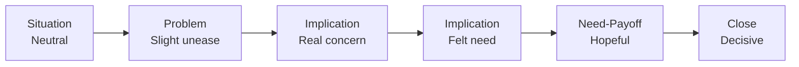
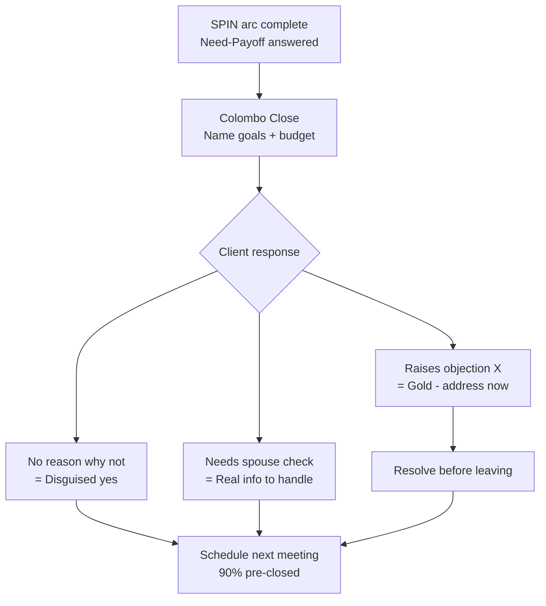

# Day 49 — Implication & Need-Payoff Questions

> **The one idea for today:** Situation and Problem questions **uncover** the gap. Implication and Need-Payoff questions make the client **feel** it — and then **want** to close it. This is where meetings turn into decisions.

## What you'll walk away with

By the end of today you should be able to:

1. **Ask** 8 Implication questions that make a client feel the weight of their gap without sounding manipulative.
2. **Ask** 6 Need-Payoff questions that let the client articulate — in their own voice — the benefits of acting.
3. **Close** the SPIN arc with a confident transition into recommendation.

---

## 1. From exploration to intensification

Day 48 covered the **first half of SPIN** — Situation + Problem questions. Those uncovered **implied needs.**

Today is the **second half.** Two things happen here:

1. **Implication questions** turn an implied need into an **explicit, felt** need.
2. **Need-Payoff questions** flip the emotional tone from problem → solution.

**The emotional arc of a full SPIN meeting:**

  
Emotional arc · full SPIN meeting

  

    

Neutral

    

Slight unease

    

Real concern

    

Explicit need

    

Hopeful

    

Decisive

    
Situation

    
Problem

    
Implication

    
Implication

    
Need-Payoff

    
Close

  

Done well, the client does most of the emotional work. You're not pushing — you're asking questions they've never been asked.

## 2. Implication Questions — the purpose

**Purpose:** make the client feel the **consequences** of NOT solving the problem.

The client has named a gap. Now they need to feel its weight. Implication questions ask about the **downstream effects** of the problem if it goes unaddressed.

**Rule:** never ask an Implication question before the client has acknowledged the problem. You'd be scare-selling. Always follow this sequence: Problem → client acknowledges → then Implication.

## 3. Implication Questions — 8 to memorise

### Around retirement
1. "How do you think you'll feel when you're 4–5 years from retirement and realise you don't have enough?"
2. "What happens to your lifestyle when you have to stop working? Who pays the bills?"

### Around critical illness / health
3. "If you were unable to work for 3 years, how would that affect your family's finances?"
4. "What would be the consequences to your kids if one major illness drained your savings?"

### Around children's education
5. "What will be the consequences of not having the funds available when your child turns 18?"
6. "How will you feel if the degree they want is one you can't afford — after a lifetime of planning?"

### Around inflation / savings
7. "If your bank savings keep earning 0.5% while inflation runs at 2% for 20 years, what will that money actually buy?"
8. "What happens if you arrive at retirement with half the purchasing power you thought you had?"

**Delivery rules:**

- Speak slowly. Don't rush.
- After asking, **pause.** Count to 5 internally. Let the client sit with the question.
- Don't "rescue" them from the uncomfortable silence by jumping into solutions. The discomfort is doing your work.
- Show empathy in your body language — but don't dilute the question with reassurance.

### The 10-second silence sequence — why holding matters

When a client sits with a well-asked Implication question for a full 10 seconds, their brain goes through a specific sequence:

- **0–2 seconds:** they register what you asked.
- **2–5 seconds:** their brain searches for a specific answer.
- **5–8 seconds:** a concrete image forms — their spouse, their kids, a specific scenario.
- **8–10 seconds:** the emotional weight of the image lands.

**If you interrupt before second 8, you cut the emotion.** The client gives a generic, surface answer — which is useless for the Need-Payoff phase that follows. If you hold to 10, you get the real answer with feeling attached.

**New FCs typically last 2–3 seconds.** That's the training gap.

### Productive silence vs dead silence — tell them apart

Not all silence is the same. Two different signals, two different responses:

| Signal | What you see | Action |
|---|---|---|
| **Productive silence** (they're thinking) | Eyes move — up, to the side, down. Slight facial movement, micro-furrow, small nod. Breathing deepens or slows. Body leans slightly in. | **Hold.** Don't speak. Give them more time than feels comfortable. |
| **Dead silence** (they checked out) | Eyes glazed or looking at phone. Body language closed or bored. They've physically disengaged — leaned back, crossed arms. Facial expression flat. | **Rescue.** *"Am I going too deep? Want me to come back to that after we cover some basics?"* |

The diagnostic: watch the eyes for 3 seconds. If they're moving, it's productive — hold. If they're glazed, it's dead — rescue.

### Practical drill — the 10-second hold

Build the silence-tolerance muscle through reps:

1. Ask a loaded Implication question.
2. **Start counting in your head** — 1 Mississippi, 2 Mississippi…
3. Hold until count 8–10.
4. If they speak first, you held long enough.
5. If they haven't spoken by 10 and the eyes are still moving, hold longer. If glazed, gentle rescue.

Most new FCs bail at count 4 on the first attempt. That's normal. Train it deliberately for two weeks on every Implication question and it becomes automatic — and compounds across every fact-find for the rest of your career.

## 4. Need-Payoff Questions — the purpose

**Purpose:** the client articulates, **in their own words**, the benefits of solving the problem.

When you describe benefits, you're selling.
When the client describes benefits, they're **buying.**

Need-Payoff questions are subtle. They sound like you're asking about their feelings — but they're actually getting the client to state the reason they should take action.

## 5. Need-Payoff Questions — 6 to memorise

### Retirement-focused
1. "How do you think your spouse will feel when you can do all the things you want to do in retirement?"
2. "What would it mean to you to know — right now — that your retirement income is locked in?"

### Family-focused
3. "What will it mean to you if, when your child starts university, the funds are fully ready?"
4. "How will your family feel knowing they're protected no matter what happens to you?"

### Summary-style
5. "Are these benefits important enough for you to want to put a plan in place to achieve them?"
6. "To summarise: you want [X, Y, Z] for yourself and your family. Is that right?"

**Critical:** after a Need-Payoff question, **wait for a full answer.** Don't nod and move on. The client's answer is the most valuable sentence in the meeting.

## 5a. ARQ mechanics for Implication + Need-Payoff questions

The second half of SPIN is where four specific construction techniques land the emotional work. Day 47's ARQ method inventory covers all six Golden Rules; these are the four that dominate intensification.

### Rule 3 — Contrast and impactful word choices (for Implication)

Two versions of the same Implication question — one with teeth, one without:

**Weak:** *"Wouldn't you agree the earlier you start saving, the better?"*
**Strong:** *"Wouldn't you agree we don't have many years in our lives we can afford to waste? Since your time is precious, why give up the years that compound hardest?"*

Weak has no teeth. Strong uses contrast (*years we can afford to waste* vs *precious time* vs *years that compound hardest*) and forces emotional engagement. Same idea, different energy.

**The general move:** when an Implication question feels too gentle to land the weight, add explicit contrast. *"Versus"* language, *"instead of"* language, *"the difference between"* language — all force the client to weigh two scenarios rather than passively nod.

### Rule 4 — Two distinct contrasting options (for Need-Payoff and trial closes)

Frame the choice as binary, with the *correct* answer obvious. The client picks the better option — which is the one you're recommending — but they chose it themselves, so they own it.

> *"If you had to choose — would you rather arrive at retirement knowing exactly what you'll have, or get there and hope the math works?"*

> *"If you had to pick one — would you rather your kids inherit a plan that continues compounding, or a lump sum of cash they have to figure out what to do with?"*

> *"Would you rather be financially wiped out by a single hospital bill, or transfer that risk for a small fraction of the cost?"*

Binary. One option is obviously better. The client has to pick the better one. Notice: you didn't *tell* them what to choose — they chose.

**Tail it:** *"You've always struck me as someone who thinks ahead — I'm sure you know the second makes more sense, right?"* — confirms the choice and reinforces positive identity.

### Rule 5 — Non-committal words (for trial closes and Need-Payoff)

Use: *may, might, possibility, could, is there a chance, perhaps, potentially*.
Avoid: *must, will, should, definitely, need to*.

| High-pressure (forces hedging) | Low-pressure (produces real yeses) |
|---|---|
| *"Do you agree we should start this plan next month?"* | *"Is there a *possibility* we *could* look at starting something next month?"* |
| *"You need to get your spouse to decide this week."* | *"*Perhaps* your spouse *might* want to see these numbers — could we set up a time the three of us meet?"* |
| *"You should cover critical illness."* | *"Do you see a *possibility* that critical illness coverage *might* matter to you?"* |

Counter-intuitive to new FCs who equate directness with strength. In reality: non-committal language produces more **real** yeses than pressured language produces **fake** ones. A fake yes reverses later; a real yes compounds into referrals.

### Rule 6 — Quote respectable third parties with differing views (for hardened objections)

When a client holds a firm position during Implication, **don't argue — introduce a respected third party's contradicting position as a question.**

> *Client:* *"I don't want to invest through an insurance company."*
> *You:* *"Why do you think that?"* (Rule 1 — keyword echo first)
> *Then:* *"Would you agree professional fund managers are experts at investing?"* (get the yes)
> *Then:* *"Would you agree those fund managers wouldn't hold these structures in their own portfolios if they weren't good?"* (contradiction via expertise)
> *Then:* *"I actually manage portfolios for a number of people whose full-time job is markets. What do you think might be one reason they chose this structure?"* (reality)

The client has to rethink. They can't argue against fund managers choosing the structure without contradicting the expertise they just agreed to — so the argument moves from *"you vs me"* to *"my prior view vs the experts I just endorsed."* That shift is the conversion.

### The construction checklist for every Implication / Need-Payoff question

Before you ask it, test it against Day 47's 3-point checklist:

1. **Does it lead to my objective?** — If this question is answered the way I expect, am I closer to the close?
2. **Is it specific?** — Does it force a concrete answer or allow a hedge?
3. **Is it logical and indisputable?** — Can the client disagree without sounding unreasonable?

If all three pass, ask it slowly and hold the silence. If any fails, rewrite first.

## 6. The full SPIN arc — a worked example

Let's trace a retirement conversation through all 4 stages.

### Situation
> "You mentioned you'd like to retire at 60 — where are you thinking you'll retire?"
> *"Singapore mostly, maybe travel."*

### Problem
> "Have you started building a retirement fund specifically, or is it mostly CPF and bank savings at the moment?"
> *"Honestly just CPF. I know I should do more."*

### Implication
> "How do you think you'll feel when you're 55 and realise CPF alone won't cover the travel you're planning?"
> *"I'd be... stressed. Might have to keep working."*

*[Pause. Let them sit.]*

> "Having worked from your 20s, how would you and your wife feel about not being able to have the retirement you've both talked about?"
> *"That would be... I don't want that."*

### Need-Payoff
> "What would it mean to you to know — today — that your retirement plan is fully on track?"
> *"It would be a huge relief. My wife worries about this too."*

> "How would she feel if, in 5 years, you could show her the numbers and say 'we're set'?"
> *"She'd be thrilled. That's been on her mind for years."*

### Transition to recommendation
> "It sounds like the security of a locked-in retirement plan is genuinely important to you both. If I could show you a plan that gets you there — within your budget — would you want to see what that looks like?"

**The client said "yes" 3 times before you mentioned a product.** That's the SPIN method working.

## 7. Common Implication / Need-Payoff mistakes

### Mistake 1: Too many Implications in a row
Three Implication questions in a row feels like emotional manipulation. Mix them with Need-Payoff to maintain balance.

### Mistake 2: Need-Payoff before the client feels the problem
If the client hasn't felt the pain, Need-Payoff sounds like empty upsell language. Always establish the problem first.

### Mistake 3: Leading questions
> "Wouldn't it be awful if your kids couldn't go to uni because you didn't plan?"

This is leading and manipulative. The client senses it. Rewrite:

> "What would it mean for your family if the education funds weren't available when your kids turned 18?"

Neutral, curious, respectful.

### Mistake 4: Moving too fast
Rushing SPIN kills the emotional work. A proper SPIN conversation takes **45–60 minutes.** If you're doing it in 15, you're doing Situation-only + a pitch. That's not SPIN.

## 8. The Colombo Close — the transition out

At the end of a SPIN conversation, use this classic close to bridge into recommendation:

> "Before I leave, just one final question. If I can come back on [day] and show you a plan that will allow you to achieve your goals of [goal 1] and [goal 2] for within $[amount] per month — can you see any reason why we can't go ahead and implement your plan?"

**Why it works:**
- It pre-frames the next meeting.
- It uses their goals (stated in Need-Payoff).
- It names the budget (their comfort zone).
- It surfaces any remaining objections now, not at close time.
- The question format invites a "no" (no reason why we can't) — which is a disguised "yes."

Most clients answer: "No, no reason — let's do it."

Some answer: "Well, I'd need to check with my spouse." → that's real information. Handle it.

Some answer: "Actually, I'm concerned about X." → gold. That's the real objection. Handle that before you walk out.

## Quick quiz

1. **Implication Questions are designed to:**
   - A) Gather factual information
   - B) Make the client feel the consequences of NOT solving the problem ✓
   - C) Present product benefits
   - D) Surface budget objections

   **Why:** Implication questions exist specifically to make the client feel the downstream weight of an unresolved problem — not to gather facts (that's Situation), not to pitch products (that comes after SPIN), and not to probe budget (that's handled in the CFR numbers section). The emotional impact of "what happens if this goes unaddressed" is what converts an implied need into an explicit, felt need.

2. **The most powerful thing about a Need-Payoff Question:**
   - A) It names the product
   - B) The client describes the benefits in their own words ✓
   - C) It gets agreement on price
   - D) It tests urgency

   **Why:** When the client articulates the benefits themselves, they are buying — not being sold to. Need-Payoff questions don't name products (that's premature) or negotiate price (that's later). Urgency testing may be a side effect, but the defining power is that the client's own voice becomes the reason for acting.

3. **The Colombo Close is used:**
   - A) At the very start of the meeting
   - B) After presenting the product
   - C) As the transition from SPIN into scheduling the next meeting + surfacing remaining objections ✓
   - D) During rapport building

   **Why:** The Colombo Close bridges a completed SPIN conversation into the next meeting — it pre-frames the follow-up, uses the client's own stated goals, names their budget comfort zone, and draws out hidden objections before you walk out. Using it at the start of a meeting (A) would be premature and manipulative. Using it after the product presentation (B) misses its main value, which is surfacing objections early enough to address them.

4. **A client says "I know I should save more for retirement but haven't started." You've acknowledged the problem. What's the correct next move?**
   - A) Jump straight to recommending a plan
   - B) Ask a Need-Payoff question to have them describe what acting would mean
   - C) Ask an Implication question to make them feel the consequences of not starting ✓
   - D) Summarise and close the meeting

   **Why:** The client has acknowledged the problem — the sequence now calls for Implication questions to deepen the felt need before moving to solution. Jumping to a recommendation (A) skips the emotional work that makes the client receptive. Need-Payoff (B) is the step after Implication, not before — the client needs to feel the consequences first, then articulate the benefits of acting.

5. **You've just asked three Implication questions in a row. The client looks uncomfortable. What should you do?**
   - A) Keep going — the discomfort is doing your work
   - B) Reassure them everything will be fine
   - C) Pivot to a Need-Payoff question to shift the emotional tone toward the solution ✓
   - D) Stop and present the product immediately

   **Why:** Three Implication questions in a row crosses into emotional manipulation — the discomfort has done its work, and the balance must shift toward hope. A Need-Payoff question reframes the emotional tone from problem to solution. Continuing Implication questions (A) risks the client feeling cornered. Reassurance (B) dilutes the work already done. Jumping immediately to a product (D) skips the critical step where the client articulates the benefits in their own words.

6. **Which of these is a correctly framed Need-Payoff question?**
   - A) "Wouldn't it be great if your family was protected?"
   - B) "Have you thought about how much retirement income you need?"
   - C) "What would it mean to you to know right now that your retirement plan is fully on track?" ✓
   - D) "Are you aware that CPF alone won't be enough?"

   **Why:** A correctly framed Need-Payoff question is neutral, curious, and invites the client to articulate the value of solving the problem in their own words. Option A is a leading question — it presupposes the answer and feels manipulative. Option B is a Situation-level question gathering data, not a payoff question. Option D is an Implication-style challenge, not a benefit-elicitation question.

7. **A client answers your Need-Payoff question with "It would be a huge relief — my wife worries about this too." What is the most important thing to do next?**
   - A) Nod and immediately move to the product presentation
   - B) Ask another Implication question to deepen the concern
   - C) Wait for the full answer and let it sit — that sentence is the most valuable in the meeting ✓
   - D) Introduce the Colombo Close right away

   **Why:** The client's Need-Payoff answer is the emotional and motivational core of the meeting — it should be heard fully and allowed to land. Rushing to a product presentation (A) wastes the moment. Going back to another Implication question (B) reverses the emotional arc — the tone has shifted to hopeful and should stay there. The Colombo Close (D) is appropriate at the end of the full SPIN arc, not immediately after a single Need-Payoff answer.

---

## Related

- Previous: [[../week-8/day-48|Day 48 — Situation & Problem Questions]]
- Next: [[day-50|Day 50 — Client Financial Review: Part 1]]
