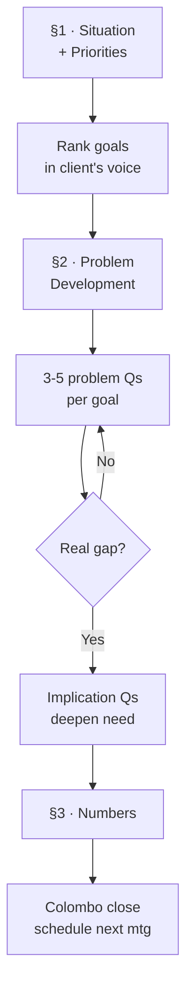
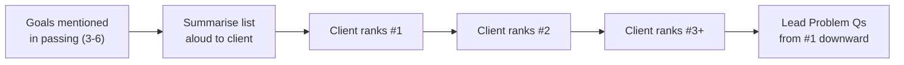

# Day 50 — Client Financial Review: Part 1

> **The one idea for today:** The Client Financial Review (CFR) is where SPIN meets paper. It's a structured fact-find form that captures the client's real situation, builds the case for a recommendation, and creates a document both of you can refer back to. Do this phase well, and your recommendations almost write themselves.

## What you'll walk away with

By the end of today you should be able to:

1. **Explain** the 3-section structure of a CFR and what each section accomplishes.
2. **Transition** from opening rapport into Section 1 without awkwardness.
3. **Prioritise** client goals using the framework that exposes real motivations.

---

## 1. What is a CFR?

The Client Financial Review (CFR) is the **structured second meeting** (or extended first meeting) where you collect the data you need to make a real recommendation.

It's:
- A **fact-finding conversation** guided by a standardised form.
- A **SPIN conversation** (Days 47–49) applied to financial topics.
- A **permission-based deep dive** into the client's real situation.

It's NOT:
- A sales pitch.
- A product presentation.
- A one-way interrogation.

The CFR produces three outputs:
1. **Factual data** (income, expenses, existing coverage, assets, liabilities).
2. **Prioritised goals** (with the client's own ranking).
3. **Acknowledged problems** (the gaps the client now sees clearly).

With those three in hand, Day 54's recommendation phase is simply **"here's the plan that fits what you just told me."**

## 2. The 3-section structure

A standard CFR has three sections. Today covers the first two; Day 51 covers the third (the financial numbers).

### Section 1 — Personal Situation + Priorities (today)
- Basic family structure.
- Client's goals and priorities.
- Life-stage context.

### Section 2 — Problem Development by Topic (today)
- Retirement concerns.
- Education funding.
- Protection gaps.
- General savings.

### Section 3 — Financial Numbers (Day 51)
- Income and expenses.
- Existing assets and liabilities.
- Existing insurance coverage.
- Budget capacity for new plans.

**Total time:** 60–90 min for a good CFR. Don't rush.

## 3. Section 1 — Situation Questions (the easy start)

The first part of the CFR is **very general questions.** Deliberately so. The purpose is to:

1. Get the client talking about themselves.
2. Let you spot **implied needs** that will be developed later.
3. Build rapport through genuine interest.

**Key questions (Situation-level):**

- "Tell me about your family — who are you planning for?"
- "Tell me about your children — names, ages, how they're doing."
- "What does your typical week look like — work, family, activities?"
- "What are you most looking forward to in the next 5 years?"
- "Where do you see yourself at retirement — what does that look like?"

**Rule:** the first factual question isn't the important one. It's the **follow-up questions** that surface the implied needs.

### Example — the follow-up matters

**You:** "How many kids do you have?"
**Client:** "Two. 6 and 4."

*Don't stop here.* Probe:

**You:** "That's a fun age. Any thoughts yet on what you want for their future — education, overseas?"
**Client:** "Hmm, honestly we haven't really planned. My wife wants them to study in Australia maybe."
**[Implied need surfaced: education funding.]**

**You:** "Nice dream. Have you started putting money aside for that specifically, or is it mixed in with general savings?"
**Client:** "It's in our savings account. I know I should be doing more."
**[Implied need developed: the gap is acknowledged.]**

You've just planted the seed for the education-funding Problem + Implication questions later.

## 4. Prioritising goals — Section 2a

After open conversation, you'll have 3–6 goals mentioned. Now you **rank them.**

**The transition:**

> "Let me make a quick list of what I've heard you mention as goals. I have [retirement at 62, kids to study in Australia, paying off the mortgage early, a family holiday fund]. Did I miss anything?"

*Let them add or adjust.*

> "Sometimes we can't tackle everything at once. To figure out how to approach these, we need to understand how important each is to you. Which of these would you call your #1 priority?"

*Listen. Continue:*

> "And the #2?" ... "#3?"

**Why prioritisation matters:**

1. The client **commits** to their priorities in their own voice.
2. You know which topic to lead with in Problem Questions.
3. When presenting recommendations, you can match solutions to their #1 priority first — not yours.

**Rule:** always start Problem Questions with their **#1 priority.** That's where the emotional engagement is highest.

## 5. Section 2 — Problem Development

Moving from Section 1 to Section 2 is the shift from **understanding the client** to **understanding their gaps.**

**The bridge:**

> "Now that I have a clearer picture of what you're working toward, let me ask more specific questions about where things stand today on each goal. These are a bit more personal — feel free to pass on anything that's too private."

That permission move matters. It signals respect and lowers defences.

### Problem Questions by topic

For **each priority goal**, ask 3–5 Problem Questions. Examples:

**Retirement**
- "When did you start actively thinking about retirement planning?"
- "What's your current approach — CPF, private plans, investments?"
- "How confident are you that you'll hit your retirement income target at 62?"
- "What's your biggest worry around retirement?"

**Children's education**
- "Have you started a dedicated education savings plan?"
- "How much do you think Australian uni costs today — and in 15 years?"
- "If those funds weren't available when they turn 18, what would happen?"

**Critical illness / hospital**
- "What coverage do you currently have for CI or major illness — personal or company?"
- "If you were unable to work for 2–3 years due to illness, how would your family cope?"
- "How much is your current hospital plan limit? Is it enough for private-tier treatment?"

**Mortgage / debt**
- "How's the mortgage structured — fixed, floating, tenure?"
- "If your income stopped tomorrow, how long could the mortgage payments continue?"

### The probing discipline

After each Problem Question, **wait.** Most clients need 3–5 seconds to form an honest answer. If you fill the silence, you lose the answer.

If the first answer is shallow ("yeah I know I should do more"), probe:

- "Could you tell me a bit more about that?"
- "What do you mean by 'should do more'?"
- "How long has this been on your mind?"

**Rule:** keep probing until you feel the client has **acknowledged a real problem.** Only then move to Implication Questions (Day 49 + Day 51).

## 6. The note-taking balance

During CFR, you're collecting lots of data. But heavy note-taking kills rapport.

**The balance:**
- **Eye contact 80%**, notes 20%.
- **Short keywords** on the form, not paragraphs.
- **Repeat back** what you heard: "So what I'm hearing is you want [X] by [age] — is that right?" This confirms and gives you a moment to write.
- **Expand notes into full CFR form + CRM** within 30 min of meeting end.

Some clients actually **want** to see you writing — it signals seriousness. Test the client's preference early and adjust.

## 7. Common Section 1/2 mistakes

### Mistake 1: Asking Situation Questions already answerable online
"Where do you work?" when LinkedIn tells you → wastes time + signals you didn't prep.

### Mistake 2: Skipping prioritisation
Jumping to Problem Questions without ranking goals → you present solutions in the wrong order.

### Mistake 3: Only one Problem Question per topic
A single question doesn't surface real gaps. Probe 3–5 times per priority goal.

### Mistake 4: Moving to Section 3 (numbers) too fast
Clients share numbers only after trust. Earn trust in Sections 1 and 2 first.

## 8. Ending Section 2 cleanly

Once you've developed problems on the top 2–3 priorities, transition to Section 3 (numbers):

> "Thanks for being so open. Before we look at what's possible, I need to understand where you are financially today — a quick look at income, expenses, what's already in place. Then we can plan properly. Is that OK?"

Most clients agree. Some need reassurance — offer it:

> "Everything you share stays confidential. I'm just making sure the plan I propose is realistic for your actual situation, not a generic template."

## Quick quiz

1. **The purpose of Section 1 of the CFR is:**
   - A) Collect all financial data
   - B) Pitch products
   - C) Get the client talking, spot implied needs, rank priorities ✓
   - D) Negotiate price

   **Why:** Section 1 is deliberately general — it builds rapport, gets the client talking about themselves, and surfaces implied needs through follow-up questions. Financial data collection belongs to Section 3, and product pitching has no place in any part of the CFR. Ranking priorities happens at the end of Section 1 and directly shapes which Problem Questions you lead with in Section 2.

2. **When transitioning from general discussion into Problem Questions:**
   - A) Skip it — just start asking
   - B) Ask permission first, signal the shift is to more personal questions ✓
   - C) Announce you're about to sell
   - D) Pause for 2 minutes

   **Why:** The permission move ("these are a bit more personal — feel free to pass on anything too private") signals respect and lowers the client's defences before you probe sensitive topics. Skipping the transition (A) feels abrupt and can cause the client to close off. Announcing a sales intent (C) would trigger resistance immediately. A 2-minute pause (D) is awkward and serves no purpose.

3. **After ranking goals, you start Problem Questions with:**
   - A) The easiest goal
   - B) The client's #1 priority — where emotional engagement is highest ✓
   - C) The goal with the highest product margin
   - D) The goal that requires the cheapest product

   **Why:** Emotional engagement is highest on the client's self-declared #1 priority — that's where they're most willing to go deep and acknowledge real gaps. Starting with the easiest goal (A) wastes the emotional opening. Leading with the most profitable goal for you (C) or the cheapest product (D) signals you're optimising for yourself, not for the client's outcomes.

4. **A client answers "Two kids, ages 6 and 4" and stops. What should you do?**
   - A) Move on to the next Situation question
   - B) Write the answer in your notes and ask about income next
   - C) Probe with a follow-up — "Any thoughts on what you want for their future?" — to surface implied needs ✓
   - D) Skip to Problem Questions since you have a data point

   **Why:** The first factual answer is not the important one — the follow-up question is what surfaces the implied need. A client who says "Two kids, 6 and 4" is giving you an entry point, not a complete picture. Moving to income immediately (B) breaks rapport and misses the implied education-funding need. Jumping to Problem Questions (D) without first surfacing implied needs means you're probing without direction.

5. **A client mentions 5 goals in passing. You haven't ranked them yet. What's the risk of jumping straight to Problem Questions?**
   - A) No risk — you can rank as you go
   - B) You may present solutions matched to the wrong priority and lose emotional engagement ✓
   - C) The client may feel rushed
   - D) You'll run out of time for Section 3

   **Why:** Without prioritisation, you don't know which goal carries the most emotional weight — so your Problem Questions may develop the wrong topic first, and your eventual recommendations won't match the client's own stated hierarchy. Ranking as you go (A) means the client never explicitly commits to their priorities. Running short on time for Section 3 (D) is a time-management issue, not a consequence of skipping prioritisation.

6. **During Section 2, a client gives a shallow answer: "Yeah, I know I should do more for retirement." What do you do?**
   - A) Accept it and move to the next goal
   - B) Proceed to Implication questions — the need is acknowledged
   - C) Probe further: "How long has this been on your mind?" until a real problem is acknowledged ✓
   - D) Pivot to financial numbers immediately

   **Why:** A shallow acknowledgement is not a real problem statement — it's a social deflection. You need to probe until the client has genuinely named a specific gap they feel, not just mentioned it politely. Accepting the surface answer (A) leaves you without the emotional material needed for Implication questions. Moving to Implication too early (B) on a shallow acknowledgement produces a weak response because the client hasn't really felt the problem yet.

7. **You're mid-CFR and the client gets defensive when you begin Section 3. This most likely means:**
   - A) The client has something to hide
   - B) Sections 1 and 2 weren't done well enough to earn the trust required for financial disclosure ✓
   - C) You should reschedule the meeting
   - D) The client is a high-D personality and prefers to skip to numbers

   **Why:** Financial data is sensitive, and clients only share it when trust has been established through a quality Section 1 and Section 2. If they become defensive, the trust simply hasn't been earned yet — the correct response is to spend more time in conversation, not reschedule or attribute it to personality type. Assuming the client is hiding something (A) is uncharitable and likely wrong. Rescheduling (C) wastes the progress already made.

---

## Related

- Previous: [[day-49|Day 49 — Implication & Need-Payoff Questions]]
- Next: [[day-51|Day 51 — Client Financial Review: Part 2]]
