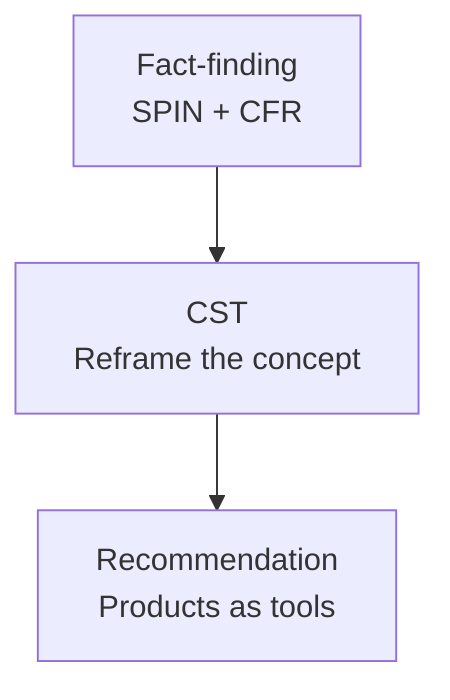
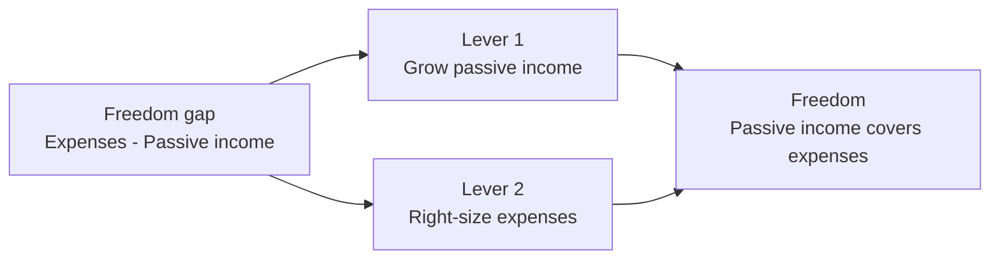

# Day 52 — CST: The Wealth Angle

> **The one idea for today:** CST (Client Strategy Talk) is the 5–10 minute reframe you give a client — before you show any product — that makes a specific wealth concept click in their head. The wealth angle reframes saving from "being responsible" into "buying freedom." Once they feel that, the products basically sell themselves.

## What you'll walk away with

By the end of today you should be able to:

1. **Deliver** a 5-minute CST that frames wealth-building as freedom-building.
2. **Distinguish** the wealth angle from the risks angle (tomorrow's Day 53).
3. **Integrate** the CST into the flow of a fact-finding meeting without it feeling like a pitch.

---

## 1. What is a CST?

A **Client Strategy Talk (CST)** is a short, structured mini-presentation — usually 5–10 minutes — that reframes a specific financial concept for the client.

It sits **between** fact-finding and recommendation:

```
Fact-finding (SPIN + CFR)
       ↓
 CST (reframe a concept)
       ↓
Recommendation (products)
```



The purpose: **change how the client thinks about a topic** before you recommend solutions. A client who sees wealth-building as "being responsible" buys reluctantly. A client who sees it as "buying freedom" buys enthusiastically.

## 2. The Wealth Angle — the core reframe

Most people approach wealth-building with one of three mindsets:

| Mindset | What they believe | Behaviour |
|---|---|---|
| Scarcity | "Money is hard to make; hold tight." | Hoard cash, under-invest |
| Consumption | "Money is for enjoying now." | Spend everything, no plan |
| **Freedom** | **"Money buys optionality — time, choice, security."** | **Save deliberately, invest, compound** |

The Wealth Angle CST moves the client from mindset 1 or 2 to mindset 3.

**The core reframe:**

> "You're not saving money for its own sake. You're buying freedom — the day your passive income covers your expenses is the day you stop needing a job. Every dollar invested today is a dollar of future freedom. That's what we're actually doing when we plan wealth."

This is the same freedom formula from Day 10, delivered as a live concept for the client.

## 3. The structure of a Wealth Angle CST

A good CST follows this 5-part structure. Total time: ~5–7 minutes.

### 1. The hook (30 sec)
Open with a question that makes them think.

> "Can I ask — when you think about retirement, what's the actual picture in your head? What are you doing? Where are you living?"

*Let them answer. Usually it's vague — travel, time with family, no boss.*

### 2. The reframe (1 min)
Name what they actually want.

> "So what you're really describing is **freedom.** Not insurance, not investments, not products. Freedom — the ability to choose what you do with your time. That's the real goal. Everything else we talk about is just tools to buy that."

### 3. The formula (2 min)
Give them the math.

> "Here's the formula for freedom. It's simpler than most people think.
>
> **Passive income > Monthly expenses = Freedom.**
>
> That's it. The day your passive income — from investments, CPF, rental, savings plans — covers your expenses, you're free. Not rich. Not famous. *Free.*
>
> For you, with expenses around $[X]/month today and inflation taking that to roughly $[Y]/month at 65, freedom means building an income stream of $[Y]/month by age 65."

### 4. The levers (1.5 min)
Show them the two levers.

> "There are only two ways to close the gap between today and freedom:
>
> 1. **Grow passive income** — invest, save, let compounding work.
> 2. **Right-size expenses** — distinguish real needs from lifestyle inflation.
>
> Most people focus only on the first. The best advisors help clients do both — without moralising about how they spend."



### 5. The transition (30 sec)
Move to recommendation.

> "So that's the frame — freedom, not products. With that in mind, let me show you how we'd actually build your stream of passive income."

Then you present the plan.

## 4. Why CSTs work

A CST works because:

1. **It's not a pitch.** It's a conversation about the client's own goals.
2. **It uses their numbers** (expenses, retirement age) — not generic examples.
3. **It installs a mental frame** the client keeps after you leave.
4. **It makes the product feel like a tool**, not a product.

**The key discipline:** don't skip from fact-finding to product without a CST. The CST is the mental bridge. Clients who hear a CST are 2–3× more likely to say yes to the recommendation.

## 5. Variations of the Wealth CST

You'll use the Wealth Angle with different client profiles. Adapt the CST accordingly.

### For a 25–35 year old (accumulation phase)
Emphasise **time and compounding.**

> "You have one massive advantage nobody can buy: time. A dollar you invest today compounds for 30–40 years. A dollar at 45 compounds for 15. That 25-year head start can mean 3–5× more at retirement, on the same monthly contribution."

### For a 35–50 year old (catch-up phase)
Emphasise **systematisation and automation.**

> "The good news: you still have 15–25 years of compounding. The key is consistency. A disciplined monthly contribution, auto-deducted, beats any attempt to 'save when I have extra.' We're building the system that saves for you."

### For a 50+ year old (preservation + income phase)
Emphasise **income streams and de-risking.**

> "Your focus shifts now. Not growing — protecting and producing. We want income streams that pay for your retirement years while keeping your capital safe from big market drops."

## 6. The three signal phrases to listen for

During the CST, watch for these client responses — they tell you it's landing:

| Signal | What it means |
|---|---|
| "I've never thought of it that way." | Frame shift happening ✓ |
| "That actually makes sense." | Intellectual agreement ✓ |
| "So how do I actually do that?" | Ready for the recommendation ✓ |

If you **don't** hear these signals by the end of the CST — the reframe didn't land. Either slow down, use more of their own numbers, or pause and ask: "Does this frame make sense to you?"

## 7. Common CST mistakes

### Mistake 1: Making it a lecture
A CST is a conversation, not a monologue. **Ask questions throughout.** Check they're tracking.

### Mistake 2: Skipping their numbers
A generic CST feels like a sales pitch. Always use **their** expenses, **their** age, **their** retirement target.

### Mistake 3: Jumping straight to products
Don't shortcut the frame-building. The 5 minutes you invest in CST pay back 3× in close rate.

### Mistake 4: Over-long CSTs
10+ minutes of reframing becomes a lecture. Stay under 7.

### Mistake 5: CST without SPIN first
A CST on a client who hasn't felt their problem yet falls flat. Always SPIN first, then CST, then recommend.

## 8. The Wealth Angle + CPF

For Singaporean clients, always anchor the Wealth CST to CPF. They already have one income stream there — your plan is adding layers.

**The integration:**

> "You already have the foundation — your CPF LIFE will produce around $[X]/month starting at 65. That's great. But if your target expense is $[Y]/month, there's a gap of $[Y−X] per month. Our job is to build income streams to close that gap. Here's how."

This respects what the government has already built, honours the client's existing efforts, and positions your plan as the **complement** — not a replacement.


## Quick quiz

1. **The Wealth CST moves the client from what mindset to what mindset?**
   - A) From poor to rich
   - B) From scarcity or consumption mindset → freedom mindset ✓
   - C) From saver to investor
   - D) From risk-averse to risk-taking

   **Why:** The Wealth Angle specifically addresses the two unproductive money mindsets — scarcity (hoard cash, under-invest) and consumption (spend everything, no plan) — and reframes wealth-building as buying optionality and freedom. The shift from poor to rich (A) is an outcome, not a mindset reframe. Saver to investor (C) is a behaviour change, not the conceptual shift the CST is designed to produce. Risk tolerance (D) is never mentioned as the target of the Wealth CST.

2. **The core formula for the Wealth CST:**
   - A) Income × Years = Wealth
   - B) Passive income > Monthly expenses = Freedom ✓
   - C) Save 20% = Financial independence
   - D) Compounding × Time = Wealth

   **Why:** The formula "passive income > monthly expenses = freedom" is the exact frame the Wealth CST is built around — it defines freedom as a mathematical threshold, not a feeling or a number. The 20% rule (C) is a generic savings heuristic, not the CST's framework. Compounding and time (D) are important levers but are not the core formula. Income times years (A) is not a concept used anywhere in the CST.

3. **The 3 signals that tell you the CST is landing:**
   - A) Smiles, nods, handshakes
   - B) "I've never thought of it that way," "That makes sense," "So how do I do that?" ✓
   - C) Silence, pause, lean-in
   - D) Objections, clarifications, counter-questions

   **Why:** The three verbal signal phrases specifically indicate a cognitive frame shift ("never thought of it that way"), intellectual agreement ("that makes sense"), and readiness for recommendation ("so how do I do that?"). Physical cues like smiles or nods (A) are ambiguous and not the specific diagnostic signals named in the material. Silence (C) could indicate confusion, not agreement. Objections and counter-questions (D) suggest the CST hasn't landed and needs more work.

4. **A 29-year-old client with no dependents wants to "start investing." Which Wealth CST variation is most appropriate?**
   - A) Income streams and de-risking — they need to think about preservation
   - B) Systematisation and automation — consistency beats timing
   - C) Time and compounding — emphasise the head start they have while young ✓
   - D) CPF LIFE gap analysis — retirement income is the key lever

   **Why:** A 25–35 year old in the accumulation phase has the single greatest advantage no one can buy — time. The compounding variation speaks directly to this and maximises the motivational case for starting early. Preservation and de-risking (A) is for pre-retirees who have already built wealth. Systematisation (B) is the 35–50 catch-up framing. CPF LIFE gap analysis (D) is a useful integration point but not the primary variation for this life stage.

5. **You deliver the Wealth CST formula: passive income > monthly expenses = freedom. The client is silent and doesn't respond. What should you do?**
   - A) Continue to the levers section immediately
   - B) Repeat the formula using different words
   - C) Check whether the frame landed: "Does this way of thinking about money make sense to you?" ✓
   - D) Skip to the product recommendation — the silence means they agree

   **Why:** Silence after a reframe can mean confusion, processing, or non-engagement — you need to diagnose which before moving forward. Asking directly whether the frame makes sense is the prescribed check. Continuing immediately (A) risks building on a foundation that hasn't been accepted. Repeating it (B) may help if the issue is phrasing, but the better move is to invite feedback first. Silence does not mean agreement (D); proceeding to product without confirmation risks presenting to someone who hasn't bought the frame.

6. **The Wealth CST covers two levers for closing the freedom gap. What are they?**
   - A) Saving more and spending less
   - B) Investing aggressively and cutting debt
   - C) Growing passive income and right-sizing expenses through deliberate distinction of needs vs lifestyle inflation ✓
   - D) Maximising CPF and buying property

   **Why:** The two levers are growing passive income (investing, saving, compounding) and right-sizing expenses by distinguishing genuine needs from lifestyle inflation — without moralising about spending. "Saving more and spending less" (A) is close but too blunt and doesn't capture the non-judgmental nuance of the CST framing. Aggressive investing and debt cutting (B) are tactics, not the conceptual levers. CPF and property (D) are specific tools, not the two structural levers.

7. **For a Singaporean client, the Wealth CST should acknowledge CPF LIFE because:**
   - A) CPF LIFE is enough on its own — no gap to address
   - B) It shows respect for existing efforts and positions your plan as a complement to close the remaining income gap ✓
   - C) It avoids any conversation about the government
   - D) It is required by MAS regulations before recommending any plan

   **Why:** Acknowledging CPF LIFE respects what the client has already built and what the government has provided, positioning your recommendation as the complement rather than a replacement. CPF LIFE alone is explicitly not enough for most clients — there is nearly always a gap between the CPF payout and the target retirement expense (A is wrong). Avoiding government topics (C) is irrelevant — the material endorses referencing CPF openly. There is no MAS requirement to reference CPF LIFE before making a recommendation (D).

---

## Related

- Previous: [[day-51|Day 51 — Client Financial Review: Part 2]]
- Next: [[day-53|Day 53 — CST: The Risks Angle]]
