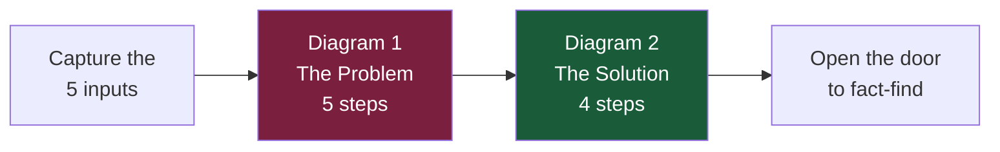

# Day 52 — Retirement Step-by-Step CST

> **The one idea for today:** Most clients can't *feel* their retirement gap. They've heard the abstract version a hundred times. Today you'll learn a paper-and-pen walkthrough that lets the client *watch* their own gap appear, then *watch* the gap close — without you ever pitching a product.

> **🛠 Use the live tool with your prospect:** **[Total Wealth Concept · Retirement Step-by-Step](https://present.financeillustrator.com/total-wealth-concept/retirement?subtab=step-by-step)**. Same diagrams as the screenshots below, but interactive — set the five inputs in front of the client (current age / retirement age / life expectancy / inflation / target monthly lifestyle) and click *Draw All* on each tab to walk through the Problem → Solution sequence live. Use this when you have a screen between you and the prospect; use the paper-and-pen version below when you don't.

> **🧮 Companion view — Lifestyle only:** **[Total Wealth Concept · Retirement — Lifestyle](https://present.financeillustrator.com/total-wealth-concept/retirement?subtab=lifestyle)**. A stripped-down version of the same idea — just the inflation curve from today's desired monthly lifestyle to its future-dollar equivalent at retirement age. Run this as a 2-minute warm-up before the full step-by-step, or use it with clients who only want the headline. Base URL: [present.financeillustrator.com](https://present.financeillustrator.com/).

> **📎 What the engine under this CST actually is:** straight **inflation math** — the monthly passive income a client *desires today* becomes a meaningfully larger number in future dollars. If you want the foundation, revisit [[day-35|Day 35 — Inflation: The Silent Wealth Killer]]. Today's lesson is how you *draw* that same math in front of a prospect until they feel it.

## What you'll walk away with

By the end of today you should be able to:

1. **Capture** the five inputs that drive a retirement story — current age, retirement age, life expectancy, inflation, target monthly lifestyle.
2. **Draw** the 5-step "Problem" diagram that surfaces the lump sum required and how scary the no-investing version is.
3. **Draw** the 4-step "Solution" diagram that shows how the same target gets reached with a fraction of the monthly outlay — and how dividends preserve the capital.
4. **Extend** the conversation with the 1/3 income rule, the four AIA-vs-DIY differentiators, the bonus structure, and the fees comparison.

---

## 0. Concept-draw FIRST. Slides come SECOND. Slides are *your* tool.

The single biggest mistake new FCs make is opening the laptop, projecting the AIA presenter, and trying to *explain* slides to the client. The brain switches off. There are too many fields, too many bullets, too many things going on at once.

> **Concept-drawing on a single page first → presenter slides only AFTER.**

The presenter is your reference deck and your compliance backup. It's not the show. The show is *you, drawing two diagrams, on one piece of paper, while the client watches their own retirement story appear.* Once they've felt it, the slides confirm and document it. Reverse that order and you lose the room.

This page contains both diagrams plus the live extension scripts that come after them. Practise drawing all of it from memory before your next prospect meeting.

## 1. Why this CST is different

Yesterday's CST (Day 51) and the wealth-angle CST you'll see again later both work by *reframing*. This one works by **arithmetic on paper, in front of the client.** The client watches the numbers appear in their own handwriting (or yours, on a whiteboard). They can't unsee them.

The structure is two diagrams, drawn in sequence:



Total time in the meeting: 10–12 minutes once you've practised it. Most new FCs run it too fast on the first attempt. The pauses between steps are the conversion — don't rush.

## 2. The five inputs (capture these first)

Before you draw anything, ask the client these five questions in order. Write each answer on the page so they can see them:

| # | Ask | Default if they don't know |
|---|---|---|
| 1 | "How old are you today?" | (must have) |
| 2 | "What age do you want to stop working?" | 65 |
| 3 | "How long do you expect to live? Most Singaporeans now plan to 85." | 85 |
| 4 | "What's the lifestyle you'd want each month in today's dollars — same as now, more, or less?" | same as current monthly spending |
| 5 | "We'll plan with 2.5% inflation — that's the long-term Singapore average. OK?" | 2.5% |

Write these five numbers across the top of the page. They're the constants for everything that follows.

> **Worked example used through the rest of this lesson:** Age 30, retire 65, life expectancy 85, inflation 2.5%, lifestyle $5,000/mth.

---

## 3. Diagram 1 — The Problem (5 steps)

This is what the finished diagram looks like — the rendered version inside the AIA Total Wealth tool with the same worked example (Age 30 → 65 → 85, $5,000/mth lifestyle, 2.5% inflation):


When you draw this for a client, you draw a horizontal timeline with three tick marks: **Age 30 (today)**, **Age 65 (retirement)**, **Age 85 (end)**. Leave plenty of room above the line — the rising curve and the calculation will live up there.

### Step 1 — Mark today and draw the inflation slope

**Draw:** A red dot on Age 30. From that dot, draw a rising line up to Age 65. Label the start *"$5,000/mth — your desired lifestyle"*. Label the slope *"2.5% p.a. inflation"*.

**Say (slowly, while drawing):**
> "Today, $5,000 a month gives you the lifestyle you want. But inflation doesn't sleep — at 2.5% a year, the same lifestyle gets more expensive every year. So this line is the cost of *the same lifestyle*, going up over the next 35 years."

**Pause.** Let the curve sit on the page for a beat.

### Step 2 — Ask them to guess, then reveal

**Say:**
> "By the time you're 65 — what do you think this same $5,000 lifestyle will actually cost per month?"

Let them guess. Most people guess too low — $7,000, $8,000.

**Then write at the top of the slope:**
> *"Need ≈ $11,800/mth"*

**Say:**
> "Almost $12K a month — just to keep what you have today."

The number lands harder *because they guessed first*. Don't skip the guess.

### Step 3 — The lump sum reveal

**Write underneath:**

```
$11,800/mth × 12 months × 20 retirement years
= ≈ $2.85 MILLION
```

Make the lump-sum figure **the biggest number on the page**. Underline it twice.

**Say:**
> "So between 65 and 85, just to fund the same lifestyle you have today, your retirement pot needs about $2.85 million sitting there ready to draw down."

**Pause.** Most clients react here. Don't fill the silence.

### Step 4 — The depletion line

**Draw:** From the peak of the line at Age 65, a *dashed grey line* sloping down to $0 at Age 85. Add little down-arrows along the way to show drawdowns. Label: *"Capital depletes → $0"*.

**Say:**
> "And in this version, every dollar you spend in retirement comes *out of* the $2.85M. So at 85 — best case, perfect plan — there's nothing left. No buffer for a long-term care bill. No legacy for the kids."

### Step 5 — The "no investing" reality check

**Calculate live:**

```
$2,850,000  ÷  (35 years × 12 months)
=  ≈ $6,800 / month
```

**Write the number very large:**

> *"Save $6,800/mth, every month, for 35 years — and still end at $0."*

**Say (this is the gut-punch line):**
> "If you just save the money — no investing, no growth — you need to put away about $6,800 every single month for the next 35 years. That's the safe path. And it still ends at zero at 85."

**Stop. Don't transition immediately to the solution.** Let the discomfort sit. The client should now be slightly worried — that's the conversion.

---

## 4. Diagram 2 — The Solution (4 steps)

The rendered version of the Solution diagram, same worked example:


On the same page (or a fresh one — your call), redraw the timeline. This time you're drawing in **green**, not red.

### Step 1 — Replace "save" with "invest"

**Draw:** A green dot at Age 30. From there, a rising green curve up to Age 65 — but this curve grows *steeper* than the inflation line, because compound returns compound.

**Label the curve:**
> *"Invest $1,700/mth"*

**Say:**
> "Same target — $2.85 million by 65. But this time we're not just saving — we're investing in a diversified global portfolio. Historical long-term return is around 6.6% per year. With that growth working for you, you don't need $6,800 a month. You need about **$1,700**."

**Let the contrast land.** $6,800 → $1,700 is an 80%+ reduction.

### Step 2 — Hit the target

**Draw:** A bigger green dot at Age 65. Label above it:

> *"$2.85M achieved → reinvest for dividends"*

**Say:**
> "At 65, you've hit the target. Now the question becomes: *how* you take income matters more than the size of the pot."

### Step 3 — The two paths from age 65

This is the most powerful moment. You're going to draw two paths from the same retirement dot:

**Path A — the old version (re-draw it from yesterday's diagram):** dashed grey line dropping to $0 at age 85.

**Path B — the dividend version:** A *horizontal* green line from Age 65 to Age 85, *staying at the same height*. Add small downward arrows hanging off the green line — those are the dividends. Label below the arrows:

> *"≈ $14,900/mth in dividends"*

At Age 85 on the green line, write:

> *"$2.85M still preserved"*

**Say:**
> "If your $2.85M is invested at a 6.3% dividend yield, it pays out about $14,900 a month — which more than covers your $11,800 lifestyle. The capital itself stays intact. So you're not draining a tank. You're drinking from a stream."

> "And what's left at 85 — $2.85 million — becomes your legacy. Or your buffer. Or your medical safety net. Your call."

### Step 4 — The side-by-side card

Either draw two boxes on the page or hand them this comparison:

| | **WITHOUT Investing** | **WITH Investing** |
|---|---|---|
| Monthly outlay (35 years) | **$6,800/mth** | **$1,700/mth** |
| Outcome at 85 | Capital depletes to $0 | $2.85M preserved + $14,900/mth dividends |
| Headline | "Save and survive" | "Invest and thrive" |

**Say (the closing line):**
> "Same goal. Same target lifestyle. The only thing that changes between these two columns is the choice to *invest* instead of just *save*. That's the conversation we need to have."

---

## 5. Extension — the 1/3 income rule

After the two diagrams land, the natural follow-up question from the client is *"Where does $1,730/mth even come from?"* Use the **1/3 rule** to make the budgeting feel doable instead of impossible.

**Draw on the page:**

> **Take-home income** — e.g. $3,000 of a $5,000 salary

| Bucket | Share | Amount | Goes to |
|---|---|---|---|
| **Short term** | ~1/3 | ~$1,000 | Food, transport, daily bills |
| **Mid term** | ~1/3 | ~$1,000 | Rent, house, kids |
| **Long term** | ~1/3 | ~$1,000 | **Investments + Insurance** ← future you |

**Say:**
> "Most people's mistake is they spend the first third on lifestyle, the second third on commitments, and then nothing's left for the long term. They take care of today and ignore future-you. The future-you in 30 years is the one who's going to thank you — or curse you — for what you do with this third right now."

> "If we just commit one third — about $1,000 a month — that's already enough for the investing target we just calculated, plus room for proper protection on top."

This collapses the *"I can't afford it"* objection without you having to push back.

## 6. Extension — what the dividend twist actually means

The Solution diagram showed a horizontal green line + dividend arrows. Reinforce *why* this works in plain language:

> "If you have $2.8M at 65 — do you spend it all at once? No. The smart move is leave the capital invested, take the dividends as your monthly income. At a 6% dividend yield, $2.8M throws off about $14,951 a month — which is *more* than your $11,866 lifestyle target."

> "So you get two things at once: a lifelong stream of passive income, *and* the $2.8M sits there as a legacy for your kids. If you ever need more than $14,951 in a particular month, that capital is your buffer — you've got the breathing room."

## 7. Extension — why this beats DIY (the AIA-vs-S&P conviction stack)

Once they're sold on the *concept*, they'll ask the real question: *"Why this and not just DIY into S&P 500 through a robo-advisor?"* You have **eight specific answers**, not four. The headline four from earlier versions of this lesson are here plus four more that most FCs leave on the table. Any one of them, landed cleanly, is enough to shift the conversation.

> **📎 Full FC-only reference:** deep dive with all the numbers, country tables, and source citations → **[SP500-vs-ILP conviction reference](/learning-track/first-60-days/reference/sp500-vs-ilp-conviction)**. Read it once end-to-end; then pull individual arguments as the prospect's objections emerge. Don't spray all eight — pick the one that matches *their* concern.

### The conviction table

| # | Risk in DIY | What AIA does about it | Hook number |
|---|---|---|---|
| 1 | **Dividend withholding tax** — US-domiciled ETFs lose **30%** of every dividend at source. Irish-domiciled funds lose 15%. Singapore-resident direct equities: 0%. | No client-level DWT on fund distributions inside the policy. | 30% → 0% |
| 2 | **Currency risk (USD/SGD)** — retirement is in SGD; USD-denominated ETFs expose you to FX swings. USD/SGD fell ~4% over 5 years (2020–2025). DBS forecasts **SGD parity with USD by 2040** — roughly a 35% headwind on USD assets. | Plan is SGD-denominated with currency hedging baked in. No FX lottery on retirement income. | Parity by 2040 |
| 3 | **US estate tax** — US-situs assets held by non-US persons → **40% estate tax** above the $60K exemption. On $2.8M that's ~$1M gone before the family sees a cent. | Nominated beneficiaries, non-US-situs policy structure → no US estate tax. Flows by nomination, not probate. | 40% → 0% |
| 4 | **Concentration risk** — the S&P 500 is one country, 500 companies. Every prior decade had a different winner. | Global fund architecture across BlackRock, Wellington, Baillie Gifford, Capital Group. **S&P 500 is only ~18%** of the AIA Elite Adventurous Index Fund. | S&P 500 = 18% |
| 5 | **Lost-decade risk** — between **2000 and 2010, the S&P 500 returned −9%** while International Small Cap Value made **+191%** and Emerging Markets made **+148%**. | Multi-region, multi-asset exposure means whichever cycle wins next, the portfolio owns it by default. | −9% vs +191% |
| 6 | **Execution risk on death** — money locked in a robo-advisor app your family has never logged into. Who decides when to sell? Who files the US estate tax forms? Who handles the FX? | Named beneficiaries + an advisor of record who already knows the plan + estate/will coordination. The handover is rehearsed, not improvised. | — |
| 7 | **Inheritance mismanagement** — heirs receive a cash lump sum and, with no investing experience, often spend it down or reinvest poorly. | **Secondary insured** — heirs inherit the *policy*, not cash. The plan continues. AIA continues managing the portfolio in their name. | — |
| 8 | **Macro currency pressure on USD** — COVID-era monetary expansion, rising US national debt, BRICS settlement alternatives, cross-border crypto adoption — structural pressures on the reserve-currency status. | Not a prediction, a cluster of concerns. AIA's SGD hedging means the plan is not hostage to whichever of these plays out. | — |

### The Dividend Withholding Tax math (if you need to show it)

On a $2.8M portfolio yielding ~6.3% in dividends = ~$14,900/month = ~$178,800/year = **~$3.6M of total dividends over 20 retirement years**.

| Holding structure | DWT rate | Withheld over 20 years |
|---|---|---|
| US-domiciled ETF (VOO, SPY, VTI) | 30% | **~$1.08M gone to IRS** |
| Irish-domiciled ETF (CSPX, VWRA) | 15% | ~$540K gone to IRS |
| AIA ILP fund structure | 0% at client level | $0 withheld — full amount in policy |

*"A million dollars of your retirement income going to the IRS instead of you, over 20 years, purely because of where the fund is domiciled. That's not a small number. That's a house."*

### The US Estate Tax schedule (if they don't believe the 40%)

| Taxable amount (value above the $60K exemption) | Rate |
|---|---|
| $0 – $10,000 | 18% |
| $80,001 – $100,000 | 28% |
| $250,001 – $500,000 | 34% |
| $750,001 – $1,000,000 | 39% |
| **Over $1,000,000** | **40%** |

*(IRS schedule, via Bloomberg / Jimmy Sexton. Non-US persons only get a $60K exemption vs $13M+ for US citizens.)*

### The Lost Decade receipts (2000–2010)

| Asset class | 2000–2010 total return |
|---|---|
| **S&P 500** | **−9%** |
| US Large Cap Value | +56% |
| US Small Cap Core | +74% |
| US Small Cap Value | +140% |
| Int'l Large Cap Value | +91% |
| Int'l Small Cap Core | +130% |
| **Int'l Small Cap Value** | **+191%** |
| Int'l Emerging Markets | +148% |

This is the killer chart. Any client who thinks "S&P 500 is the safe default" has not seen these numbers.

*"If your retirement happened to land on 2000–2010 and you were 100% S&P, you were poorer at the end of 10 years than at the start. International small-cap value made 191% in that same decade. A global portfolio doesn't have to guess which decade it's living through."*

### The "does your family know what to sell?" angle

Most FCs miss this one. On a DIY setup:

- The money is in a robo-advisor app (Endowus, StashAway, Syfe, SaxoTraderGo).
- Your spouse has never logged in. Your kids don't know the password.
- When you die, nobody knows *when* to sell, *what* to sell, how to handle US estate tax paperwork, or how to time the FX conversion.

With AIA: named beneficiary + advisor of record + estate/will coordination. The family calls one person, not a helpdesk.

### Secondary insured — the generational mechanic

On an AIA ILP, you can name a **secondary insured** (typically spouse or child). When the first life assured dies, the policy **does not terminate**. No death benefit is paid at first death — the plan simply continues on the secondary insured's life. All units, dividends, bonuses roll forward.

This is how a 40-year plan becomes a 100-year plan. On the ProAchiever bonus example, the $960/year perpetual bonus doesn't stop at 60 — it rolls to the child and keeps paying for another 40-60 years. That's the real power of the structure.

*"On a DIY portfolio, when you die, the portfolio is liquidated and your kids get a cash lump sum. On this plan, when you die, the plan doesn't end — it rolls to your child as the secondary insured, and the compounding keeps going. The policy outlives you."*

## 8. Extension — the bonuses sweetener

Once they understand the structure, introduce the bonuses *after* the value is clear (not as the lead — that signals you're selling, not advising). For a $12K/yr premium, a typical AIA bonus structure looks like:

| When | Bonus | On $12K/yr premium |
|---|---|---|
| Year 1 | 10% of annual premium | **$1,200** |
| Year 2 | 10% of annual premium | **$1,200** |
| Year 3 | 15% of annual premium | **$1,800** |
| Years 1–3 total welcome bonus | | **~$6,360** |
| Year 10 onwards (every year) | 5% of annual premium | **+$600/yr** |
| Year 20 onwards (every year) | 8% of annual premium | **+$960/yr** |

**Say:**
> "What seems bigger to you — the $6,360 welcome bonus in the first three years, or the $600 + $960 per year forever after? Most people guess the first one. But if you hold this to 60, you'll have collected ~$45K in lifetime bonuses. And because of the secondary-insured structure, the bonuses keep being paid into your descendants' policy after you're gone — so it's not a 60-year bonus, it's a 100-year one."

Bonuses are real numbers from iResource — don't make them up. Always pull current illustration values from the system before quoting.

## 9. Extension — the fees comparison (FC reference only — *don't* draw for the client)

This one is for *your own* understanding, not for the client whiteboard. A client will ask *"What about fees vs Endowus / Phillip / DIY?"* and you need a one-line answer ready.

**First 10 years**

| Platform | Fee load | What's happening |
|---|---|---|
| **AIA** | ▓▓▓▓▓▓░░ | Fees in — offset partly by welcome bonus |
| **Endowus / DIY** | ▓░░░░░░░ | Small recurring management fee |

**After 10 years**

| Platform | Fee load | What's happening |
|---|---|---|
| **AIA** | ▓░░░░░░░ | Bonus inflows now > fees → **effectively negative cost** |
| **Endowus / DIY** | ▓▓▓▓▓▓▓░ | Same % fee on a much bigger pot → real $ explodes<br/>*(1% of $1M = $10K/yr; over 30 retirement years that's $300K+ to the platform)* |

**The one-liner you can say out loud:**
> "Other platforms charge a small percentage every year. That sounds great when your pot is $50K. When your pot is $2.8M and you're 30 years into retirement, that same 1% becomes ten thousand dollars a year leaving the portfolio — every year. Our structure flips that: front-loaded fees in the first 10 years that get more than offset by bonuses for the rest of the lifetime."

## 10. The door-opener

After all of the above, close the meeting with the door-opener *— don't pitch a product yet*:

> "I'm not going to suggest anything specific today. The right portfolio depends on your time horizon, what's already in CPF, what your risk tolerance actually is — none of which we've covered yet. Mind if I run through a proper fact-find with you, then come back with an actual plan that gets you to that $2.8M at $1,730 a month, instead of $6,781?"

That last sentence is the entire sale. You've earned the second meeting.

## 11. Why this CST works

1. **The math is theirs.** They watched the numbers appear in real time. They cannot un-see $6,800/mth or $1,700/mth.
2. **They guessed.** The reveal of "$11,800/mth" lands harder because their gut said $7,000.
3. **The two paths are visually permanent.** A green line that *stays flat* at $2.85M next to a grey line that *falls to $0* — that image stays with them after the meeting ends.
4. **It's a teaching frame, not a sale.** You haven't named a single product. You've made the gap and the leverage of investing undeniable. The product recommendation becomes the only logical next step.

## 12. Common reactions and how to handle them

| Reaction | Reframe |
|---|---|
| *"$1,700/mth is still a lot."* | "It is — but compare it to the alternative. The whole point of the exercise is that doing nothing is more expensive than doing something. We can also start smaller — $500/mth today, scaling up as your income grows. The number on the diagram is the *finish line*, not the starting block." |
| *"How do I know I'll get 6.6% returns?"* | "You don't. That's the historical average for a global balanced portfolio over multi-decade horizons — past performance, not a guarantee. We use it as the planning assumption because it's defensible. Your actual portfolio will fluctuate, which is why we'd review it at least annually." |
| *"I'd rather buy property."* | "Property can be one of the layers. The question is whether the *income stream* it produces — net of mortgage, maintenance, and vacancy — gets you to $11,800/mth in retirement. Sometimes yes. Often the cash flow tells a different story. We can run both scenarios side by side." |
| *"My CPF will cover most of it."* | "CPF LIFE pays roughly $1,500–$2,500/mth for most Singaporeans. Against an $11,800/mth target, that closes about 15–20% of the gap. The rest still has to come from somewhere." |
| *"Why are you showing me this scary version?"* | "Because most plans gloss over inflation and assume retirement is 10 years, not 20. You deserve to see the real number first, then choose what to do about it. The good news is the second diagram is the *easy* version." |

## 13. Compliance checklist

- All return assumptions (6.62%, 6.3% dividend yield) are illustrative averages, not guarantees. State this verbally before you write any number.
- The lump-sum calculation here is intentionally simplified — `monthly × 12 × years` ignores inflation *during* retirement and assumes flat drawdown. When you move to a real plan, use proper iResource illustrations.
- Inflation rate of 2.5% is the long-term Singapore CPI average. State the source if asked.
- The "$2.85M dividend yields $14,900/mth at 6.3%" scenario assumes a specific dividend portfolio that may not match the client's risk profile. Don't promise a yield.
- Any actual product recommendation must come with the full guaranteed / non-guaranteed split and the standard "past performance does not guarantee future results" disclosure.

---

## Quick quiz

1. **What are the 5 inputs you capture before drawing anything?**
 - A) Age, salary, savings, expenses, debts
 - B) Current age, retirement age, life expectancy, inflation rate, target monthly lifestyle ✓
 - C) Income, CPF balance, OA, SA, MA
 - D) Net worth, monthly spending, mortgage, age, kids

 **Why:** The 5 inputs that drive the whole walkthrough are current age, retirement age, life expectancy, inflation rate, and target monthly lifestyle. They're the constants you write across the top of the page before any line is drawn. A and D mix in inputs (debts, mortgage) that don't affect the retirement-pot math at this CST level. C is a CPF-specific subset that doesn't include lifestyle or life expectancy — both are essential.

2. **In Step 2 of the Problem diagram, why do you ask the client to guess the inflated number before revealing it?**
 - A) Compliance requires client involvement at every step
 - B) The reveal of the actual number lands harder when their gut estimate was too low ✓
 - C) It saves the FC from having to do the calculation
 - D) Guessing is required by the framework's IP

 **Why:** Most clients guess $7,000–$8,000 for the future cost of a $5,000 lifestyle 35 years out. The actual answer (~$11,800) lands as a real "wow" moment specifically because their gut was already anchored too low. Skipping the guess turns the reveal into a passive number; including the guess turns it into a felt one. A invents a compliance rule. C is the wrong reason — you still do the math; the client just owns the surprise. D is a fabricated framework rule.

3. **The "no investing" outcome in Step 5 — what's the headline number for the worked example (age 30 → 65 → 85, $5,000 lifestyle, 2.5% inflation)?**
 - A) Save $1,700/mth and end with $0 at 85
 - B) Save $6,800/mth and end with $0 at 85 ✓
 - C) Save $5,000/mth and grow it to $2.85M
 - D) Save $11,800/mth to be safe

 **Why:** The Step 5 calculation is `$2,850,000 ÷ (35 years × 12 months) = ≈ $6,800/mth`. That's the no-investing reality: even saving $6,800 every month for 35 years, the capital still depletes to $0 at age 85 because no growth was applied. A is the *investing* version — that's the next diagram. C confuses the lifestyle with the savings target. D doubles the actual figure.

4. **What does the green horizontal line in Step 3 of the Solution diagram represent?**
 - A) The lifestyle staying flat through retirement
 - B) The capital staying preserved while dividends are paid out from it ✓
 - C) The investment return rate
 - D) Inflation flatlining at 0%

 **Why:** The solution version splits into two paths from the retirement dot — Path A is the dashed grey line depleting to $0 (the old approach), and Path B is the green horizontal line representing the capital staying intact while dividends are drawn off it. The dividend arrows hang *down* from the line. A confuses lifestyle with capital — lifestyle still inflates. C and D aren't on the diagram at all.

5. **The compelling contrast at the end — what's the monthly outlay difference for the worked example?**
 - A) $6,800/mth (save) vs $5,000/mth (invest)
 - B) $6,800/mth (save) vs $1,700/mth (invest) ✓
 - C) $11,800/mth vs $1,700/mth
 - D) $2.85M vs $1,700/mth

 **Why:** The whole walkthrough culminates in this side-by-side: $6,800/mth without investing (capital depletes to $0) vs $1,700/mth with investing (capital preserved + dividend stream). That's an 80%+ reduction in monthly outlay AND a better outcome — the closing line of the CST. A inflates the investing side. C and D mix up the units (lifestyle, lump sum) with the savings rate.

6. **In the door-opener at the end, what's the right move?**
 - A) Recommend a specific ILP that targets 6.6% returns
 - B) Ask permission for a proper fact-find — no product yet ✓
 - C) Send a follow-up email with calculator screenshots
 - D) Schedule a second meeting with a senior FC

 **Why:** The closing line is *"Mind if I run through a proper fact-find with you, then come back with an actual plan…"* The CST has done its job — installed the gap and the leverage. The recommendation needs the real fact-find first. A is the classic new-FC trap of pitching during the demo. C delays without earning the relationship. D outsources the conversation prematurely; the trust just established belongs to *you* in the room.

7. **Which compliance line MUST go in front of any number you write?**
 - A) "These figures are guaranteed by AIA"
 - B) "Returns are illustrative averages, not guarantees" ✓
 - C) "Dividends are tax-free in Singapore"
 - D) "Inflation will definitely be 2.5%"

 **Why:** Both 6.62% (long-term return) and 6.3% (dividend yield) are illustrative historical averages — not guarantees. State this verbally *before* writing any number on the page. A is fundamentally false — non-guaranteed returns can never be presented as guaranteed. C is a tax claim that's not the focus and could mislead. D presents an assumption as a certainty.

---

## Related

- Previous: [[day-51|Day 51 — CST: The Risks Angle]]
- Next: [[day-53|Day 53 — CST: The Risks Angle]]
