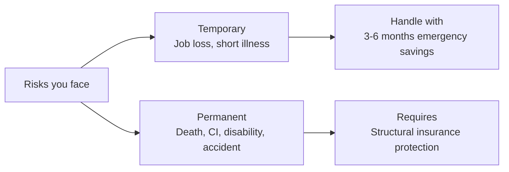
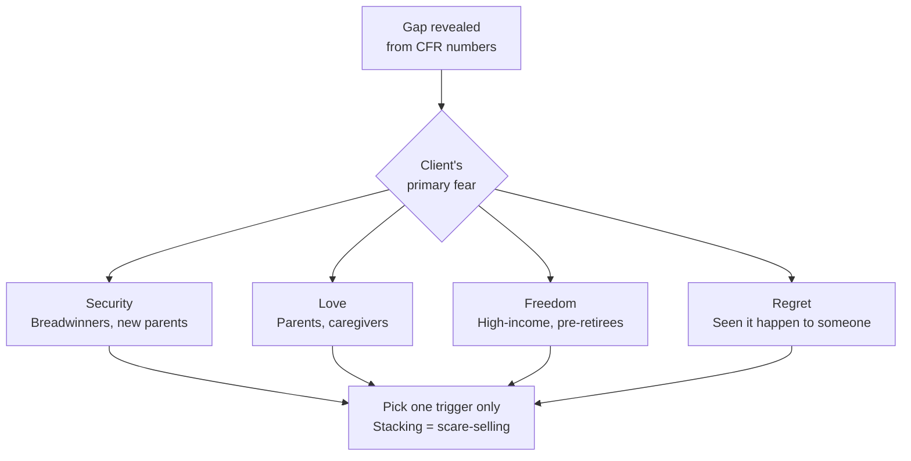

# Day 53 — CST: The Risks Angle

> **The one idea for today:** The Risks Angle CST reframes insurance from "optional expense" to "the foundation everything else depends on." Done well, a client sees insurance not as a cost but as the permission slip to build wealth. That reframe closes more protection cases than any product pitch.

> **🎥 Watch the live training:** **[Module 1 — New FC Training (David)](https://youtu.be/EtAo1of4h8U)**. Module 1 contains the live CST demo where Director Winnie walks through the income-loss section that this day is built around — temporary vs permanent income loss, the three risk-management methods (avoid / retain / transfer), and the "$1 million question" framing. Also available in this day's **Video** tab.
>
> **🎥 Companion video — the full Canned Sales Track in action:** **[Canned Sales Track (David)](https://youtu.be/TAsMoWdXLyg)**. Watch the entire CST delivered end-to-end with all of the structure below in one continuous flow. Reference for Assignment 1 Part B.
>
> **📄 Source script — the full OST (Odyssey Sales Track):** the canonical 2-page hand-drawn script this lesson is built on. **[Read the full OST script reference](../_source-supplementary/ost-script-full.md)** — every line, every pause, every example, in the order they're delivered. The Page 1 / Page 2 OST appendix at the bottom of this lesson is the consolidated version of that document, restructured around the actual delivery flow.

## 0. Live training reference — the income-loss spine

Two ways your client can lose income, and the only honest response:

| Loss type | Examples | Solution |
|---|---|---|
| **Temporary** | Sacked, resigned, retrenched | Contingency cash — 3–6 months of expenses sitting in the bank |
| **Permanent** | Death, disability, critical illness, accident, old age / retirement | **Irreversible** — savings won't catch up. Insurance transfer is the only honest answer |

**The $1 million question (use this verbatim):**
> "If you're 25 and need $25K/year of expenses for 40 years, that's $1,000,000 — just to keep yourself alive in retirement. Can your family lend you $1,000? Probably. $10,000? Maybe. $1,000,000? No. *We don't want clients to beg, borrow, or steal.*"

**Three risk-management methods — the elimination logic:**

1. **Avoid** — unrealistic. Can't avoid getting sick. Can't avoid getting old.
2. **Retain (self-insure)** — needs $1M sitting in cash already. Almost no one has it.
3. **Transfer** — use **10% of income** to protect the **other 90%**. ✅

That elimination is the close. By the time the client agrees with you on points 1 and 2, point 3 is the only remaining option.

## What you'll walk away with

By the end of today you should be able to:

1. **Deliver** a 5-minute Risks Angle CST without scare-selling.
2. **Explain** the "uncontrollable event" principle that justifies Level 1 protection.
3. **Know when** to lead with Risks vs Wealth — and why the order matters.

---

## 1. When to use the Risks Angle vs Wealth Angle

Both CSTs are in your toolkit. Use the right one for the situation.

| Client situation | Lead with |
|---|---|
| Young, single, no dependents | Wealth Angle |
| New parents | **Risks Angle** |
| Newly married, no kids yet | Risks (moderate) → Wealth |
| Pre-retirees with wealth already built | **Risks Angle (preservation framing)** |
| Sudden income jump (promotion, windfall) | Wealth, then Risks |
| Recent health scare (self or family) | **Risks Angle** |
| Client who "has everything sorted" | Risks (surface gaps) |

**The rule:** lead with the angle that matches the client's **present life tension.** If they're anxious about family → Risks. If they're focused on retirement dreams → Wealth. If both, run both (but not in the same meeting — split across two meetings).

## 2. The Risks Angle — the core reframe

Most people see insurance as:
- A cost.
- A necessary evil.
- Something they should "get around to."
- A hedge against bad things they'd rather not think about.

The Risks Angle reframes it as:
- **The foundation of everything they want to build.**
- **A structural guarantee that one bad event doesn't destroy years of planning.**
- **The only way to genuinely "transfer" catastrophic risks.**

**The core reframe:**

> "Insurance isn't a cost. It's the permission slip that lets you confidently build wealth — because you know one uncontrollable event won't wipe out the plan. The clients who reach retirement on time are almost always the ones who secured protection first."

## 3. The structure of a Risks Angle CST

Same 5-part structure as the Wealth CST. Different content.

### 1. The hook (30 sec)
Open with a question that surfaces the real concern.

> "Can I ask — if something happened to you tomorrow, an illness or accident, how long could your family continue their current life before something broke?"

*Let them answer. Most realise the answer is uncomfortable. Some don't know. Both reactions are useful.*

### 2. The reframe (1 min)
Name what's actually at stake.

> "Here's the thing most people miss. Everything you're building — the retirement plan, the kids' education fund, the house, the investments — sits on **one assumption**: that you keep being able to earn. The day that assumption breaks, the whole plan breaks. Unless you've put a structural guarantee underneath.
>
> That's what insurance actually does. It's not about dying. It's about making sure that when uncontrollable things happen, **your plan doesn't have to stop.**"

### 3. The permanent vs temporary frame (1.5 min)
Separate the risks that matter.

> "Let's map out the risks you're exposed to. There are two kinds:
>
> **Temporary risks** — losing a job, short illness. These are handled by 3–6 months of emergency savings. Easy.
>
> **Permanent risks** — death, critical illness, long-term disability, serious accident. These can take out your income for years or forever. No amount of saving handles these. This is what insurance exists for.
>
> You're already handling temporary risks with your savings. The question is whether permanent risks — the ones that really matter — are handled."



### 4. The gap reveal (1.5 min)
Using the data you collected in the CFR, show their actual exposure.

> "Based on what you shared earlier:
>
> - Your current life cover is $[X]. With two kids and a mortgage, a rough target is 10× your income — which would be $[Y]. So there's a gap of $[Y−X] in death cover.
>
> - Your CI cover is [amount or 'non-existent']. Recovery from major CI typically takes 3–5 years without income. For your income level, that's a 3-year gap of $[Z] — if it happened.
>
> - Your hospital plan through your employer ends the day you leave that job. If you had a diagnosis after leaving, you might not be insurable at reasonable rates.
>
> So there are gaps. None of this is to scare you — it's just the map of what we'd want to address."

**The 4 emotional triggers behind every gap.** When you're surfacing the gap, pick the one trigger that matches the client's actual fear — the reframe lands harder when you name the right emotion:



| Trigger | Who it hits hardest | Sample follow-up |
|---|---|---|
| **Security** | Breadwinners, new parents | "If your income disappeared for 3 years, what would your family sell first?" |
| **Love** | Parents, caregivers | "If something happened to you tomorrow, who'd take on your role for the kids?" |
| **Freedom** | High-income professionals, would-be retirees | "Which of these gaps is the one that'd force you to keep working past 60?" |
| **Regret** | Clients who've seen a friend or parent get hit | "If this happened and we hadn't addressed it, what would that conversation sound like?" |

Pick one. Don't stack all four — stacking is scare-selling.

### 5. The transition (30 sec)
Move to recommendation.

> "With that frame, let me show you the specific protection plan that closes these gaps within your budget."

Then present.

## 4. The "uncontrollable event" principle

The deepest idea in the Risks CST:

> **Some events are controllable. Some are not. Structural protection exists for the uncontrollable.**

Examples:
- Controllable: buying too much house, over-leveraging, lifestyle inflation.
- **Not controllable**: cancer diagnosis, accident while crossing the road, genetic health conditions, pandemics.

A wealthy person isn't wealthy because nothing bad ever happens. They're wealthy because when bad things happen, they're **structurally protected**. The rest of their plan keeps running.

**The client message:**

> "You can't control a critical illness diagnosis. You can control whether that diagnosis destroys your family's financial future. Insurance is the control mechanism."

## 5. Avoiding scare-selling

The Risks Angle can slide into fear-based selling if delivered badly. Avoid this.

### What NOT to do
- Dramatic "what if you die tomorrow" hypotheticals.
- Graphic descriptions of cancer, accidents, or illness.
- Statistics meant to frighten ("1 in 4 people get CI...").
- Tone of urgency or panic.
- Implying the client is irresponsible for being uncovered.

### What to do instead
- Calm, matter-of-fact tone.
- The client's own numbers (from their CFR).
- Questions that let them reach the conclusion themselves.
- Respectful acknowledgment of existing coverage.
- Empathetic language when discussing gaps.

**The test:** at the end of the CST, does the client feel **informed** or **cornered**? Informed = good. Cornered = you scare-sold.

## 6. The "house on sand" analogy

Useful mental model to introduce during the CST:

> "Think of your financial plan as a house. Risk management is the foundation. Savings and investments are the floors above it. Legacy planning is the roof.
>
> If the foundation isn't secure, every floor above it is vulnerable. One CI diagnosis can force you to liquidate investments at a loss — wiping out years of accumulation. One disability can force you to dip into retirement savings decades early.
>
> Everything we build above needs a foundation that can absorb shocks. That foundation is insurance."

This analogy consistently lands because it matches the client's intuition about homes.

## 7. Age-appropriate Risks CSTs

### Young (25–35)
Emphasise **affordability while young.**

> "Premiums are lowest when you're young and healthy. Locking in coverage now costs you a fraction of what it would cost if you waited to your 40s. The cheapest insurance is the insurance you buy early."

### Middle (35–50)
Emphasise **dependents and mortgage.**

> "You have people depending on you now — kids, spouse, possibly parents. And a mortgage that takes 20+ years to pay off. Insurance is what ensures all those obligations are met, regardless of what happens to you."

### Pre-retirees (50+)
Emphasise **wealth preservation + legacy.**

> "You've built substantial wealth. The biggest threat to it now isn't markets — it's a major medical event eating through your savings in the final working years. We want to preserve what you've built, protect your retirement, and ensure an orderly legacy."

## 7b. Closing the first appointment — three options + the parents objection

Once the prospect agrees the protection gap exists, you don't try to close the policy on the spot. You close the **second meeting** — and you give them three pre-framed paths to choose from.

### The three-options close

Frame the second meeting as a choice between three packages, all of which you'll prepare:

| Option | Frame |
|---|---|
| **Comprehensive** | *"Covers everything fully — what I'd recommend if budget weren't a factor."* |
| **Best bang for buck** | *"Optimised value — best protection per dollar of premium."* |
| **Budget-friendly** | *"If keeping monthly cost low is the priority, here's the lean version."* |

This does three things:
1. **Removes the binary.** It's not "buy / don't buy" — it's "which of three." Almost everyone picks one.
2. **Pre-anchors the comprehensive option.** When they see the budget-friendly version, they often upgrade themselves toward the comprehensive.
3. **Gives the client control.** They feel like the decision-maker, not the sold-to.

### Handling "I need to ask my parents / spouse"

This is the most common deferral. The wrong response is *"OK, talk to them and let me know."* That hands the entire pitch to someone who didn't sit through your CST and can't answer their parents' questions.

The right response — verbatim:

> *"Totally fair. One thing I've learned, though — if you try to relay this to your parents secondhand, you may not be able to answer the questions they'll have. How about I meet you AND your parents together, so I can help them gain confidence in what you're planning? It'll be a much better conversation."*

That sentence does three things at once:
1. Reframes the parental approval from a *blocker* into a *joint meeting*.
2. Positions you as the source of confidence, not the salesperson trying to bypass them.
3. Quietly opens up the parents as **two new prospects** in the same household.

### The bonus offer that compounds the meeting

If the parents are 50+, layer this in:

> *"Your parents may have policies they bought 20 years ago that are outdated or overpriced. While I'm there, I can review those for free. Even if they don't change anything, they'll know exactly what they're holding."*

Free policy review = goodwill + trust + organic referral conversation. Many of the strongest cases in this practice came from a child's first policy that triggered a parent's review.

## 8. The CST → CST sequencing

Some meetings warrant both CSTs. Never deliver both in one meeting — it's too much. Sequence across meetings.

### Meeting 1: Risks Angle
Establish the foundation. Close the protection plan.

### Meeting 2: Wealth Angle
Now that protection is done, pivot to accumulation. The client feels their plan is stable — they're ready to build.

This is **the textbook CST-aware relationship arc** for a new client. By 3 meetings in, you've covered both angles, closed 2 products, and set up a long relationship.


## Quick quiz

1. **The Risks Angle reframes insurance from:**
   - A) A necessary evil → a smart investment
   - B) An optional cost → the foundation everything else depends on ✓
   - C) Boring → exciting
   - D) Expensive → cheap

   **Why:** The Risks Angle's core reframe is that insurance is not an optional cost but the structural guarantee that a single uncontrollable event won't destroy the client's entire financial plan. "Necessary evil to smart investment" (A) still frames insurance as a cost with a return, which misses the point. Making it exciting (C) or cheap (D) are surface-level pitches, not conceptual reframes. The correct shift is from discretionary expense to foundational requirement.

2. **When should you lead with the Risks Angle (not Wealth)?**
   - A) Young singles with no dependents
   - B) New parents, pre-retirees, clients after a health scare ✓
   - C) Every meeting
   - D) Never — always lead with Wealth

   **Why:** You lead with the angle that matches the client's present life tension. New parents, pre-retirees with wealth to preserve, and clients who have just experienced a health scare all have protection as their dominant concern — the Risks Angle speaks directly to their current emotional state. Young singles with no dependents (A) have minimal protection needs and respond better to the Wealth Angle. Neither angle is universal (C, D) — context determines the choice.

3. **The "uncontrollable event" principle says:**
   - A) Life is random
   - B) Structural protection exists for the risks you can't control ✓
   - C) Clients should worry less
   - D) Insurance covers everything

   **Why:** The principle draws a sharp distinction between controllable risks (over-leveraging, lifestyle inflation) and uncontrollable risks (cancer, accidents, genetic conditions, pandemics) — and states that structural protection is the mechanism for the latter. "Life is random" (A) is philosophically adjacent but misses the actionable point. "Worry less" (C) is the opposite of what the CST is designed to do at this moment. Insurance doesn't cover everything (D) — it covers specific uncontrollable events you cannot self-insure against.

4. **A client has just recovered from a serious health scare. Which CST should you lead with, and why?**
   - A) Wealth Angle — focus on building back their financial plan
   - B) Risks Angle — their present life tension is protection, not accumulation ✓
   - C) Either works — the order doesn't matter
   - D) Neither — avoid insurance topics when emotions are high

   **Why:** The rule is to lead with the angle that matches the client's present life tension — and someone who has just experienced a health scare is acutely aware of how exposed they are. The Risks Angle meets them exactly where they are. The Wealth Angle (A) would feel tone-deaf given the immediate concern. Order always matters (C) because the wrong angle at the wrong time falls flat or feels misaligned. Avoiding insurance precisely when the client's health experience has primed them to understand the need (D) is the opposite of good advising.

5. **During the Risks CST gap reveal, you quote a client's actual numbers from the CFR. Why does this matter?**
   - A) It is legally required for compliance
   - B) Using their real numbers makes the gap concrete and personalised, not a generic scary statistic ✓
   - C) It shows you were listening, which builds rapport
   - D) It shortens the meeting by combining data collection with the CST

   **Why:** A gap stated in the client's own numbers ("your $20K employer plan vs $80–150K for major surgery") is real and felt — it's not a generic statistic that the client can dismiss as unlikely to apply to them. Personalisation is what makes the Implication land. It is not a compliance requirement (A). While it does build rapport (C), that is a secondary effect, not the primary reason. The CFR and the CST are separate phases — combining them (D) is not the intent.

6. **A client's hospital plan through their employer has a $20K per claim limit. You point out they'd lose this coverage if they leave the job. Which of the four emotional triggers does this most directly target?**
   - A) Love — their family would be affected
   - B) Regret — they've seen this happen to someone else
   - C) Security — the loss of cover could jeopardise financial stability after a job change ✓
   - D) Freedom — it limits their ability to retire early

   **Why:** The scenario specifically surfaces the risk of losing coverage at the moment of a job change — which threatens the client's financial security and insurability. Security is the trigger for breadwinners and anyone whose financial stability depends on continuous employment. Love (A) is triggered by scenarios where the client's absence harms dependents. Regret (B) requires a past reference point. Freedom (D) is about retirement timing, not coverage continuity.

7. **You've just run the Risks CST and closed a protection plan. At the next meeting, the client is ready to talk wealth building. This is an example of:**
   - A) An upsell — treat it carefully
   - B) The textbook CST-aware relationship arc: Risks first to secure the foundation, then Wealth to build above it ✓
   - C) Skipping the proper sequencing — you should have done both in one meeting
   - D) A client who was mis-sold a protection plan they didn't need

   **Why:** This is the intended two-meeting sequencing: Risks CST closes protection first (securing the floor), and the Wealth CST at the next meeting builds accumulation on top of that foundation. Calling it an upsell (A) misreads the architecture — these are two distinct and necessary conversations, not an add-on sale. Doing both in one meeting (C) would be too much and is explicitly warned against. A client who has closed protection and is now asking about wealth-building has demonstrated exactly the right progression (D is wrong).  

---

## Appendix A — The OST Script (Page 1 + Page 2)

> **OST = Odyssey Sales Track.** The canonical 2-page hand-drawn script delivered live at the prospect's first appointment. The pages are the actual artefact you draw in front of the client and hand to them at the end.
>
> Full source: **[OST Script — Full Reference](../_source-supplementary/ost-script-full.md)** (every line, every pause). The condensed version below is what you carry into the meeting.

### Page 1 — Risk Management & The Pyramid

#### Opening — what financial planning IS

> *"NAME, my role as a Financial Planner is to help my clients with financial planning. What does financial planning entail? Two things: first, **protect**; second, **grow**. We're protecting and growing two things — (1) your existing wealth, and (2) your future potential wealth."*

#### The 4 financial instruments

Insurance, Savings, Investments, Wealth Management. Wealth Management isn't relevant yet — for now we focus on **1, 2, 3**.

#### Inflation anchor

> *"For this discussion, can we agree inflation in Singapore is about 2–4%? Let's average 3%. Inflation will eat into your returns if you leave money in the bank as liquid cash, right?"*

#### The 3-level pyramid

```
              ▲
             / \           Wealth Management (later)
            /   \
           /     \         Wealth Accumulation
          /       \
         /         \       Risk Management ← BUILD FROM HERE
        /___________\
```

> *"Where do you build a pyramid from? The base, right? Do you expect to build it overnight? No. My job is to work with you to build it wider and taller over the years."*

#### The risk hierarchy — small / medium / major (5+1)

| Size | Examples | Cost | Solution |
|---|---|---|---|
| **Small** | Cough, flu, GP visit | $30–$100 | Pay yourself |
| **Medium** | Job loss / between jobs | A few thousand / few months income | **3–6 months expenses** as emergency cash |
| **Major (5+1)** | Premature death · Disability · Critical Illness · Accident · Hospitalisation · **+ Retirement** | $$$$ | **Insurance for 1–5; planned wealth accumulation for 6** |

#### The "important AND urgent" trap (this is where the close lives)

> *"Numbers 1–5 — important AND urgent? Yes. They have to be handled ASAP. What about Number 6 (retirement) — important AND urgent? Important yes, urgent no. What do most people do with things that are important but not urgent? They procrastinate. Do you see a lot of Singaporeans in their 40s and 50s who don't have enough to retire? It's too late. The reason — they didn't start in their 20s. **Which is exactly what we want to avoid here.**"*

#### The 3 risk-management techniques (elimination logic)

| Technique | Realistic? |
|---|---|
| **Avoid** the risk | Unrealistic — can't avoid CI, can't avoid old age |
| **Retain** (self-insure) | Need $200K+ in cash already — eats your retirement, parents shouldn't have to pay |
| **Transfer** (insurance) | ✅ The only viable answer for major risks |

> *"Insurance is nothing but a **risk transfer tool**. Three basic ones everyone needs: Life Insurance, Hospitalisation, Personal Accident."*

#### The 3 plans, in delivery order

**1. Life Insurance — the centre of the base level**

> *"It's the most important policy in your entire portfolio. The moment you set aside say $2–3K a year for life insurance, it covers you about **100×** that amount, against risk Number 1 and Number 3. Some coverage for Number 2 (disability) but may not be sufficient. Mostly: premature death and major illnesses."*

> *"If you hold the plan a long time and nothing happens — at 60+, will it be gone or worth a sum of money? In the future, if all is well, the policy will be worth quite a lot — returns enough to cover inflation. **It is the only policy I know that protects a person from contracting a CI / dying too young, AS WELL AS living too long. That is the dual purpose of a life insurance plan.**"*

**2. Hospital Plan vs Personal Accident — the "Expenses vs Loss of Income" framing**

This is the conceptual heart of Page 1.

| Plan | Covers |
|---|---|
| **Hospitalisation** | **Expenses** — bills (50K bill → covered, 500K bill → covered) |
| **Life / CI** | **Loss of Income** — pays YOU when you can't work |

The OST worked example (CI hits a $45K-income earner):

> *"What is your annual income? × 12, plus 13th-month bonus. Now: a major CI in Singapore — how long out of work? Cancer 1–1.5 years. Major stroke 5–10 years. **Average 3.5 years. Round down to 3.** With your annual income at $X, 3 years = $3X of income lost."*

> *"Would a $50–100K hospital bill be more painful, or a $135K loss of income? Obviously the loss of income. But people only see expenses because expenses are upfront. They don't see they lost their income over a period of time. **It is the lack of income that kills people financially.**"*

**3. Personal Accident — the gap-filler**

| Scenario | Hospital | Life | PA |
|---|---|---|---|
| Hospitalised for CI / accident | ✅ | ✅ (if CI/death/TPD) | (varies) |
| **Minor sprain — X-ray + MRI + physio (~$3-4K, no admission)** | ❌ | ❌ | ✅ |
| **Lose 1 limb / 1 eye** | (depends) | ❌ (TPD = 2 limbs/eyes) | ✅ |

> *"What if I, as a Financial Planner, get into an accident and lose one of my arms? How much would I claim from my life insurance? **Zero.** But if that happens, I'd lose a lot of income — I'd do things slower, people may not trust me, clients may drop me. Where do you think I'll be claiming a few hundred K from? **The accident plan.**"*

#### Wealth Accumulation (briefly, on the same Page 1)

Two ways: **savings** and **investments**.

| Type | Sub-type | Typical return |
|---|---|---|
| **Short-term savings** | Bank | ~0.05% |
| | High-yield (UOB One / OCBC 360) | ~1+% |
| | Fixed deposit (3–5y) | 1–2% |
| **Long-term savings** | Endowment | ~3–3.5% p.a. |
| | Annuity (retirement income) | ~3–3.5% p.a. |
| **Investments** | Active (DIY) — needs Time + Knowledge + Expertise + Capital | Variable |
| | Passive (regular $300–500/mth) — only needs Capital | Outsourced to fund managers |

> *"For most of you starting out — short-term savings + active investing isn't where my expertise lies. **My value is in the middle layer — long-term savings + passive investments.** That's what we'll work on."*

The anti-clockwise progression: bank → savings/endowment → passive investing → (much later) active investing.

#### Page 1 close + transition

> *"NAME, what specifically would you like to start on? What would you like me to go deeper into?"*

(Wait. Spin response into both Risk Management AND Wealth Accumulation.)

---

### Page 2 — How Much to Cover + Budget

#### Coverage uses GROSS income (budget uses TAKE-HOME)

> *"Coverage is based on **gross income** — before CPF deduction. Is CPF still your own money? Yes. So we cover for it too. For budgeting, we use take-home pay — that's only fair."*

#### The 3 coverage benchmarks (worked example: $45K/year earner)

| Risk | Benchmark | Worked example |
|---|---|---|
| **Premature death** | 10× annual income (full lifetime value: 40 yrs × income) | $450K (target) — full lifetime value $1.8M (the ideal). 100K is too little. |
| **Critical Illness** | **$100K + 3–5 years income** | $100K + ($45K × 3) = **$235K**. 200–250K OK. 100K too low. 500K excessive. |
| **Hospitalisation** | Based on hospital/ward preference | Lock in early — can't upgrade later if a medical condition emerges |

The $100K CI buffer specifically funds: home care, nursing, taxi/grab (can't take MRT), and the lost income of a family member who quits to care for the patient.

#### The 1/3 Rule — the budget framework

> *"NAME, have you heard of the 1/3 rule? Something my team and I came up with — has helped a lot of our clients."*

| Bucket | What |
|---|---|
| **Short-term needs** | Daily expenses (food, transport, parents, bills) |
| **Medium-term needs** | House, car, holiday, wedding (2–3 years out) |
| **Long-term needs** | Insurance + wealth accumulation (decades out) |

**The two mistakes most people make:**

1. **Forgo the long term.** "If I don't set aside money for retirement today, how does it affect me in 10 years? It wouldn't. In fact I'd have more to spend now." — exactly the trap.
2. **Hold too much cash.** Asians (especially Singaporeans) over-cash. Beyond emergency funds, money should be invested for higher returns.

#### Worked budget — $3.5K gross / $2.8K take-home

| Category | Item | Amount |
|---|---|---|
| **Short-term** | Parents (10%) | $300 |
| | Food ($10/day × 20 + weekends) | $400 |
| | Transport (incl Grab ~$50) | $150 |
| | Entertainment | $200 |
| | Phone | $50 |
| | **Subtotal** | **$1,100** |
| **Cash remaining** | | **$1,700** |
| **Medium-term** | Holidays / car / house — funded by **bonuses**, not monthly cashflow | (separate) |
| **Long-term — Risk Mgmt** | Aim **~10%** of take-home (range 10–15%) | **~$300** |
| **Long-term — Wealth Accum** | Aim **~20%** of take-home | **~$500/mth** |
| **Excess cash** | After all of above | **~$900/mth → ~$11K/yr** |

#### The "retirement is the most expensive purchase" anchor

> *"NAME, what's the most expensive thing you'll need to fund in your lifetime? (Pause) It's a phase of your life — starts with R. Yes, retirement. Retirement costs more than your property, agree? And who pays for it? Yourself."*

> *"If it's the most expensive thing in your life and you have to fund it — **the best time to start was your first paycheck. The second-best time is now.**"*

> *"5% of your income — will you ever retire? No. 10%? Possible if very high returns. **20%? Sounds about right. 25%? A stretch.** **20% of take-home at 4–6% return is the magic number for comfortable retirement.** As your income grows, maintain at 20%."*

#### The final budget commitment (the close)

> *"For risk management, can we do around $300, ok? In the event I cannot keep within $300 and need a bit more, how much can I stretch it to? Okay can. I promise to keep it within this range."*

> *"For wealth accumulation, after RM you're left with $1,400. A portion goes to increasing your cash, a portion to long-term savings/investments. How much can you set aside? OK $500/month. So you'll be left with $900/month — about $11,000 excess cash a year. Is that enough?"*

> *"The risk management part you leave to me. For wealth accumulation, **3 options** — could you let me know which is best for you?"*

| Option | Wealth allocation |
|---|---|
| **1** | Full $500/mth into endowment plan |
| **2** | Full $500/mth into investment plan |
| **3** | Split — 50/50 between endowment and investment |

#### Closing the first meeting

> *"NAME, this is all I have to do for you today. Any questions? I will go back and do up a proposal based on what we discussed. Let's set a time **about 2 weeks from now** to go through it together."*

> *"Oh yes — can you write down your full name as in NRIC and your date of birth in this blank space? (Top of the last section.)"*

#### The decision-roadblock check

> *"Let's say if I come back with a proposal that meets all your needs and within the budget we've set aside, would there be any potential roadblocks with you going ahead? You're able to decide everything on your own, right? Okay great — that's what I needed to understand."*

---

### OST delivery rules — 10 non-negotiables

From the source script's "note to advisors" page. Memorise these — the script's effectiveness collapses if you skip them.

1. **Take a picture of the last section, hand them the paper.** Ask them to bring it to the next session.
2. **Point accurately** — to where you want them looking, and to your own answers.
3. **Eye contact >80%.**
4. **How you say it > what you say.**
5. **3 steps to master the script: memorise → internalise → personalise.** Don't skip a step or it backfires.
6. **2-way conversation** as much as possible.
7. **Ask questions whenever possible.**
8. **Master 100% first**, then learn where to elaborate or cut.
9. **Whole thing < 45 minutes**, unless major objections.
10. **Faster, louder, upbeat** — not monotonous. High energy creates urgency + confidence.

---

## Appendix B — The full Canned Sales Track (CST), end-to-end

This is David's complete CST flow, lifted from the Module 1 + Canned Sales Track training video. Use it as a single-page reference when preparing for Assignment 1 Part B or rehearsing for a real first meeting. The same elements have been broken down across multiple days above; this section consolidates them into one continuous script.

### The opening line

> *"Have you ever wondered what would happen if you suddenly lost your ability to work tomorrow?"*

Let the client respond naturally. Their answer is the emotional temperature for the next 25 minutes.

### Why → What → How Much

The whole CST is organised around three guiding questions:

1. **Why** do we need to plan?
2. **What** do we need to plan for?
3. **How much** do we need to plan?

#### 1. WHY — the income-dependency walk-through

Walk the client through what their income currently supports:

- Personal expenses (food, clothes, daily living)
- Family expenses (utilities, parents)
- Savings and investments
- Future goals (house, car, wedding)

Then the pivot:

> *"But what happens if tomorrow you lose your income? You can't pay personal expenses. Can't help with family. Have to liquidate savings. Can't save toward future goals."*

#### 2. The two types of income loss

| Type | Examples | Recoverability |
|---|---|---|
| **Temporary** | Sacked, retrenched, resigned | Recoverable — you're young, you have skills, find another job |
| **Permanent** | Critical illness (cancer/stroke/coma), death, hospitalisation, retirement | **Potentially unrecoverable** |

#### 3. The $1 million scaling question

> *"If you had a medical emergency, can your family lend you $1,000?"* → Yes, probably.
>
> *"How about $10,000?"* → Maybe, ask some relatives.
>
> *"How about $1 million?"* → Not possible.

> **The punchline:** *"If you don't have your own financial plan, your family becomes your financial plan."*

The math: annual expenses ~$25K × ~40 years = **$1,000,000 of total exposure**.

#### 4. Three ways to manage risk

| Method | What it means | Realistic? |
|---|---|---|
| **Avoid** | Stay home, avoid danger | Can't avoid critical illness — unrealistic |
| **Retain** | Self-insure with $1M in savings | Don't have $1M yet — unrealistic |
| **Transfer** | Pay premiums to transfer risk to insurance | ✅ Most practical |

> **The golden goose analogy:** *"If you had a golden goose laying golden eggs, would you leave it in the open or install CCTV and hire a bodyguard? You are the golden goose. Your income is the golden eggs. Take ~10% of income to protect 90%."*

#### 5. WHAT — the wealth triangle

Build like a house — foundation up:

1. **Foundation: Risk Management (Protection)** — insurance first
2. **Middle: Wealth Accumulation** — savings and investments once protected
3. **Top: Wealth Preservation** — estate, legacy (future stage)

> *"If you invest without protection, one $200K medical bill wipes out everything you've built."*

#### 6. Four types of insurance coverage

| Type | Category | What it does |
|---|---|---|
| **Hospitalisation** | Medical Expense | Covers ~95% of hospital bills (you pay ~5%, capped ~$3K) |
| **Accident (PA / Exceed)** | Medical Expense | Covers outpatient — stitches, food poisoning, fishbone, etc. |
| **Critical Illness** | Income Protection | Lump sum payout (3–5× annual income) when diagnosed |
| **Death & Disability** | Income Protection | Pays out to cover lost income permanently |

> **The clean distinction every client needs:** *Hospital plan pays the hospital. CI plan pays YOU. Hospital plan only covers inpatient — accident/PA covers outpatient.*

#### 7. HOW MUCH — the MAS guidelines

| Coverage | Guideline |
|---|---|
| Premature Death | 10× annual income |
| Critical Illness | 3–5× annual income + $100K buffer (cancer drug treatments not covered by hospitalisation) |
| Accident | 5× annual income |
| Hospitalisation | Depends on ward preference (private vs public) |

#### 8. The Rule of Thirds budget framework

| Bucket | Allocation |
|---|---|
| Monthly expenses (food, transport) | ~1/3 of income |
| Medium-term goals (house, car, wedding, holiday) | ~1/3 of income |
| Protection + wealth building | ~1/3 of income |

Within the protection / wealth third:

- **Insurance:** 10–15% of income
- **Savings & investments:** 15–20% of income

#### 9. The budget commitment ask

Direct, no-flinch:

> *"What's the maximum budget you'd allocate for insurance?"*
>
> *"And for investments?"*

Worked example from a real roleplay: $3,200/month income → ~$300 insurance (≈10%) + ~$400 investment = **~$700/month total commitment**.

#### 10. Closing the first meeting — the three options

Don't try to close the policy on the spot. Frame the second meeting as a choice between three pre-prepared packages:

1. **Comprehensive** — covers everything fully
2. **Best bang for buck** — optimised value
3. **Budget-friendly** — if cost is a concern

The client picks one. Almost no one picks "none."

#### 11. The "I need to ask my parents" handler

> *"If you try to explain to your parents secondhand, you may not be able to answer all their questions. How about I meet you AND your parents together so I can help them gain confidence in what you're planning?"*

Add the bonus offer if parents are 50+:

> *"Your parents may have policies bought 20 years ago that are outdated or overpriced. While I'm there, I can review those for free."*

This converts a deferral into **two new meetings + two new prospects in the same household**.

### Key phrases — the master cheat sheet

| Phrase | Purpose |
|---|---|
| *"Have you ever wondered…"* | Opens emotional engagement |
| The $1K → $10K → $1M scaling | Makes risk tangible |
| *"Your family becomes your financial plan"* | Creates urgency without scare-selling |
| Golden goose analogy | Makes protection intuitive |
| Wealth triangle | Justifies protection-first ordering |
| Three-options close | Gives the client control, increases commitment |
| *"Let me meet your parents too"* | Overcomes the deferral + creates referral opportunity |
| *"Hospital plan pays the hospital. CI plan pays you."* | Resolves the hospital-vs-CI confusion in one line |

### CST mastery requirements (from Module 1)

1. **Memorise to 95% accuracy** — flow and gist, not word-for-word perfection
2. **Deliver in under 25 minutes**, plus 5–10 min rapport at the start
3. **Be able to present on paper OR slides** — napkin at Starbucks or iPad at a café
4. **This is your foundation** — master before customising for specific demographics
5. **Record yourself** delivering it (Zoom or phone) and send to your mentor — no perfection expected, just demonstrate you know the flow

This appendix is the source script for **[Assignment 1 Part B](../assignments/assignment-01.md)**. Internalise this and the Risks Angle CST above flows naturally as a tighter sub-script.

---

## Related

- Previous: [[day-52|Day 52 — CST: The Wealth Angle]]
- Next: [[day-54|Day 54 — Concept Selling]]
