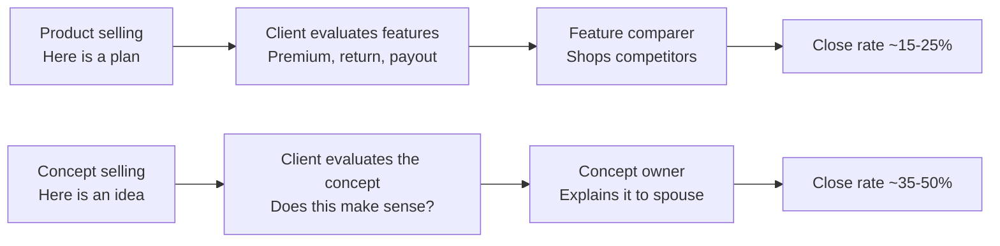

# Day 54 — Concept Selling

> **The one idea for today:** Product selling says "here's a plan — want to buy it?" Concept selling says "here's an idea — here's how it plays out — here's the plan that delivers it." One produces sales. The other produces long-term clients who understand what they own and why.

## What you'll walk away with

By the end of today you should be able to:

1. **Distinguish** concept selling from product selling.
2. **Structure** three common concept frames (Gen3 vs Property, Smart Growth vs Bank Deposits, Life Insurance as an Asset).
3. **Deliver** a concept in under 5 minutes that connects a specific product to a specific client outcome.

---

## 1. Concept selling vs product selling

### Product selling
- "Here's a plan. It returns X% p.a. projected. The premium is $Y/month."
- The client evaluates **features** — premium, return, payout.
- The client becomes a **feature comparer**: they'll ask competitors to quote similar.
- Conversion rate: ~15–25%.

### Concept selling
- "Here's a way to build [outcome]. I'll walk you through how it works — then the specific plan that delivers it."
- The client evaluates **the idea** — does the concept make sense?
- The client becomes a **concept owner**: they'll explain it to their spouse, their friends.
- Conversion rate: ~35–50%.

**The shift:** you're not selling a product. You're selling a **way of thinking about money** that the product happens to solve.

## 2. Why concept selling works

1. **Clients remember concepts.** They forget product names.
2. **Concepts transfer.** A client who owns a concept can explain it to their spouse. Their spouse is more likely to approve. (Referrals work the same way.)
3. **Concepts reduce competitor shopping.** A feature comparison invites other quotes. A concept says "this idea, from this advisor, matters."
4. **Concepts survive price changes.** If premiums change, the concept still holds. The recommendation just adjusts.

## 3. Concept 1 — The Non-Property Alternative

**The concept:** a participating whole-life plan with coupons can mimic the cash flow of a rental property — without the complexity, illiquidity, and risk.

**Who it's for:** clients who say "I want to invest in property for passive income" but may not be ready for the complexity.

**The 5-minute frame:**

### The hook (30 sec)
> "You mentioned you want to eventually have passive income streams. Have you considered property?"
> *"I have — but it's a lot of capital and complexity."*

### The comparison (2 min)
> "Let me show you how a structured plan compares to buying property for rental income. Both are legitimate paths. They have very different profiles."

|  | Property | Participating plan (with coupons) |
|---|---|---|
| Time to "own" | 20–30 years to pay off mortgage | Fully paid in 10 years |
| Initial capital | High deposit (20%+), stamp duty, legal fees | Low — monthly premium only |
| Loan interest | Paying bank interest on mortgage | No loan |
| Income stream | Rental (subject to tenants, vacancy, repairs) | Guaranteed coupons (when declared) |
| Taxation | Rental income taxable | Coupons typically not taxable |
| Liquidity | Very illiquid (months to sell) | More liquid (surrender value) |
| Passing on to family | Must sell or pass property (legal process) | Immediate estate upon death |
| Maintenance | Ongoing tax, repairs, property management | None |
| Capital appreciation | Market-driven (volatile) | Non-guaranteed bonus declarations |

### The positioning (1.5 min)
> "This isn't to say one is better. Property has real upside — leverage, asset appreciation, physical value. But if your goal is *income stream* without taking on the complexity of property management, a participating plan gets you similar cash flow with far less friction.
>
> The best clients often do **both** — property when they have the capital and discipline, plans when they don't but want the income stream anyway."

### The close (1 min)
> "Here's a plan that would give you roughly $[X]/year in coupons once it matures. To compare: a rental property in that range would need roughly $[Y] in capital and $[Z] in mortgage — and you'd have to manage tenants. Want me to show you the specifics?"

## 4. Concept 2 — The Bank Deposit Alternative

**The concept:** a systematic savings plan with a small insurance component beats a bank deposit on almost every dimension — yield, estate transfer, compounding, discipline.

**Who it's for:** clients with savings sitting in a bank account earning minimal interest.

**The 5-minute frame:**

### The hook (30 sec)
> "Earlier you mentioned you have about $[X] in savings. Roughly what's that earning — a standard savings rate?"
> *"Yeah, maybe 0.5–1%."*

### The comparison (2 min)

|  | Bank deposit | Systematic savings plan |
|---|---|---|
| Death benefit | None — money passes through estate process | Immediate estate benefit upon death |
| Estate transfer | Probate process required (months, costs) | Direct to beneficiary (days) |
| Interest rate | ~0.5–1% | Projected ~3–4% p.a. (non-guaranteed) |
| Discipline | Withdrawable anytime | Structured period, encourages consistency |
| Compounding | Weak (very low rate) | Stronger (higher rate + discipline) |
| Inflation protection | Losing to inflation | Roughly keeping pace or better |

### The positioning (1.5 min)
> "This isn't about getting rid of your bank account. You need that for immediate access. It's about **separating short-term cash from medium-to-long-term savings.**
>
> The cash that sits in your bank for years earning 0.5% is silently losing purchasing power. Moving some of that into a plan with 3–4% projected returns, with insurance benefits attached, closes that gap."

### The close (1 min)
> "If you moved $[X] of your idle savings into a 10–12 year plan, you'd likely end up with $[Y] vs $[Z] — a difference of $[Y−Z]. Plus the insurance benefit throughout. Want to see what that looks like specifically?"

## 5. Concept 3 — Life Insurance as a Family Asset

**The concept:** a well-structured whole-life or term plan is not a "cost" — it's the single most leveraged asset you can create for your family.

**Who it's for:** family breadwinners, parents with young kids, sole earners.

**The 5-minute frame:**

### The hook (30 sec)
> "If I asked you to list your biggest assets for your family — house, savings, CPF, investments — where would insurance rank?"
> *"Honestly, not high. Maybe after everything else."*

### The reframe (2 min)
> "Here's what's counterintuitive. A $500,000 life insurance policy, with a $500/month premium — what's your family's return if you passed away in Year 2?
>
> $500/month × 24 months = $12,000 in premiums paid.
> Payout = $500,000.
>
> That's a **40× multiplier.** No other financial instrument produces that kind of leverage. Not stocks, not property, not savings plans.
>
> This is why life insurance, when properly sized, is the single most leveraged family asset a working parent can create."

### The use cases (1.5 min)
> "This leverage matters in real scenarios:
>
> - **Sudden death of breadwinner**: the payout covers years of family expenses, kids' education, mortgage.
> - **Business owner**: the payout funds business continuity or equalisation among heirs.
> - **Estate planning**: the payout provides liquid cash to cover estate duties, business valuations, or legal costs.
>
> None of these can be solved by savings alone — they require the insurance leverage."

### The close (1 min)
> "For your situation — [spouse], two kids, mortgage, parents — a properly sized life cover would be $[X]. Let me show you how that structures."

## 6. Your full advisor toolkit — 9 planning solutions

The three concepts above are the most common. But your real toolkit is broader. Every client walks in with a life stage and a concern — your job is to have a planning angle for every one of them.

Keep this table open when you're preparing for a meeting. The right concept is usually the one that matches their current life moment.

  
— client life moment → the right concept —

  

    

i.

Basic Financial Planning

Any first meeting

    

ii.

Wedding Budgeting

Engaged / married

    

iii.

Home Budgeting · BTO

Buying first property

    

iv.

Baby Planning

Pregnant / new parent

    

v.

Wealth Building · CPF

Working adult

    

vi.

Tax Savings

Taxable income

    

vii.

Investments

Savings earning nothing

    

viii.

One Retirement

Mid-career check-in

    

ix.

GoalsMapper

Wants full picture

  

| # | Solution | Client trigger | What you cover |
|---|---|---|---|
| 1 | **Basic Financial Planning** | Any first-time meeting | How much to cover, why risk management comes first, simple budgeting, loan management |
| 2 | **Wedding Budgeting** | Engaged / recently married | Setting aside for the wedding *and* locking in financial planning in the same window |
| 3 | **Home Budgeting (BTO / Property)** | Applying for BTO or upgrading | Good-debt concept, leveraging the housing loan to grow the first property asset |
| 4 | **Baby Planning** | Pregnant / recent parent | Prenatal, delivery, diapering, education planning, reviewing the parent's existing coverage |
| 5 | **Wealth Building — CPF** | Working adult with CPF balance | Building wealth through CPF, maximising the resources already in their account |
| 6 | **Tax Savings** | Taxable income, wants to reduce | CPF top-ups, SRS contributions, the retirement angle these unlock |
| 7 | **Investments** | Saving but earning nothing | Basic investment knowledge so they can make informed calls |
| 8 | **"One Retirement"** | Mid-career, wondering if they're on track | Putting the entire portfolio together to determine comfortable retirement on ~20% of the capital most people assume they need |
| 9 | **GoalsMapper / timeline simulation** | Wants to see the big picture | Charting the full financial timeline, stress-testing scenarios to see if the portfolio holds |

**This list is not exhaustive** — and it's not product-specific. It's a set of planning *conversations.* The product comes after you've established which conversation the client actually needs.

**Rule of thumb:** by Month 6 you should be able to walk any prospect through any of these 9 in 5 minutes flat. Until then, over-prepare before each meeting.

## 7. Building your own concepts

The three concepts above are starting points. Build your own library of 8–10 concepts over time. Each one:

1. **Solves a specific client confusion** ("I should buy property," "bank is safe," "insurance is a cost").
2. **Uses a comparison the client can evaluate** (property vs plan, bank vs plan, cost vs leverage).
3. **Connects to a specific product you can recommend** (otherwise it's just a lecture).

**Rule:** every concept must end with a recommendation path. Concepts without product tie-ins are wasted time.

## 8. When NOT to concept-sell

Not every meeting needs concept selling.

**Skip concept selling when:**
- The client already has a clear, well-informed preference.
- You've only got 20 minutes (concepts need 5+ min).
- The client is high-C (Day 46) — they prefer data to frames.
- The concept is so basic the client would find it patronising.

**Always concept-sell when:**
- The client has a misconception you need to correct gently.
- The recommendation involves a non-obvious product structure.
- The client is comparison-shopping (concepts beat feature-comparison).
- You want a referral-quality client (someone who can explain their plan to others).

## 9. The concept → product handoff

A clean concept close transitions into product specifics:

> "[Concept explanation ends.] So that's the idea. Now let me show you the specific plan that delivers it. [Hand over illustration / propose structure.]"

**Don't:**
- Over-explain the concept after they "get it."
- Jump into product without the concept landing first.
- Mix concept and product mid-explanation (confusing).

Clean handoff = clean decision.

## Quick quiz

1. **Concept selling is different from product selling because:**
   - A) It's faster
   - B) It sells an idea that the product solves, producing concept-owning clients ✓
   - C) It skips products entirely
   - D) It uses more data

   **Why:** Concept selling installs a way of thinking about money — the product is introduced as the tool that delivers the concept, not as the centrepiece of the pitch. This produces clients who own the idea and can explain it to their spouse or refer it to others. Product selling focuses on features and invites comparison-shopping; it is not faster (A) in terms of close rate (15–25% vs 35–50%). Concept selling does not skip products (C) — every concept must end with a recommendation path. It does not inherently require more data (D).

2. **The comparison in Concept 2 (bank deposit alternative) exposes:**
   - A) Banks are bad
   - B) The opportunity cost of idle cash in low-interest accounts ✓
   - C) Banks are going broke
   - D) All savings should be in plans

   **Why:** Concept 2 highlights that cash sitting in a bank at 0.5–1% is silently losing purchasing power to inflation, and that a systematic savings plan with a small insurance component typically delivers 3–4% projected returns plus estate-transfer benefits. The concept is not anti-bank (A, C) — the positioning explicitly says the bank account should be kept for immediate access. The conclusion is also not that all savings should move into plans (D), but that idle medium-to-long-term savings should.

3. **When you should NOT concept-sell:**
   - A) Client is confused
   - B) Meeting is 20 min, client is high-C, or concept is too basic ✓
   - C) Client asks too many questions
   - D) Never — always concept-sell

   **Why:** Concept selling is not appropriate when time is insufficient (concepts need 5+ minutes), when the client is a high-C personality who prefers data and structure over frames, or when the concept is so basic the client would find it patronising. A confused client (A) actually benefits from a well-delivered concept. Too many questions (C) indicate engagement, not a reason to avoid concept selling. Always concept-selling (D) ignores situations where the client already has a clear, well-informed preference.

4. **A client says "I want to buy a second property for rental income." Which concept frame is most relevant?**
   - A) Life Insurance as a Family Asset — leverage is the key theme
   - B) The Bank Deposit Alternative — idle savings are the real problem
   - C) The Non-Property Alternative — a participating plan can deliver similar income streams with less friction ✓
   - D) The CPF Wealth concept — maximise existing government resources first

   **Why:** The Non-Property Alternative is specifically designed for clients who want passive income from property but may not be ready for the complexity — it directly addresses the same goal (income streams) with a different vehicle (participating plan). Life Insurance as a Family Asset (A) addresses leverage and estate, not income streams. The Bank Deposit Alternative (B) targets idle low-interest cash. The CPF Wealth concept (D) is about a different planning angle entirely.

5. **After walking through the Bank Deposit Alternative, the client understands the concept but asks for a competitor quote. What does this most likely indicate?**
   - A) The concept landed well and they're engaged
   - B) The concept frame did not fully install — they are still in feature-comparison mode ✓
   - C) They are a high-D personality who likes options
   - D) You need to present a better yield projection

   **Why:** One of the stated benefits of concept selling is that it reduces competitor shopping because the client evaluates the idea, not the features. If the client is still asking for competitor quotes after a concept delivery, the frame has not fully installed — they are still comparing products rather than owning the concept. This is a signal to revisit the concept using more of their personal numbers, not to improve yield projections (D) or default to a personality explanation (C).

6. **What is the key difference between a concept client and a product client?**
   - A) A concept client is wealthier and requires a more sophisticated approach
   - B) A concept client owns the idea and can explain their plan to others; a product client compares features and shops around ✓
   - C) A concept client buys more products
   - D) A product client needs a follow-up meeting; a concept client decides on the spot

   **Why:** A concept client can articulate why they have what they have — they own the frame, not just the product. That makes them referral-quality clients who bring in others who've heard the explanation. Wealth level (A) is irrelevant to concept vs product distinction. Buying more products (C) may be a downstream effect but is not the defining difference. Decision speed (D) is not a reliable differentiator — concept selling affects conviction, not necessarily meeting count.

7. **You are preparing for a meeting with a newly married couple who are applying for a BTO. Which of the 9 planning solutions is the best starting concept?**
   - A) "One Retirement" — put their whole portfolio together
   - B) Investments — they need to start growing wealth early
   - C) Home Budgeting (BTO/Property) — matches their current life moment ✓
   - D) Tax Savings — CPF top-ups and SRS are the highest-leverage entry point

   **Why:** The rule of thumb is that the right concept matches the client's current life moment — and a couple actively applying for a BTO is squarely in a home-budgeting conversation. Home Budgeting (BTO/Property) covers the good-debt concept and leveraging the housing loan, which is immediately relevant and actionable. Retirement (A) and investments (B) are important but premature given where the clients are emotionally and financially right now. Tax savings (D) may be relevant later but is not the natural entry point for this life stage.

---

## Related

- Previous: [[day-53|Day 53 — CST: The Risks Angle]]
- Next: [[../week-10/day-55|Day 55 — AIA Solutions Overview Part 1]]
- Week 9 summary: [[README|Week 9 — Uncovering Needs & Sales Concepts]]
