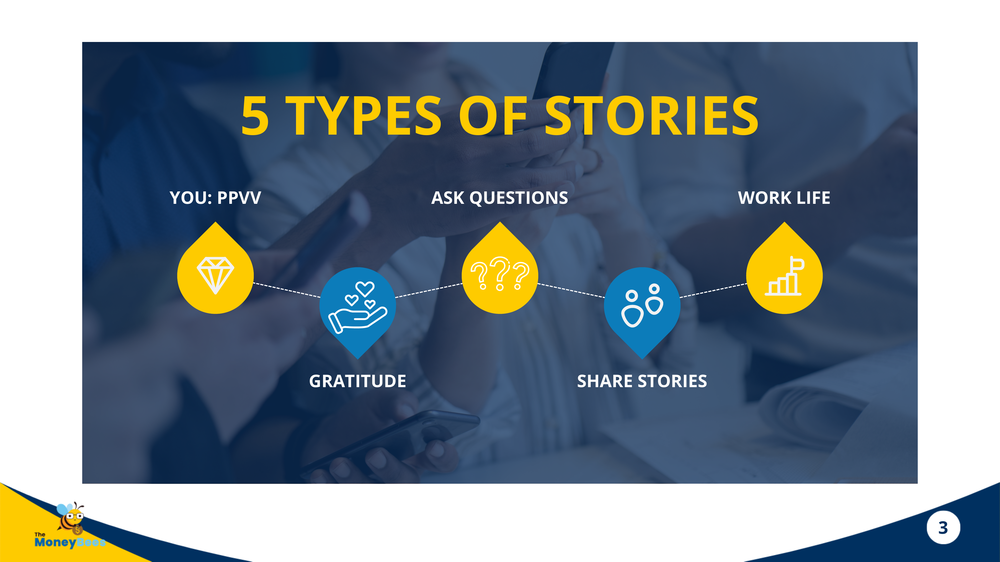

# Instagram Profile & Stories — The Warm-Prospecting Playbook

> **Companion file:** [[instagram-selling-secrets-eric-feng]] owns IG **strategy** (positioning, growth math, content types, DM funnel, 6-story story-sell structure). This file owns IG **execution** (profile anatomy, PPVV, 5 story types, weekly calendar). Read Feng first for the *why*, this one for the *what to post today*.

> **Core thesis:** *There is no secret ingredient.* To win on IG — **be interesting** and **be interested**. That's the whole game.

---

## Part 1 — Anatomy of the Instagram Profile

### The 6 Elements

| Element | Purpose | Do | Don't |
|---|---|---|---|
| **Profile Picture** | Easy for people to recognise | Professional faceshot / candid. Smile visible. Brand colour background. Use pfpmaker.com. | Cartoon picture or anything people can't identify you with |
| **Profile Name** | What others type when searching you — must be memorable | If username taken, add "real" or "official" (e.g., `TheRealJunHong`) | Symbols/numbers (`Bentotheright@9123`), repeated letters (`Bentotherighttttt`), too long |
| **Category** | Labelling | Insurance agent / Financial service / Public figure | Anything irrelevant (blogshop, website, stripper) |
| **Bio** | Summary of what you do + how great you are | See structure below | Leave empty; generic one-liners that look the same as everybody's |
| **Link** | CTA for interested viewers | Telegram channel (nurturing machine) / YouTube / lead-magnet download | Junk links with no value / intent |
| **Location** | Contact discovery | Optional, good to have | — |

### Bio Structure

**Why You Should Follow Me:**
- Best credentials
- Helped *[xxx]* people (e.g., "Made 28 claims in 2021. 89 clients protected. $3.5M AUM to date")
- Achievement no one / few has
- Biggest, longest, fastest, etc.

**What Results You Can Get:**
- Promise / framework (e.g., *"I help millennials get $2,000/month passive income without spending more than 5 mins a week"*)

**How You Can Get It:**
- Call-to-action (*"Click the link below to access my free sources to kickstart your passive income"*)

---

## Part 2 — Instagram Stories Strategy

### The Two Commandments

1. **Be Interesting** — tell your story so people *want* to watch.
2. **Be Interested** — ask questions, listen, follow back, engage.

### The PPVV Framework — *Tell Us About You*

| Letter | What to share |
|---|---|
| **P**assion | Your interests |
| **P**ain | Your challenges |
| **V**alues | What you care about |
| **V**ision | Your goals (and progress) |

### 8 Emotional Story Types

Share stories that hit one of these emotional registers:

> **Surprising · Funny · Frustrating · Upsetting/Sad · Happy · Inspiring · Embarrassing · Grateful**

For each: **(1) Tell what happened (pic/video) · (2) Make it interactive · (3) Share lessons.**

### 4 Pillars of *Documenting Your Work*

| Pillar | What to post |
|---|---|
| **Useful** | Teach something |
| **Funny** | Interesting stories at work |
| **Relatable** | Who you get to work with / your struggles |
| **Inspiring** | Your wins or testimonials |

### Ask Your Followers a Question

Use IG's native **Questions** sticker. Perfect way to get to know followers *and* condition them to interact with you. *(Source deck embeds a screenshot showing the Questions sticker location in the IG sticker tray — page 26 of the deck.)*

---

## Part 3 — The 5 Types of Stories

| # | Type | Description |
|---|---|---|
| 1 | **YOU: PPVV** | Passion / Pain / Values / Vision content |
| 2 | **Gratitude** | Thank-yous, compliments, wins, losses, lessons, self-gratitude |
| 3 | **Ask Questions** | Use the Questions / Poll sticker |
| 4 | **Share Stories** | 8 emotional registers above |
| 5 | **Work Life** | BTS (behind the scenes), teach, people you work with |

---

## Part 4 — Weekly Stories Calendar (7-Day Plan)

*(Credit: Eric Feng, 2020 — included in source deck)*

| Day | Story 1 | Story 2 | Story 3 |
|---|---|---|---|
| **Mon** | Gratitude — Person | Work Life — BTS/Teach | Story |
| **Tue** | Ask Qn *(Story-Sell Poll)* | YOU — Pain | Gratitude — Experience *(Story-Sell)* |
| **Wed** | Gratitude — Compliment *(Story-Sell Poll)* | Work Life — BTS/Teach | Story *(Story-Sell)* |
| **Thu** | Ask Qn *(Story-Sell Poll)* | YOU — Passion | Gratitude — Loss *(Story-Sell)* |
| **Fri** | Gratitude — Win *(Story-Sell Poll)* | Work Life — BTS/Teach | Story *(Story-Sell)* |
| **Sat** | Ask Qn *(Story-Sell Poll)* | Work Life — People | Gratitude — Lesson *(Story-Sell)* |
| **Sun** | Gratitude — Self | YOU — Value | YOU — Vision |

**Pattern:** Gratitude / Ask-Qn / Work-Life / YOU-PPVV rotate daily. Story-sell (soft sell) slots are embedded in Tue–Sat.

---

## Part 5 — Story Selling Structure

Before the pitch, plant **3 Seeds**:
1. **Who you can help**
2. **What problem you can solve**
3. **You are in demand**

Then the pitch arc (6 stickers, one per story slide):

1. **Problem** — who has it
2. **Consequences** — of not solving it
3. **One-sentence solution**
4. **Benefit**
5. **Testimonial**
6. **CTA**

Positioning support (3 stickers alongside):
- *Who you can help*
- *Advanced designs* (your edge)
- *Affordable price*

---

## Reflection prompt

Open IG. For each of the 6 profile elements, score yourself 1–5 against the Do column. Rewrite whichever scored lowest tonight.

**Teaching angle:** IG-native counterpart to [[content-multiplier-rsp-method]] — RSP = feed; this file = Stories. Story-selling only introduced *after* 4+ weeks of non-sales stories have built trust; the 3 seeds must be planted first.
