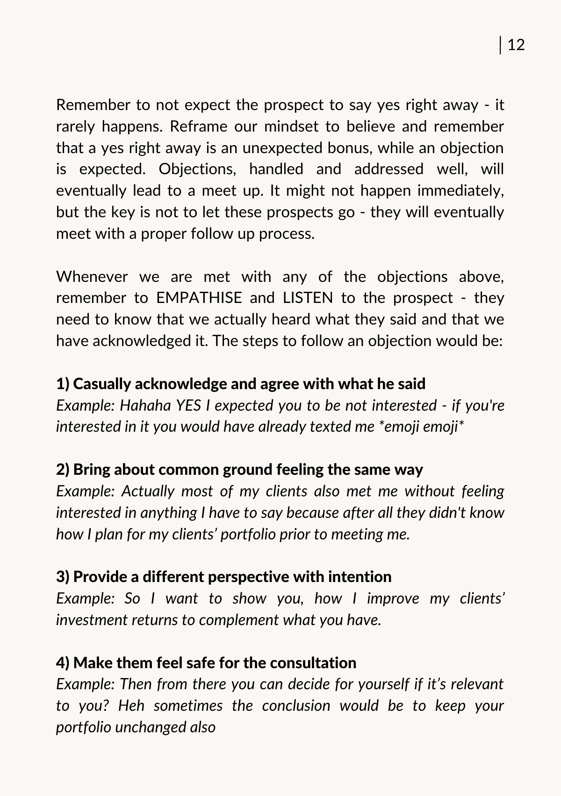
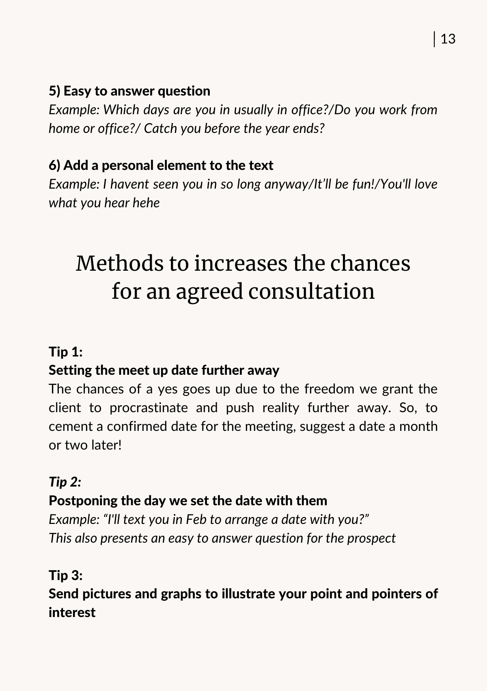
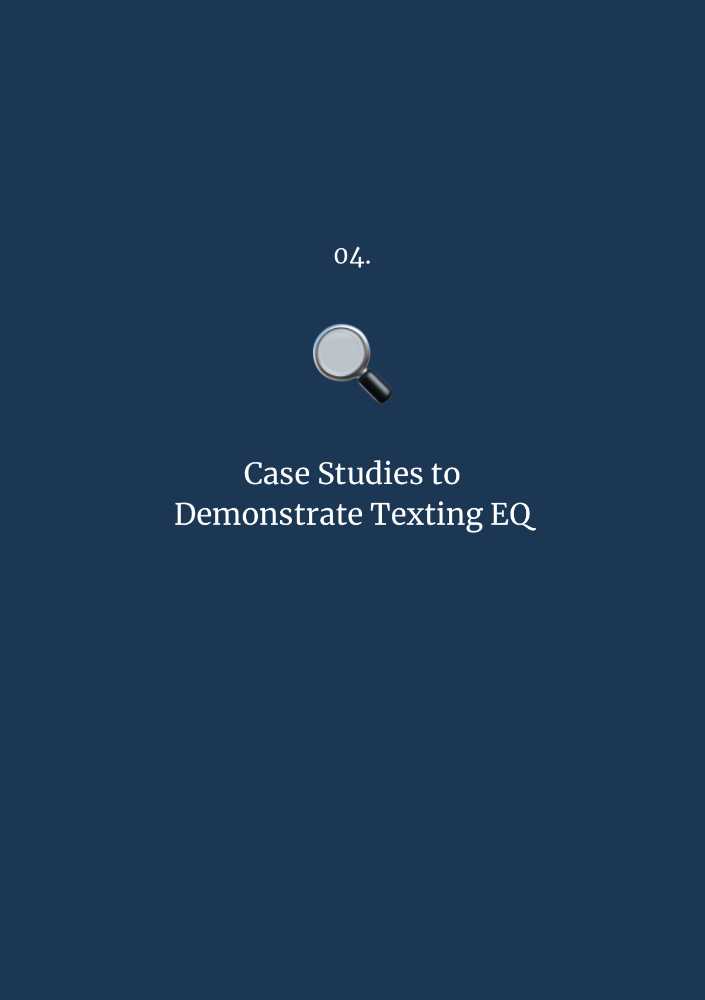
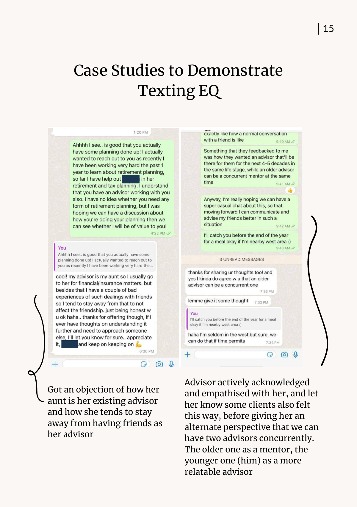
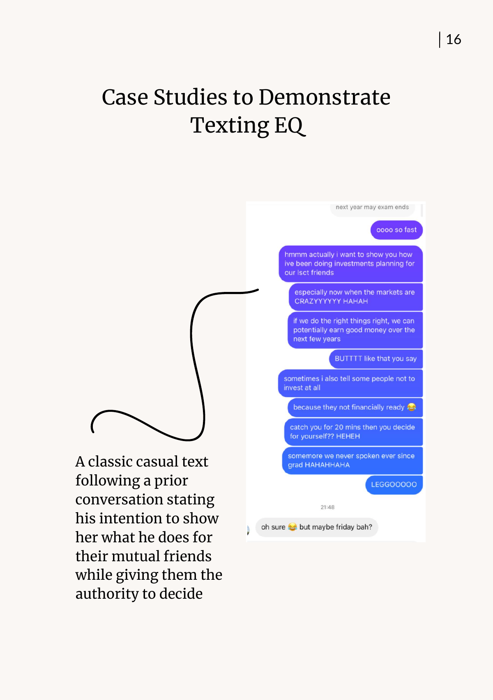

# Texting EQ — Warm Client Acquisition via Text

> **Core thesis:** Scripts don't work for warm market — they sound inauthentic. What works is a **flow with rules**, so advisors stay themselves while staying effective.

> Texting EQ = Emotional Quotient applied to prospecting. Serve first. "The rare individual who unselfishly tries to serve others has an enormous advantage. He has little competition." — Dale Carnegie

---

## Part 1 — The 11 Texting Rules

| # | Rule | Key Example |
|---|---|---|
| 1 | **Link back to the previous conversation** — no random openers | *"Hey bro, the other time you were saying you work in Tanjong Pagar right? Where exactly?"* |
| 2 | **Every text creates more reason to meet** | *"I've been wanting to show you how I helped clients increase returns on their existing portfolio."* |
| 3 | **End every text with an easy-to-answer question** | *"Are you working from home or office?"* |
| 4 | **Make them feel SAFE about the consult** | *"Sometimes I advise people not to invest at all if there's no need — when we meet you can decide for yourself."* |
| 5 | **Common ground that keeps the convo going** | *"Some of my clients are doctors too — I help them because of long hours."* |
| 6 | **Actively follow up** (90% don't reply first time) | Bump by name: *"Hi Sarah!"* |
| 7 | **Reply quickly** — within 3–4 hours. Shows reliability. | — |
| 8 | **Be casual — no jargon, no "optimisation"**. Use emojis/"hahaha" if that's you. | — |
| 9 | **Warm up with 2–3 touchpoints before the approach** | Familiarity → higher reply ratio |
| 10 | **Never use "free"** — nobody is "free". Use 30-min specifics. | *"When's a better time for a 30-min call — Thu or Fri?"* |
| 11 | **Minimise thinking on the CTA — give 2 options** | *"I have 10 Jan 6pm or 23 Jan 8pm — which works?"* |

---

## Part 2 — Turning Objections into Opportunities

### The 9 Predictable Objections

1. *"Thanks bro, but I'm not interested."*
2. *"Cool! If I need it I'll let you know."*
3. *"Thank you, I have an advisor already."*
4. *"It's ok, thank you."*
5. *"I'm good, thank you."*
6. *"I just did a review with my advisor."*
7. *"Not looking to invest right now."*
8. *"Not looking to get any products now."*
9. *"Getting married / buying house soon — bad time."*

> **Reframe:** A yes is the unexpected bonus. An objection is expected. Don't lose them — follow up properly and most convert eventually.

### The 6-Step Objection Response

| Step | Intent | Example |
|---|---|---|
| 1. Acknowledge & agree casually | Validate feelings | *"Hahaha YES I expected that — if you were interested you'd have texted me first 😄"* |
| 2. Common ground | "My clients felt the same" | *"Most of my clients also met me without interest — they just didn't know how I plan portfolios yet."* |
| 3. Different perspective (with intent) | Show value | *"I want to show you how I improve returns — to complement what you already have."* |
| 4. Make them feel safe | Remove pressure | *"You can decide if it's relevant to you. Sometimes the conclusion is to keep your portfolio unchanged."* |
| 5. Easy-to-answer question | Lower friction | *"Which days are you usually in office?"* |
| 6. Personal element | Warmth | *"Haven't seen you in so long anyway — it'll be fun!"* |

### 3 Methods to Increase the "Yes" Odds

1. **Set meet-up date further out** — freedom to procrastinate = more likely to commit. Suggest 1–2 months ahead.
2. **Postpone the *scheduling* itself** — *"I'll text you in Feb to arrange a date?"* (easy-to-answer + buys time)
3. **Send pictures/graphs** to illustrate your point — visual > wall of text.

---

## Part 3 — Case Studies

### Case 1 — Prospect already has aunt as advisor
**Technique:** Acknowledge + empathise → reframe as *"older advisor = mentor, younger advisor (me) = relatable peer; you can have both."*

### Case 2 — Casual text to a mutual-friend contact
**Technique:** Reference prior convo, show authority to decide (*"sometimes I tell people not to invest at all"*), 20-min low-commit ask, humour.

### Case 3 — *"Not now, maybe on long leave"*
**Technique:** Take scheduling back — *"Okay no worries, check in with you around November!"* Rights to set the next date stay with the advisor, not the prospect.

### Case 4 — Prospect forgot to reply multiple times
**Technique:** Curiosity hook (*"I just spent an hour studying your case"*), fresh reason (*"having second thoughts on whether you should invest"*), personal warmth (*"Happy Nov ❤️"*), easy CTA.

### Case 5 — Reprospecting someone who rejected years ago
**Technique:** Humility-first (*"I was a noob back then, good thing you rejected"*), deferred ask (*"after your wedding"*), permission-lowered close → *"Sure! But no pressure 😅"*

**Pattern across all 5:** empathy → lowered stakes → prospect feels in control → soft yes.

---

## Part 4 — Extra Pointers

1. **Keep an Excel follow-up ledger** — every name that crosses your mind goes in. Names you'd want to reapproach. You'll never run out of pipeline.
2. **Split long texts into chunks** — 3 short bubbles feel casual; one wall of text feels scripted.
3. **Never open cold with *"How are you?"*** — it's too deliberate, raises suspicion. Open with something specific: *"Hey XX, still at Singtel?"*
4. **Have fun.** Laugh off bad replies. Show confidence through the text itself.

---

## Bonus Chapter — Daniel Heng (2× COT, 6× MDRT in 2 years): *Falling in Love with Prospecting*

**First 2 months:** $730 and $2,500 FYC. COT needed $13,500/month.

**The shift:** Read Brian Tracy's *Eat That Frog* — 3 key areas = opening, closing, **prospecting**. Realised he had to *love* prospecting or he'd burn out.

**His rule:** The things I hate when FAs do them to me (long texts, hidden agenda) — I don't do. The things I'd appreciate (touchpoints first, honesty, humour) — I do.

### Daniel's Hook-Based Openers

| Life stage | Opener | Where it leads |
|---|---|---|
| Working young | *"Btw have you started investing?"* | *"How about I give you a crash course?"* |
| Engaged couple | *"Are ya'll gonna BTO?"* | BTO planning + budgeting |
| Fresh grad | *"You graduated already?"* | *"Have you finished your investment and insurance planning?"* → *"Why not I show you what I do for my other clients?"* |

### Handling Ghosts

- **Mid-convo ghost:** *"Eh bro, don't ignore me leh HAHA don't like FA just say…"* → usually gets *"Paiseh bro HAHA damn busy with work"* → *"Me too, let's push it a few weeks"*
- **Full ghost:** Don't dwell. *"I've had plenty of people ghost me, but as of today I have 175 clients I love and serve — I can't remember the last person who ghosted me."*

### The core insight
> *"Prospecting is the ART of building relationships — deeply, sincerely, in an enjoyable way. Find your love for it and you become a MASTER at texting."*

---

**Teaching angle:** The **inside-the-chat-window** companion to phone Market Survey and the first-text template. Texting EQ covers what happens *after* the first reply — mid-convo rules, objection handling, calendar-control moves, ghost-rescue.

**Rule hierarchy — one thing to remember:**
> Every text → links back + creates reason to meet + ends with easy question.

**Reflection prompt:** *"Open your phone. Find a blue-ticked chat from the last 30 days. Draft a reply that (a) links back to what you last discussed, (b) creates fresh reason to meet, (c) ends with an easy question. Send it."*
