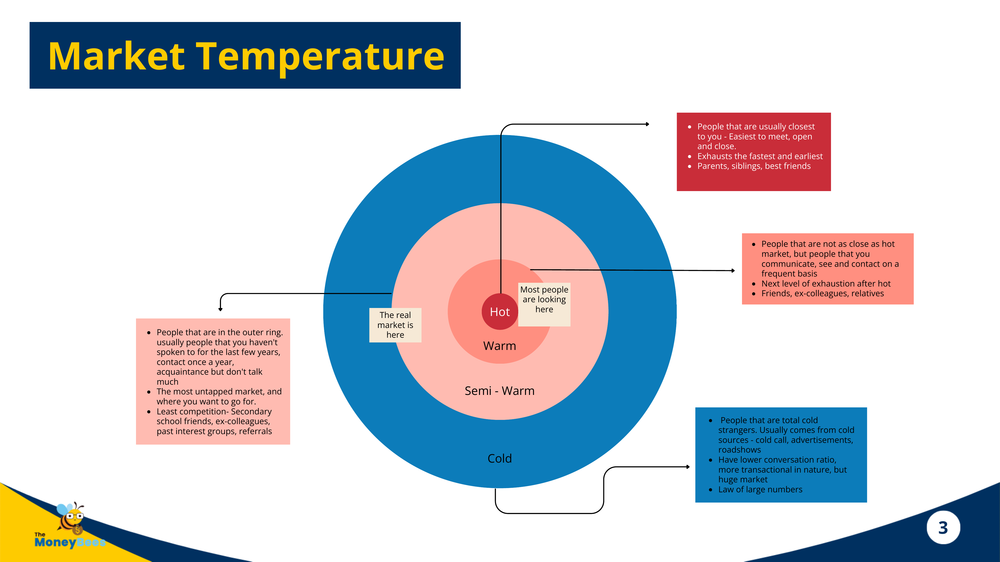

# Warm Prospecting Methodology — MoneyBees Framework

> The master taxonomy: *where* prospects sit, *what stage* an appointment is at, and *which activity* generates each outcome. Vocabulary layer for every prospecting lesson.
>
> **Canonical segmentation for this course.** [[warm-market-success]] uses a simpler Hot/Lukewarm/Cold model — defer to this 4-ring model; that file's unique contribution is the **3-year reality check** + **lukewarm = 66% of opportunity**.

---

## Part 1 — Market Temperature (Where Prospects Sit)

| Ring | Description | Examples | Characteristic |
|---|---|---|---|
| **Hot** (centre) | Closest to you — easiest to meet, open, close | Parents, siblings, best friends | Exhausts fastest & earliest |
| **Warm** | Not as close as hot; communicate / see on a frequent basis | Friends, ex-colleagues, relatives | Next to exhaust after hot. *"Most people are looking here."* |
| **Semi-Warm** (outer ring) | Haven't spoken to in years; contact once a year; acquaintances | Secondary school friends, ex-colleagues, past interest groups, referrals | **The real market.** Most untapped, least competition. |
| **Cold** | Total strangers from cold sources (cold call, ads, roadshows) | — | Lower conversion ratio, transactional, huge market. Law of large numbers. |

**Teaching point:** Advisors over-index on Hot + Warm, burn it fast, then panic. Semi-Warm is where long-term pipeline lives.

---

## Part 2 — The 8 Appointment Stages

Appointments fall into **Prospect stages** or **Client stages**:

### Prospect stages
| Stage | What it is | Objective |
|---|---|---|
| **Warm Up** | Warming relationships with acquaintances / dormant friends. No selling, no iPad, no presentations. Conversational only. | Educational Fact Find appointment |
| **Educational Fact Find** | Financial-planning-specific agenda. Prospect has expressed interest. Fact-find + press on problem/pain + educate. **Crux of the entire sales process.** | Empower + educate + lightbulb referrals |
| **Proposal** | Recommendation or proposal stage. Tests commitment (budget, personal particulars). | Signed engagement |
| **Follow Up** | Prospect rejects or says *"think about it"* — no conclusion. | Re-engage, eventually close |
| **Policy Review** (prospect) | Review before advancing sales process. Optional. | Context for proposal |
| **Closing** | Prospect converts to client. Impact referrals happen here. | Impact referrals |

### Client stages
| Stage | What it is | Objective |
|---|---|---|
| **Check-In** | Pure personal + financial check-in. Build deeper relationship. | Testimonials + advocacy referrals |
| **Policy Review** (client) | Review → usually leads to closing | Cross-sell / upsell |

**Teaching point:** Advisors often conflate stages and try to *sell at Warm Up*. Each stage has one job — respect it.

---

## Part 3 — Activity Appointment Matrix (How You Generate Each Stage)

Three strategies: **Active**, **Passive**, **Hybrid** — each maps to an appointment outcome.

### Active (you reach out)
| Activity | Description | Outcome |
|---|---|---|
| Cold Outreach \| FB / IG / LinkedIn | Reach prospects beyond your network | Educational Factfind |
| Warm Outreach \| FB / IG / LinkedIn | Semi-warm / 4–6th degree connections | Warm Up |
| Warm Outreach \| WhatsApp, Telegram, Text | Indirect-style ask to close friends / warm market | Warm Up |
| Offline Networking \| Gatherings / Events | Requires thick skin + conversational selling | Warm Up / Educational Factfind |
| Client \| Policy Review | Revisit clients to upsell / cross-sell | Policy Review |
| Active Referrals | Lightbulb / Trust / Advocacy referral asks during appointments | Leads |

### Passive (content pulls them in)
| Activity | Description | Outcome |
|---|---|---|
| Distributing Digital Assets \| Traffic Platforms | IG / FB / LinkedIn content to attract right prospects | Educational Factfind / Closing |
| Distributing Digital Assets \| Nurturing Machine | Telegram / FB Group / Email List / WA Broadcast | Educational Factfind / Closing |
| Client \| Check-In | Revisit clients for deeper relationship | Check-In |

### Hybrid (content + targeted outreach)
| Activity | Description | Outcome |
|---|---|---|
| Traffic Platforms \| Bridging Message | Distribute content + actively reach out to those on platform | Warm Up / Educational Factfind |
| Nurturing Machine \| Bridging Message | Same, via nurturing platform | Warm Up / Educational Factfind |

**Teaching point:** Passive alone = slow. Active alone = burns out. Hybrid = where top producers live.

---

## Part 4 — Attraction Prospecting Script (Natural Warm Market)

> **Warning:** Speak calmly as a friend, not a telemarketer. Treat it as another casual call.

### Greeting
> *"Hi <First name>! <Adviser> here! Good to talk now?"*
> Prospect: *"Sure, what's up?"*

### Opening
> *"Hey you know what, <First name>! We've known each other for a while but I realised I've never got the opportunity to update you on what I do. Do you know exactly what I do?"*
>
> Prospect: *"I thought you're in insurance or something right?"* *(smile, light chuckle)*
>
> *"Well, that's what most people thought. What I do is way more than just insurance. Over the years, I have great joy helping people, **including strangers referred to me**, to make better decisions in their finances, so they can achieve their goals with more certainty."*
>
> *"And frankly, you are the kind of friend I'd love to have as my client. Because I know you as someone responsible, someone who plans ahead, someone who appreciates good advice. Am I right?"*

### Prospect's Strengths + Punchline
> *<List their strengths>*
> *"Of course <First Name>, being friends doesn't mean we have to do business together — agree?"*
> *<pause for positive acknowledgment>*

### Fix the Meeting (With Assurance)
> *"If you're open, let's have a chat over coffee or lunch say… next week? End of the day, whether you choose to engage my services or not, it's entirely up to you. Fair?"*
> *<wait for reply>*
> *"Exactly! I believe you'll be pretty impressed with how different we are."* *<smile confidently>*

### Additional Pointers — Unique Benefit & Strong Reason to Meet (Why You, Why Now)

- *"I won't be surprised that over the years you probably already have worked with one or several insurance agents or bankers, and acquired some financial products along the way, right?"*
- *"In fact, that's the case for most clients prior to knowing us."*
- *"Do you know what makes us so different?"*
- *"What makes us special is — our work is strictly consultative and we only work for our clients' sole interest."*
- *"You'll know what I mean when you experience it yourself. I truly believe you'll be impressed."*
- *"Again, being friends doesn't mean we have to do business, correct? At the end of the day, whether you engage our services or not, we leave that entirely up to you. Is that fair?"*

**Pattern signature:**
greeting → honest opener about what I actually do → specific appreciation of prospect → *"friends ≠ business"* disarmer → assurance close → *why us* differentiator → repeat the disarmer

---

## Script-to-Map Index

Where each tactical script lives in the matrix:
- **Market Survey** ([[market-survey-warm-market]]) → Warm Up → Educational Factfind (Active, Warm Outreach)
- **Attraction script** (above) → Warm Up for closer warm market
- **Texting EQ** ([[texting-eq-warm-client]]) → Active, Warm Outreach via messaging
- **CRAB** ([[crab-framework-blue-ticks]]) → Follow-up stage rescue
- **Content Multiplier RSP** ([[content-multiplier-rsp-method]]) → Passive, Distributing Digital Assets

**Overlap note:** Deck pages 4–8 duplicate Market Survey script + objection handlers + ABCD promises — ingested only in [[market-survey-warm-market]] to avoid drift.

**Reflection prompt:** *"List 10 names from your phone. Place each in Hot / Warm / Semi-Warm / Cold. Pick which Activity (Active/Passive/Hybrid) and Appointment Stage you're targeting this week."*
