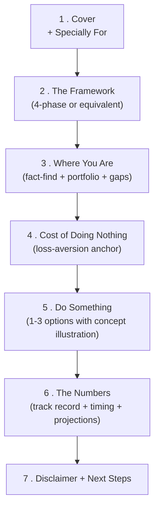

# Canonical Proposal Template — From Fact-Find to Close

> **The one idea:** A proposal is not a brochure. It is the **document the client signs to confirm a decision they already made during the meeting.** The structure exists to walk them from "I have an existing portfolio" to "I have a plan I'm comfortable executing." Every slide answers a specific question they already have - in the order they have it.

This template generalises the team's existing **Golden Retirement Planning Framework** structure into a profile-agnostic shape. The retirement-led version (in the [MDRT Team Proposals folder](https://drive.google.com/drive/folders/12SmS2FZItjznpgOZurZqpBXQxs12K28O)) is the reference; this template is the parent shape that fits retirement, protection, wealth, or mixed.

---

## The 7-section structure (in order)

The proposal has **7 sections, ~14-18 slides total.** Don't add more. Long proposals lose the room.

Why this order matters: **the framework comes before the data, and the gap comes before the recommendation.** Reverse either of those and the prospect feels sold-to instead of guided. The Do-Nothing slide must land before the Do-Something slide - loss aversion is ~2× stronger than gain orientation (see [Day 39 next-60-days - Pain-Before-Gain Framing](week-7/day-39.md)), so the loss has to be quantified first.

---

## Section 1 — Cover

**Slide 1: Title + Specially For**

- Title that names the *outcome* the proposal addresses, not the product.
  - Retirement-led: *"Retirement Planning Discussion Meeting"*
  - Protection-led: *"Family Protection Review"*
  - Wealth-led: *"Wealth Architecture Review"*
  - Mixed: *"Comprehensive Financial Review"*
- *"Specially For: [Client first name]"* - personalisation matters; never use "Mr./Mrs." in retail proposals (too formal, breaks rapport).
- Date in small text bottom-right.
- Your name + AIA branding bottom-centre.

**Slide 2: Agenda (optional but recommended)**

A 4-5 line agenda card. Sets expectations. *"Today we'll walk through: (1) where you are today, (2) what continuing on the current path costs, (3) two options that improve the outcome, (4) the math behind both. ~30 minutes."*

---

## Section 2 — The Framework

**Slide 3: The phased framework**

This is the **conceptual scaffold** the rest of the proposal hangs on. The team's retirement template uses a 4-phase Golden Retirement Planning Framework. The same shape works for any profile - just rename the phases.

| Phase | Generic name | Retirement-led | Protection-led | Wealth-led |
|---|---|---|---|---|
| 1 | **Readiness Assessment** | Retirement readiness + portfolio summary | Coverage adequacy + policy summary | Asset allocation review |
| 2 | **Optimisation Targets** | Identify redundant retirement assets | Identify coverage gaps | Identify drag (fees, fund quality, structure) |
| 3 | **Tailored Strategy** | Recommendations balancing risk + income | Recommendations matching life stage | Recommendations on fund + structure |
| 4 | **Execution + Review** | Execute if comfortable, review yearly | Execute if comfortable, review yearly | Execute if comfortable, review yearly |

**Visual:** 4 numbered cards left-to-right, with phase 1+2 grouped as "Diagnose" and phase 3+4 grouped as "Optimise." This grouping is what the team's retirement template does (Phase 1 + Phase 2 labels at the bottom).

---

## Section 3 — Where You Are (the diagnosis)

**Slide 4: Fact-find recap (FORM)**

Drawn from the meeting notes. 4-quadrant card or simple table.

| F (Family) | O (Occupation) | R (Recreation) | M (Money) |
|---|---|---|---|
| 2 kids (5, 8), wife works part-time | SaaS sales, $180K/year, target $250K by 35 | Triathlon (active), travel | $80K savings, no investment plan, $400K mortgage |

This slide signals **"I listened."** It's a credibility multiplier - the client sees their own life in the deck before any recommendation.

**Slide 5: Existing portfolio summary**

The single most powerful slide in any proposal. Mirror of the [Policy Summary deliverable](../first-60-days/week-10/day-58.md#6-the-policy-snapshot-deliverable) from Day 58. A clean table:

| Plan | Insurer | Type | Sum Assured | Premium | Riders | Notes |
|---|---|---|---:|---:|---|---|
| AIA Pro Lifetime | AIA | ILP whole-life | $300K | $600/mo | CI rider | Started 2018, $42K cash value |
| AIA Solitaire PA | AIA | Personal Accident | $750K | $33/mo | - | - |
| HSGM Standard | AIA | Hospital | Standard tier | $0 (Medisave) | No rider | Out-of-pocket exposure on each claim |
| **Totals** | | | **$1.05M cover** | **$633/mo** | | |

Clients have **never** seen this consolidated view before. It IS the trust moment.

**Slide 6: Gap analysis vs benchmarks**

Side-by-side: what they have vs what their profile needs.

| Coverage type | Benchmark for $180K income | Current | Gap |
|---|---:|---:|---:|
| Death / TPD | 10× income = $1.8M | $300K | **−$1.5M** |
| Major CI | 5× income + $100K = $1M | $0 | **−$1M** |
| Hospital (private) | Max tier + rider | Standard, no rider | $5K+ co-pay/claim |
| Disability income | 60-70% of income | $0 | Full income loss exposure |
| Wealth accumulation | Structured plan | $80K savings only | No engine |

Highlight gaps in red/amber. **The recommendations later answer specific gaps named here.** Clients only buy what they recognise as missing.

---

## Section 4 — Cost of Doing Nothing

**Slide 7: Quantified inaction cost**

This is the team's signature slide pattern - *"Do Nothing: $327K Depleted to pay Increasing Hospital Plan Payments in Retirement Years."*

The shape works for any pain:
- **Hospital inflation:** *"Cumulative hospital plan payments to 85 = $327K. Premiums escalate to $1,000+/month in retirement."*
- **Coverage gap:** *"If a major CI hits at 50, your family loses $1.5M of unfunded coverage during their highest-need decade."*
- **Wealth drag:** *"$80K sitting at 0.5% loses $14K of real value over 20 years to inflation."*
- **Tax inefficiency:** *"$5K/year in fund-level fees over 30 years = $640K in lost compounding."*

**Compute the number, name the time horizon, anchor with one line.** Don't decorate. The number IS the slide.

**Optional Slide 8: Visual chart**

A line/bar chart showing the trajectory of inaction. Cumulative cost over time. Anchor the 85-year-mark with the total.

---

## Section 5 — Do Something (the recommendation)

**Slide 9-10: 1-3 Options with concept illustration**

The team's retirement template uses **"Convert 100% of the Expense into an Income-Generating Asset"** vs **"Convert 2/3 of the Expense into an Income-Generating Asset."** Two options, presented as a binary - the prospect picks one.

**Always 2 options, never 1, never 4+.**

- 1 option = take-it-or-leave-it. Prospects leave.
- 2 options = a binary they have control over. Prospects pick.
- 3 options = paradox of choice. Prospects defer.
- 4+ = decision fatigue. Prospects "think about it."

The 2 options should differ on one axis:
- **Coverage axis:** more comprehensive vs more affordable
- **Risk axis:** higher growth vs more conservative
- **Capital deployment axis:** 100% vs 2/3 of available capital

**Concept illustration card** for each option:
- Premium / capital required
- Coverage or value at key milestones (5 yr, 10 yr, retirement, age 85)
- The "this is what changes" line in plain English

**Slide 11: Side-by-side comparison**

A table comparing the two options on the dimensions that matter to *this* client (drawn from FORM):

| Dimension | Option A (100%) | Option B (2/3) |
|---|---|---|
| Capital required | $327K | $218K |
| Income at 65 | $X/month | $0.67X/month |
| Bequest at 85 | $Y | $0.67Y |
| Cash flexibility | Lower | Higher |

The client picks. Always.

---

## Section 6 — The Numbers (substantiation)

**Slide 12: Concept Illustration — bequest vs dividends (or equivalent)**

For wealth/retirement proposals, the team's template uses *"You can withdraw dividends for as long as you live, whilst preserving the bequest value to be minimally the principal that you've deposited."* This is the one line that turns "is it worth it?" into "of course."

Profile-agnostic version:
- **Wealth:** dividend yield + bequest preservation
- **Protection:** premium-to-coverage ratio + permanent vs term tradeoff
- **Retirement:** income generation + capital flexibility

**Slide 13: Track record / data substantiation**

The team's template uses *"Annualised Dividend Yield ~7.09% since inception."* That's the credibility anchor - the prospect sees this isn't an untested concept.

For protection proposals: claim ratio data (e.g. *"AIA paid out $X in CI claims in Singapore in 2024"*).
For wealth: fund track record over 5+ years.
For retirement: dividend yield + payout history.

**Slide 14: Underlying instrument overview (1 slide max)**

Value proposition + underlying funds + fund positioning. Keep it concise - if it needs more than 1 slide, it belongs in an appendix, not the main flow.

**Slide 15: Timing rationale (optional, for wealth/retirement only)**

The team's template uses interest-rate-cycle timing for the Allianz Income and Growth Fund. Same shape works for:
- ILP entry timing based on market conditions
- Lock-in benefit timing (Vitality discount expiry, age-band increases)
- Limited-time bonus offers (with care - never manufacture urgency)

---

## Section 7 — Disclaimer + Next Steps

**Slide 16: Disclaimer**

The team's existing disclaimer is **already strong.** Reuse verbatim:

> *"All diagrams and charts included in this proposal serve illustrative purposes only. Actual results may differ based on the performance of the underlying assets in the selected funds. Fund performance is not guaranteed, and the policy's cash value may fall below the total premiums invested.*
>
> *For precise projections across various premium levels, please refer to the official policy illustration. All figures shown are rounded to the nearest dollar and do not reflect potential changes in net asset value (NAV). Investment management fees and product charges are estimated on a best-effort basis. Actual payable amounts may vary.*
>
> *Capital protection applies in the event of death or terminal illness. If the policy is in force, the insurer will pay the higher of 100% of total premiums paid or the account value.*
>
> *Past performance does not represent or predict future outcomes, and asset values may fluctuate with market conditions. Early withdrawals may result in charges. Please speak with a licensed financial advisor representative before making any financial decisions.*
>
> *Any observations, recommendations, or projections in this document reflect opinions only and should not be interpreted as financial advice. For the most accurate and up-to-date details, always consult the official product materials, websites, and contract documents.*
>
> *This document is private and confidential. It is intended solely for the recipient and may not be copied, distributed, reproduced, or shared with any third party, in whole or in part."*

**Slide 17: Thank you + next steps + contact**

- *"Thank you!"* (heading)
- **Next steps** (3-5 short bullets)
  - *Relationship comes first*
  - *Review once a year*
  - *[Specific next action] — e.g. "Submit application within 14 days for the Vitality 15% discount lock-in"*
- **Contact card:** name + LinkedIn + mobile + email (all on one line each)

---

## Slide design rules (style guide)

These are non-negotiable defaults. Override only with reason.

1. **One idea per slide.** If a slide has two ideas, split it.
2. **Numbers > paragraphs.** If a slide has more than 80 words, it's a script, not a slide.
3. **The headline is the conclusion, not the topic.** Bad: "Hospital Plan Inflation." Good: "Doing nothing costs $327K to age 85."
4. **Charts beat tables, tables beat paragraphs, paragraphs beat slides at all.** When in doubt, simplify down a level.
5. **Two-colour accent maximum.** AIA red + one neutral. No rainbow.
6. **No stock photos of "happy retirees."** Either use the client's own data or skip the image.
7. **Every dollar figure cites its source** (your projection, illustration ID, or external reference link).

---

## Profile-specific cheat sheet

| Client profile | Section emphasis | Hero slide | Cost-of-inaction angle |
|---|---|---|---|
| **Pre-retiree (50-65)** | Sections 4 + 5 | Cumulative cost of hospital inflation | $X depleted to pay rising hospital premiums |
| **Young professional (28-38)** | Sections 3 + 5 | Coverage gap matrix | Family income exposure if CI/death hits during peak earning years |
| **Young parent** | Sections 3 + 5 | Family protection floor | Children's education + spouse income gap if breadwinner stops |
| **Business owner / self-employed** | Sections 3 + 6 | Income continuity + key person | 6-month income gap if unable to work, no employer fallback |
| **HNW / wealth accumulation** | Sections 5 + 6 | Wealth architecture diagram | Tax/fee drag over 20 years |

---

## Building the proposal — workflow

1. **Pull from the policy summary** ([Day 58](../first-60-days/week-10/day-58.md)) - sections 3 (existing portfolio + gaps).
2. **Pull from the fact-find** - section 3 FORM card.
3. **Compute the cost-of-doing-nothing number** - section 4. Always quantified, always time-horizon-anchored.
4. **Pick 2 options** - section 5. Differ on one axis. Use concept illustrations not raw illustrations.
5. **Reuse the disclaimer block verbatim** - section 7. Don't rewrite it.
6. **Send within 24 hours of the meeting.** Latency kills proposals more than content quality does.

---

## Where the source proposals live

The team's reference proposals (in [MDRT Team Proposals Drive folder](https://drive.google.com/drive/folders/12SmS2FZItjznpgOZurZqpBXQxs12K28O)):

- *"Retirement Planning Proposal: Wan.pptx"* - the full retirement-led version with $153K hospital-cost framing
- *"Copy of Retirement Planning Proposal.pptx"* - the same pattern with $327K framing and Option 1 (100%) vs Option 2 (2/3)

Both follow the structure above. Compare yours against either before sending - if the section count is wrong, the structure is wrong.

---

## Companion curriculum

- [Day 58 (first-60-days) - Policy Summary](../first-60-days/week-10/day-58.md) - the upstream artifact that feeds Section 3
- [Day 56 (first-60-days) - Protection & Living Benefits](../first-60-days/week-10/day-56.md) - the product knowledge that fills Section 5
- [Day 55 (next-60-days) - Policy Restructuring](week-10/day-55.md) - the cash-value math discipline that prevents churning recommendations
- [Day 39 (next-60-days) - Pain-Before-Gain Framing](week-7/day-39.md) - why Section 4 (Do Nothing) must come before Section 5 (Do Something)
- [Day 41 (next-60-days) - Pitch Mechanics + the 4 Closes](week-7/day-41.md) - the closing techniques to use when the proposal is presented live
