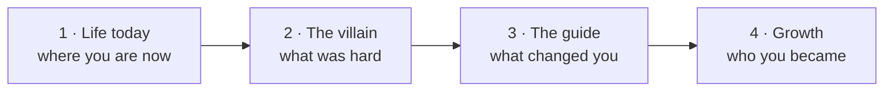

# Day 1 — Day 1 of Your Real Career

> **The one idea for today:** Facts tell. Stories sell. Before you pitch anything, the prospect has already asked — *why should I give you a chance, and not the other five advisors who messaged me?*

By the time you close today you should be able to explain why a prospect's first silent question is *"why you, not them?"*, draft a v0 of your own story using the 4-part frame (Life today → Villain → Guide → Growth), and spot the single biggest failure mode — telling the villain as a fact instead of a feeling.

---

## What changes today

Yesterday you had a syllabus. Today you have a calendar. Empty.

The FINternship is over. You're licensed. Your income is $0 until you close your first case. That's not a demotion — that's the career starting for real.

For the next 60 days you're not studying the business. **You are the business.**

This module works the same way. Every week has a KPI, not just a quiz. Every practice day (every 6th day) ends with a Loom link you submit. Week N+1 unlocks when you log Week N's KPI — not when the calendar says it's time. The course runs at the pace you actually run.

## The week ahead

| Day | What you're doing |
|---:|---|
| 1 | Your story (today) |
| 2 | The activity math: appointments × close rate × case size |
| 3 | 90-Day Scorecard + revenue-per-appointment |
| 4 | Your story — first real draft |
| 5 | Tonality — how you *say* it |
| 6 | Practice — record your 90-second intro |

By Saturday you'll have a 90-day scorecard with real numbers on it, and a 90-second intro you've recorded and can watch back. Those are Week 1's deliverables. Everything else is scaffolding around them.

---

## The silent question

Roy is your secondary-school friend. You haven't seen him in three years. You message him — *"hey bro, want to grab lunch and talk about financial planning?"*

Inside his head: *why should I say yes to Roy and not the other five advisors who've already messaged me?*

He won't say that out loud. He'll say *"sure, let me check my calendar"* — or he'll blue-tick you. The silent question is the same either way.

**Your story is the answer.**

Not your product. Not your company. Not your certifications. From the outside, those look identical to what the other five are offering. Your story — what you went through, why you do this, who you are when no one's paying — is the one thing they can't copy.

> *Facts tell, stories sell. Emotions are stronger than anything else. If you go up against other FCs, you need a way to win — and your story is the only thing they can't copy.*

---

## The 4-part story frame

Every good origin story — superhero movie or 90-second warm-market pitch — hits the same four beats.

**1 · Life today.** A short setup of where you are now — so the contrast lands. *"You see me today and I can travel, buy a home, take care of my parents. It wasn't always like this."*

**2 · The villain.** What was hard. The thing you fought against. Financial assistance, a sick parent, a failed investment, an argumentative household. **Not the fact — the feeling.** *"I used to eat one packet of Milo nugget for lunch because I couldn't afford anything else. I didn't take a single taxi until I was in the army."*

**3 · The guide.** The person or process that changed your trajectory. For some it's a mentor. For some it's an event — a hospitalisation, a first real paycheck, watching a parent struggle with money. For many of you, it's this career itself.

**4 · Growth.** Who you became. What you can do now that you couldn't before — and what that means for the person you're about to serve. *"I fought for every dollar I have. If someone is going to manage your money, why not the one who knows what every cent is worth?"*

Where most first drafts break: step 2 is told as fact. *"My parents didn't have much money."* That's a fact, not a story. The version that lands is the same circumstance with the feeling attached: *"I used to avoid going home because my parents always argued about money. I'd rather sit in McDonald's till closing than walk through the door."*

Same event. Completely different pull on the listener.

---

## Why this is harder than it sounds

Most of you will resist step 2. You've spent years building the opposite skill — keeping it together, not showing weakness, never complaining. That's served you well. It won't serve you here.

Vulnerability is the skill Day 1 is about. Not performative, not rehearsed — real. The story only works if the prospect feels the weight of the thing you went through. You can't fake that. You also can't hide from it *and* sell through it at the same time.

**This is the first thing that separates the advisors who make it from the ones who don't.** Product knowledge is universal. Scripts are copyable. Your story is the one asset nobody can take from you — but only if you're willing to tell it.

One more thing: you don't need a traumatic past for the story to work. You need the craft. Someone who grew up comfortable can still build a gripping story around the moment money suddenly felt fragile, or the first time someone close to them had an uninsured claim, or the mentor who changed how they thought about wealth. The raw material matters less than the honesty you bring to it.

---

## The 10pm-Wednesday test

Some point in the next 60 days — probably a Wednesday night, probably around 10:47pm — you won't feel like making the last three dials. The novelty will have worn off. The first rejection of the day will still be ringing. Your friends' texts will be more appealing than your pipeline.

That moment is the whole test.

Motivation won't carry you through it. Motivation comes and goes with results, sleep, and how recently you ate. **Identity** is what carries you through — the version of yourself you've already told a story about, the version the pledge sheet names, the version your vision board is a picture of. You picked up the phone tonight because *that's what this version of you does*, not because tonight felt inspired.

The Day-1 story work, the pledge sheet, the vision board, the scorecard — none of that is ceremony. They're the props you look at at 10:47pm on Wednesday. The story is for the prospect. The artefacts are for you.

**Do this now.** Pick one — the signed scorecard photo, the vision board, one line of your story — and put it on your phone wallpaper this week. You'll look at your phone 80 times today. You won't open a folder on your laptop once. The wallpaper is how the work reaches the 10:47pm moment.

---

## The 7 mindsets that carry you through

If the 10pm-Wednesday test is *who you become when willpower runs out*, these 7 traits are the answer. Think of it as your identity blueprint for the next 60 days.

| # | Mindset | What it looks like at 10:47pm on Wednesday |
|---|---|---|
| 1 | **Optimistic + enthusiastic** | Every dial is a new coin flip. The last rejection didn't change the odds of the next one. |
| 2 | **Competitive** | Not against peers — against your own Week-N number. Beat yesterday. |
| 3 | **Confident** | Assumes the prospect will want to meet. The assumption is self-fulfilling. |
| 4 | **Relentless** | *"One more call"* after the block ends. Top producers add 10% past the limit; average producers stop 10% short. |
| 5 | **Thirsty for knowledge** | 15 min/day reading × 250 days = 62.5 hours of craft growth a year. Compounds harder than reps alone. |
| 6 | **Systematic + efficient** | Monday calling block, Friday review, Sunday prep. Same week, every week. |
| 7 | **Adaptive + flexible** | *"Adopt, adapt, adept."* Run the script until it breaks — then rewrite the version that didn't. |

These aren't personality traits you have or don't have. They're *postures* you pick up daily. The 10pm-Wednesday test is about which posture the artefact on your wallpaper reminds you of.

---

## Quiz

**Q1. The prospect's silent question when they see your DM is:**
- A) "What's the product?"
- B) "Why should I give you a chance and not the other advisors who've messaged me?" ✓
- C) "Is this going to be expensive?"
- D) "Can I trust AIA as a company?"

**Why:** Company and product questions come later — if ever. The first filter is *you versus the other five*. Your story is the only input that answers that filter differently from everyone else.

**Q2. In the 4-part story frame, the most common failure point is:**
- A) Starting with "life today" — it feels arrogant
- B) Telling the villain as a fact rather than a feeling ✓
- C) Skipping the guide
- D) Making step 4 too long

**Why:** New advisors narrate the villain as fact ("my parents had no money") instead of the feeling that came with it ("I'd walk the long way home to avoid another fight"). Same event, opposite impact on the listener. The feeling is what lowers the prospect's guard.

**Q3. "A prospect buys the person, not the product." In Day 1's framing, this means:**
- A) Product knowledge is unnecessary
- B) Your personal story is what lets the prospect choose you over a near-identical competitor ✓
- C) You should never discuss product features
- D) A polished pitch deck doesn't matter

**Why:** Product knowledge and deck quality still matter — they just don't *break ties*. In a market where every advisor sells near-identical products, the tie-breaker is who the prospect feels they know. The story is the only input under your control that moves that needle.

**Q4. The "guide" step in the 4-part story frame is best described as:**
- A) A hero figure who solves the villain for you
- B) The person or moment that changed your trajectory so growth became possible ✓
- C) A step-by-step financial plan
- D) Your mentor or team leader

**Why:** The guide is the pivot — what (or who) made change possible between the villain and the growth. It doesn't have to be grand. A single conversation, a realisation, an illness — any of those work. Skipping the guide leaves the listener wondering how you got from A to B.

**Q5. You grew up middle-class. No family trauma, no "villain moment" of deprivation. Can you still build a story that lands?**
- A) No — without adversity the story can't carry weight
- B) Yes — the raw material matters less than the honesty. A gripping story can be built around the moment you realised money was fragile, an uninsured claim near you, or a mentor who reshaped your thinking ✓
- C) Only if you invent a story that sounds harder than it was
- D) Only if you tell someone else's story on their behalf

**Why:** Craft matters more than raw suffering. Someone from a comfortable background can still build a real story around a specific moment — a parent's uninsured claim, the mentor who challenged their defaults, the first time they saw a friend's family blindsided. Honesty is the ingredient, not the drama.

**Q6. In the Day 1 framing, why doesn't product knowledge "break ties" between advisors?**
- A) Because product knowledge isn't necessary to sell
- B) Because from the outside the insurer catalogue looks near-identical — the tie-breaker is who the prospect feels they know ✓
- C) Because customers ignore product details
- D) Because AIA's products are different from every competitor's

**Why:** In a market where every advisor sells near-identical products from the same 3–4 major insurers, product knowledge is a minimum, not a differentiator. The differentiator — the only input under your control that moves the needle — is the prospect's felt sense of who you are.

**Q7. The "10pm-Wednesday test" refers to:**
- A) A mandatory Wednesday-night mentor call
- B) The moment each week when motivation has faded and identity has to carry you — the last 3 dials you don't feel like making ✓
- C) A productivity framework for evening reviews
- D) A Lark doc template for weekly reflection

**Why:** Everyone's 10pm Wednesday is slightly different, but the category is the same: the moment where novelty has worn off, results haven't compounded yet, and the only thing keeping you on the phone is what you've already committed to being. The story work isn't for the pitch — it's for that moment.

---

## Related

- Next: [[day-02|Day 2 — The Activity Math]]
- Previous (prerequisite): [[../../first-60-days/week-10/day-60|First 60 Days — Day 60: Graduation]]
- Week 1 overview: [[README|Week 1 — Reset & Activate]]
