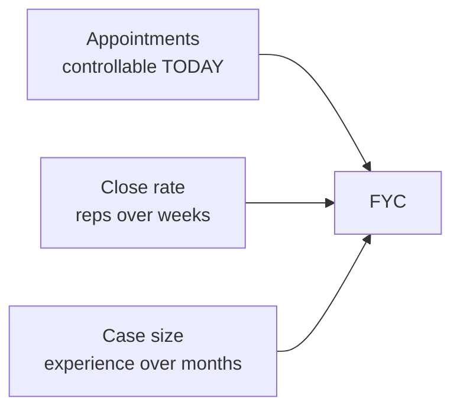

# Day 2 — The Activity Math

> **The one idea for today:** Your FYC is three numbers multiplied. Two improve with reps. One you control today.

By the end of today you'll use the formula **FYC = Appointments × Close rate × Case size** to find your current gap, tell apart the two slow-moving levers (close rate, case size) from the one behavioural lever you control today (appointments), and work out how many weekly appointments you need to hit a 6-month FYC target using realistic starter numbers.

---

## The formula

Every dollar of first-year commission comes from the same equation:

```
FYC = Appointments × Close rate × Case size
```

Three levers. That's it.

- **Appointments** — how many qualified first-meetings (Educational Fact-Finds, not coffees) you sit through in a week
- **Close rate** — what % of those meetings become paying clients
- **Case size** — average first-year commission per closed case

If your FYC isn't where you want it, one of those three is the problem. There is no fourth thing.

---

## Why appointments is the only lever you control today

The three levers are not equal. Here's what actually moves each one:



**Close rate** is a function of skill — asking the right questions, reading DISC, handling objections, closing with conviction. You will get better at all of those, but you cannot get dramatically better this week. A new FC typically closes somewhere between 20–40% of qualified meetings. Month 3 it might be 30–50%. That's a real move, and it takes time.

**Case size** depends on who's across the table and what you uncover. Bigger cases come from wealthier prospects, better fact-finds, and the confidence to recommend a complete plan instead of a polite entry policy. Most new FCs' first 10 cases land at **$500–$1,000 FYC per case**. That number grows as your network and competence grow — but not on a schedule you can force.

**Appointments** is pure behavior. You pick up the phone. You send the text. You book the meeting. There is no skill barrier on Day 2 that stops you from booking 5–7 meetings this week. The only barrier is whether you do it.

This is why every experienced advisor, when asked what broke them early, gives the same answer: *they didn't pick up the phone often enough.*

---

## Honest starting numbers

You're going to plug your own numbers into the scorecard tomorrow (Day 3). Today, understand the ballpark for someone in your position:

| Lever | Typical new-FC starting range | Where it ends up Year 2–3 |
|---|---|---|
| **Close rate** | 20–40% of qualified Fact-Finds | 40–60% |
| **Case size** | $500–$1,000 FYC | $1,000–$1,500 FYC |
| **Appointments / week** | 5–7 | 7–10 |

Run the math on the low end of a new FC:
> 5 appointments/week × 30% close × $750 case = **$1,125 FYC / week** → **~$58,500 FYC / year**

Run it on the upper end of the starter range:
> 7 appointments/week × 30% close × $750 case = **$1,575 FYC / week** → **~$82,000 FYC / year**

Same close rate. Same case size. **Two more meetings a week adds ~$23,500 FYC over a year.** No new skill required — just two more calls that land.

---

## The inverse math — working backward

Start with the number you actually want, then solve.

**Question:** I want $30,000 FYC in my first 6 months. What do I need to do weekly?

```
$30,000 ÷ 26 weeks = ~$1,154 FYC / week needed
Case size (starting) = $750
Close rate (starting) = 30%
```

Appointments per week = **$1,154 ÷ ($750 × 30%) ≈ 5.1 appointments/week**

That's the honest floor — and it's exactly the low end of the starter range in the table above. To have margin for cancelled meetings, ghosts, and slow weeks, target **6–7 appointments/week.** That's the Week-1 activity floor this module is engineered around.

Want a bigger number? Raise any of the three levers: grow case size by tightening fact-finds (Week 8 work), grow close rate with objection-handling reps (Week 9), or book more meetings (every day from today).

**The scoreboard gets built tomorrow (Day 3).** Today's job is to internalize that the scoreboard is not ambiguous — it's three numbers, and two of them are mostly out of your control for now.

---

## What this changes about your week

Three behavioral consequences flow from the math:

1. **Stop optimizing the wrong thing.** New FCs spend hours tweaking their pitch deck, rehearsing closes in the mirror, and reading about sales psychology. Those are close-rate and case-size activities — the slow-moving levers. You need reps before polish pays off. Pick up the phone first, refine the pitch second.
2. **Count the right unit.** Not "people I messaged." Not "people who said maybe." **Qualified first-meetings actually booked with a time, a place, and a Fact-Find agenda.** That's the only unit that feeds the formula.
3. **Work the math publicly.** Write your weekly appointment count on a whiteboard, in your phone wallpaper, or on a sticky note on your desk. The number you see is the number you move.

The advisors who survive Year 1 are not the ones with the smoothest pitch. They are the ones who picked up the phone when they didn't feel like it.

---

## Team operations — know the money structure

The activity math above is *your* math — how reps turn into FYC. The income math — how commission actually lands in your account — is AIA's. Both need to click by the end of this week.

- **EPS scheme** — watch the walkthrough ([Loom](https://www.loom.com/share/7fda52b3744d47fe8fc57a1ce78ceb63)). Read the [EPS Lark doc](https://nsgukkz32942.sg.larksuite.com/wiki/AK2jwgjKgic5vzkcToSlflbQgXf), focus on the **last page** — your month-by-month target. First two months on EPS: no revenue target, only 80% BTS attendance.
- **How income stacks** — watch the walkthrough ([Loom](https://www.loom.com/share/a01cb43f09994861a61ca76a2068eed4)). Commission rates in the same Lark doc. Don't memorise — internalise that income compounds via **renewals + career benefit + Activity Incentive Bonuses + Agent Provident Fund**.
- **New-consultant incentives** — aim for the [new-consultant challenges](https://nsgukkz32942.sg.larksuite.com/wiki/D6pHwlmiSimxaikXGKplk1pUgjd). Plan how to close your first few cases in your first 3 months.

Full walkthrough: [[../_source-articles/onboarding-steps-first-30-days|Onboarding Steps — First 30 Days]] §2.

---

## The 30-Day Rule + Law of Replacement

The activity math tells you *what* to do. These two laws tell you *when it pays off* — and what happens if you skip a day.

### The 30-Day Rule

> **Prospecting you do in any 30-day window pays off for the next 90 days.**

Miss a day of dials — you probably won't feel it this week. Miss a week — it lands in your commission check two months later. Miss a month — you wake up 90 days later in a slump you can't explain, wondering *"why are my appointments drying up when I'm working harder than ever?"*

The lag is what tricks new FCs. *"I skipped Monday calls but still closed 2 cases this week, so it's fine."* Those 2 closes were pipeline you built 30 days ago. The Monday you skipped is the reason *next* month drops.

**Practical consequence:** your calling block is not negotiable based on how busy *this week* feels. The dials you make today are for the person you'll be in March.

### The Law of Replacement

Every appointment you sit for *burns* a lead — regardless of whether it closes. The lead was a name in your pipeline; now it's either a client or a pass.

> **Law of Replacement:** you must inject new prospects into your pipeline at a rate ≥ your closing ratio, or the pipeline runs dry.

Close rate 30% means every 10 leads produce 3 clients and 7 passes. If you don't add ≥10 new leads for every 10 you burn through, pipeline math collapses — usually around Month 6–9, which is exactly when most Year-1 FCs fail and assume the career is broken. **It isn't. The Law of Replacement was the unpaid bill.**

### The slump anatomy

When a Year-1 FC says *"I'm in a slump,"* the chain is almost always:

1. Stopped prospecting (violated 30-Day Rule)
2. Pipeline stalled (violated Law of Replacement)
3. Deals stopped closing (pipeline exhausted)
4. Confidence eroded → energy dropped → desperation set in

**Recovery:** resume aggressive prospecting *immediately.* Do not dwell on the past month. The fix is behavioural, not emotional. One calling block. Then the next.

---

## Quiz

**Q1. Your FYC equation has three variables. In your first 60 days, which one is most under your direct control?**
- A) Close rate — it's about how polished your pitch is
- B) Case size — it's about finding wealthier prospects
- C) Appointments — it's a behavioral number you can move today ✓
- D) All three are equally hard to move

**Why:** Close rate and case size improve with reps and experience — they move on months-to-years timelines. Appointments is behavior. Whether you picked up the phone today is a yes/no answer, and the answer is under your control regardless of skill level.

**Q2. A new advisor has a 30% close rate, $750 average case size, and books 5 appointments per week. What's their weekly FYC pace?**
- A) $750
- B) $1,125 ✓
- C) $2,250
- D) $3,750

**Why:** 5 × 30% × $750 = $1,125 FYC per week. Annualized that's ~$58,500 — a real starter income that compounds fast once close rate and case size move up with experience.

**Q3. Two advisors both have a 30% close rate and $750 case size. Advisor A books 5 appointments a week. Advisor B books 7. What's the FYC gap over a year?**
- A) ~$23,000 ✓
- B) ~$50,000
- C) ~$10,000
- D) Depends on product mix

**Why:** A: 5 × 30% × $750 × 52 = ~$58,500. B: 7 × 30% × $750 × 52 = ~$81,900. Gap = **~$23,400**. Same skill, same product — two more meetings per week. And because volume accelerates skill improvement, the multi-year gap compounds wider than the first-year math suggests.

**Q4. Your close rate is 20-40% as a new FC. Why can't you "just get better at closing" this week?**
- A) Because only certified advisors can close
- B) Because close rate is a skill function — it compounds with reps across weeks, not in a single week ✓
- C) Because AIA policies prevent fast close-rate growth
- D) Because close rate is purely about product knowledge

**Why:** Close rate improves when you have more meeting reps, better DISC reads, sharper objection handling — all of which are learned over weeks and months. A new FC who rehearses closing in front of a mirror for a whole weekend will not dramatically improve their live close rate on Monday. Volume unlocks skill; skill alone doesn't.

**Q5. Day 2 argues: "stop optimizing the wrong thing." What's the "wrong thing" new FCs tend to over-optimize?**
- A) The pitch deck, the script, the memorised objection answers — all close-rate and case-size work, before they have volume ✓
- B) Their prospect list — it's always too long
- C) Their commission splits — they should negotiate up
- D) Their product knowledge — it's never enough

**Why:** The close-rate and case-size levers are real — they need work eventually. But they move slowly, and obsessing over them before you've booked enough meetings to test them is procrastination dressed as preparation. Appointments is the first lever. Polish comes after volume.

**Q6. "Count the right unit" — what does Day 2 define as the unit that feeds your FYC formula?**
- A) DMs sent
- B) Coffees scheduled
- C) Qualified first-meetings booked with a time, a place, and a Fact-Find agenda ✓
- D) LinkedIn connections accepted

**Why:** A DM sent isn't a meeting. A "let me check my calendar" isn't a meeting. A coffee chat with no agenda is socialising, not pipeline. The only unit that plugs into the formula is a confirmed first-meeting where the prospect has agreed to sit for a Fact-Find. Counting anything looser inflates your number and hides your actual activity.

**Q7. Day 2 closes on: "the advisors who survive Year 1 are the ones who picked up the phone when they didn't feel like it." What does that sentence imply about the dominant failure mode?**
- A) Failure is rarely about talent or product — it's about whether phone-picking-up survives low-motivation moments ✓
- B) Failure is always about product knowledge
- C) Only extroverts make it in financial advisory
- D) The smoothest talkers become the best advisors

**Why:** Talent distributes across the population; discipline at 10pm Wednesday does not. The FCs who quit in Year 1 rarely lacked product knowledge — they lacked the stubbornness to keep dialing after a stretch of rejection. Year 1 is a war of attrition, and attrition favors boring discipline over dramatic talent.

---

## Related

- Previous: [[day-01|Day 1 — Day 1 of Your Real Career]]
- Next: [[day-03|Day 3 — Your 90-Day Scorecard + Revenue Math]]
- Week 1 overview: [[README|Week 1 — Reset & Activate]]
- Cross-reference: [[../../first-60-days/week-4/day-19|First 60 Days D19 — Prospecting: The Lifeblood]], [[../../first-60-days/week-5/day-27|First 60 Days D27 — Activity Scorecard]]

