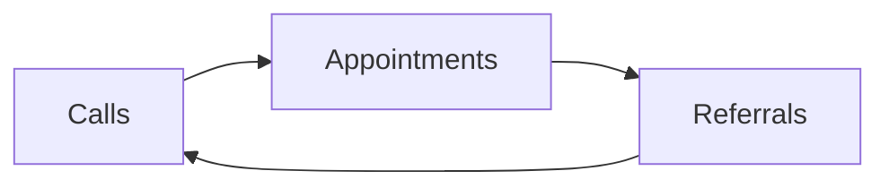

# Day 3 — Your 90-Day Scorecard

> **The one idea for today:** The scorecard is not a planner. It's a promise. Three numbers, one page, signed.

By the time you close today you'll have built a signed weekly CAR scorecard (Calls / Appointments / Referrals) with a Friday review cadence, tagged every lead and client with the ABC and 1/2/3 segmentation, and learned how to diagnose which CAR link to fix first when weekly numbers drop — one lever, not three.

---

## Yesterday vs. today

Yesterday you saw the math: FYC = Appointments × Close rate × Case size. Three levers. One of them — appointments — moves today.

Today you turn the math into an artifact. A one-page scorecard that tracks the levers week by week, forces you to look at the number every Friday, and makes next week's drop-off impossible to hide.

---

## What the scorecard tracks

Three weekly numbers and one monthly number:

| Metric | What it is | Cadence |
|---|---|---|
| **C — Calls** | Actual dials or messages sent to warm-market prospects | Daily / weekly |
| **A — Appointments** | Qualified first-meetings booked with a time, place, and Fact-Find agenda | Weekly |
| **R — Referrals** | Names received from existing conversations this week | Weekly |
| **FYC** | First-year commission closed this month | Monthly |

These four are called the **CAR + FYC scorecard.** CAR tells you whether the input is flowing. FYC tells you whether the input is paying.

---

## The CAR diagnostic

Each of C / A / R is a bottleneck for the others.

| Broken link | Downstream effect |
|---|---|
| **Not enough calls** | → fewer appointments → fewer referrals → fewer leads to call |
| **Calls happening, few appointments** | → your script or targeting is weak |
| **Appointments happening, no referrals** | → you're not asking at the right moment |

**Diagnostic rule for every Friday review:** find the weakest of C, A, or R this week. Fix that one. Don't try to fix all three.

---

## Two segmentations you'll track over time

You have zero clients today. That will change. The scorecard is built with the next 12 months in mind, not just this Friday.

### ABC — your future client book

Once you start closing cases, each client falls into one of three tiers:

| Tier | Definition | What they mean |
|---|---|---|
| **A** | Strong relationship AND strong buying power. Treats you as a financial confidant. Refers. | **The future.** You want more of these. |
| **B** | Strong buying power OR strong relationship — not both. | **The present.** Your bread and butter. |
| **C** | Transacted once. No relationship momentum. No referrals. | **The past.** Maintain with broadcast, low-effort. |

> A represents the future. B represents the present. C represents the past.

This distinction matters because your time is finite. Year 2 you'll decide which A-clients to double down on and which C-clients to let drift. Year 1 you're just collecting data.

### 1 / 2 / 3 — the prospects you haven't closed yet

For every new prospect in your pipeline, tag them on the scorecard:

| Tier | Description |
|---|---|
| **1 — Hot** | Fresh opt-ins, nurtured, warm-market. High conviction. |
| **2 — Warm** | Active referrals (a client introduced them). Relationship via the referrer. |
| **3 — Cold** | They know you but haven't kept in touch. Awkward both directions. |

Your first 60 days will mostly be tier 1 and tier 2. Tier 3 opens up when you've built something worth reconnecting for.

---

## Revenue-per-appointment — the number that forces triage

Here's the math that reshapes your calendar:

| Segment | Meetup % | Close % | Avg case | Revenue / review appt |
|---|---:|---:|---:|---:|
| **A-client** | 40% | 70% | $1,500 | **~$420** |
| **B-client** | 50% | 60% | $1,000 | ~$300 |
| **C-client** | 10% | 50% | $500 | ~$25 |

These are Year-2 numbers for an FC who's grown their book. But the point lands now: **an A-client review is worth 17× a C-client touchpoint.**

If you miss a week of A-client reviews this year, you didn't just lose a check-in — you lost ~$420 per missed slot. Multiply that by your A-tier count and the math gets honest fast.

---

## The scorecard is signed

The Week-1 KPI says *signed,* not *filled.*

Filling is private. Signing is a commitment. The signature goes at the bottom of the page, under a line that reads:

> *"I commit to reviewing this scorecard every Friday and reporting my CAR numbers to my mentor. If the number falls, I will not hide it. I will name the weakest link and fix it first."*

Sign it. Show it to your mentor. Put a photo of the signed page on your phone wallpaper. The scorecard is only a scorecard if there's a witness.

---

## Team operations — spin up the tools and the business plan

The scorecard is a number-tracker. It sits on top of a toolchain — Lark for docs + tasks, Lark Base for the CRM. Set both up this week so the Friday review has a home.

**Lark provisioning** (~30 min):
- [Join 100% MDRT Team on Lark](https://nsgukkz32942.sg.larksuite.com/invite/2475o5zzfclg1?join=1&team_name=100%25+MDRT+Team) — invite code `WPMMPELG`. Install Lark **Desktop + Mobile**.
- Open and pin [the access-checklist doc](https://nsgukkz32942.sg.larksuite.com/wiki/Jqu5wln6eiVL7PklkgplPQc4gIe) to your left sidebar. Secure access to every resource it lists (we walk through each in coaching calls).
- Create a Lark task list with sections (ad-hoc + recurring). 15-min "brain scan" — dump everything in. Habit: **capture constantly, process in a focused session each day.** Optional primers: [GTD intro](https://www.youtube.com/watch?v=7M6bIeVbCqA), [Lark task 2-min guide](https://youtu.be/HtBTAnWH3vk).

**CRM (Lark Base)** — ask Leo to spin up your CRM ([access here once created](https://nsgukkz32942.sg.larksuite.com/base/AKOwbIgCJajwpdsZxtmluiF7gZd?table=tblK1Q35uvwAe4pU&view=vew7AogXqL)). While you wait, watch [Lark Base intro (2 min)](https://youtu.be/KH2h4kxc_4c) and [the CRM Loom tutorials](https://nsgukkz32942.sg.larksuite.com/wiki/KwYfw7WRxiH6pskbm2tlHCOXgie). Habit: **every lead sorted by stage**.

**Business plan doc** (this week — not today):
- [Instructions in Lark](https://nsgukkz32942.sg.larksuite.com/wiki/JnLewrJCmi6VBSkCJsvlcysYgPe) · [Sample Canva deck](https://www.canva.com/design/DAG1v21ulvQ/) (duplicate and edit).
- Upload to [the examples folder](https://drive.google.com/drive/folders/CyXsfQiuPlRA1udutA0lpbPxggf), send to your onboarding GC for feedback.

Full walkthrough: [[../_source-articles/onboarding-steps-first-30-days|Onboarding Steps — First 30 Days]] §3a–3b.

---

## The 3 P's that kill prospecting

Once the scorecard is signed, the math is simple. But three mental patterns stop the math from happening. Watch for them in the first two weeks — they're diagnostic.

| P | What it looks like | Why it's deadly | Disruption |
|---|---|---|---|
| **Procrastination** | *"I'll start calling after I set up the CRM / finish this article / have my morning coffee."* | Small slips in self-discipline compound into dry pipelines | Commit to *one* call before anything else |
| **Perfectionism** | *"I'll call when I've rehearsed the opener 20 more times."* | Correlated with fear of failure — imperfect action beats perfect inaction | Dial the imperfect version. Refine from feedback, not rehearsal |
| **Paralysis from analysis** | *"What if they ask X? What if they object with Y? I should study objections more first."* | Endless "what if" loops are disguised avoidance | Disrupt with a single focus — **just make one call** |

**Your Friday review catches these.** If CAR numbers dropped this week, ask: *which of the 3 P's showed up?* Not *"was I unlucky"* or *"was the market bad"* — those are rarely the cause in Week 1–8.

The diagnostic is almost always one of the three. Name which one. Then next week, your mentor asks you about it by name.

---

## Quiz

**Q1. The CAR framework stands for:**
- A) Clients, Appointments, Revenue
- B) Calls, Appointments, Referrals ✓
- C) Close, Analyze, Refer
- D) Contact, Arrange, Reconnect

**Why:** Calls feed Appointments. Appointments feed Referrals. Referrals feed back to Calls. It's a self-regenerating loop once all three are running. Revenue lives downstream as FYC; it's what the loop produces, not what the loop tracks.

**Q2. An A-tier client review is worth ~$420 in expected revenue. A C-tier touchpoint is worth ~$25. What's the practical consequence for how you spend your time?**
- A) Spend equal time across tiers — relationships matter
- B) Prioritize A-tier reviews; maintain C-tier with broadcast, low-effort touches ✓
- C) Drop C-tier clients entirely
- D) Only work with A-tier from the start

**Why:** A-tier are ~17× more valuable per touchpoint than C-tier. Your time is finite. Equal allocation would bury you in low-value work. But C-tier still deserves maintenance — a quarterly broadcast, a newsletter, a birthday wish — because some C-tier re-activate into A-tier over years. Dropping them entirely or only working with A-tier (option D) forgoes that compounding.

**Q3. Your Friday review shows: Calls on target, Appointments on target, Referrals at zero. Which lever do you fix first?**
- A) Calls — make more of them
- B) Appointments — book more
- C) Referrals — the zero is the diagnostic signal ✓
- D) Wait and see if referrals catch up next week

**Why:** The CAR diagnostic rule is: fix the weakest link. Calls and appointments are healthy; the gap is at the ask stage. That tells you your appointments aren't ending with a referral ask, or the ask is weak. Doubling down on C or A (A or B) won't fix R — only fixing the ask does.

**Q4. The Week-1 KPI says "scorecard signed" — why signed rather than just filled?**
- A) Legal compliance requirement
- B) A signature transforms private intention into public commitment — filling is a planner, signing is a promise ✓
- C) To prove the document is yours
- D) The scorecard must be notarised by your mentor

**Why:** Filling in a tracker is a solo exercise. Signing it — and showing the signature to your mentor — changes the psychology. The week's numbers stop being something you can quietly miss and start being something you named out loud. The signature is the commitment device.

**Q5. The 1 / 2 / 3 tier system tags prospects (not clients) as:**
- A) 1 = A-client, 2 = B-client, 3 = C-client
- B) 1 = Hot (fresh opt-ins, nurtured), 2 = Warm (active referrals), 3 = Cold (they know you but no momentum) ✓
- C) Priority ranks for the week
- D) Days until they'll sign

**Why:** A/B/C covers your existing client book — people you've already transacted with. 1/2/3 covers the prospects you haven't closed yet. Tier-1 and Tier-2 are where most of your Week-4 outreach lands. Tier-3 opens up later when you've built something worth reconnecting for.

**Q6. The Friday review is "non-negotiable" — 30 minutes, one sitting. What breaks when you spread it across the week?**
- A) You never do it — context-switching costs + the false security that "I can catch up later" push it off the calendar entirely ✓
- B) The math changes
- C) Your mentor loses visibility
- D) The scorecard deletes itself

**Why:** Weekly reviews that live in 5-min slices become weekly reviews you postpone. One sitting makes the ritual habitual — a protected block in the calendar. The review is also more diagnostic in one sitting because you see all three CAR numbers in the same state of mind.

**Q7. The Day 3 scorecard is described as "only a scorecard if there's a witness." What does the witness unlock?**
- A) A mentor's permission to advance
- B) Accountability — numbers you've only shown yourself are easier to fudge than numbers another person has seen ✓
- C) Legal compliance
- D) Additional cold leads

**Why:** A private commitment has one voter. A witnessed commitment has two. Most new FCs can rationalise a missed call target to themselves; fewer can rationalise it to a mentor who saw the signed scorecard last week. The witness is not there to grade — they're there to keep the number true.

---

## Related

- Previous: [[day-02|Day 2 — The Activity Math]]
- Next: [[day-04|Day 4 — Your Story (First Draft)]]
- Week 1 overview: [[README|Week 1 — Reset & Activate]]
- Cross-reference: [[../../first-60-days/week-5/day-27|First 60 Days D27 — Activity Scorecard]], [[../../first-60-days/week-7/day-39|First 60 Days D39 — Project 100]]
