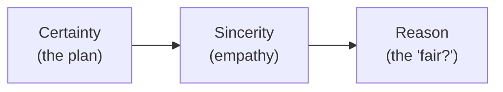

# Day 5 — Tonality & Salesmanship

> **The one idea for today:** Sales is the transfer of emotions. Tonality is how emotion transfers.

By the time you close today you'll know the 6 tonalities (Surprise, Empathy, Certainty, Urgency, Doubt, Reason) and when each one fits, you'll have run the Tritonal Closing Pattern (Certainty → Sincerity → Reason) through a real close, and you'll have drilled your intent statement in 3 reads — flat, certainty-heavy, and naturally varied — and picked the strongest.

---

## The misconception new advisors carry

Most new FCs spend all their prep time on *what* to say. Scripts, rebuttals, closing lines. Almost none on *how* to say it.

This is backwards. Two advisors can deliver the same words and get opposite outcomes. The difference isn't the script — it's the tone.

Two beliefs hold people back from working on tonality:
- *"Tonality comes with talent."* It doesn't. It's a trainable skill, like any other sales muscle.
- *"Changing my tone makes me sound fake."* The opposite. Flat, default delivery is what sounds fake — because it signals you're reading, not relating.

The fix is learning which tone fits which moment, then practising until it stops being a choice and starts being a reflex.

---

## Why tone carries most of the message

Rough weighting from communication research: what people remember from an interaction comes much more from *how* something was said than from *what* was said. Body language and tonality dominate; the words themselves are a fraction.

You can't fix that by writing better scripts. You fix it by learning to use your voice.

---

## The 6 tonalities

Six recognisable tones. Each has a job. You'll recognise all of them once named — you use some unconsciously already.

| Tonality | When to use | Example |
|---|---|---|
| **1 · Surprise** | Hot-button discovery, rapport | *Low:* "Oh! Software engineer?" (tell-me-more) · *High:* "Huh, really?!" (bro for real?) |
| **2 · Empathy / Sincerity** | Cushioning a real concern | *"I understand. You're probably feeling a bit hesitant — this is the first big financial commitment you've made."* |
| **3 · Certainty** | Framing, intent statements, closing | *"Insurance takes precedence over investments, and it's non-negotiable."* |
| **4 · Urgency** | Start of a phone call | *"Hello hello? Eh, Grace — are you at home now??"* (breaks the default pattern) |
| **5 · Doubt / Ridicule** | Create uncertainty around an objection | *"Honestly, if I'd been your advisor for the last five years processing every claim properly, you probably wouldn't be saying 'let me think about it' right now — right?"* |
| **6 · Reason** | The tone a prospect can't say no to | *"End of the day, whether you engage my services or not is entirely up to you. Fair?"* |

---

## Two tonalities to get right first

New FCs in Week 1 don't need all six. They need two cold:

### Tonality of Certainty

Used for your intent statement, for framing the meeting agenda, for the close. Conviction without volume — you don't speak louder, you speak steadier. Every sentence ends where it started, no upward lilt at the end.

Wrong: *"So, um, what we can do is maybe go through your cashflow and, you know, talk about insurance? If that works?"*
Right: *"Here's how we'll move forward. We'll go through your cashflow, your emergency fund, your insurance, and your longer-term goals. Insurance comes before investments — that one is non-negotiable."*

**Caveat:** over-use flattens everything. Certainty is for the load-bearing sentences, not every sentence. Treat it like cooking beef — too long on the fire and the whole conversation dries out.

### Tonality of Reason

The one that's hard to say no to. Ends on *"Fair?"* or uses *"probably"* as a softener.

*"Being friends doesn't mean we have to do business together. Whether you engage my services or not is entirely up to you. **Fair?**"*

The prospect can't reasonably disagree. You've given them the out, and now they're free to stay in the conversation without feeling cornered.

---

## The Tritonal Closing Pattern

Three tonalities strung together for a signature close:

**Example delivery:**

> *"As long as you follow the plan we've put together here" — **Certainty** — "and I genuinely believe this is what I'd do for my own family in your position" — **Sincerity** — "getting you to where you want to be is just a matter of time. Any further questions? **Fair?**"* — **Reason**

Three tones in one close. Felt-certainty, shared-humanity, low-pressure out. That combination is what taste like professional closing.

---

## The drill — don't practise the words, practise the intonation

The mistake most new FCs make is re-memorising the script. The fix is re-reading the same script in different tonalities until the intonation becomes automatic.

Pick the intent statement or the close. Read it ten times. The first five times, don't even focus on the words — focus on where your voice rises and falls. The next five, match the tonality to the moment.

It will feel awkward. It's supposed to. Until you've done 50 reps, tonality is a conscious choice. After 50, it's a reflex.

---

## Quiz

**Q1. "Sales is the transfer of emotions." In the context of this module, that means:**
- A) You should always be emotionally intense
- B) How you say something carries more of the message than what you say ✓
- C) Emotional prospects buy more
- D) Empathy closes faster than logic

**Why:** The research point the deck leans on is that body language and tonality dominate what a listener actually remembers. "Transfer of emotions" is the compact version of that — the emotional weight your tone carries is the primary vehicle, not the word choice. A, C, D are not wrong in isolation but miss the central claim.

**Q2. Your prospect raises a real concern: "I'm not sure I can commit this much monthly." Which tonality fits the cushion?**
- A) Tonality of Certainty
- B) Tonality of Empathy / Sincerity ✓
- C) Tonality of Doubt / Ridicule
- D) Tonality of Urgency

**Why:** A genuine concern needs to be met with genuine empathy before anything else. Certainty at this moment feels cold; Doubt mocks the prospect's legitimate hesitation; Urgency is a phone-open tool, wrong stage. Empathy validates first — *"I completely understand, this is a real commitment"* — then you earn the right to reframe.

**Q3. The Tritonal Closing Pattern strings three tonalities in what order?**
- A) Empathy → Certainty → Reason
- B) Certainty → Sincerity → Reason ✓
- C) Reason → Certainty → Empathy
- D) Urgency → Certainty → Reason

**Why:** Certainty establishes the plan ("as long as you follow this…"), Sincerity shares the humanity ("this is what I'd do for my own family"), Reason gives the prospect their out ("fair?"). Reordering breaks the emotional arc — you can't lead with the out, and you can't close on certainty because that lands as pressure.

**Q4. The Tonality of Reason (the "fair?" tonality) works because:**
- A) It's louder than other tones
- B) It's structured so the prospect can't reasonably disagree — and feels free to stay in the conversation without being cornered ✓
- C) It triggers urgency
- D) It uses formal language

**Why:** *"Whether you engage my services or not is entirely up to you — fair?"* is hard to say no to because saying no means disagreeing with *"you get to decide"* — a weird thing to disagree with. The out is real, the frame is kind. The prospect stays in dialogue instead of tightening up.

**Q5. Which tonality specifically fits the start of a phone call, to break the default polite-rejection pattern?**
- A) Certainty
- B) Empathy
- C) Urgency (*"Hello hello? Eh, Grace — are you at home now??"*) ✓
- D) Reason

**Why:** Urgency at the phone-open pattern-interrupts. Most cold prospects hear "hello this is [name] calling from..." and are already preparing their exit. A slightly elevated urgency that sounds like a real friend with something to say breaks the script and earns a 10-second window. Later in the call, urgency burns trust — it's a phone-open tool only.

**Q6. The warning on Tonality of Certainty is:**
- A) Never use it
- B) Use it only when you're angry
- C) Over-use flattens everything — treat it like cooking beef; too long on the fire and the whole conversation dries out ✓
- D) It only works on male prospects

**Why:** Certainty is for load-bearing sentences — the intent statement, the agenda frame, the close. If every sentence lands with the same declarative weight, the prospect starts hearing a lecture. Vary tonality around certainty so the certain sentences stand out. Monotone certainty becomes indistinguishable from monotone doubt after 30 seconds.

**Q7. "Tonality comes with talent." This module treats this claim as:**
- A) True for natural-born salespeople
- B) Mostly true with some exceptions
- C) A trainable skill like any other sales muscle — 50 reps turn conscious tonal choice into reflex ✓
- D) Irrelevant — scripts matter more than tone

**Why:** If tonality were talent, the worst-delivered pitch on Monday would still be the worst-delivered pitch on Friday. It isn't — people who drill the reps get measurably better in weeks. Treating tonality as talent is a permission slip for not practicing; treating it as reps moves it into the same category as any other skill you've already mastered before.

---

## Related

- Previous: [[day-04|Day 4 — Your Story (First Draft)]]
- Next: [[day-06|Day 6 — Practice: Record Your 90-Second Intro]]
- Week 1 overview: [[README|Week 1 — Reset & Activate]]
