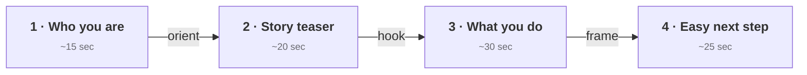

# Day 6 — Practice: The 90-Second Intro

> **The one idea for today:** This is the first practice that goes on tape. The recording is the commitment.

By the time you close today you'll have your 90-second intro structured in 4 beats (Who / Story teaser / What you help with / Easy next step — 15/20/30/25 seconds), three takes recorded and self-rated on tonal shifts and body-language congruence (audio-on + muted passes), and a Loom link submitted with a 10-minute mentor review booked. Those two artefacts unlock Week 2.

---

## What today is

Everything this week built toward a single artifact: a 90-second introduction you can send to anyone in your warm market this weekend and have it *open* the conversation instead of close it.

You've already done the pieces.
- **Day 1** — the 4-part story frame
- **Day 2 / Day 3** — the math and the scorecard so you know the size of what you're building
- **Day 4** — your story written and read aloud
- **Day 5** — the tonality to deliver it

Today you combine them, record 3 takes, submit the best one, and log your Week 1 KPI. Week 2 unlocks when the submission + KPI are in.

---

## The 90-second structure

Four beats. Roughly:

**1 · Who you are + new role (~15 sec).** Name, your new role as an FC, and one-sentence context for why this is a real career change rather than a side-hustle. Not a pitch — just orientation.

**2 · Story teaser (~20 sec).** A compressed version of your Day-4 story. You're not telling the whole thing — you're dropping the hook. The villain and the guide, in one or two sentences. Enough to make the prospect feel *why* you care. Save the full story for the meeting.

**3 · What you help people with (~30 sec).** Frame it around the person you're speaking to, not your process. *"I help people like you [state the audience] do [state the outcome] without [state the common objection]."* Concrete, specific, no jargon.

**4 · The easy next step (~25 sec).** Low-pressure. *"If you're open to a 30-minute chat I'd love to show you what I mean — you decide if it's useful. Worst case you get one good idea out of it. Fair?"* Give them the out. Make yes easy.

---

## The non-negotiables for the recording

- **Film yourself on camera, not just audio.** You're going to watch this back, so your expressions and energy need to be on it.
- **Good light, clean background, no earphones visible.** Phone on a tripod or leaning against a stack of books at eye level. Not handheld.
- **No script in front of you.** You know the beats. If you stumble, start again. Stumbling is fine — reading is not.
- **Three takes.** Watch each one back before starting the next. You'll catch yourself in the act.

---

## Pre-record prep sheet

Before you hit record, write these four lines on a sticky note *next to* the camera (not in front of it):

1. Who you are — one sentence
2. Story hook — one sentence
3. What you help people with — one line
4. The close — one line (ends on *"Fair?"* or similar)

The sticky note is for glance-level recall, not reading. If you need more than a glance, you haven't internalised it enough — go back to Day 4 and compress.

---

## How to self-rate each take

Watch each take with the audio on, then **mute and watch it again**. You're checking two things:

- **With audio:** did the tonality shift between sections, or did everything sound the same? If it all had the same energy, your delivery was flat. Re-record.
- **Muted:** do your face and hands tell a congruent story? If your face is flat while your hands wave, or vice versa, it reads as rehearsed. Your body should match the emotional arc of the words.

If both passes feel right, that's your submission take.

---

## Submission

**Paste your Loom URL here:** _________________________________

**Your mentor will not critique the pitch — they will critique two things:**
1. Did your tonality match the emotional arc, or was it flat?
2. Did you close with a *genuine* easy-out, or did it still feel like a push?

That's the entire feedback loop for this submission. Book the 10-minute check-in with your mentor before Sunday ends.

---

## Week 1 KPI — the unlock gate

Week 2 unlocks when you have all three:

- [ ] **Signed scorecard** (Day 3 — the one-page weekly tracker with your signature)
- [ ] **Intent statement v1 recorded** (this Loom video counts if beats 3 and 4 were clear)
- [ ] **Loom link submitted above + mentor review booked**

If you're missing any of the three at Sunday 9pm, use Sunday to finish. The unlock is automatic — Week 2 opens when the three items are logged, not when the calendar flips.

---

## Quiz

**Q1. The 90-second intro's four beats are:**
- A) Story → Who → What you do → Close
- B) Who → Story teaser → What you help with → Easy next step ✓
- C) Pitch → Features → Benefits → Close
- D) Hook → Value → Proof → Ask

**Why:** Who-first orients the listener — they need to know who's talking before they can care about the story. Story second creates the emotional weight. What-you-help-with translates that weight into relevance. The easy next step gives them a low-stakes way to say yes. Reordering breaks the arc.

**Q2. When you watch Take 1 back with the audio muted, what are you checking for?**
- A) Whether you said the words correctly
- B) Whether your face and hands match the emotional arc of the words ✓
- C) Whether your lighting and background look professional
- D) Whether the video is 90 seconds exactly

**Why:** Audio-on tells you about tonality. Muted tells you about body congruence. If your face is flat while your story is meant to be felt, the prospect sees the mismatch even if they don't name it. Both passes catch different failure modes.

**Q3. A mentee submits her Loom. The pitch is word-perfect, the script is clean, but the mentor's feedback says it still felt like a pitch. The most likely cause is:**
- A) The content was wrong
- B) The close didn't give a genuine easy-out — it still had the pressure of a yes-question ✓
- C) The 90 seconds ran over
- D) The lighting was bad

**Why:** The close is where pressure sneaks in. A "*would you be open to a meeting?*" without the genuine out (the *"fair?"* or *"worst case you get one good idea"* style) reads as a push no matter how polished the rest was. Word-perfect + still-feels-like-a-pitch almost always traces to the final beat.

**Q4. Watching Take 1 back, the rule is:**
- A) Critique every mistake and re-record from scratch
- B) Make one specific note on what to fix, then record Take 2 ✓
- C) Redo it until it's perfect
- D) Submit only Take 1 so it feels natural

**Why:** One-note-per-take is the fix. A full critique of Take 1 produces a mental list too long to execute on Take 2 — you overload and freeze. One note per pass compounds across three takes into a meaningfully tighter delivery, without the paralysis.

**Q5. The sticky note with the 4 beats should be placed:**
- A) In front of the camera, readable
- B) Next to the camera — glance-level recall, not reading ✓
- C) On the back wall
- D) In your hand

**Why:** If it's in front of the camera you read it, and the recording becomes "an FC reading a script" — which is exactly what a prospect doesn't need to see. Beside the camera means you can glance if panic hits but you're still looking through the lens. If you need more than a glance, you haven't internalised the beats — go back to Day 4.

**Q6. The mentor on this practice day is specifically critiquing:**
- A) Whether the pitch content was polished
- B) Whether your tonality matched the emotional arc and whether the close gave a genuine easy-out ✓
- C) Whether your lighting was professional
- D) Whether you stayed under 90 seconds

**Why:** Content fidelity was Day 4's job. Day 6's mentor critique is narrow on purpose: tonal match and close authenticity. Two failure modes most new FCs hit on their first warm-market video — and two fixes that compound into every subsequent delivery.

**Q7. Week 2 unlocks when:**
- A) The calendar rolls to Monday
- B) The signed scorecard, intent-statement Loom submitted, and mentor review booked are all logged ✓
- C) The practice day's Loom has been watched by 3 peers
- D) You've read every Day 1-6 again

**Why:** The unlock is behavioural, not temporal. Week 1's KPI isn't "survive Week 1" — it's three concrete artifacts (signature + Loom + mentor booked). Week 2 waits until those are in. This is the first unlock gate the learner hits; the pattern repeats every week for the next 10.

---

## Related

- Previous: [[day-05|Day 5 — Tonality & Salesmanship]]
- Next: Week 2 unlocks after Loom + scorecard submitted — [[../week-2/day-07|Day 7 — The Intent Statement (Framework)]]
- Week 1 overview: [[README|Week 1 — Reset & Activate]]
