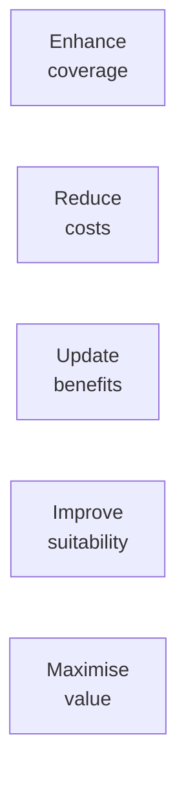

# Day 55 — Policy Restructuring

> **The one idea for today:** Restructuring is a scalpel, not a hammer. Used right, it serves the client. Used wrong, it serves your commission.

By the time you close today you'll identify the 4 factors that make an existing policy a legitimate restructuring candidate (premium, sum assured, cash value, benefits), apply the 5 objectives framework (enhance coverage · reduce costs · update benefits · improve suitability · maximise value), and spot the ethical line — when restructuring serves the client vs when it serves you — and refuse to cross it.

---

## The common situation

You meet a prospect. They already have policies — maybe 2, maybe 6, often a mix of old ILPs from previous advisors, legacy CI plans from 10 years ago, and small term plans bought reactively after a friend's cancer diagnosis.

They say *"I don't have more money to spend on insurance."*

**This is when restructuring becomes relevant.** Not adding new coverage on top — *reorganising* what they have so it serves them better. Sometimes the restructure frees up cashflow. Sometimes it improves coverage at the same premium. Sometimes it does both.

But — and this is the rest of the lesson — **restructuring can also be used badly.** Churning old policies to generate new commission is a real industry problem. The ethics of restructuring matter as much as the technique.

---

## The 5 objectives of legitimate restructuring

Good restructuring aims at one or more of these 5 goals:

### 1. Enhance coverage
Upgrade to plans that fill gaps in the existing ones. Example: client has $200K CI coverage bought at age 28; now 42 with 2 kids, exposure is higher — gap is real.

### 2. Reduce costs
Move to plans with more competitive premiums for the same coverage. Example: client's old whole-life premium is $600/month for $500K death benefit; modern term at $180/month covers the same need. (With the caveat that the old plan has cash value — see Section 5.)

### 3. Update benefits
Newer plans have features old ones don't — multi-claim CI, early-stage cancer coverage, wellness benefits. A 2015 CI plan typically doesn't cover early-stage cancer; a 2024 plan does.

### 4. Improve suitability
Life changed. The plan should change too. Single when they bought term → now married with kids → needs much higher coverage. Bought an ILP for accumulation → now approaching retirement → should probably shift to income-producing structure.

### 5. Maximise value
Specifically for permanent policies with cash value — leverage accumulated cash value to improve the coverage structure.

**The rule:** a legitimate restructure hits at least 1–2 of these objectives meaningfully. A restructure that hits *zero* of them is churning.

---

## The 4 factors to check on existing policies

Before any restructure discussion, audit existing policies across 4 factors:

### 1. Premium
- How much does it cost per dollar of coverage?
- How long does it need to be paid for?
- Level or stepped premium?

### 2. Sum assured
- What's the sum assured?
- What age does it cover until?
- Any multipliers or indexing?

### 3. Cash value
- Is the policy accumulating cash value?
- How much has been accumulated?
- What's the surrender value today vs guaranteed value at various ages?

### 4. Benefits
- Core coverage (death, TPD, CI — early / late stage)
- Riders (hospitalisation, accident, waiver)
- Flexibilities (withdrawals, premium holidays, conversion)

**Collect all 4 before making any recommendation.** New FCs often restructure based on premium alone and miss cash value implications. That's where ethics slips.

---

## The cash-value trap

The single biggest restructuring ethics trap:

A client has a permanent policy with $40K accumulated cash value. They're paying $600/month. You recommend replacing with a term plan at $180/month — *"look, you save $420/month!"*

**What you didn't say:** surrendering the permanent policy now loses $X of the $40K cash value (or all of it, depending on terms). You've generated fresh commission for yourself and cost the client the accumulated value they'd been paying for.

**This is churning. It's illegal in many cases and always unethical.**

### The ethical check
Before recommending surrender or replacement of any policy with cash value:
1. Calculate the surrender loss
2. Compare to the premium savings over a realistic time horizon (10–20 years)
3. Factor in the new commission you'd earn
4. Present *all* numbers transparently to the client

If the math genuinely favours the restructure *net of all costs*, proceed. If the math only favours it because you're ignoring the cash value loss, don't.

### The alternative — supplement, not replace
Often the right move isn't replacing the old policy. It's **keeping the old policy** (because the cash value matters) and **supplementing** with a new plan that fills the actual gap. The client ends up with both. You earn a smaller new-plan commission instead of a churn-sized one. The client is better off. That's the ethical path.

---

## When restructuring genuinely helps

Clear cases where restructuring is the right call:

**Case A — outdated CI coverage**
Client has $200K CI bought in 2014. Now 42 with 2 kids and $1.2M in household income exposure. Existing plan doesn't cover early-stage cancer. *Supplement* with a modern CI plan at $500K. Keep the old one — it still covers something. Total premium goes up; coverage goes up materially more.

**Case B — over-insurance on an obsolete life stage**
Client bought large whole-life at 25 when single. Now 55, financially independent, no dependants. The life coverage they paid for 30 years is no longer needed. Surrender value is substantial. *Paid-up option or partial surrender* — unlocks capital, maintains some coverage, ends unnecessary premium outflow. Legitimate.

**Case B — pre-retiree variant (the CPF capital trigger).** The same 55-year-old client just hit FRS at 55. That means their CPF excess (typically $100K+) is now withdrawable from OA — and the funds are sitting at 2.5% earning low real return. This *combines* with Case B in a powerful way: the surrender value from the obsolete whole-life PLUS the CPF excess together fund a restructured retirement-income plan (e.g., PWV) that closes the actual income gap from 65. The frame:

> *"You've got two pools of capital that aren't doing their job — the cash value in this old whole-life that no longer matches your situation, plus the CPF excess that crossed the FRS line at 55 and is sitting in OA at 2.5%. Combine them, and we have $X to deploy into something that actually pays you a known monthly income from 65. Let me show you the math."*

This is **legitimate** because (a) the existing whole-life genuinely no longer fits, (b) the CPF excess is genuinely under-deployed at 2.5%, and (c) the new plan fills a quantifiable income gap. **Where it crosses into churning:** if the whole-life still has dependants relying on the death benefit, or if you ignore the CPF lump-sum withdrawal cost (taking $100K out at 55 = ~$112K less in retirement stack at 60 — see [Day 39](../week-7/day-39.md) for the math), or if the new plan's premium is structured to consume both pools with no margin. Show the full math; let the client decide.

**Case C — fragmented plans**
Client has 5 tiny ILPs from different advisors, each with different funds, different charges, different surrender periods. Combined into 1 well-structured plan, total cost drops, visibility improves. Legitimate restructure.

**What makes each legitimate:** the *client benefit* is clear and quantifiable, and you've considered the full cost-benefit including any lost cash value.

---

## When restructuring is the wrong call

Clear cases where you should *not* restructure:

**Case D — early-surrender of cash-value policy for premium savings**
Client 5 years into a 25-year whole-life. Has $25K surrender value. You recommend term replacement to save $300/month. Surrender cost is $25K now, or potentially $60K+ if you held to maturity. Don't.

**Case E — churning for the sake of commission**
Client has adequate coverage across well-structured plans. There's no material gap, no meaningful premium reduction, no significant benefit upgrade. You're recommending restructure because it generates a commission. Don't.

**Case F — restructure sold on emotional urgency without the math**
Client got scared by a recent family CI event. You're tempted to restructure heavily to capture that emotional moment. But the restructure's net cost-benefit is poor. Don't — even if they'd sign.

**The compliance angle:** Monetary Authority of Singapore (MAS) regulations around policy replacement are strict for good reason. Document every restructure recommendation with a clear cost-benefit analysis. If you can't defend the recommendation on paper 3 years later, don't make it.

---

## The client conversation

When a restructure is genuinely indicated:

### Opening
> *"Looking through your existing plans, I want to flag one area that's worth a conversation. I'm going to lay out the math transparently — what you'd gain, what you'd potentially give up, and the trade-off. I'd rather you see the full picture than just the upside."*

### Body
- Present the 4 factors for the current plan
- Present the 4 factors for the proposed restructure
- Show surrender cost / lost cash value explicitly
- Show new commission (yes — disclose this)
- Show the net benefit to the client

### Close
> *"Based on this, my recommendation is [X] — because [specific reason]. But this is your decision — the numbers are here and the tradeoff is real. If you'd rather keep things as they are, that's also a legitimate answer."*

Transparent, math-forward, includes the commission disclosure. This is how trust is built long-term.

---

## Quiz

**Q1. The 5 objectives of legitimate restructuring include all EXCEPT:**
- A) Enhance coverage
- B) Reduce costs
- C) Generate advisor commission ✓
- D) Update benefits

**Why:** Enhance coverage, reduce costs, update benefits, improve suitability, maximise value — these 5 describe client-facing outcomes. Commission generation is a byproduct, not an objective. A restructure that hits zero client objectives but generates commission is churning. The ethics test is: would this recommendation still make sense if the commission were zero?

**Q2. Before recommending replacement of a policy with accumulated cash value, you must:**
- A) Calculate and transparently disclose the surrender loss and compare to premium savings over a realistic time horizon ✓
- B) Focus on the monthly premium savings to keep the prospect engaged
- C) Recommend the replacement if the monthly saves more than $200
- D) Avoid mentioning cash value to keep things simple

**Why:** Early surrender of cash-value policies often destroys accumulated value that took years to build. Presenting only the premium savings without the surrender cost is the classic churn pattern. The ethical and compliance-correct path is to transparently calculate both sides — sometimes the math still favours the restructure, but the client has to see the full picture to decide honestly. Hiding the surrender cost isn't simplification; it's misrepresentation.

**Q3. A client has 5 small fragmented ILPs with different fees, different funds, different surrender periods. Consolidating into one well-structured plan reduces overall cost and improves visibility. This is:**
- A) Churning — avoid
- B) A legitimate restructure that hits *reduce costs* and *improve suitability* objectives ✓
- C) Only legitimate if the client is under 35
- D) Only legitimate for HNW clients

**Why:** The 5 fragmented plans create real client-facing inefficiencies: diffused charges, unclear exposure, administrative drag. Consolidation solves a problem the client actually has. It hits reduce costs + improve suitability + maximise value — multiple legitimate objectives. As long as the cash-value math across all 5 plans is calculated and disclosed transparently, this is the scalpel use of restructuring, not the hammer.

**Q4. Before any restructure discussion, you audit the existing policy across 4 factors:**
- A) Cost, coverage, cash, claims
- B) Premium, sum assured, cash value, benefits ✓
- C) Date, duration, discount, death benefit
- D) Insurer, agent, amount, age

**Why:** Premium tells you current cashflow. Sum assured tells you coverage level. Cash value tells you what's already been accumulated (the ethics pivot). Benefits tells you riders + flexibilities. Skipping cash value is the most common ethics slip — new FCs recommend replacements based on premium savings alone and destroy the accumulated cash value the client had been paying for. All 4 before any recommendation, always.

**Q5. The "supplement, not replace" approach means:**
- A) Always sell a new plan alongside existing
- B) Often the right move is keeping the old policy (cash value matters) and adding a new plan that fills the actual gap — smaller commission, better client outcome ✓
- C) Only applies to HNW clients
- D) Never mixing old and new policies

**Why:** The ethical alternative to churning is *supplementing*. Old policy stays (because surrender would lose cash value); new plan addresses the specific gap. Net: smaller commission for you, better outcome for client, no ethics breach. Most legitimate restructures for clients with existing coverage should at least consider this path before considering full replacement.

**Q6. MAS regulations around policy replacement are strict because:**
- A) They want to make advisors' lives harder
- B) Policy replacement (churning) has historically damaged clients by destroying cash value to generate fresh commissions — documentation and transparency requirements exist to prevent that ✓
- C) It's new-advisor training
- D) It's required by insurers

**Why:** The regulatory framework exists to protect clients from a specific historical abuse. Documentation requirements force the advisor to explicitly calculate and disclose the cost-benefit, which is exactly the ethical check the framework was designed to enforce. "If you can't defend the recommendation on paper 3 years later, don't make it" is both good ethics AND good compliance.

**Q7. A client with $25K surrender value on a 5-year whole-life and you're recommending term replacement to save $300/month. The right move is:**
- A) Proceed with the replacement — $300/mo × 20 years = $72K savings beats $25K loss
- B) Refuse — early-surrender that destroys substantial accumulated value for premium-savings alone is almost always churning, and the full-term projection of the WL's cash value likely exceeds the term savings ✓
- C) Offer a 50% discount on the new plan
- D) Let the client decide without disclosure

**Why:** The napkin math (A) is misleading — it ignores the projected cash value at maturity ($60K+), the guaranteed returns embedded in the WL, and the compound value accumulation. Running the honest projection usually shows the WL wins over 20 years net of all costs. The recommendation to replace only looks good because it omits the offsetting numbers. That omission is the churn pattern, regardless of whether it's intentional or sloppy analysis.

---

## Related

- Previous: [[../week-9/day-54|Day 54 — Practice: 5 Objection Drills]]
- Next: [[day-56|Day 56 — After Sales: Onboarding Your First Client]]
- Week 10 overview: [[README|Week 10 — After the Close + Graduation]]
