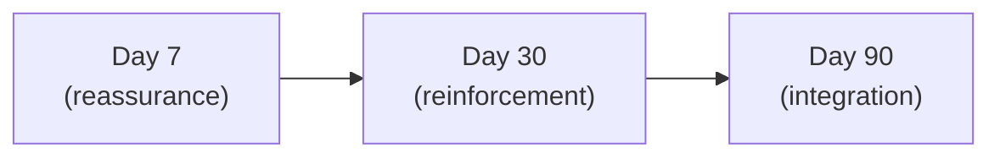

# Day 56 — After Sales: Onboarding

> **The one idea for today:** The 90 days after the close decide whether they refer you or forget you. Build the onboarding system before you have the first client.

By the time you close today you'll build an onboarding checklist that runs the first 90 days post-close systematically (not ad hoc), structure the 3 onboarding touchpoints (Day 7 / Day 30 / Day 90) with a specific purpose for each, and lock in the post-sales ritual that turns clients into ambassadors.

---

## Why after-sales decides the pipeline

Most new FCs treat the signed case as the endpoint. Paperwork done, case logged, moving on to the next prospect.

That's the Year-1 mistake that breaks the referral flywheel before it turns.

The client just made a significant financial commitment based on trust in *you*. They're slightly anxious for the first few weeks. If you go silent — which is the default if you don't have a system — they interpret the silence as *"once he got the sale, he stopped caring."* Referrals die before they're asked.

**The 90 days after close are when the client decides whether you're the advisor they tell their friends about.** Not during the pitch. After.

---

## The onboarding checklist

One-page checklist. Runs automatically for every new client. Build it once, use it every time.

### Week 1 (Day 1–7 post-close)
- [ ] Send a *thank-you* note — handwritten if feasible, otherwise a personalised email. Not the automated *"welcome to [company]"* email. From *you*.
- [ ] Confirm all submitted paperwork went through. Email or text update.
- [ ] Schedule the Day-30 check-in meeting before this week ends.

### Week 2–4 (Day 8–30)
- [ ] Send one *useful* piece of content unrelated to the sale — a relevant article, a short video, an insight. Shows you're still thinking about them.
- [ ] Proactively communicate any policy milestones (policy delivery, first premium confirmation).
- [ ] Make sure they know how to contact you if they have questions.

### Day 30 — first review meeting (15 minutes)
- [ ] Confirm policy is live and they understand what they bought
- [ ] Ask about any life changes in the last 30 days
- [ ] First referral ask — FACT Method, low-key, with genuine warmth
- [ ] Book the Day-90 review

### Day 30–90
- [ ] Two more value-drop touches — articles, videos, thoughtful messages
- [ ] Birthday / anniversary / life-event acknowledgment if any arise
- [ ] Stay responsive — reply within 3–4 hours to any message

### Day 90 — second review meeting (30 minutes)
- [ ] Portfolio check-in — anything changed on their side?
- [ ] Any gaps that've surfaced since the first meeting?
- [ ] Second referral ask — now that they've had 90 days of post-sale experience
- [ ] Set the Quarter 2 review cadence

---

## The 3-touchpoint rhythm

Within the checklist, 3 specific touchpoints do the heaviest lifting:

### Day 7 — reassurance
Purpose: confirm they made a good decision.

Clients often go through *buyer's remorse* around Day 3–7 — *"did I really need this?"*, *"was that the right plan?"* If you don't touch them during that window, they stew in the doubt. If you do — with warmth and competence — the doubt resolves.

Touch: text / email. Short. Warm. Tangible. *"Hey — just wanted to let you know the policy is confirmed and live. If anything comes up over the next few weeks, I'm a text away. Proud of you for making this move — I'll check in properly end of the month."*

### Day 30 — reinforcement
Purpose: make the value of what they bought real.

Meet for 15 minutes. Not a sales meeting — a check-in. Review the policy, answer any questions, confirm they know what they have and what it does. End with a light referral ask.

The Day-30 meeting is where clients either *get* what they bought or feel like they signed for something abstract. Your job: make it concrete.

### Day 90 — integration
Purpose: turn a customer into a repeat / referring client.

Meet for 30 minutes. Broader check-in. Life changes? New priorities? Any gaps? The referral ask here is sharper — they've had 90 days of your post-sale behaviour to judge.

This is also where you set the Q2–Q4 cadence. Quarterly touchpoints, annual review, ad-hoc life-event responses. The *client relationship* is established here, not at the close.

---

## The *fighter* posture (callback from Day 26)

Week 5 Day 26 introduced the 3 versions on a hard case. That applies now.

When a client hits a difficult moment in the first 90 days — a claim that's hard to process, an underwriting issue, a question about their coverage that requires real effort — this is the moment that decides whether they become an ambassador.

**V1 (Easy Out):** *"Sorry, looks like it won't work out."*
**V2 (Optimistic Shrug):** *"We can try but no promises."*
**V3 (The Fighter):** *"I'll use every relationship and bit of experience I have to push this through. No guarantees, but I'll do my best."*

V3 is what builds ambassadors. Clients remember *exactly* how you handled the one hard moment. They tell that story to friends for years.

**Build the muscle of V3 now**, before you have the first hard case. The mindset is: *"my client's problem is my problem."* When that posture is automatic, ambassadors follow.

---

## Going the extra mile — small acts with outsized compound

Specific, thoughtful, non-transactional gestures — not lavish, not scheduled, but *noticed*. A few real-world patterns:

- A client mentions a kid's birthday during the Fact-Find → send a small gift or card on the day
- A client mentions stress at work → a thoughtful text 2 weeks later — *"how's the project going? hope the intense phase is past."*
- A client mentions an aging parent → send a relevant article on elder care planning, un-salesy

**The rule of small gestures:**
1. **Specific** — tied to something *they* said, not a generic template
2. **Small** — under $50 and under 30 minutes of effort
3. **Zero sales attached** — purely relational, not a wrapped pitch
4. **Genuine** — you actually care about the thing you're acknowledging

Done consistently, small gestures accumulate into a reputation. The FC who remembered your daughter's birthday gets referred to every parent in the referrer's circle — not because of the birthday itself but because the birthday signalled *"this person actually pays attention."*

---

## Resourcefulness — your professional network

Your value to the client isn't only the policy you sold. It's the *network* around you.

A client asks you for a specialist recommendation. You have one. That's leverage.
A client asks for a reliable contractor. You have one. That's leverage.
A client asks for a specific professional service. You have a vetted name. That's leverage.

**Build your referral network actively:**
- When you encounter excellent professionals in adjacent fields (lawyers, accountants, specialists, contractors, mortgage brokers), note them
- Stay in light contact — they eventually become your referral sources, and you become theirs
- When you refer a client to them, *tell the client what your standard is*: *"I only refer to people I'd use myself"*

Your network is an extension of your value proposition. Clients who feel they can come to you for recommendations in any domain stay clients much longer — and refer much more.

---

## The onboarding system as a brand

Your after-sales system is as much a brand signal as your posts or your pitch. Two FCs who pitched identical plans can have wildly different 5-year outcomes based purely on whether their after-sales was structured or not.

- **Structured after-sales** → clients feel cared for → clients refer → referrals compound → Year 5 book is 60% referrals
- **Unstructured / silent after-sales** → clients feel forgotten → clients don't refer → Year 5 book is 10% referrals, 90% outbound effort

Same work. Same plans. Entirely different careers.

Build the system this week — before you have your first client — and it runs automatically for the next 30 years.

---

## Quiz

**Q1. The 90 days after the close matter because:**
- A) That's when compliance issues arise
- B) That's the window where the client decides whether you're the advisor they tell their friends about — referrals are earned or lost here ✓
- C) That's when the first premium hits
- D) Clients rarely change their minds after that

**Why:** The signed case is a starting line, not a finish line. New FCs treat it as an endpoint, which is why their Year-2 book is 90% outbound effort instead of 30%. The client's experience over the first 90 days — specifically whether you're attentive, useful, responsive, and proactive — decides if they become an ambassador. Silence during those 90 days is interpreted as *"once the sale closed, he stopped caring."*

**Q2. The purpose of the Day-7 touchpoint is:**
- A) Ask for referrals
- B) Resolve buyer's remorse — confirm they made a good decision, with warmth and competence ✓
- C) Cross-sell additional products
- D) Send the policy documents

**Why:** Most clients go through a wave of mild doubt between Day 3–7 — *"did I really need that?"* If you don't touch them, the doubt compounds. A short, warm, *non-sales* check-in resolves it. Referral asks are for Day 30+; policy documents are system-driven; cross-sell isn't appropriate this early. The Day-7 touch exists to make them feel *cared for*, which is the foundation for everything that follows.

**Q3. A client hits a difficult moment in Month 2 — a claim that looks likely to be declined. The ambassador-building response is:**
- A) *"Sorry, looks like it won't work out."*
- B) *"We can try but no promises."*
- C) *"I'll use every relationship and bit of experience I have to push this through. No guarantees, but I'll do my best."* ✓
- D) Refer them to a different advisor

**Why:** This is the *fighter* posture — V3 from Day 26. Clients remember *exactly* how you handled the hardest moment, and they tell that story for years. V1 abandons; V2 is uninspiring and forgettable; D actively breaks the relationship. V3 — committing maximum effort without overpromising the outcome — is the move that makes clients tell their friends *"she actually went to bat for me."* That's how ambassadors are made, and it always happens in the hard moments, not the easy ones.

**Q4. The 3 onboarding touchpoint moments are Day 7, Day 30, Day 90. The specific purpose of each is:**
- A) Day 7 referral ask, Day 30 upsell, Day 90 review
- B) Day 7 reassurance (resolve buyer's remorse), Day 30 reinforcement (make value real) + first referral ask, Day 90 integration (turn client into referring relationship) ✓
- C) Day 7 paperwork, Day 30 paperwork, Day 90 paperwork
- D) All three are the same — welfare checks

**Why:** Each touchpoint solves a different psychological moment. Day 7: buyer's remorse peaks. Day 30: abstract policy becomes concrete, and the client has enough experience of you to give a first referral. Day 90: the relationship shifts from *customer* to *client + ambassador candidate*, with the sharper referral ask. Treating all three as the same (C, D) collapses the sequence's compound effect.

**Q5. The onboarding system should be built:**
- A) After you close your first 5 cases
- B) Before you have your first client — the system runs automatically once in place, and it's too late to design it under time pressure after the first close ✓
- C) Only for HNW clients
- D) Only after 6 months of experience

**Why:** After the first close, you're in the emotional rush of the win + dealing with admin + trying to onboard while also chasing the next prospect. Not the ideal moment to design a system. Building the onboarding checklist, Day-7 text template, and Day-30 agenda *before* you need them means the first client receives the same thoughtful experience as the 50th. The system is a brand signal.

**Q6. A client mentions during Fact-Find that their daughter has a piano recital in 6 weeks. The right extra-mile move is:**
- A) Send a large bouquet the day of — grand gesture
- B) Remember it, send a short "good luck to her today" text the day of the recital — specific, small, personal, zero-sales ✓
- C) Offer to attend the recital
- D) Buy concert tickets as a gift

**Why:** The rule: specific (tied to what they said) + small (under $50, under 30 min of effort) + personal (recognisably about them) + zero-sales-attached. A short text on the right day hits all four. Grand gestures (A, D) read as transactional. Attending (C) crosses into personal territory that most clients don't want. The text is cheap, specific, noticed, and compounds.

**Q7. Your professional network (specialists, lawyers, contractors, mortgage brokers) adds value to your client relationship because:**
- A) It doesn't — clients only care about insurance
- B) Clients who come to you for recommendations across domains stay clients much longer and refer much more — network is an extension of your value proposition ✓
- C) You get kickbacks
- D) It's required by MAS

**Why:** The transactional view ("I sell insurance, I don't recommend contractors") misses the broader relationship play. A client who came to you for insurance and then got a great doctor referral, a vetted contractor, a reliable mortgage broker — that client has 3× the engagement surface with you. They think of you first for everything adjacent, and they refer 3× as often. Building the network actively (1 new professional relationship per quarter) compounds faster than any other relationship investment.

---

## Related

- Previous: [[day-55|Day 55 — Policy Restructuring]]
- Next: [[day-57|Day 57 — Building Moments: The Touch-Point Calendar]]
- Week 10 overview: [[README|Week 10 — After the Close + Graduation]]
