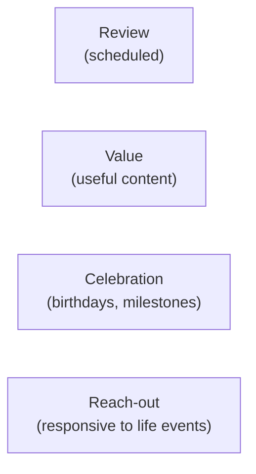

# Day 57 — Building Moments

> **The one idea for today:** Clients remember the moments, not the policy. Build the calendar that makes sure the moments actually happen.

By the time you close today you'll design a yearly touchpoint calendar (4–6 scheduled touchpoints plus 3–5 ad-hoc moments per client), sort touchpoints into 4 types (Review · Value · Celebration · Reach-out) and know what each is for, and build the moments that compound — small, specific, memorable acts that get talked about.

---

## Why moments matter more than policies

Ask any satisfied client *"what do you like about your advisor?"* and listen to the answer.

They almost never say *"her underwriting expertise"* or *"his product selection."* They say:
- *"She remembered my daughter's birthday."*
- *"He got me in touch with a doctor during a health scare."*
- *"She checked in when my mum was in hospital — no sales agenda."*
- *"He noticed I'd lost weight and sent a note."*

**Clients remember the moments.** The policy is the reason they engaged; the moments are the reason they stay, refer, and defend you.

Year-1 FCs often treat moments as *nice to have* — side-quests to the main work of selling. The truth is the opposite: moments are the main work of retention and referrals. Sales without moments produces churn. Sales with moments produces compounding businesses.

---

## The 4 types of touchpoints

Touchpoints split into 4 categories. A good yearly cadence uses all 4.

### Review touchpoints — scheduled
Portfolio reviews. Annual check-ins. Formal business meetings where you look at the client's plan and discuss changes.

**Cadence:** 1–2 per year minimum. Quarterly for A-clients (Day 3's ABC tiers).

### Value touchpoints — useful content
Articles, videos, insights, research summaries shared with the client because you genuinely think they'll find it useful. Zero sales agenda.

**Cadence:** 4–6 per year. Light touches. Not a newsletter broadcast — personalised to what you know about them.

### Celebration touchpoints — birthdays, milestones
Birthday, anniversary, promotion, new baby, new house, graduation, achievement. Acknowledged personally.

**Cadence:** as-they-happen. 2–4 per year per client typically.

### Reach-out touchpoints — responsive to life events
They mentioned a parent's illness — you follow up a week later. Their industry had layoffs — you check in. They're moving — you ask how settling in is going.

**Cadence:** as-situations-arise. 1–3 per year. These are the highest-compound touches because they're the least expected.

---

## A sample yearly cadence

For a B-tier client (bread-and-butter), a typical yearly cadence might look like:

| Month | Touchpoint | Type |
|---|---|---|
| Jan | New Year message — personalised | Celebration |
| Feb | *"here's a relevant article on X I thought of you for"* | Value |
| Mar | Client's birthday — thoughtful message + small gesture | Celebration |
| Jun | Half-year portfolio check-in (30 min) | Review |
| Aug | Follow-up on [thing they mentioned] | Reach-out |
| Oct | Useful content drop — year-end planning piece | Value |
| Dec | Year-end review (60 min) + holiday message | Review + Celebration |

~7 touchpoints for the year, spread across all 4 types. Plus ad-hoc reach-outs when life events happen.

For an A-tier client, double the frequency. For C-tier, quarterly broadcasts with ad-hoc reach-out only for major events.

---

## Competency + extra mile — the two sides of moments

Competence is the *baseline*. Extra mile is what makes moments memorable.

### Example 1 — competency alone
Client's policy delivery arrives. You email them to confirm it's with them. *Done competently.* They'll appreciate it and forget it within a week.

### Example 2 — competency + extra mile
Client's policy delivery arrives. You email to confirm. You also include a short video summary of the policy in 2 minutes so they understand what they bought without reading 40 pages. You mention their daughter's upcoming recital (which they mentioned during Fact-Find) and wish her luck. *Memorable.* They'll tell a friend about it.

**The extra mile is almost always small.** A 5-minute extra effort. A detail that shows you were listening. A personal touch beyond the transaction. The cost is low; the compound is high.

---

## Going the extra mile — real examples

Specific stories of what the extra mile looks like in practice:

### Example — the sambal and the toy
A real-estate agent learned during a house sale that her client's mum loved a specific homemade sambal chili. Also learned the client's daughter was 5. After the deal closed, she dropped off a jar of homemade sambal + a small toy for the daughter. Total cost: ~$20. That family referred her to every person they knew for the next 10 years.

### Example — the medical specialist
A client mentioned their sister was seeing a specialist they didn't fully trust. The FC happened to know a top specialist in that field personally. He made the introduction. The client got better care. The family referred 6 more clients over the following 2 years.

### Example — the gate kit
An FC learned a client was flying alone with 2 kids for the first time. Packed a small kit: snacks, activities, a thank-you card. Delivered to the gate. One moment. That client's husband told that story at every dinner party for years.

**Common pattern:**
- **Specific** — tied to something the client said, not generic
- **Small** — under $50 and under 30 min of effort
- **Personal** — recognisably about *them*, not a template
- **Zero sales attached** — purely relational

---

## The calendar — your execution system

You will not remember to do these things without a system.

Build a simple calendar reminder structure:

- **Monthly recurring reminder:** *"Who needs a value touch this month?"* Pick 5 clients.
- **On every client's birthday:** automatic 7-day advance reminder. Prep the birthday touch.
- **Post every Fact-Find:** log 2–3 personal details (family, interests, stressors) into your CRM with date tags for future reference.
- **Quarterly:** review all A-clients. Have they been touched in the last 30 days? If not, who needs a reach-out?

The system is what makes this work at scale. Without it, you'll do 3 thoughtful things in the first month and then forget when you get busy.

---

## The compound math

One thoughtful gesture to one A-tier client generates (on average):
- Higher retention probability
- 1–3 referrals over the following 2 years
- A dinner-party anecdote that reaches an average of 8 other potential prospects

Scale that across 20 A-clients × 2 thoughtful moments per year = 40 moments annually. If 25% produce a referral, that's 10 warm referrals from moments alone — before any explicit ask.

**The math of moments:** low-cost inputs produce disproportionately high outputs over multi-year time horizons. The FCs who compound hardest in Year 5–10 are almost always the ones who built a moments habit in Year 1.

---

## Quiz

**Q1. Clients mostly remember their advisor for:**
- A) Underwriting expertise and product selection
- B) The moments — birthdays remembered, specific help in hard times, thoughtful gestures ✓
- C) Low fees
- D) Fast paperwork

**Why:** Ask satisfied clients what they like about their advisor and they almost never cite technical capability — they cite relational moments. Moments are what they tell friends about, what they remember years later, and what drives referrals. Technical work is baseline expected; moments are the differentiator. New FCs often treat moments as side-quests; experienced FCs treat them as the core product.

**Q2. The 4 types of touchpoints are:**
- A) Sales · cross-sell · upsell · referral
- B) Review · Value · Celebration · Reach-out ✓
- C) Email · text · call · meeting
- D) Monthly · quarterly · annual · ad-hoc

**Why:** The 4 types describe *what the touchpoint does* — scheduled business review, useful-content drop, acknowledgment of life event, responsive follow-up on something they shared. All 4 should appear in a healthy yearly cadence. A client who only gets Review touchpoints (formal meetings) feels like a transaction; a client who gets all 4 feels like a person.

**Q3. The common pattern of effective "extra mile" gestures is:**
- A) Expensive and elaborate
- B) Specific, small, personal, zero-sales attached ✓
- C) Scheduled monthly
- D) The same for every client

**Why:** Lavish gestures feel transactional (*"what do they want in return?"*). Small thoughtful gestures tied to something specific the client said feel *seen*. Generic gestures (the same gift for every client) feel template-driven, which kills the moment. The compound math of moments works because small + specific + personal is both affordable (you can do many) and emotionally high-impact (each one is remembered).

**Q4. A realistic yearly cadence for a B-tier client is:**
- A) 1 touchpoint per year (annual review only)
- B) ~7 touchpoints across the year, spread across all 4 types (Review / Value / Celebration / Reach-out) ✓
- C) 1 touchpoint per week
- D) Only when they call you

**Why:** 1 touchpoint per year reads as *"you only matter once a year"* — referrals die. 1 per week is overkill and burns the client out. ~6–8 per year, spread across 4 types, is the sweet spot: enough to keep the relationship warm, not so much it feels like harassment, and varied enough to hit different emotional registers (formal review, useful content, acknowledgment, responsive care).

**Q5. For A-tier clients, you should:**
- A) Same cadence as B-tier
- B) Double the B-tier cadence (~14 touchpoints per year) because they're higher-value and more referable ✓
- C) Only review annually
- D) Touch them monthly

**Why:** The ABC tier system from Day 3 exists because client value varies ~17× between A and C. Proportional attention means A-tier gets roughly double the relational investment. Monthly (D) is too rigid — tier the cadence based on what each client *actually needs* and how much they compound into the book. A-tier reaches toward 14–16 touchpoints; C-tier stays at 3–4 quarterly broadcasts.

**Q6. Capturing personal details in the CRM during Fact-Find is for:**
- A) Decoration
- B) Enabling specific, personal touchpoints later — you can't remember every client's daughter's recital 6 weeks out without the capture ✓
- C) Legal compliance
- D) Impressing your mentor

**Why:** The difference between *"hope I remember"* and *"the system reminds me"* is the difference between 3 thoughtful moments per year and 30. Capture the detail + date + relevant context in the CRM during Fact-Find. Set the reminder for the appropriate date. Scale moments across 20+ clients without relying on memory. Systems beat willpower at this scale; willpower runs out by client 5.

**Q7. The compound math of moments means:**
- A) 40 touchpoints per year produce 40 new clients
- B) Small, specific, personal moments across years produce disproportionate referral and retention outputs — FCs who build the moments habit in Year 1 compound hardest by Year 5–10 ✓
- C) Every touchpoint guarantees a referral
- D) Only HNW clients refer from moments

**Why:** Moments don't guarantee linear outcomes — they compound non-linearly over time. One thoughtful touch to an A-client might produce 0 referrals that quarter and 3 referrals the following year when the client ran into a friend facing a similar situation and recalled *"my advisor is the one who remembered my mother's illness."* Year-1 moments work is an investment in Year 3–10 compounding, which is why new FCs who skip it plateau in Year 2–3.

---

## Related

- Previous: [[day-56|Day 56 — After Sales: Onboarding]]
- Next: [[day-58|Day 58 — Case Study: How a Top Producer Runs a Week]]
- Week 10 overview: [[README|Week 10 — After the Close + Graduation]]
