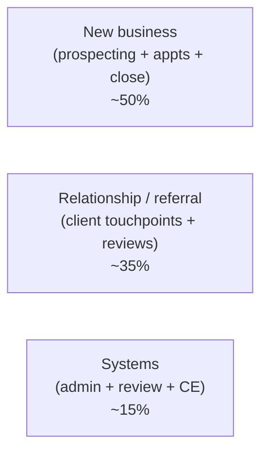

# Day 58 — How a Top Producer Runs a Week

> **The one idea for today:** The difference between top producers and everyone else isn't talent or luck. It's the weekly system they refuse to break.

By the time you close today you'll have pictured a realistic top-producer weekly schedule — time-blocked, discipline-driven, repeatable — separated the 3 activity categories that fill the calendar (New business · Relationship / Referral work · Systems), and audited your own current week against the model to spot the 1–2 blocks to add immediately.

---

## Why study the weekly rhythm

Every top producer who was once a new FC went through the same transition: from *"I work when there's something to do"* to *"I work the same week every week whether I feel like it or not."*

The transition isn't motivation. It's *structure.* Top producers run a weekly system that:
- Guarantees prospecting volume regardless of how many cases close
- Protects client-relationship work from getting crowded out
- Keeps administrative drift from eating productive hours
- Makes rest and family time *actually happen* rather than being vague aspirations

The specific hours vary person to person. The structural pattern is remarkably consistent.

---

## A representative week — the 3-category split

A typical top-producer week runs about **45–50 productive hours** split across 3 categories:

Rough breakdown:
- **New business (22–25 hrs)** — prospecting calls, Fact-Finds, pitches, closes
- **Relationship / referral (16–18 hrs)** — client reviews, onboarding, after-sales touchpoints, referral asks
- **Systems (6–8 hrs)** — admin, weekly review, CE, mentor work, reading

Most new FCs over-spend on systems (too much planning, not enough doing) and under-spend on relationships (which is why their Year-2 book is hollow).

---

## A sample weekly schedule

A representative top-producer week in time-blocks:

### Monday — calling day
- **8:30–9:00** — Weekly review, pipeline scan, target list finalisation for the week
- **9:00–12:00** — Prospecting calls (Market Survey / warm outreach / referral follow-ups). Two phones, no distraction.
- **12:00–13:00** — Lunch + email triage
- **13:00–17:00** — More prospecting + appointment setting + text/DM follow-ups
- **17:00–18:00** — Admin buffer

### Tuesday – Thursday — meetings
- **9:00–11:00** — Prospecting or client calls (flex)
- **11:00–12:30** — Meeting 1 (Fact-Find / pitch / review)
- **12:30–14:00** — Lunch + travel buffer
- **14:00–15:30** — Meeting 2
- **15:30–17:00** — Meeting 3 or buffer + debrief
- **17:30–19:00** — Meeting 4 (evening slot for after-work prospects)

### Friday — review + relationship day
- **9:00–10:00** — Weekly scorecard review (CAR numbers from Day 3/23)
- **10:00–12:00** — Onboarding touchpoints (Day-7 / Day-30 / Day-90 messages and calls)
- **12:00–13:00** — Lunch + peer / mentor call
- **13:00–15:00** — Client review meetings (A-tier check-ins)
- **15:00–17:00** — Systems work — CE, reading, content creation, learning

### Saturday — mixed (half-day or flex)
- **9:00–12:00** — Client meetings that couldn't fit weekdays, or content creation, or prospecting if pipeline is light
- **12:00 onwards** — off

### Sunday — off + 30-min review
- 30 minutes late evening: next week's prep, target list update, calendar block confirmation
- Rest the other 23 hours

**Total:** ~45 productive hours. Sustainable long-term. Not heroic — just disciplined.

---

## The non-negotiables

Across every top-producer schedule, a few patterns appear consistently:

### Monday = calling day
Most top producers block Monday morning as pure calling time. No meetings, no admin, no email. The rationale: the week's pipeline is set in those 3 hours. If Monday morning gets eaten by anything else, the week suffers. *"Calling Monday"* is non-negotiable.

### Protected meeting windows
Specific time blocks held sacred for prospect meetings. Prospects adjust to your schedule, not the reverse. Top producers don't move meetings to fit admin or personal requests — admin and personal fit around the meeting grid.

### Friday review + onboarding
Friday morning is the weekly scorecard review. Friday early afternoon is onboarding and client touchpoints. The week closes with *relationship* work, not new business — because new business momentum carries into next Monday automatically.

### Saturday as flex
Not pure rest, not full work. Used for overflow meetings, content creation, and professional development. Creates a pressure valve so weekday blocks don't slip.

### Sunday as off + 30-min prep
Rest is scheduled, not hopeful. 30 minutes of prep Sunday evening makes Monday's first 3 calling hours effortless.

---

## What top producers *don't* do

Sometimes patterns are clearer by omission:

- **Don't check email during calling blocks** — 3 focused calling hours produce more than 6 fragmented ones
- **Don't attend every networking event or optional meeting** — they pick 1–2 high-value recurring ones, skip the rest
- **Don't re-learn the same lessons** — they build systems that encode learnings (checklists, templates, CRM flows) rather than relying on memory
- **Don't take every prospect** — they qualify early and walk from bad fits rather than sinking 3 meetings into someone who won't close or would be a hard client

The discipline of *not* doing the wrong things is as important as the discipline of doing the right things.

---

## Common failure modes for new FCs

Where the weekly rhythm typically breaks in Year 1:

### Failure 1 — calling drift
You meant to call 3 hours Monday morning. You ended up checking email for 20 min, responded to a client, followed up on admin, and by the time you picked up the phone it was 10:30am with a fragmented 90 minutes left. *This is the #1 Year-1 failure.*

**Fix:** calling blocks are protected. Phone off notifications. Browser closed except CRM. Set the 3-hour block and don't leave the chair except for water and bathroom.

### Failure 2 — meeting flexibility erodes the grid
A prospect asks to move Tuesday 2pm to Thursday 4pm. You say yes. Over 6 weeks, the grid dissolves into chaos. Can't find calling windows. Can't protect Friday review.

**Fix:** offer 2 alternative times that fit *your* grid, not their preferred slot. *"Tuesday 2pm or Thursday 11am work — which's better?"* Prospects adjust.

### Failure 3 — systems work expands to fill available time
You block Friday 3–5pm for CE / reading. It becomes Friday 1–5pm. Then Friday 11–5pm. Then half of Tuesday. Suddenly you're spending 15 hours a week on systems and 20 on actual revenue-generating work.

**Fix:** systems stays under 20% of the week. If it creeps higher, something's wrong — usually a signal that you're avoiding the uncomfortable work (calling, closing) by doing the comfortable work (planning, learning).

---

## Adapt, don't copy

The schedule above is a model, not a template to copy verbatim. Your context will differ:

- **Early morning people** may prefer 6:30–9:30am calling blocks
- **Evening prospects** (working professionals, entrepreneurs) may mean more 6–9pm slots
- **Family commitments** may shape when deep work happens
- **Local market patterns** (e.g., Singapore office hours, Ramadan adjustments) affect meeting timing

**Keep the structure**, adapt the specifics. Calling block + protected meeting windows + weekly review + onboarding discipline + Sunday prep — those are the invariants. The exact hours are flexible.

---

## The hunger that lasts — Year-5 thinking

The weekly system above is what top producers *run*. Why they run it for 5, 10, 20 years without breaking — while peers who started the same week quit in Year 2 — is a different question. It's the hunger question.

Year-1 hunger is easy. The numbers are small. Progress is visible weekly. The stakes feel high. You want to prove you can do this career.

Year-5 hunger is different. By Year 5 the book produces recurring revenue. The early fear of *"can I survive this?"* is answered. The income is stable. Calls don't feel existential the way they did in Month 2.

That's exactly where most multi-year plateaus start.

**What keeps top producers compounding past Year 5 isn't the same thing that got them through Year 1.** Year-1 hunger was *fear of failure*. Year-5+ hunger is something else — usually one of three things:

| Year-5+ motivator | What it looks like |
|---|---|
| **Mastery** | *"I want to be the best version of this craft that exists. I'll still be studying objection handling at Year 20."* |
| **Impact scale** | *"Every additional client I handle well is a family better off. I won't cap at 50 clients when I can serve 200."* |
| **Legacy identity** | *"I want the next generation of FCs in my team to say 'she's the standard we measure against.'"* |

Year-1 FCs can't pick their Year-5 motivator honestly yet — you haven't experienced the shift. But you can *notice* which one resonates most when you read them. That resonance is data.

**The drill.** On the back of your Day-59 scorecard, write one sentence: *"Five years from now, what keeps me still caring on a Wednesday in Month 59?"* If the answer is *"I don't know yet,"* that's fine — note the question, revisit at Month 12. The question is the anchor. Top producers eventually find a Year-5 motivator that carries them through the plateau — and the ones who never find it exit the career in Year 3–5 despite doing everything else right.

Year-1 discipline keeps you alive. Year-5 hunger keeps you *compounding*.

---

## Out-Learn = Out-Earn — the 4 Pillars underneath

The Year-5 motivators in §8 are *why* top producers keep running. The 4 Pillars are *what* they run on — the physical and mental infrastructure that makes 5-year compounding possible.

### The 4 Pillars

| Pillar | What it means | Daily evidence |
|---|---|---|
| **1 · Desire** | Answered with 3 questions: *what do you want / how will you get it / how badly do you want it?* | Your Year-5 sentence from §8. If you can't answer, discipline alone won't carry you. |
| **2 · Mental resilience** | *Sometimes you need to slow down to speed up.* Reading, CE, roleplays. | 15 min of reading / day × 250 working days = **62.5 hours of craft growth per year.** |
| **3 · Physical resilience** | Exercise + sleep + healthy eating. *"Your mental energy will be limited by your physical resilience."* | The advisor who skips sleep to squeeze 2 more calls loses the next day's 5 calls to poor decision-making. |
| **4 · Discipline** | Monday block, Friday review, Sunday prep — regardless of feeling. | The operating system from §2–5. The week that runs when motivation has run out. |

### The Out-Learn = Out-Earn rule

> *"When you out-learn your competitors and your peers, you will out-earn them."*

15 minutes of reading daily beats 3 hours once a month. The daily rhythm is what accumulates into expertise. The accumulation is what makes your Year-5 pitch land when a peer's Year-5 pitch plateaus.

**What 62.5 hours / year of professional reading actually buys you:**
- More thorough thinking under pressure
- A different lens on the same client problem (peers see one angle; you see three)
- Deeper resource for clients — you become the person they call with the weird question
- Better vocabulary + writing + conversation quality
- Expert positioning that attracts others — inbound referrals compound
- Subconscious programming that problem-solves while you sleep

### Setting up the rhythm today

Pick one:
- Morning 15 min with coffee — business section + one advisory book chapter
- Commute — podcast or audiobook
- Evening — last 15 min before sleep, book only (no screen)

Commit to the time-of-day, not just *"I'll read when I can."* Consistency is the whole mechanism; sporadic reading produces sporadic growth.

**The frame.** Year-1 discipline keeps you alive. Year-5 hunger keeps you compounding. The 4 Pillars are what converts the hunger into behaviour that actually happens every day.

---

## Quiz

**Q1. In a representative top-producer week, the 3 activity categories split roughly:**
- A) 90% new business, 5% relationships, 5% systems
- B) ~50% new business, ~35% relationship / referral, ~15% systems ✓
- C) Equal thirds
- D) 25% new business, 50% relationships, 25% systems

**Why:** New business produces today's revenue; relationship work produces tomorrow's revenue (via retention and referrals); systems make the engine sustainable. The ~50/35/15 split balances all three. New FCs typically over-invest in systems (too much planning, CE, reading) and under-invest in relationships (which is why Year-2 books are hollow). A is the Year-1 hero-mode pattern that burns out by Year 2.

**Q2. Monday-as-calling-day is a near-universal top-producer pattern because:**
- A) Prospects are fresh on Monday
- B) The week's pipeline is set in those 3 hours — if Monday morning gets eaten by anything else, the rest of the week suffers ✓
- C) Admin tasks accumulate over the weekend
- D) It's a tradition

**Why:** Pipeline volume is the lagging indicator of whether Monday's calling block actually happened. Top producers protect it ruthlessly — no email, no meetings, no admin, just calling. New FCs typically allow Monday to drift, and then spend the rest of the week playing catch-up on prospecting. The Monday block is structural, not preferential.

**Q3. Systems work (admin, review, CE) expanding to consume 30%+ of the week is:**
- A) A sign of deep investment in long-term growth
- B) Usually a signal that the advisor is avoiding uncomfortable revenue-work (calling, closing) by doing comfortable planning-work ✓
- C) Required for regulatory compliance
- D) Fine as long as new business still hits targets

**Why:** Systems should stay under 20% of the week. Creep above that is almost always a disguise for avoidance — planning and learning are comfortable; calling and closing are uncomfortable. New FCs rationalise the avoidance as *"I need to learn more first"* or *"I need to optimise my CRM."* The diagnostic: if new business numbers are flat while systems work is expanding, the systems work is hiding the real problem. Fix the avoidance, not the system.

**Q4. Monday morning calling block should be:**
- A) Flexible based on how motivated you feel
- B) 3 hours, protected — no email, no meetings, no admin, phone notifications off, browser closed except CRM ✓
- C) 30 minutes max to ease into the week
- D) Spread across the day

**Why:** 3 focused hours produce more than 6 fragmented ones. The protection is the whole point — any permeability to email, meetings, or admin and the block dissolves into fragments. Top producers treat Monday morning as sacred; the week's pipeline is set in those 3 hours, and if Monday drifts, the rest of the week suffers. Structural protection beats willpower every time.

**Q5. A prospect asks to move a Tuesday 2pm meeting to a random Thursday 4pm slot. The correct response is:**
- A) Say yes — client flexibility matters
- B) Offer 2 alternative times that fit *your* grid — *"Tuesday 2pm or Thursday 11am work — which's better?"* ✓
- C) Refuse any rescheduling
- D) Move all your other meetings to accommodate

**Why:** If you let every prospect dictate your calendar, the grid dissolves in 6 weeks and you lose all the protected blocks (calling, review, onboarding). Offering 2 alternative times respects their needs *and* protects your system. Prospects adjust to this — most of the time they'll pick one of the offered times. If none work for them, genuinely constrained prospects will say so; flaky ones will keep requesting off-grid slots, which is information.

**Q6. Year-5+ hunger is usually driven by one of three things. Which is NOT one of them?**
- A) Mastery — pursuit of craft excellence
- B) Impact scale — wanting to serve more people
- C) Legacy identity — wanting to be the standard for the next generation
- D) Competition — beating peers in rankings ✓

**Why:** A, B, C are the motivators that sustain multi-decade careers in advisory. Competition-as-motivator burns out because rankings are zero-sum and comparative — you'll always find someone doing better, and the motivator turns against you. The three sustainable motivators are internal (mastery), outward (impact), or identity-focused (legacy). Year-1 FCs can't pick theirs yet; the question is the anchor to revisit at Year 1.

**Q7. The Year-5 hunger question *"what keeps me still caring on a Wednesday in Month 59?"* works because:**
- A) It tests discipline
- B) It anchors the learner to a specific future moment where their current motivator (fear of failure / novelty) will have faded — forcing them to find a more durable one ✓
- C) It's philosophically interesting
- D) It predicts income

**Why:** Year-1 motivators (fear of not surviving the career, novelty of being new, proving you can do it) all fade by Year 3–5 once survival is achieved. The Wednesday-Month-59 prompt simulates that post-fade state — *"when the current motivator is gone, what's the replacement?"* Noticing the answer (or noticing you don't have one yet) is how top producers identify what they need to build or discover over the next 5 years to keep compounding past Year 5.

---

## Related

- Previous: [[day-57|Day 57 — Building Moments: Touch-Point Calendar]]
- Next: [[day-59|Day 59 — Your First $X FYC: Reviewing Your Numbers]]
- Week 10 overview: [[README|Week 10 — After the Close + Graduation]]
