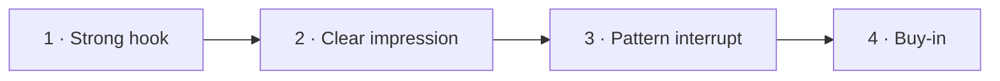

# Day 7 — The Intent Statement (Framework)

> **The one idea for today:** The first 60 seconds decide the next 60 minutes. An intent statement is how you engineer that opening instead of hoping for it.

By the time you close today you'll know the 4 ingredients of a good intent statement (hook, clear impression, pattern interrupt, buy-in), you'll apply the Lady's Skirt principle (long enough to cover the essentials, short enough to stay interesting), and you'll spot which of the 4 traps (task-oriented, jargon, generic, too long) is weakening your current opener.

---

## What an intent statement actually is

An intent statement is the first structured thing you say to a new prospect after the small talk ends. It is not a pitch. It is an *opener* — a short, deliberate sentence or two that sets the impression you want the person to carry for the rest of the meeting.

The impression is up to you. You choose in advance which version of advisor you want them to feel they're meeting:

- The *objective and unbiased* advisor
- The *sincere, for-the-people* advisor
- The *extremely competent, always gets it done* advisor

Pick one. Commit. The intent statement is the tool that plants it.

---

## The 4 ingredients

Every good intent statement has four parts:

**1 · Strong opening hook.** The first sentence is an introduction, not a product line. Like the first paragraph of an essay — if it doesn't pull the listener in, the next nine sentences don't matter.

**2 · A clear impression you want to leave.** Don't try to be all three versions of advisor. Pick one. "Objective" is the most common starting choice for new FCs — it's believable, low-pressure, and hard to argue with.

**3 · A pattern interrupt.** Something they didn't expect to hear from an advisor. Most prospects have a script in their head for what an advisor says — break it. *"Not every one of my company's products will be the best fit for you"* breaks it. *"I genuinely only want you to work with me if the value you get is more than the value I take"* breaks it. More on this tomorrow.

**4 · Buy-in.** End with *"does that sound fair?"* or *"does that sound good?"* or similar. You're not asking for a commitment — you're asking them to *agree to the frame.* Once they say yes, you've set the rules of the meeting.

---

## A worked example

Here's the classic four-ingredient version, delivered verbatim:

> *"Good morning — before we get started with our session today, I'm sure you'd like to know a little more about who you might eventually be working with. So I want to put something on the table upfront: having been in this industry for some time, I know for a fact that not every one of my company's products is always going to be the best fit for you. You have my word that if, across the course of our conversation, we find that there are areas of your portfolio better solved by another provider, I will be objective and honest with you about that. However, if we uncover areas my company can effectively implement and solve for, I'll do my best to help you there. **Does that sound fair?**"*

Unpack it against the four ingredients:

| Ingredient | Where it lives in the script |
|---|---|
| **Hook** | *"I want to put something on the table upfront"* |
| **Impression** | Objective advisor — *"I'll be honest… better solved by another provider"* |
| **Pattern interrupt** | *"Not every one of my company's products is going to be the best fit"* |
| **Buy-in** | *"Does that sound fair?"* |

Every element has a job. Remove any one and the statement weakens.

---

## The Lady's Skirt principle

A strong intent statement obeys the **Lady's Skirt theory:**

> *"Long enough to cover the essentials; short enough to be interesting."*

Too short, and it sounds like a line you rehearsed. Too long, and you lose the room before you've earned it. Aim for ~30–45 seconds spoken — three or four sentences max.

**Teaser variants that follow the same principle:**
- *"Many people overlook one critical aspect of retirement planning that costs them thousands — want to know what it is?"*
- *"There's a strategy some of my clients use that shortened their retirement timeline by 5–10 years. It's not what most people expect."*

The pattern: name the surprising thing → invite curiosity → don't reveal the answer until they ask.

---

## The 4 traps to avoid

New FCs almost always fall into one of these four:

| Trap | What it sounds like | Why it fails |
|---|---|---|
| **Task-oriented** | *"I help you review your insurance portfolio and recommend products."* | Prospects don't care about your process — they care about the benefit |
| **Industry jargon** | *"I specialise in holistic wealth accumulation and risk mitigation strategies."* | Jargon alienates. The prospect stops listening. |
| **Generic / vague** | *"I help people with their financial planning."* | Blends in with every other advisor they've met |
| **Too long** | Three paragraphs explaining your approach | Loses punch. They stop tracking by sentence two. |

**Diagnostic question:** read your current intent statement aloud. Which of these four traps does it fall into? Fix that one first, tomorrow.

---

## When to use it

Use the intent statement **as early as possible** in the first appointment — right after the small-talk settles, before you open the OST or fact-find. For a phone appointment-setting call, you can use a shorter version in the call itself.

**When NOT to use it:**
- On a cold call where there's no established intent to meet yet (you'd have to explain who you are first)
- In the middle of a meeting already underway (the moment is past)

The rule: it belongs at the top of the frame, not inside it.

---

## Quiz

**Q1. The four ingredients of a good intent statement are:**
- A) Pitch, features, benefits, close
- B) Hook, clear impression, pattern interrupt, buy-in ✓
- C) Introduction, credentials, products, ask
- D) Smile, compliment, question, pitch

**Why:** Without a hook, the rest isn't heard. Without a clear impression, you sound like every other advisor. Without a pattern interrupt, their sales-resistance stays up. Without buy-in, they haven't agreed to the frame. All four do different jobs.

**Q2. The "Lady's Skirt" theory says a good intent statement is:**
- A) Long enough to explain everything, short enough to remember
- B) Long enough to cover the essentials, short enough to be interesting ✓
- C) Exactly 60 seconds
- D) As short as possible

**Why:** Too short and you sound underprepared or scripted. Too long and the listener disengages before the pattern interrupt lands. The sweet spot is roughly 30–45 seconds spoken — three or four tight sentences.

**Q3. Which of these openers falls into the "generic / vague" trap?**
- A) *"Not every one of my company's products will be the best fit for you."*
- B) *"I help people with their financial planning."* ✓
- C) *"I specialise in helping parents grow wealth while covering their family's risks."*
- D) *"Before we start, I want to put something on the table upfront."*

**Why:** Option B could be said by any advisor anywhere. It carries no impression, no pattern interrupt, and no hook. A, C, and D each commit to a specific frame — generic is the absence of a frame, not a bad frame.

**Q4. The intent statement works best delivered:**
- A) Anytime during the meeting
- B) As early as possible — right after small talk settles, before the OST/fact-find opens ✓
- C) At the close, to reset the frame
- D) Never — it's a gimmick

**Why:** The intent statement's job is to plant the impression you want carried through the rest of the meeting. If you wait, the prospect forms their own impression from your small talk and your first few fact-find questions. The top of the frame is when the prospect is most open to being told what shape this meeting takes.

**Q5. When is the intent statement *not* appropriate?**
- A) With any warm-market prospect
- B) On a cold call where no intent to meet has been established yet, or mid-meeting once the frame has already formed ✓
- C) At a first meeting with a C-profile client
- D) With prospects younger than 30

**Why:** Cold context has no "meeting frame" to set yet — you'd have to explain who you are before the intent statement had meaning. Mid-meeting is past the moment — the impression has already formed. The intent statement belongs at the *top of the frame*, not inside it and not before it.

**Q6. The pattern interrupt in the worked example is:**
- A) "Good morning"
- B) "Not every one of my company's products is going to be the best fit for you" ✓
- C) "Does that sound fair?"
- D) "Having been in this industry for some time"

**Why:** Advisors are expected to defend their company's products. The line *"not every one of my products is going to be the best fit"* breaks the mental script the prospect has been running — their sales-resistance suspends for 10–20 seconds. That's the window where the impression actually lands.

**Q7. The "task-oriented" trap fails because:**
- A) It's too short
- B) Prospects don't care about your process — they care about the benefit to them ✓
- C) It uses too much jargon
- D) It isn't delivered with enough certainty

**Why:** *"I help you review your insurance portfolio and recommend products"* describes what you do to the portfolio. The prospect is listening for what happens to *them* — their time back, their family protected, their plan working. Task-oriented openers miss the emotional transfer and blend in with every other advisor.

---

## Related

- Previous: [[../week-1/day-06|Day 6 — Practice: Your 90-Second Intro]]
- Next: [[day-08|Day 8 — The Intent Statement: Your Pattern Interrupt]]
- Week 2 overview: [[README|Week 2 — Your Voice I: Intent & Positioning]]
