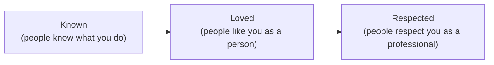

# Day 10 — Profile as Compound Asset

> **The one idea for today:** Your profile is working 24/7 whether you are or not. Make it earn the trust before you have to.

By the time you close today you'll have scored your IG profile across 6 elements (picture, name, category, bio, link, highlights) and spotted which one to fix first, rewritten your bio using the Why / What / How structure in under 30 minutes, and picked either Authority or Social positioning based on your stage and temperament.

---

## Why the profile is a compound asset

Most new FCs think of social media as a *broadcast* channel — they post something, they hope it reaches someone. That's not where the money is.

The real value of a strong profile is **asymmetric trust-building that compounds while you sleep.** Every person you prospect, every referral someone hands you, every warm-market person you text — they will look up your profile before they reply. Your profile decides whether they reply.

Think about it this way: you spend an hour today fixing your bio. Over the next year, somewhere between 200 and 2,000 prospects will see it. Each of those viewings is a silent trust decision. A good bio earns trust in one viewing. A bad one burns it.

That's compound math. One hour of fix → 200+ trust wins. Fastest ROI in your whole prospecting stack.

---

## The KLR framework — what your profile is trying to do

Every strong personal brand in financial services builds three signals simultaneously:

| Signal | What it looks like | Channel |
|---|---|---|
| **Known** | *"Oh, she's an advisor."* | Profile name + category + bio |
| **Loved** | *"She seems like a real person."* | Stories — personality, interests, life |
| **Respected** | *"She knows her stuff."* | Posts — frameworks, client wins, insights |

A profile that hits all three reads as a *human professional*. Missing one of three is where profiles fail:

- **Known + Loved but not Respected** = *"fun person, but would I trust her with my money?"*
- **Known + Respected but not Loved** = *"competent but robotic. I'd rather work with someone warmer."*
- **Loved + Respected but not Known** = *"I like her content, but what does she actually do?"*

All three signals matter. Today is about the **Known** foundation — the profile. Tomorrow covers **Loved** (stories) and **Respected** (content).

---

## The 6 profile elements

Six fields. Each has a job.

| Element | Purpose | Do | Don't |
|---|---|---|---|
| **Profile picture** | Instant recognition | Professional faceshot or candid, smile visible, brand-colour background. Tools like pfpmaker.com help. | Cartoon, group shot, or anything that hides your face |
| **Profile name** | Searchability | Your real name. If taken, add "real" / "official" (e.g., `TheRealJunHong`) | Symbols, numbers, repeated letters, or long nonsense handles |
| **Category** | Labelling | *Financial services* / *Insurance agent* / *Public figure* | Blogshop, anything irrelevant |
| **Bio** | Who / what / how, in 150 chars | See Section 4 | Leave empty, or use the same generic line as every other advisor |
| **Link** | Single CTA | Telegram channel, YouTube, or lead-magnet download | Junk links with no value |
| **Highlights** | Always-on proof | Client wins, behind-the-scenes, FAQs, testimonials | Random old stories, nothing curated |

**Diagnostic.** Open your profile right now. Score each element 1–5 against the *Do* column. Whichever scores lowest — that's the element you fix tonight.

---

## The Why / What / How bio structure

A bio has roughly 150 characters. That's 2–3 lines of text. Burn them on three jobs, in order:

**Why you should follow me (credibility):**
- *"Made 28 claims in 2021. 89 clients protected. $3.5M AUM to date."*
- If you have no results yet (you won't for Week 2–3 — that's normal), replace results with *specificity*: *"Working with late-20s professionals in tech navigating their first big financial decisions."*

**What results you can get (promise):**
- *"I help millennials get $2,000/month passive income without spending more than 5 mins a week."*
- The "without [common objection]" half is what makes it stick. It handles the fear before they voice it.

**How you can get it (CTA):**
- *"Click the link below to download my free Financial Reset checklist."*
- If you don't have a lead magnet yet, the CTA can simply be a Telegram channel or a booking link. Either beats nothing.

**Worked example:**

> **Jenny Tan**
> Financial Consultant, AIA
>
> Helping late-20s professionals in tech build their first structured financial plan — without ten confusing policies.
>
> 🔗 Free 5-min financial reset quiz ↓

Three lines. Who. What. How. No jargon. No *"holistic financial planning."* No *"passionate about helping clients achieve their dreams."*

---

## Authority vs Social — pick one

There are two proven approaches. Pick the one that fits your stage.

| | **Authority** | **Social** |
|---|---|---|
| **Built on** | Topic or market | Interest or identity |
| **Bio states** | Profession + who you help | Interest / identity (and profession in the category field) |
| **Pros** | Easier to create sales conversations — people know why they're following you | Easier to grow the page — people know *you*, then discover what you do |
| **Cons** | Harder to grow the page | Harder to create sales conversations |
| **Who it fits** | FCs with a clear niche or strong framework | FCs with a strong personality, hobby, or community base |

Most Week-2 FCs should start **Authority** if they have a clear niche in mind, or **Social** if they don't yet — grow the audience first, monetise the relationships later.

### Optional: the named framework

A named framework inside the bio gives you a *memorable shorthand* for what you do. Examples:

- **P.I.S.A** — Protect · Income · Scale · Assets
- **F.A.T** — Foundation · Accelerate · Transfer

If you use one, put it in the bio. It makes the *What* line sharper and the *How* feel more credible. Don't invent a framework just to have one — but if your existing process has 3–4 clear phases, naming them pays.

---

## The 30-day goal

A benchmark for a serious IG profile in Month 1:

| Metric | Target | Driven by |
|---|---:|---|
| Followers | 1,000 | Positioning + clean-up + consistent content |
| Conversations | 100 | Engagement strategy + stories |
| Sales | 10 | DM funnel |

For a Week-2 FC this is aspirational. You are nowhere near 1,000 followers yet. That's fine — the point isn't to hit 1,000 this month; it's to know which direction you're pointing.

The leading indicator you *can* move this week is simpler: **does your profile make a cold viewer stay on it for 20 seconds, or do they bounce in 3?** A good bio, clean highlights, and a real-person profile pic is what gets you to 20.

---

## The 5 Levers of Familiarity

The profile is *one* of five levers for being remembered. Strong profiles don't sell by themselves — they combine with the other 4 to compound trust over months. Understanding all 5 stops you from over-investing in any single lever.

| Lever | What it builds | Where it lives in your week |
|---|---|---|
| 1 · **Persistent daily prospecting** | One-to-one touches — calls, DMs, voice notes | Day 19/20/22 work |
| 2 · **Referrals** | Borrowed trust — customer / personal / professional | Week 5's full curriculum |
| 3 · **Networking** | Showing up at events + chambers + communities | *"Nobody cares about you; they want to talk about themselves"* |
| 4 · **Company + brand familiarity** | AIA's brand + team reputation you can point to | Team credentials, office presence |
| 5 · **Personal branding** | Profile, content, speaking, volunteering — owned assets | Today (profile) + Day 11 (stories/content) |

**The compound.** A prospect who has seen your profile (5), heard about you from a friend (2), *and* received your DM (1) replies at ~10× the rate of someone touched through only one lever.

**Where new FCs break:** they spend Week 2 on profile obsession (lever 5 only) while ignoring 1, 2, 3. The profile polishes; the pipeline stays empty. Profile is necessary, not sufficient — **1 of 5, not 5 of 5.**

---

## Quiz

**Q1. The KLR framework for personal branding stands for:**
- A) Knowledge, Leadership, Results
- B) Known, Loved, Respected ✓
- C) Kind, Likeable, Reliable
- D) Kept, Linked, Registered

**Why:** Known = people know what you do (profile fundamentals). Loved = people like you as a person (stories). Respected = people see you as a professional (content). Missing any one makes the profile feel incomplete — fun but untrustworthy, competent but cold, etc.

**Q2. The Why / What / How bio structure uses each line for:**
- A) Greeting / introduction / sign-off
- B) Credibility / promise / CTA ✓
- C) Name / title / company
- D) Hashtags / mentions / link

**Why:** Why = credentials or niche specificity that earns the follow. What = the concrete outcome you help with, with the common objection handled. How = the single CTA (link, channel, lead magnet). 150 characters is tight — every line has to do a job.

**Q3. A new FC with strong interest in fitness, no niche chosen yet, and 80 followers should probably position their profile as:**
- A) Authority — pick a client niche and go hard
- B) Social — lead with fitness, build the audience, convert relationships later ✓
- C) Generic financial planning — to keep options open
- D) Don't post until they have 1,000 followers

**Why:** Authority positioning is easier to convert but harder to grow. At 80 followers with no niche yet, growth is the bottleneck. Lead with the interest (fitness), grow the audience, then introduce the profession naturally once the relationships are established. C is the path that actively fails — generic positioning is what option B is trying to avoid. D reverses cause and effect.

**Q4. The 6 profile elements (where you score 1–5 for each) are:**
- A) Followers, following, posts, bio, link, name
- B) Profile picture, name, category, bio, link, highlights ✓
- C) Feed, reels, stories, IGTV, guides, live
- D) Username, password, email, phone, address, DOB

**Why:** These are the permanent fields a cold viewer sees in the first 3 seconds on your profile. Picture (recognition), name (searchability), category (labelling), bio (who/what/how), link (one CTA), highlights (always-on proof). Score them 1–5 each and fix the lowest first — that's the Day 10 move.

**Q5. Missing the *Respected* signal of KLR means your profile reads as:**
- A) Boring but safe
- B) "Fun person, but would I trust her with my money?" ✓
- C) "Competent but robotic"
- D) Invisible

**Why:** Loved without Respected is the classic new-FC failure — warm content, lots of personality, no frameworks or client wins visible. Prospects like the person but don't see the professional, so they never convert. Respected without Loved is the opposite failure ("competent but robotic"). Both signals need to coexist for a profile to convert at all.

**Q6. The key difference between Authority and Social positioning is:**
- A) Authority is better, Social is outdated
- B) Authority is easier to convert to sales but harder to grow; Social is easier to grow but harder to convert ✓
- C) Authority is for men, Social is for women
- D) There's no difference

**Why:** Authority says *"follow me because of what I do"* — high-intent audience, small. Social says *"follow me because of who I am"* — broad audience, softer intent. A new FC with a clear niche should go Authority; a new FC with a strong personality but no niche yet should go Social and grow the audience before monetising. Pick one based on your stage.

**Q7. A new FC fixes their profile picture to a clear faceshot with a smile. Why does this single change have compounding returns?**
- A) It makes the profile prettier
- B) Every person prospected, referred, or warm-messaged over the next year looks up the profile before replying — one fix × 200–2,000 viewings is asymmetric ROI ✓
- C) Instagram's algorithm boosts profiles with faces
- D) Photographers charge for this

**Why:** The compound math is the whole point of Day 10. One hour of work on a field that will be viewed hundreds to thousands of times creates ROI that no other single activity in your week matches. The algorithm angle (C) isn't false but isn't the driver — human trust judgments are.

---

## Related

- Previous: [[day-09|Day 9 — Positioning: The Objective Advisor]]
- Next: [[day-11|Day 11 — Personal Branding P2: Content + Stories]]
- Week 2 overview: [[README|Week 2 — Your Voice I: Intent & Positioning]]
