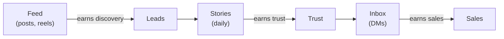

# Day 11 — Content + Stories Rhythm

> **The one idea for today:** Feed earns leads. Stories earn trust. Inbox earns sales. One engine, three surfaces.

By the time you close today you'll turn one insight into three posts using the RSP method (Relatable · Simple · Provoking), plan a week of stories on the PPVV + 5-types rhythm instead of staring at a blank screen at 9pm, and know exactly what each of the three surfaces — feed, stories, inbox — is for.

---

## The three-surface model

Every good IG strategy runs the same loop. The surfaces do different jobs:



- **Feed** is your portfolio. Permanent posts that a cold viewer scrolls to decide if you're worth following. Fewer, heavier pieces.
- **Stories** is your reality TV. Daily, disposable, personal. This is where 80% of your actual follower attention lives — and where trust builds.
- **Inbox** is where sales actually happen. The DM is the handoff from trust to conversation.

New FCs blow time on the feed because it feels like "content." But **stories are where your follower attention actually lives** — posts enhance the landing page; stories build the relationship. Ratio to aim for: **1 post a week, 3 stories a day.**

---

## The RSP method — one insight, three pieces of content

The biggest content blocker for new FCs isn't ideas — it's *reuse*. One strong insight should produce three posts, not one.

Every insight gets filtered through three screens:

### R — Relatable
Does this connect to what your audience is dealing with *right now?* 

| Audience | What matters NOW |
|---|---|
| Students / new grads | Uncertain job market |
| Working singles | Long HDB wait, high rent |
| Married | Cost-of-living inflation |
| Married with kids | Childcare, schooling, protection |
| Pre-retirees | Healthcare inflation, retirement adequacy |

Start with *where their head already is*. Content that's relatable gets read; content that isn't gets scrolled past.

### S — Simple
One point per post. Simple words. If a 16-year-old cousin wouldn't get it, rewrite it.

### P — Provoking
Challenge a belief they currently hold.

| Current belief | Provoking counter |
|---|---|
| *"I don't need an advisor — I can read."* | *"60%+ of self-directed Singaporeans are under-covered."* |
| *"Crypto is a good investment."* | *"85% of retail investors lose money in crypto."* |
| *"Insurance is about death."* | *"90% of claims paid out in 2023 were for living benefits — not death."* |

Provoking doesn't mean combative. It means *reframing*. The reader sees the topic differently after reading your post than they did before.

---

## The multiplier — 1 insight → 3 posts

One RSP-filtered insight gives you three post formats:

### Format 1 — One-Liner
**Structure:** one-liner quote or question → 2 sentences of what it means to you.

Example:
> *"Did you know you could spend on what you want and still have enough for retirement?*
>
> *I grew up thinking there was never enough. It's demoralising — but thankfully there's a way out."*

### Format 2 — Tips
**Structure:** one-liner → brief context → 3 practical tips.

### Format 3 — Story
**Structure:** one-liner → share a specific negative experience → consequence → possibility → 3 tips → closing advice.

Same underlying idea. Three formats. Three audience segments reached. This is the content engine — not inventing three new ideas, but multiplying one.

---

## The 4 content types (feed)

Posts split into four categories. Each does a different job:

| Type | Best for | Format cue |
|---|---|---|
| **Useful** | Authority positioning | Carousel, <10 images, slide 9 = summary, slide 10 = CTA. 60-second reels that solve one problem. |
| **Funny** | Social positioning | Memes, GIFs. Insider jokes for social; express-their-pain jokes for authority. |
| **Relatable** | Either | Story-based. Share emotion. Common ground + a touch of vulnerability. |
| **Inspiring** | Authority | Wins, testimonials, David-vs-Goliath, victim-to-victor arcs. |

Mix them. A week of only Useful posts reads like a textbook; a week of only Funny reads like a teenager's page. Aim for **2 Useful, 1 Relatable or Inspiring, 1 Funny across 4 weeks** — not per week.

---

## Stories — the PPVV + 5-types rhythm

Stories are where new FCs freeze. *"What do I even post?"* Here's the rhythm that prevents that.

### PPVV — the personality-share spine

| Letter | What you share |
|---|---|
| **P**assion | Your interests — music, food, a side hobby |
| **P**ain | Your challenges — what you're wrestling with, honestly |
| **V**alues | What you care about — family, integrity, long-term thinking |
| **V**ision | Your goals and progress toward them |

Rotate through PPVV across the week. Prospects want to work with a *person*, not a company uniform. PPVV is the spine of the *Loved* signal from yesterday.

### 5 types of stories

Any given story fits into one of five types:

1. **YOU: PPVV** — Passion / Pain / Values / Vision
2. **Gratitude** — thanks, compliments, wins, losses, lessons
3. **Ask Questions** — use the *Questions* or *Poll* sticker
4. **Share Stories** — happen to fit one of 8 emotional registers (surprising, funny, frustrating, upsetting, happy, inspiring, embarrassing, grateful)
5. **Work Life** — behind-the-scenes, teach something small, people you work with

### Weekly stories calendar (3 stories a day)

| Day | Story 1 | Story 2 | Story 3 |
|---|---|---|---|
| **Mon** | Gratitude — person | Work Life — BTS / teach | Share story |
| **Tue** | Ask Qn (poll) | YOU — Pain | Gratitude — experience |
| **Wed** | Gratitude — compliment | Work Life — BTS / teach | Share story |
| **Thu** | Ask Qn (poll) | YOU — Passion | Gratitude — loss / lesson |
| **Fri** | Gratitude — win | Work Life — BTS / teach | Share story |
| **Sat** | Ask Qn (poll) | Work Life — people | Gratitude — lesson |
| **Sun** | Gratitude — self | YOU — Value | YOU — Vision |

**The move:** don't design each day from scratch. Copy this calendar. Fill the slots as they happen. Most of these are spontaneous — a photo of what you're doing, a question you're curious about, a work-related moment. Plan less, share more.

---

## Story-selling — the 6-box sequence

After 4+ weeks of non-sales stories, you earn the right to sell a soft pitch. Here's the structure:

```
┌─────┬──────────┬─────┬─────┬─────┬─────┬─────┬─────┐
│ 1   │ wait 3-6h│ 2   │ 3   │ 4   │ 5   │ 6   │ 7   │
│Poll │          │Story│Story│Story│Teach│Proof│ CTA │
└─────┴──────────┴─────┴─────┴─────┴─────┴─────┴─────┘
```

1. **Poll** — a problem-adjacent question. *"Ever had a bill arrive at the worst possible moment?"* Wait 3–6 hours so poll results boost reach.
2. **Story 1–3** — tell what happened, one beat per slide.
3. **Teach or tease** — one insight with an "agree? / no?" poll.
4. **Social proof** — a DM screenshot or testimonial.
5. **CTA** — a DM sticker: *"Who wants the full playbook?"* or *"Who needs help reviewing their coverage? — Me / Maybe later."*

**Do not run story-selling before week 4 of posting.** The 3 seeds (*who you help, what problem you solve, you're in demand*) need to be planted non-commercially first. Otherwise the pitch lands cold.

---

## Quiz

**Q1. The RSP method stands for:**
- A) Research · Strategy · Publish
- B) Relatable · Simple · Provoking ✓
- C) Reach · Signal · Post
- D) Read · Summarise · Publish

**Why:** Relatable makes the content meet the reader where they are. Simple makes it digestible — one point, plain words. Provoking makes it memorable — the reader sees the topic differently after. Missing any one dimension weakens the post.

**Q2. The three surfaces of an IG strategy do different jobs. Which pairing is correct?**
- A) Feed → sales, Stories → leads, Inbox → trust
- B) Feed → leads, Stories → trust, Inbox → sales ✓
- C) Feed → trust, Stories → sales, Inbox → leads
- D) All three do the same job

**Why:** Feed is your permanent landing page — cold viewers discover you there. Stories are where daily attention lives and trust compounds. Inbox is where the actual sales conversation happens. Confusing the jobs is the most common new-FC mistake — they pitch in the feed, which kills discovery, or small-talk in the inbox, which wastes the sales moment.

**Q3. The PPVV framework for sharing personality across stories is:**
- A) Passion, Pain, Values, Vision ✓
- B) Plans, Products, Value, Variety
- C) People, Process, Proof, Pitch
- D) Personal, Professional, Promotional, Public

**Why:** PPVV is the spine of the *Loved* signal in KLR. Passion = interests, Pain = what you're wrestling with (honest, not manufactured), Values = what you care about, Vision = goals and progress. Rotating through these across the week gives prospects a whole person, not just a profession.

**Q4. The ratio Day 11 recommends between feed posts and stories is:**
- A) 3 posts a week, 1 story a day
- B) 1 post a week, 3 stories a day ✓
- C) Only post once a day, nothing else
- D) Equal amounts

**Why:** Stories are where ~80% of your follower attention actually lives — daily, low-stakes, trust-building. Posts are your portfolio — permanent, heavier, discovery-level. The 1:21 ratio (1 post + 21 stories across the week) matches where attention actually goes. New FCs default to inverting this because posts feel like "content" — they burn time in the wrong place.

**Q5. The 4 content types for feed posts are:**
- A) Text, image, video, audio
- B) Useful, Funny, Relatable, Inspiring ✓
- C) Educational, Emotional, Entertaining, Experiential
- D) Dawn, day, dusk, night

**Why:** Each type does a different psychological job. Useful builds Respected. Funny builds Loved. Relatable builds connection. Inspiring builds aspiration. A feed that's only Useful reads like a textbook; only Funny reads like a teen's profile. Mix across 4 weeks: 2 Useful, 1 Relatable/Inspiring, 1 Funny.

**Q6. The RSP multiplier — turning one insight into three posts — means:**
- A) Writing three new insights each week
- B) Passing one insight through three formats (one-liner, tips, story) to reach different audience segments from a single idea ✓
- C) Reposting the same content three times
- D) Splitting a long post into three shorter ones

**Why:** The content bottleneck is rarely idea generation — it's reuse. One good insight has enough depth to support three different framings (quick one-liner, practical tips list, longer story arc). Each framing reaches a slightly different reader mood. The multiplier stretches your idea bank without asking you to generate three fresh ideas every week.

**Q7. "Do not run story-selling before week 4 of posting." Why?**
- A) Instagram's algorithm penalises early sales posts
- B) The 3 seeds (who you help, what problem you solve, you're in demand) need non-commercial planting first — otherwise the pitch lands cold ✓
- C) Most advisors quit before week 4
- D) Polls don't work until you have 1,000 followers

**Why:** Story-selling works because the audience already knows what you do, trusts you slightly, and has seen you in demand — the sales ask feels like a natural next step. Without those non-commercial foundations, the sales story reads as a salesperson who suddenly started selling. The 4-week delay is the earning period for the sell.

---

## Related

- Previous: [[day-10|Day 10 — Personal Branding P1: Profile as Compound Asset]]
- Next: [[day-12|Day 12 — Practice: Deliver Intent Statement to 3 Prospects]]
- Week 2 overview: [[README|Week 2 — Your Voice I: Intent & Positioning]]
