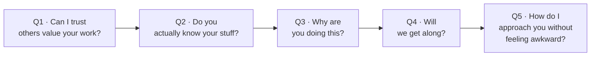

# Day 13 — The 5 Silent Questions

> **The one idea for today:** Before anyone DMs you, they run 5 silent checks. Your content either answers them or loses the lead before you knew it existed.

By the time you close today you'll know the 5 silent questions every cold prospect runs through your profile before engaging, audit your last 10 posts against those 5 questions (which are you answering, which are you ignoring), and plan a 5-post rotation where each post handles a different silent question.

---

## The gap most new FCs miss

You post something useful. Views go up. Nobody DMs. You assume the content was wrong.

It wasn't. Your post probably answered one of the silent questions — *"do you know your stuff?"* — and ignored the other four.

Prospects don't DM strangers on the strength of one useful post. They DM strangers they've decided are *safe to approach*. The 5 silent questions are the checklist their brain runs through on the way to that decision. Most of them run unconsciously. All of them need an answer somewhere on your feed, or the DM never comes.

---

## The 5 silent questions

Each question needs a *content type* that answers it. One post per question is enough — but all five have to exist somewhere on your feed or stories.

---

## Q1 — Can I trust that others value your work?

This is social proof. Testimonials. Real client stories. Without it, you're a stranger making claims.

**What answers it:** a testimonial post in the **pre-during-post** format.

> *"Before working with me, Ryan felt lost about his finances. During our consultation, we built a clear strategy tailored to his goals. After implementing the plan, he now has a structured roadmap and knows exactly what every dollar is doing."*

Three beats:
- **Before** — what the client's situation felt like
- **During** — the work you did together
- **After** — the state they're in now

**Strengthens it further:** a screenshot of a genuine client message, a short video testimonial, a specific dollar figure or outcome.

**New-FC workaround:** no closed cases yet. Use *first-60-days* client wins from your mentor's book, with their permission and their client's permission. Or use case studies from your training — framed as *"here's how this kind of situation typically gets solved,"* not claimed as your own.

---

## Q2 — Do you actually know your stuff?

Expertise. Most new FCs only answer this question — educational carousels, product explainers, tax tips. It's necessary but not sufficient.

**What answers it:** a breakdown of a real client challenge, solved in plain language.

Avoid:
- Jargon (*"holistic wealth accumulation strategies"*)
- Vague authority claims (*"trust me I know what I'm doing"*)
- Textbook summaries (those get scrolled past)

**If you're new, don't bluff.** Frame insights as *"my perspective"* or *"what I've been learning."* That keeps you credible without overreaching. A post titled *"3 things I got wrong about CareShield Life before I became an FC"* lands stronger than a post pretending you already know everything.

---

## Q3 — Why are you doing this?

Skepticism is the default. Prospects assume every advisor is in it for the commission. That belief doesn't break from *"I help people"* — it breaks from *why you specifically care*.

**What answers it:** your origin story. Not your CV — your moment.

- What happened that made this feel like a real career and not a job?
- What personal experience shaped how you think about money?
- Whose financial situation made you angry, confused, or scared for them?

This is where your Week-1 Day-4 story goes to work. That's why you wrote it. Take the villain and the guide sections — that's a 60-second origin post.

Authentic storytelling turns *"another advisor"* into *"a person I'd trust."*

---

## Q4 — Will we get along?

Trust is expertise + connection. Expertise without connection reads as cold and competent — the *"I know he's good, but I'd rather work with someone warmer"* advisor.

**What answers it:** PPVV content (from Day 11). Passion, pain, values, vision. Your hobbies, your family, your Sunday, your opinion about a thing unrelated to finance.

The move is counterintuitive: **posts that have nothing to do with money build more trust than posts that do.** Because they tell the prospect you're a whole person, not a job title.

Risk: you repel mismatches. That's a win. You attract aligned prospects and repel the ones who'd never have clicked with you anyway.

---

## Q5 — How do I approach you without feeling awkward?

Most prospects hesitate because they don't know how to *start*. *"Hi, I want to know about insurance"* feels weird. So they don't send it.

**What answers it:** an **offer post** — a soft CTA embedded in a testimonial or insight.

> *"After implementing the plan, Sarah now feels financially secure and confident about her 40s. If you want to see how this approach could work for you, **DM me 'plan'** and I'll share the same free cashflow audit we used."*

The magic is the keyword. *"DM me plan"* removes the friction of composing an opening line. The prospect has a specific word to send. No awkward *"hey, can I ask you something"* required.

**Variations:**
- *"Comment 'reset' and I'll send you the checklist."*
- *"Reply with your age and I'll tell you which of the 5 planning gaps you're most likely to have."*

Offer posts convert 5–10× higher than posts with no CTA. The post ends in the DM inbox, not the comments.

---

## The content pillar map

Five questions → five pillars. One post per pillar per month minimum. Rotate.

| Question | Content pillar | Format |
|---|---|---|
| Q1 — Others value? | Testimonial | Pre-during-post case study |
| Q2 — Know stuff? | Educational | Breakdown, carousel, short reel |
| Q3 — Why? | Origin story | 60-sec reel, long-caption post |
| Q4 — Get along? | Lifestyle / PPVV | Personal, stories-heavy |
| Q5 — Easy to approach? | Offer post | Soft CTA with DM keyword |

**The diagnostic:** open your IG profile right now. Audit your last 10 posts. Which of the 5 questions does each answer? Most new FCs find they've answered Q2 eight times and Q1/Q3/Q4/Q5 once between them. That's why the DMs aren't landing.

---

## Quiz

**Q1. The 5 silent questions a prospect runs through before DMing are:**
- A) Price · Products · Process · Proof · Policy
- B) Others value? · Know stuff? · Why doing this? · Get along? · Easy to approach? ✓
- C) Who · What · Where · When · Why
- D) Need · Budget · Authority · Timeline · Fit

**Why:** The 5 silent questions map to social proof, expertise, purpose, connection, and approachability. If your content ignores any one of them, trust doesn't complete — and the DM doesn't come. Most new FCs only answer Q2 (expertise) and wonder why no one messages.

**Q2. The *pre-during-post* format is used for which content pillar?**
- A) Offer posts
- B) Origin story posts
- C) Testimonial posts ✓
- D) Lifestyle / PPVV posts

**Why:** Pre-during-post structures a testimonial as a three-beat arc: the client's situation before, the work you did during, the state they're in after. It's the simplest template for Q1 (social proof) and reads as concrete — not the vague *"helped a client recently"* that prospects discount.

**Q3. An "offer post" answers which silent question?**
- A) Q1 — do others value your work?
- B) Q2 — do you know your stuff?
- C) Q3 — why are you doing this?
- D) Q5 — how do I approach you without feeling awkward? ✓

**Why:** The offer post is a soft CTA (*"DM me [keyword]"*) embedded at the end of a testimonial or insight. Its job is to remove the friction of composing an opening line. The keyword gives the prospect a specific thing to send, so they don't have to invent one. Q5 is the one most advisors forget to design for.

**Q4. A new FC audits their last 10 posts and finds 8 of them answer Q2 (expertise). What's the most likely diagnosis for "no one DMs me"?**
- A) The posts aren't useful enough
- B) Q1, Q3, Q4, and Q5 are almost entirely unanswered — trust doesn't complete without the other four ✓
- C) They need to post more frequently
- D) The algorithm hates their account

**Why:** Over-indexing on expertise is the most common new-FC content failure. Prospects have already assumed you know your stuff — that's table stakes, not the tie-breaker. The DM decision requires social proof, connection, and approachability. Without those, the 8 Q2 posts are talking past the reader's actual checklist.

**Q5. Q3 ("why are you doing this?") is best answered by:**
- A) A list of credentials and certifications
- B) Your origin story — the villain → guide arc from Week 1, Day 4 ✓
- C) A post about the company you work for
- D) A calendar booking link

**Why:** Skepticism is the default assumption — every advisor is in it for the commission. The only thing that breaks that belief is *why you specifically care*. Your Week-1 Day-4 story (specifically the villain and guide beats) is the source material — compressed into a 150-word post, it reads as the human reason you're in this career.

**Q6. You are a Week-3 FC with zero closed cases. Which of these is still a legitimate way to produce Q1 (social proof) content?**
- A) Fabricating a testimonial
- B) A live case-in-progress, anonymised, honestly framed as "here's what we worked through this week" ✓
- C) Borrowing a competitor's testimonial
- D) Waiting until month 6 before posting Q1 at all

**Why:** A live case-in-progress preserves the structure of social proof (a real situation, a real action, a real outcome-in-progress) without fabricating results. Options A and C burn credibility instantly the moment anyone notices. D abandons Q1 entirely, leaving social proof at zero through the months when you most need it.

**Q7. The keyword in an offer post ("DM me 'audit'") removes which specific friction?**
- A) The friction of clicking a link
- B) The friction of composing the first message — the prospect doesn't have to invent an opening line, they just send the keyword ✓
- C) The friction of booking a call
- D) The friction of reading the post

**Why:** Most prospects hesitate on the DM not because they don't want the resource — they don't know how to start the message. *"Hi, I'd like to know about insurance"* feels awkward. A keyword gives them a specific, impersonal thing to send. They type one word, your system replies, and now there's a conversation. The friction-removal is why offer posts convert 5–10× harder than posts with no CTA.

---

## Related

- Previous: [[../week-2/day-12|Day 12 — Practice: Deliver Intent Statement to 3 Prospects]]
- Next: [[day-14|Day 14 — Testimonials That Actually Convert]]
- Week 3 overview: [[README|Week 3 — Your Voice II: Content & Digital Trust]]
- Callback: [[../week-1/day-04|Day 4 — Your Story]] (origin-post source)
