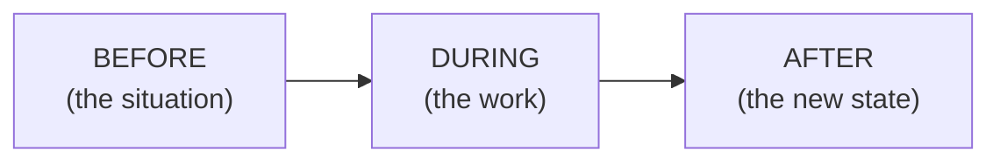

# Day 14 — Testimonials That Actually Convert

> **The one idea for today:** A testimonial earns trust only if it shows the before, the during, and the after. Miss one beat and it reads as a claim instead of evidence.

By the time you close today you'll structure testimonials using the **pre-during-post** format (before / during / after), ask clients for testimonials in a way that gets you a useful quote instead of a generic *"he's a great advisor"*, and adapt the format when you have no closed cases yet — using a live case-in-progress, a mentor's case (with permission), or a training case framed honestly.

---

## Why most testimonials fall flat

Open any advisor's feed. You'll find testimonials that look like this:

> *"Jenny is a wonderful advisor. Very patient, very professional, highly recommended!"*

Nothing in that sentence tells the reader anything. No situation, no transformation, no stakes. It's a compliment, not a testimonial. Compliments don't move the scroll.

A testimonial converts when it shows *movement*. The client was in one state, something happened, and now they're in a different state. Without the arc, it's just praise — which the reader assumes was engineered.

---

## The pre-during-post structure

Three beats. Every good testimonial hits all three.

**BEFORE** — what the client's life / portfolio / anxiety looked like before you met. Specific. *"Ryan had three old ILPs he didn't understand and was paying $780/month without knowing why."* Not *"Ryan needed help."*

**DURING** — what the two of you actually did. *"We mapped the cashflow, cut one redundant plan, restructured the two that worked."* This isn't the product pitch — it's a verb list. What got *done*.

**AFTER** — where the client is now. Concrete. *"He's $340/month lighter, has a clearer picture of his coverage, and knows exactly what his next review looks like."*

---

## A worked example

> **BEFORE:** *"When I first met Amir, he was 34, had two kids under 5, and was paying $1,100/month across four policies — none of which he'd read in the last five years. His wife had just left full-time work and the household cashflow was tighter than it had ever been."*
>
> **DURING:** *"We went through every policy document line by line. I showed him which two were still working hard (his wife's CI and their kids' savings plans), which one was overlapping, and which one was quietly costing him $260/month with no benefit. We restructured the overlap, canceled the dead plan, and topped up one gap we found in his own critical illness coverage."*
>
> **AFTER:** *"Three months later, Amir's household is $180/month lighter on premiums, his critical illness coverage went from $150K to $500K, and — more importantly — he now knows exactly what his family would do in a bad-news scenario. That clarity is what he tells me was the biggest shift."*

Three specifics per beat. No fluff. The reader sees the movement.

---

## How to ask a client for a testimonial

The biggest blocker for new FCs isn't writing the testimonial — it's getting a client to say something useful.

Generic asks get generic answers:
- *"Would you mind leaving me a quick testimonial?"* → *"Jenny is amazing!"*

Structured asks get structured answers. Send the three prompts, in order:

> *"When we first started, what was the situation with your finances — what was frustrating or confusing or keeping you up at night?"*
>
> *"What did we actually do together — what's one thing we changed or figured out?"*
>
> *"Three months in, what's different now — how does it feel?"*

You'll get three paragraphs you can stitch together. Ask if you can edit for length and post it — almost all clients say yes if the question was specific enough to answer.

**The rule:** never ask for a *testimonial*. Ask for *their story in three parts*. Same thing, entirely different quality of answer.

---

## The new-FC workaround (no closed cases yet)

Week 3 FCs typically haven't closed a case yet. You still need Q1 (social proof) posts. Here's how:

### Option A — a live case-in-progress
Write a testimonial-shaped post about a Fact-Find you did this week. Names anonymised.

> *"Met a 38-year-old dad this week. Had four policies, hadn't looked at any of them since 2019. We spent 90 minutes going through them — here's what we found, and what we're changing."*

Honest framing, same three-beat structure. The "after" is *"here's what the next 30 days look like"* instead of *"here's where we ended up."* Still moves the scroll.

### Option B — a mentor's case (with permission)
*"My mentor recently closed a case I want to share — with his permission and his client's — because it changed how I think about CI coverage."* Works if you attribute it clearly. You're showing the *kind of work* you'll be doing, not claiming credit for it.

### Option C — a training case, honestly framed
*"In our training this week, we worked through a case of a 42-year-old parent with overlapping policies. Here's what we figured out — and why I think most people have this same blind spot."* The reader gets insight; you get credibility for the thinking.

**The rule across all three:** don't fake. Faked testimonials are the single fastest way to burn your warm market when someone notices. A real case-in-progress beats a fabricated closed case every time.

---

## The offer-post variant

Yesterday you saw the offer post for Q5. Today, combine it with the pre-during-post testimonial to create the highest-converting post format on IG for advisors:

> **[pre-during-post testimonial, 3 short paragraphs]**
>
> *If you've got old policies you haven't looked at in a while and you're wondering if yours might be a similar story, **DM me 'audit'** and I'll send you the same 1-page checklist we used to go through Amir's plans. No call needed, nothing to book — just the checklist.*

Three things this does:
- **Earns trust** via the testimonial
- **Lowers the ask** — no call, no meeting, just a checklist
- **Gives them a keyword** — removes the *"what do I even say?"* friction

This is the template you'll use for one of your three posts this week.

---

## Quiz

**Q1. The pre-during-post structure for a testimonial captures:**
- A) The product, the pitch, the close
- B) The before-situation, the work you did, the after-state ✓
- C) Morning, afternoon, evening
- D) Hook, explain, CTA

**Why:** The three-beat arc shows *movement* — state A → action → state B. Without the "before," the reader has no baseline. Without the "during," no credibility that you did anything. Without the "after," no reason to believe it worked. Miss any beat and the testimonial reads as praise instead of evidence.

**Q2. The best way to ask a client for a useful testimonial is:**
- A) *"Could you leave me a quick testimonial?"*
- B) Three structured questions — what the situation was, what we did, what's different now ✓
- C) Send them a draft to approve word-for-word
- D) Record a video interview

**Why:** Generic asks produce generic answers (*"he's great!"*). Structured three-part questions prompt the client to tell you the actual story in the exact shape you need it. You stitch their answers into a pre-during-post post. They're happy because you asked specifically; you're happy because you got a usable quote.

**Q3. A Week-3 FC has not closed any cases yet. Which is NOT a legitimate way to create a Q1 (social proof) post?**
- A) A live case-in-progress, with anonymised details, honestly framed
- B) A mentor's case shared with the mentor's and client's permission
- C) A training case reframed as *"here's what we worked through this week"*
- D) A fabricated testimonial with a made-up client name ✓

**Why:** Options A, B, and C all preserve honesty — the reader knows the status of the case and trusts your framing. Option D burns credibility the moment anyone in your warm market notices, and they almost always do. Faked testimonials are the single fastest way to damage your brand.

**Q4. "Jenny is a wonderful advisor. Very patient, very professional, highly recommended!" — what's wrong with this as a testimonial?**
- A) It's too short
- B) It's a compliment, not a testimonial — no situation, no transformation, no stakes ✓
- C) It uses the wrong pronouns
- D) It's grammatically incorrect

**Why:** Compliments describe a person; testimonials describe *movement*. Without the before-during-after structure, the reader has no baseline to compare against and no concrete outcome to believe. The quote sounds nice but doesn't move the scroll — prospects discount it as engineered praise.

**Q5. In the BEFORE beat, which is stronger?**
- A) "Ryan needed help with his finances."
- B) "Ryan had three old ILPs he didn't understand and was paying $780/month without knowing why." ✓
- C) "Ryan was looking for an advisor."
- D) "Ryan had questions about insurance."

**Why:** Specifics land; generalities don't. "Three old ILPs" and "$780/month" give the reader a concrete situation to picture. "Needed help" or "had questions" could describe anyone — the reader can't imagine themselves in the situation because there isn't one yet. The BEFORE beat lives or dies on whether the reader sees themselves in it.

**Q6. Combining a testimonial with an offer post creates IG's highest-converting format for advisors because:**
- A) It's longer than most posts
- B) It earns trust via the case, lowers the ask (no call needed — just a checklist), and gives a DM keyword to remove friction ✓
- C) It uses more hashtags
- D) It looks more professional

**Why:** Three compounding moves in one post. The testimonial earns the credibility. The "no call, just a checklist" CTA lowers the perceived cost of engaging. The DM keyword removes the "what do I even say?" friction. Each alone helps; together they create the compounding conversion that a plain testimonial or plain offer post can't match.

**Q7. A client gives you this three-part answer: "(BEFORE) I had four old policies I hadn't read. (DURING) We reviewed every line and cut two. (AFTER) I'm $180/month lighter and finally know what I'm covered for." What's your next move?**
- A) Post it word-for-word without asking
- B) Ask permission to edit for length + post; most clients say yes if the question was specific enough to answer ✓
- C) Wait 6 months before using it
- D) Use it but change the client's name to someone else

**Why:** Permission + light editing is the professional loop. Posting without consent — even a glowing quote — breaks trust if the client sees it and didn't authorise it. Option D is fabrication by another name. The three-prompt ask almost always produces a client who's happy to consent, because they gave you answers that specific knowing you were going to do something with them.

---

## Related

- Previous: [[day-13|Day 13 — The 5 Silent Questions]]
- Next: [[day-15|Day 15 — Digital Pipeline Hygiene]]
- Week 3 overview: [[README|Week 3 — Your Voice II: Content & Digital Trust]]
