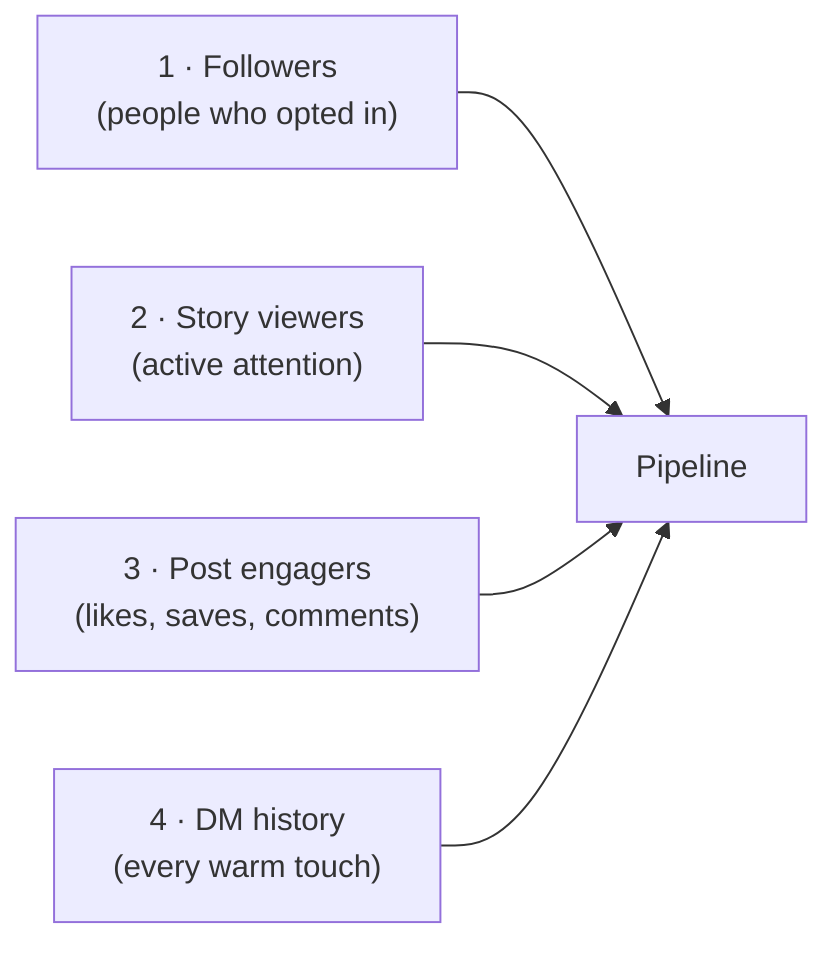

# Day 15 — Digital Pipeline Hygiene

> **The one idea for today:** Your pipeline is bigger than your CRM. Most of your real leads live inside the apps you already open 30 times a day — you just haven't counted them.

By the time you close today you'll map your 4 digital lead surfaces (followers, story viewers, post engagers, DM history) and know what each is telling you, have a weekly 30-minute hygiene ritual (clean-up, follow-back, engage-first, DM bump) that keeps the pipeline fed, and spot which surface is underused for *you* — the one where leads are hiding without being counted.

---

## Why most new FCs underestimate their pipeline

Ask a new FC how many leads are in their pipeline. They'll name maybe 8–12 people — the ones they've explicitly discussed the business with.

That number is wrong by an order of magnitude. The *real* pipeline is every person who follows you, every person who viewed your last story, every person who liked your last post, and every person you've had a DM with in the last year. That's often 300–1,500 people. You just haven't counted them because you haven't been thinking of them as leads.

The hygiene work is turning that invisible surface into something you can *see*, so you can work it systematically rather than hoping the DMs show up.

---

## The 4 digital lead surfaces

Each surface tells you something different:

| Surface | What it signals | Action |
|---|---|---|
| **Followers** | Baseline permission — they've said *"I want to see your content"* | Keep the bar high. Unfollow / remove accounts that don't match your niche (see Section 4). |
| **Story viewers** | Real-time attention — who was paying attention *this week* | Check the viewer list on your last story every morning. Names that appear repeatedly are your hottest list. |
| **Post engagers** | Topic-level interest — they cared about *this specific* insight | Reply to every comment within 24 hours. DM the savers if the post was high-signal. |
| **DM history** | Direct relationships — warmest surface you have | Audit monthly. Who did you text 6 months ago and never follow up on? |

The hygiene job is making a weekly ritual of moving through all four.

---

## Stories — the trust machine

Posts get discovery. Stories build trust. That's the split.

Why: the average follower views 30–40% of your stories in a given week. That's the slot where you're actually *being seen by the same people repeatedly*. Repetition is what builds trust — not depth of insight on one post.

**The 3-stories-a-day rhythm** from Day 11 is the output. The hygiene rhythm is the *input* — who are you watching back, replying to, engaging with?

### The story-viewer review (5 min / day)

Every morning, open your last story, tap the viewer list:

1. **Top 20–30 names** — repeat viewers across the last week. These are your hot list. Screenshot monthly.
2. **New faces** — accounts you don't recognise. Click through. Do they fit your niche? If yes, follow back. If no, move on.
3. **Notable absences** — people you expected to see who didn't show. Not a red flag (they might be muted you, or genuinely busy), but worth noting if it's a pattern.

Five minutes. Done daily, this gives you real-time data on who's paying attention.

---

## The pre-growth clean-up

Before you try to grow the profile, prune it. A bloated follower list with low engagement tells the algorithm you're not worth pushing.

### What to unfollow

- **Inactive accounts** — haven't posted in 3+ months
- **Uninspiring accounts** — content you scroll past every time
- **Irrelevant accounts** — no overlap with your niche, your audience, or your interests

Use IG's built-in **"Least interacted with"** list (Settings → Following → Least Interacted With) to find candidates.

### Who to keep / follow back

- Accounts in your target niche
- Active, engaged accounts (posts, stories, comments)
- People you'd want to have a conversation with

**Rule of thumb:** healthy follower-to-following ratio for an advisor profile is roughly 2:1 to 5:1. Follow back selectively, not reflexively.

---

## The 30-minute weekly hygiene ritual

Once a week, block 30 minutes. Do this in one sitting, not spread across the week:

| Block | Time | Action |
|---|---:|---|
| **1 · Profile audit** | 5 min | Re-score the 6 profile elements (Day 10). Any weakened? Fix. |
| **2 · Story viewer sweep** | 5 min | Screenshot top 30 viewers. Note 3 names to DM this week. |
| **3 · Engage 30 accounts** | 10 min | Engage 30 competitors' / niche accounts' recent posts with meaningful comments. Not likes — *comments*. |
| **4 · DM bump** | 10 min | Scroll your DM list. Re-open any conversation from 2+ weeks ago that needs a follow-up or a value drop (see Day 16). |

That's it. 30 minutes. The thing that separates advisors who get leads from their digital pipeline and advisors who don't is *doing this every week*, not just when you feel like it.

---

## The "DM worth sending" test

Before you hit *send* on a DM, the 3-check test:

1. **Does this link back to something specific?** *"Saw you posted about your move to the new place — congrats!"* passes. *"Hope you're well!"* fails.
2. **Does it give value or ask for it?** The strongest DMs give — a video, a resource, a thought — and ask nothing in return. *"Just saw this and thought of you"* passes. *"Can we meet?"* fails on first contact.
3. **Does it end with an easy-to-answer question?** *"Are you still at Singtel?"* passes. *"Thoughts?"* fails.

If it fails any of the three, rewrite before sending.

---

## The underutilised-surface diagnostic

Different FCs underuse different surfaces. Diagnose yours:

| Symptom | Underused surface | Fix |
|---|---|---|
| *"My posts get views but no one DMs."* | Q5 offer posts (Day 13) | Add a DM keyword CTA to one post this week |
| *"I don't know who's actually watching my content."* | Story-viewer review | Start the 5-min daily check |
| *"I have 400 followers but engagement is dead."* | Clean-up | Unfollow 50–100 accounts this week |
| *"I haven't talked to most of my warm-market in months."* | DM history | Pull 10 names from your DM list; send one value-first bump to each this week |

**Pick one symptom. Fix one surface.** Don't try to fix all four in Week 3.

---

## Team operations — your marketing assets

Parallel to the digital hygiene above: get your branding assets provisioned so the team can build marketing collateral and landing pages around *your* profile.

- **Upload your photos** to [the photos folder](https://nsgukkz32942.sg.larksuite.com/wiki/ZUWrwdapni64IckzuJ0lshSrgYf). AI-generated headshots are fine if you don't have professional shots yet.
- **Pin [the marketing-kits doc](https://nsgukkz32942.sg.larksuite.com/wiki/SeSZwNfIviIf5Akg42olF9kPgnh)** to your Lark left sidebar — the retrieval point for every commonly-used kit.
- **Duplicate team decks**, add your face/branding (DIY or through your allocated designer on Canva), store finals in [the marketing-kits base](https://nsgukkz32942.sg.larksuite.com/wiki/N7B5wRUZViIIQrkB3v5lb5KNggd).

Full walkthrough: [[../_source-articles/onboarding-steps-first-30-days|Onboarding Steps — First 30 Days]] §4c.

---

## Quiz

**Q1. The four digital lead surfaces are:**
- A) Feed, reels, highlights, profile
- B) Followers, story viewers, post engagers, DM history ✓
- C) IG, TikTok, LinkedIn, WhatsApp
- D) Likes, comments, shares, saves

**Why:** Each of the four surfaces tells you something different — baseline permission, real-time attention, topic-level interest, warm relationship. They stack. Most new FCs only count the DM history; the other three surfaces are the invisible pipeline sitting unworked.

**Q2. The weekly 30-minute hygiene ritual is best done:**
- A) Spread across the week, 5 minutes a day
- B) In one sitting, once a week ✓
- C) Once a month
- D) Only when engagement drops

**Why:** Spreading creates context-switching costs and makes you skip blocks. One sitting makes the ritual habitual and protects it in your calendar. The 5-min daily story-viewer review is separate — that's the only hygiene activity that benefits from daily cadence.

**Q3. A new FC with 400 followers and almost no engagement should probably start by:**
- A) Posting more aggressively
- B) Running paid ads
- C) Cleaning up — unfollow inactive / irrelevant accounts so the engagement ratio rises ✓
- D) Moving to TikTok

**Why:** A bloated follower list with low engagement signals the algorithm to stop pushing your content, which depresses engagement further. Cleanup is the unlock: remove dead weight, the ratio improves, the algorithm starts pushing again. More posts into a cold audience amplifies the problem, not fixes it.

**Q4. "Stories are the trust machine" — Day 15's pairing of surface-to-job claims that:**
- A) Posts build trust; stories build discovery
- B) Posts build discovery; stories build trust (repeated viewings by the same people) ✓
- C) Posts and stories do the same job
- D) Stories are not worth investing in

**Why:** Posts reach cold viewers (discovery). Stories reach the same followers repeatedly (30–40% view rate). Repetition is the trust-building mechanism — the same person seeing you in small ways across many days builds the felt-sense of familiarity that posts can't replicate. The 5-min daily story-viewer review is where new FCs find their hottest list hiding in plain sight.

**Q5. The "DM worth sending" 3-check test asks:**
- A) Does it have an emoji? Is it under 100 words? Does it use hashtags?
- B) Does it link back to something specific? Does it give value or ask for it? Does it end with an easy-to-answer question? ✓
- C) Is it sent in the morning? Does it have a photo? Does it mention your company?
- D) Is it translated? Is it spellchecked? Is it formatted?

**Why:** These three checks catch the most common warm-market DM failure modes — generic opener ("Hope you're well!"), asking before giving, and closed-ended or impossible-to-answer questions. A DM that fails any of the three gets blue-ticked. The test is a pre-send gate to catch the mistake before it lands in someone's inbox.

**Q6. A new FC sees this symptom: "I have 400 followers but engagement is dead." The Day 15 diagnosis is:**
- A) They should delete the account and start fresh
- B) Follower cleanup — unfollow 50–100 inactive / irrelevant accounts so the engagement ratio lifts ✓
- C) They need to post 10x a day
- D) They need paid ads

**Why:** A bloated follower list signals the algorithm that your content doesn't earn engagement from its current audience, which depresses reach further, which depresses engagement further — a doom loop. Cleanup is the contrarian unlock: fewer, more engaged followers lifts the ratio, the algorithm starts pushing content again, and the loop reverses. Posting harder into a dead audience just digs the hole.

**Q7. The "underutilised-surface diagnostic" rule is:**
- A) Fix all four surfaces in parallel
- B) Pick one symptom, fix one surface — don't try to fix all four in Week 3 ✓
- C) Fix posts first, always
- D) Ignore the diagnostic, just post more

**Why:** One surface at a time concentrates attention on the weakest link instead of spreading thin. Trying to fix follower count, story engagement, post conversion, and DM history all in the same week produces surface-level changes across four fronts and compounding behaviour on none. The single-surface rule is why the 30-min weekly block is feasible — one focused loop, not four parallel campaigns.

---

## Related

- Previous: [[day-14|Day 14 — Testimonials That Actually Convert]]
- Next: [[day-16|Day 16 — The DM Funnel: Reply Scripts]]
- Week 3 overview: [[README|Week 3 — Your Voice II: Content & Digital Trust]]
