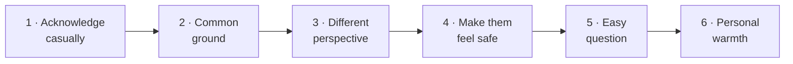

# Day 16 — The DM Funnel: Reply Scripts

> **The one idea for today:** Every text does three jobs: link back, create a reason to meet, end with an easy question. Miss one and the chat dies.

By the time you close today you'll apply the 11 texting rules (especially the three non-negotiables — link back, reason to meet, easy question at the end), handle the 6 most common DM objections with a 6-step reply template, and swap out follow-ups from *"can we meet?"* (push) to value-first drops (pull) so blue ticks stop being your default.

---

## Why scripts fail in warm market

The new FC reflex is to memorise a reply script. It rarely works — scripts sound scripted, especially to someone who already knows you.

What works is a **flow with rules**, not a script. Flows let you stay yourself (which is the whole reason the warm-market person replies to you in the first place) while keeping the conversation on the three jobs every text has to do.

- **Link back** to the last thing you talked about
- **Create a reason to meet** — give them something, not demand something
- **End with an easy-to-answer question** — lower the cost of replying

Everything else — the tone, the emojis, the *hahaha*s — is you being you. Those three rules are the invariant.

---

## The 11 texting rules

| # | Rule | One-line example |
|---|---|---|
| 1 | **Link back to the previous conversation** — no random openers | *"Hey — you were saying you work in Tanjong Pagar right? Which side?"* |
| 2 | **Every text creates more reason to meet** | *"Been meaning to show you what I've been working on — think you'd find it interesting."* |
| 3 | **End every text with an easy-to-answer question** | *"Still WFH these days or mostly office?"* |
| 4 | **Make them feel SAFE about the chat** | *"Sometimes I advise people not to buy anything — you decide after we meet."* |
| 5 | **Common ground that keeps the convo going** | *"A few of my clients are in the same industry — they usually ask me about X."* |
| 6 | **Actively follow up** — 90% don't reply first time | Don't wait. Bump with a value drop. |
| 7 | **Reply quickly** — within 3–4 hours of their reply. Signals reliability. | — |
| 8 | **Be casual** — no jargon, no *"optimisation,"* no *"portfolio reviews"* | Use emojis / *hahaha* if that's actually you |
| 9 | **Warm up with 2–3 touchpoints first** — stories, post replies, a congrats on something | Familiarity → higher reply ratio |
| 10 | **Never use the word "free"** — nobody is *"free"*. Use a specific 30-min ask | *"Grab a 30-min call — Thu or Fri better?"* |
| 11 | **Minimise thinking on the CTA — 2 options, not open** | *"10 Jan 6pm, or 23 Jan 8pm — which works?"* |

**The three non-negotiables** are rules 1, 2, 3. Every single text you send in the pipeline obeys those three. The rest are helpers.

---

## The 6 DM objections you'll see most

After the first text, new FCs run into the same six objections on loop:

1. *"Thanks bro, not interested."*
2. *"Cool, if I need it I'll let you know!"*
3. *"Thanks, I have an advisor already."*
4. *"All good, thanks."*
5. *"Not looking to invest right now."*
6. *"Getting married / buying house / just had a kid — bad time."*

**The reframe:** an objection is the *expected* response, not a bad one. A *yes* is the bonus. If you lose the prospect after the objection, you lost them — not because they objected, but because you handled it wrong or gave up.

Most new FCs respond with *"no worries, thanks anyway!"* and disappear. That's the mistake. The objection is the doorway, not the exit.

---

## The 6-step objection response

Walk through an objection using the 6 steps:

**Prospect:** *"Thanks bro, I already have an advisor."*

**Step 1 · Acknowledge casually.**
> *"Hahaha yeah — honestly if you didn't, I'd be surprised 😄"*

**Step 2 · Common ground.**
> *"Most of the people I end up meeting also have an existing advisor. They usually meet me for a second set of eyes, not a replacement."*

**Step 3 · Different perspective.**
> *"What I do is slightly different — I go through the portfolio from a returns/efficiency angle rather than just coverage. Most people find out they have 10–15% gaps they didn't know about."*

**Step 4 · Make them feel safe.**
> *"Sometimes the conclusion is just 'keep everything as-is' — which is totally fine. You decide what's useful after you see it."*

**Step 5 · Easy question.**
> *"Are you usually around CBD on weekdays or WFH-heavy?"*

**Step 6 · Personal warmth.**
> *"Haven't caught up in ages anyway — it'll be nice to see you regardless of the outcome!"*

Six steps. Strung together naturally, the whole message is 4–5 short bubbles. The objection becomes a conversation, not a close.

---

## Three moves to increase the "yes" odds

If the 6-step reply still lands soft, three structural moves that shift the odds:

### Move 1 — push the date further out

New FCs try to book the meeting *this week* or *next week*. That creates pressure. Instead, suggest **1–2 months ahead**:

> *"No rush at all — what if I check in with you mid-March? By then you'll be past the wedding prep and we can look at everything with a clearer head."*

Far-out dates feel easy to say yes to. Short-notice asks feel like pressure.

### Move 2 — postpone the scheduling, not the meeting

If they can't commit to a date, don't ask for one. Ask to *text them later about a date:*

> *"All good — I'll text you in February to pick a day that works?"*

That's an easy yes. It's also a self-scheduled follow-up — you own the next move.

### Move 3 — show, don't tell

If you're hitting *"can we meet?"* pushback, stop asking. Start *sending value* instead:

> *"Here's a 2-min video I made on the three things I look for in a Fact-Find — thought it might be useful regardless of whether we meet."*

The pattern: next text isn't another ask, it's a value drop. Video, PDF, carousel, case study — the format matters less than the fact that you gave something without asking for anything.

**Why this works:** repeated asks trigger the *pushy* filter. Repeated value drops trigger the *generous* filter. Same pipeline, entirely different response rate.

---

## Hook openers by life stage

If you're warming up a specific person and want a concrete opener, here are three that consistently land:

| Life stage | Hook opener | What it opens |
|---|---|---|
| **Working young** | *"By the way — have you started investing?"* | *"Want me to show you a quick crash course?"* |
| **Engaged couple** | *"You two BTO-ing already?"* | BTO planning + household budgeting |
| **Fresh grad** | *"Graduated already right?"* | *"Have you sorted out your insurance and investing yet?"* → *"Why don't I walk you through what I've been doing for my other clients?"* |

Life-stage-specific openers beat generic *"hey, how's life?"* every time. The opener signals *I know where you are in life and I have something relevant.*

---

## Splitting and pacing

Two small rules with outsized impact:

- **Split long messages into chunks.** Three short bubbles feel like a conversation; one wall of text feels like a pitch. Same content, different nervous-system response.
- **Never open cold with *"How are you?"*** — too deliberate, raises suspicion. Open with something *specific* about them: *"Hey — still at Singtel?"* / *"Just saw your story about Japan — is that Kyoto?"*

---

## Quiz

**Q1. The three non-negotiable rules every DM must follow are:**
- A) Emojis, hahas, short sentences
- B) Link back · create a reason to meet · end with an easy question ✓
- C) Be funny · be short · be honest
- D) Open with a compliment · build rapport · ask for the meeting

**Why:** These are the invariants — every text you send in the warm-market pipeline has to do all three. Link-back gives context (no random opener). Reason-to-meet keeps the conversation forward-moving. Easy-question lowers the cost of replying, which raises the reply rate. Everything else in the 11 rules is a helper.

**Q2. The 6-step objection response, in order, is:**
- A) Close · handle · rebut · close again · ask · push
- B) Acknowledge · common ground · different perspective · make them feel safe · easy question · personal warmth ✓
- C) Apologise · retreat · apologise again · close · apologise · close
- D) Deflect · reframe · pitch · close · pitch · close

**Why:** The 6 steps are designed to *keep the conversation open* after an objection instead of closing it. Acknowledge validates their feeling; common ground + different perspective reframes without arguing; safety removes pressure; the easy question reopens the dialogue; personal warmth reminds them this is a human conversation. Skipping any step breaks the flow.

**Q3. A prospect says *"not now, I just bought a house."* Which response has the best structural odds of keeping the pipeline alive?**
- A) *"No worries, let me know if you change your mind!"*
- B) *"Understood — how about we meet next week anyway?"*
- C) *"Totally fair — I'll text you in May to see if it's a better time by then?"* ✓
- D) *"But this is actually the perfect time to plan around that."*

**Why:** A gives up the pipeline. B pushes against a real objection, which raises resistance. D is the pushy reframe that kills warm market. C uses Move 2 — *postpone the scheduling, not the meeting*. It's an easy yes, it self-schedules the next move, and it respects the objection without abandoning the conversation.

**Q4. Day 16 argues: "an objection is the *expected* response, not a bad one. A *yes* is the bonus." What does this reframe change about how new FCs handle *"not interested"*?**
- A) They should assume the prospect is lying
- B) They should stay in the conversation using the 6-step reply instead of retreating with *"no worries, thanks anyway"* ✓
- C) They should push harder until the prospect says yes
- D) They should stop prospecting that person for 6 months

**Why:** Most new FCs respond to any objection with a polite retreat, killing the pipeline at the first resistance. The reframe — *"not interested"* is the expected doorway, not the exit — keeps you in the conversation. The 6-step reply converts the objection into dialogue instead of ending it. Pushing harder (C) raises resistance; disappearing (A, D) loses the lead entirely.

**Q5. The word "free" is banned from warm-market DMs because:**
- A) It sounds too generous
- B) Nobody is genuinely "free" — the word signals a placeholder ask instead of a specific time commitment ✓
- C) It makes you sound cheap
- D) It's against compliance rules

**Why:** *"Are you free this week?"* is too open. The prospect either has to invent a slot (high cognitive cost) or is going to say no. A specific 30-min ask with 2 time options gives them a concrete choice they can reply to in one letter. Ban "free," replace with "30-min" + 2 options.

**Q6. Repeated follow-ups that ask *"can we meet?"* over and over trigger which filter in the prospect's mind?**
- A) The generous filter
- B) The pushy filter — same pipeline, collapsed response rate ✓
- C) The professional filter
- D) The curious filter

**Why:** The filter is subconscious but consistent. Repeated asks signal *"this person needs this more than I do"* — which triggers distancing. Repeated value drops signal the opposite: *"this person is generous enough to send useful things even if I never reply"* — which triggers engagement. Same pipeline, opposite response rate, entirely controlled by what you send next.

**Q7. Move 3 (show, don't tell) replaces the next text's *ask* with a *value drop*. Format examples include:**
- A) Business cards, PDFs, emails
- B) A 2-min video you made on 3 things to check in a Fact-Find, a short carousel, an anonymised case study ✓
- C) Long voice messages explaining your process
- D) A calendar booking link

**Why:** The value-first format has to be *consumable* — something the prospect can look at in 2 minutes without committing to anything. Video, carousel, case study all fit. A calendar link is just another ask wearing a value costume; a long voice message is a monologue, not a value drop. The question to ask yourself: could they benefit from this even if they never meet me? If yes, it's a real value drop.

---

## Related

- Previous: [[day-15|Day 15 — Digital Pipeline Hygiene]]
- Next: [[day-17|Day 17 — CRAB Framework: Handling Blue Ticks]]
- Week 3 overview: [[README|Week 3 — Your Voice II: Content & Digital Trust]]
- Callback: [[../week-1/day-05|Day 5 — Tonality]] (Reason tone = safe-feeling DM tone)
