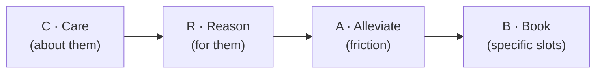

# Day 17 — CRAB: Handling Blue Ticks

> **The one idea for today:** A blue tick is not a rejection. It's usually a scheduling problem dressed up as silence. CRAB is the move that gets the calendar back.

By the time you close today you'll run the CRAB structure (Care → Reason → Alleviate → Book) on any prospect who's gone quiet, know when CRAB fits (blue-ticked, rescheduled once or twice, went silent after positive interest) and when it doesn't (hard-no, never responded to first message), and swap out open-ended *"when works?"* for the ABC booking format — 2–3 specific slots with A/B/C reply labels.

---

## Why the default follow-up fails

The new-FC blue-tick reflex:

> *"Hey — just bumping this up. Let me know when you're free!"*

That fails for three reasons:

- **No Care** — it's entirely about *your* need to book, not *their* situation
- **No Reason** — nothing new for them to engage with
- **No Alleviation** — *"when you're free"* puts the entire scheduling burden on them

A blue tick is not disinterest 80% of the time. It's a person who read your message, couldn't immediately answer, scrolled on, and never came back. Your follow-up has to acknowledge that reality — not just repeat the ask.

---

## The CRAB structure

Four beats. Each does a specific job.

### C — Care
Show the message is about *them*, not you.

- Acknowledge their *season of life* — new job, new baby, travel, a stressful month
- Reference something specific you already know about them
- Avoid pushy / transactional language

> *"I know you've just started the new role — hope the first few weeks haven't been too chaotic."*
> *"Congrats again on the promotion 🎉 — that must come with a lot of moving pieces."*

### R — Reason
Give them a compelling reason *for them* to reply.

- Tie to a benefit they already expressed interest in — or one you know fits their life stage
- Use what they said to you previously to make it relevant
- Frame it as *what's in it for them*, not *what's in it for you*

> *"If we sort this out in the next few weeks, it'll take the financial-planning thing off your plate while you settle into the role."*
> *"This'll help us make sure we don't miss the window to implement before your wedding."*

### A — Alleviate
Reduce the friction of actually saying yes.

- Remove the need for them to *check their calendar* or *think about logistics*
- Offer flexibility — office, Zoom, after work, lunch
- Pre-empt the time/effort/travel objection

> *"Happy to swing by your office during lunch, or we can do it over Zoom if your week's packed."*
> *"Totally fine if it's a 30-min call — I know this week is going to be tight."*

### B — Book
The CTA. 2–3 specific slots. Minimal effort to reply.

- 2–3 specific date/time combinations
- Format so they reply *"A"* / *"B"* / *"C"*
- Never leave it open-ended

> *"Would any of these work?*
> *(A) Tue 23 Jan @ 12pm*
> *(B) Wed 24 Jan @ 6pm*
> *(C) Mon 27 Jan @ 6pm*
>
> *Just reply A, B, or C and I'll take care of the rest."*

---

## A full CRAB message, end to end

> *"Hey Kelly — just bumping this up.*
>
> *I know the last few weeks have been busy with the new promotion — congrats again by the way 🎉*  — **Care**
>
> *I was thinking: if we wrap up the planning piece this month, it'll clear your mental space to focus on the new role, and we can move forward on what you mentioned earlier about your CI coverage.*  — **Reason**
>
> *Totally flexible on format — I can swing by your office during lunch, or we can do this over Zoom if your week is packed.*  — **Alleviate**
>
> *Would any of these work?*  — **Book**
> *(A) Thu 23 Jan @ 12pm*
> *(B) Fri 24 Jan @ 6pm*
> *(C) Mon 27 Jan @ 6pm*
>
> *Just reply A, B, or C and I'll handle the rest 🙏"*

Notice the length. Four beats, four short bubbles if you split it. The full message reads in about 20 seconds. The reply takes 2 seconds — *"B"*. That's the whole design.

---

## Why ABC booking outperforms open-ended *"when works?"*

Compare:

> *"When works for you?"* — requires the prospect to open their calendar, think across 14 days, weigh mornings vs evenings, choose a format, type out a date, and hope you agree.

> *"(A) Tue 12pm / (B) Wed 6pm / (C) Mon 6pm — just reply A, B, or C"* — requires the prospect to read three lines and type one letter.

A single-letter reply has near-zero cognitive cost. Open-ended *"when works?"* has double-digit cognitive cost. That's the reply-rate gap.

**Pro tips on the three slots:**
- Offer **one weekday lunch, one weekday evening, one unusual slot** — diversity increases the chance one works
- Make at least one slot **more than a week out** — gives them a *"later is fine"* option, reduces pressure
- Never offer *"next week sometime"* — specificity is the whole point

---

## When CRAB fits — and when it doesn't

| Situation | Use CRAB? |
|---|---|
| Blue-ticked after initial positive interest | ✅ Yes |
| Rescheduled once or twice | ✅ Yes |
| Went silent after a warm exchange | ✅ Yes |
| Said *"not interested"* clearly | ❌ No — use the 6-step objection reply (Day 16) instead |
| Never responded to your first message | ❌ No — you haven't earned a *"just bumping this up"* yet |
| Bounced 3+ of your follow-ups already | ❌ No — time to space the touches way out or close the file |

**The rule:** CRAB works when there's already been a warm exchange. It's a re-engagement tool, not an opener and not a rescue from a hard no.

---

## Rhythm — don't spam

Four discipline rules around CRAB:

- **Personalise every send** — no copy-paste. Reference a specific past detail (their new role, the wedding, the house move)
- **Warm but professional** — not robotic, not over-familiar. You're helping a busy adult, not flirting
- **Use CRAB after *one* ignored follow-up** — not five. Two failed CRABs means the prospect isn't ready, not that you need a third
- **3–5 day gap minimum** before any follow-up variation to a non-reply

The advisors who burn their warm market are the ones who CRAB every 48 hours. Don't.

---

## What to track

Two numbers to log per CRAB you send:

- **Response rate** — did they reply within 48 hours?
- **Conversion rate** — of replies, what % resulted in a booked appointment?

Healthy CRAB numbers in month 1–2 look roughly like: **40–60% response, 50–70% booking from replies.** Lower than that means either (a) your *Care* is generic, (b) your *Reason* isn't strong for them, or (c) your booking slots are all this week and too tight. Diagnose and retry.

---

## Quiz

**Q1. The CRAB framework stands for:**
- A) Close, Rebut, Ask, Book
- B) Call, Respond, Approach, Book
- C) Care, Reason, Alleviate, Book ✓
- D) Contact, Recognise, Approach, Begin

**Why:** Each letter is a specific move. Care (make it about them). Reason (give them a benefit). Alleviate (reduce friction). Book (specific slots). Missing any beat breaks the flow — skip Care and it sounds transactional, skip Alleviate and they delay replying, skip Book and you're back to *"when works?"*

**Q2. The ABC booking format outperforms *"when works for you?"* because:**
- A) It sounds more professional
- B) It reduces the cognitive cost of replying from high to near-zero ✓
- C) It makes you seem more organised
- D) It forces a commitment

**Why:** Open-ended asks require calendar-checking, cross-referencing 14 days, weighing morning vs evening, typing a date — all cognitive load. A/B/C requires reading 3 lines and typing one letter. Reply rate scales inversely with cognitive cost. The format wins because the math of *"will I do this now?"* shifts from effortful to trivial.

**Q3. A prospect said *"not interested"* clearly after your first message. Should you send CRAB?**
- A) Yes — it might change their mind
- B) Yes — the framework works for all silences
- C) No — CRAB is for re-engaging *warm* silences, not overcoming hard nos ✓
- D) Yes — but wait 3 months first

**Why:** CRAB is a re-engagement tool for prospects who were warm and went quiet. A hard *"not interested"* is a different situation — it needs the 6-step objection reply from Day 16, which reframes the objection itself. Sending CRAB after a hard no ignores what they told you, and crosses the line from *persistent* to *annoying*.

**Q4. A blue tick is described in Day 17 as:**
- A) A clear rejection
- B) Usually a scheduling problem dressed up as silence — read but not actioned ✓
- C) Spam from the prospect
- D) A sign to close the file permanently

**Why:** ~80% of blue ticks aren't rejection. They're real people who read your message at a bad moment, had no immediate answer, scrolled on, and never came back. Treating blue ticks as rejection ends pipelines prematurely; treating them as scheduling problems (which CRAB is designed for) reopens them. The diagnosis determines whether the next move is re-engagement or graceful exit.

**Q5. In the ABC booking move, one of the three slots should be:**
- A) This weekend
- B) Within 24 hours
- C) More than a week out — giving the prospect a "later is fine" option reduces pressure ✓
- D) Next year

**Why:** All three slots in the current week feels like pressure — each option is a near-term commitment. One slot more than a week out gives a psychological "later is fine" option that's often easier to say yes to than any this-week slot. Far-out slots also signal you've got a full calendar, which improves positioning (the "detached" signal from Day 9).

**Q6. How often should you send CRAB to the same prospect?**
- A) Every 48 hours until they reply
- B) After one ignored follow-up, with a 3–5 day gap; two failed CRABs means space the touches way out ✓
- C) Once, then never follow up again
- D) Daily — persistence pays

**Why:** CRAB is a precision tool, not a spam hammer. One ignored follow-up → CRAB once. Second ignored CRAB → the prospect isn't ready right now; space the next touch by weeks, not days. Every-48-hours CRAB burns the relationship past repair. The advisors who light their warm market on fire are always the ones who mistake persistence for pressure.

**Q7. Healthy CRAB numbers in month 1–2 are roughly:**
- A) 90% response, 90% booking
- B) 40–60% response, 50–70% booking from replies ✓
- C) 10% response, 10% booking
- D) Response rate doesn't matter; only booking does

**Why:** A 40–60% response rate is realistic because real people have busy lives and CRAB doesn't convert every silence. Below 40% usually means the *Care* is generic or the booking slots are all too tight; diagnose and retry. Booking from replies (50–70%) is higher because once the prospect replied, they've already decided to re-engage — you just need the slots to work.

---

## Related

- Previous: [[day-16|Day 16 — The DM Funnel: Reply Scripts]]
- Next: [[day-18|Day 18 — Practice: 3 Posts + 5 DMs Opened]]
- Week 3 overview: [[README|Week 3 — Your Voice II: Content & Digital Trust]]
