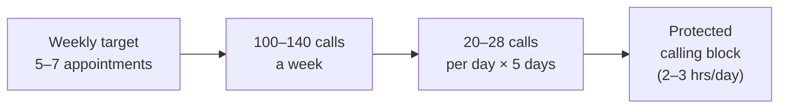

# Day 19 — The Master Map

> **The one idea for today:** Calendar full, cases pending. No prospecting, no business. This is the week you stop optimising the pitch and start moving the calendar.

By the time you close today you'll map any prospect into the 4-ring Market Temperature model (Hot / Warm / Semi-Warm / Cold) and know which activity fits each ring, separate lead generation (farming) from prospecting (hunting) and why you need both, and triage your contact list using the 4 Types of Prospects (10/20/60/10) so you stop burning energy on the bottom 10%.

---

## Why Week 4 is the hinge

Weeks 1–3 were the voice work. Intent statement, story, content, DMs. Those all build *demand* — reasons for a prospect to want to meet you.

Week 4 builds *volume* — the weekly engine that fills the calendar whether inspiration shows up or not. The math from Day 2 is unavoidable: **FYC = Appointments × Close rate × Case size.** Appointments is the lever new FCs control. Week 4 is about pulling that lever hard, systematically, for the rest of your career.

The reason it's a hinge: most Year-1 advisors who fail don't fail at closing. They fail at filling the calendar. Volume is the skill they never built.

---

## Market Temperature — the 4-ring model

Every prospect sits in one of four concentric rings:

| Ring | Who | Key characteristic |
|---|---|---|
| **Hot** (centre) | Closest to you — parents, siblings, best friends | Easiest to meet. **Exhausts fastest.** |
| **Warm** | Frequent contact — friends, ex-colleagues, relatives | Second to exhaust. *Most new FCs over-index here.* |
| **Semi-Warm** | Occasional contact — secondary-school friends, old colleagues, distant relatives, referrals | **The real market.** Least competition. Longest runway. |
| **Cold** | Strangers | Transactional. Low conversion. Law of large numbers. |

**The trap new FCs fall into:** they work Hot + Warm in months 1–3, close a handful, then run out. They panic and either (a) burn the remaining warm market harder, or (b) jump straight to cold. Both fail.

**The fix:** Semi-Warm is the ring where long-term pipeline actually lives. Most of your 3-year revenue will come from people you haven't spoken to in 1–5 years. Start reactivating them in Week 4, not Year 2.

---

## The 3-year commitment

A blunt reality:

> **Most new advisors overestimate their own consistency. They start strong on Hot, make a few sales, then lose momentum when facing hundreds of Semi-Warm contacts who don't immediately see value.**

Building a sustainable warm-market practice takes **3 years of consistent engagement**, not 3 months. That's the timeline.

Rough composition of a typical 500-contact network:

| Segment | Size | % |
|---|---:|---:|
| **Hot** | ~20 | 4% |
| **Warm** | ~100 | 20% |
| **Semi-Warm / Lukewarm** | ~330 | **66%** |
| **Cold** | ~50 | 10% |

**Two-thirds of your opportunity lives in Semi-Warm.** Not in your 20 hottest friends. The mental reframe that matters most in Week 4: *"my real pipeline is the 330 I haven't thought about yet."*

---

## Lead generation vs prospecting

These two words get conflated. They're different jobs:

| | **Lead generation** | **Prospecting** |
|---|---|---|
| **Definition** | Identifying and attracting potential customers | Qualifying leads — assessing who can convert |
| **Metaphor** | **Farming** — nurture the base | **Hunting** — actively engage |
| **Nature** | Strategy | Skill |
| **Activities** | Campaigns, content, events, IG posts, Telegram channel | Conversations, rapport, qualifying, appointment-setting |
| **Cadence** | Long-term, compound | Daily, behavioural |

You need both. Content alone (lead gen) = slow burn, no pipeline this quarter. Outreach alone (prospecting) = burns out contacts quickly.

Week 3 gave you lead generation (posts, stories, DM funnel). Week 4 gives you prospecting (outreach, surveys, scripts, pipeline board). Top producers run both simultaneously.

---

## The 4 Types of Prospects — 10/20/60/10

Not every name on your list is equal. Split them this way:

| Tier | % | Who | Strategy |
|---|---:|---|---|
| **1 · Definitely will buy** | 10% | Loyal / family — trust fully already | Relationship maintenance. They'll ask when ready. |
| **2 · Most likely to support** | 20% | Friends / relatives — inclined already | Leverage personal connection. Warm outreach + relevance. |
| **3 · Can be converted** | 60% | Anyone — with information + persuasion | **Where the real work is.** Persuasive positioning, handle objections, deliver value. |
| **4 · Die-die will not buy** | 10% | No intent regardless of what you do | **Avoid wasting resources.** Move on. |

**The biggest time-waste in Year 1:** spending 40% of effort on the bottom 10% ("if I can just convince this one person…"). Those conversations rarely convert and always drain energy.

**The highest leverage move:** spending that energy on the 60% middle instead — the convertible tier. That's where Week 4's 30 outreaches land most profitably.

---

## Activity Matrix — Active / Passive / Hybrid

Prospecting activities split three ways:

### Active — you reach out
- Direct outreach (WhatsApp, DM, call)
- Warm outreach to FB / IG / LinkedIn contacts
- Offline networking at events, gatherings
- Active referral asks at end of Fact-Find

### Passive — content pulls them in
- IG / FB / LinkedIn content (your Week-3 output)
- Telegram / WhatsApp broadcast lists
- Email list / nurturing machine
- Client check-ins

### Hybrid — content + targeted outreach
- Bridging messages — *"saw you watched my story on CI — want to chat?"*
- Poll → DM pattern — someone voted on your poll, you reach out to the voters

**Where top producers live:** Hybrid. Passive alone is too slow in Year 1; Active alone burns out the contact list. Hybrid uses content to warm people up so the outreach already has context.

For Week 4's 30 outreaches, aim for a mix: ~20 Active (direct outreach), ~10 Hybrid (responding to story viewers, offer-post replies, engagement on your posts from last week).

---

## The database *is* the asset

Most new FCs treat their contact list as a lookup tool — *"who do I know?"* That's wrong framing.

**Your contact list is the single most valuable asset in your business.** Treat it like one.

Minimum discipline:
- Every name you'd ever reapproach goes in a list (spreadsheet, Notion, CRM — any tool, just one)
- Every list entry gets an **ABC / 1-2-3 tag** (from Day 3)
- Every list entry gets a **last-contact date**
- Every list entry eventually gets a **trigger + script variant** — the specific reason + angle you'd use to reach out

If you don't have this list by Day 23, you don't have a business yet. You have a hobby with appointments.

---

## The rejection math — reframe before you dial

The Day-2 math said you need 5–7 appointments a week. The Day-21 Market Survey script gives you the tool. Between them sits the unsolved thing — *hearing no*.

Week 4's volume produces a small number of bookings and a much larger number of rejections. If those rejections land as judgment — *they don't like me, I'm bad at this, this career isn't for me* — the engine breaks before it compounds.

The reframe is math, not mindset. In the real world, outbound prospecting calls book at roughly **1 in 20**. Every booked appointment comes with **19 no's attached** — polite no's, ghosts, *"let me think about it"*, *"not now"*, no-answers. Those 19 aren't the enemy. They're the ticket price. Each one is about **5 cents of the dollar** you need to earn that single booking.

When you sit for a 20-call block, expect:

| Outcome | Count | What it actually is |
|---|---:|---|
| **Booking** | ~1 | The yes you showed up for |
| **Polite no / not-now** | ~12 | Normal market friction |
| **Ghost / no-answer** | ~5 | Try again next cycle |
| **Hang-up / hostile** | ~2 | Proof you're actually dialling |

That's a **successful call-block**, not a failed one.

The most common Week-4 quit moment is dial #3 or #4 — three no's in a row and the FC puts down the phone *"to regroup."* The regroup never happens. The block dies at 4 dials with zero bookings instead of continuing to 20 with one.

### The weekly math — no softer floor exists

To hit 5–7 appointments a week at a 1-in-20 book rate, you need roughly:

| Appointments / week | Calls / week | Calls / day (5-day) |
|---:|---:|---:|
| 5 | 100 | 20 |
| 6 | 120 | 24 |
| 7 | 140 | 28 |

That's not a typo. That's the honest floor. Anyone telling you it's easier hasn't done the math.

**The drill.** Before you dial, write the expected math on a sticky note next to the phone:

> *"Today: 20 dials → 1 appointment → 19 no's. The 19 aren't failure. They're the ticket price."*

Glance at it every time a no comes in. The sticky note is between you and the 10pm-Wednesday fog creeping in three hours early.

---

## Love rejections — the per-close math

The rejection math above is the *per-block* view: 20 dials → 1 appointment → 19 no's. Zoom out to the *per-close* arc and the numbers compound harder. Appointments cancel, prospects ghost, first meetings don't close — all of that has to be priced into the funnel.

| Stage | Ratio | Why it compounds |
|---|---|---|
| **Dials → appointments booked** | 20 : 1 | From the block math above |
| **Booked → actually held** | ~1.5 : 1 | Cancellations, no-shows, reschedules |
| **Held → closed** | ~3 : 1 | Realistic first-meeting close rate for a new FC |
| **Net: dials → 1 close** | **~90–150 : 1** | The end-to-end truth |

**Roughly 100+ rejections per sale is the baseline — not the anomaly.**

Two mindsets process that number very differently.

### Scarcity mindset
Every no is an obstacle. Every no shrinks the remaining pool. The 149 rejections feel like a wall getting closer. Advisors with this mindset quit between dial 8 and dial 15 — the first time a short streak of no's lands.

### Abundant mindset
Every no is *data* — this person wasn't it; the next one might be. The pool isn't shrinking; it's renewing (30-Day Rule + Law of Replacement — Day 2 §7). The 149 rejections are the *cost* of the yes, the way rent is the cost of a flat. Advisors with this mindset finish the block.

### The telemarketer who quit

A senior advisor shared this: he sat next to a telemarketer in the office. One hour, one call, she poured emotion into convincing a skeptical prospect about a product. The prospect said no. She looked crushed.

A few weeks later she was gone. She'd been giving 100% emotional investment to every dial — which meant every rejection landed as personal failure. The math said 149 no's per yes. Her nervous system couldn't carry that.

**The fix was never more effort.** It was *emotional detachment* — loving the rejection because it proves the law of large numbers is still running.

### The reframe

- Count **rejections**, not appointments. Aim for a *high* number. A day with 8 no's is a good day.
- Every *no* moves you closer to the next *yes*.
- There is ripe fruit on the tree. You just haven't reached this week's fruit yet.

**The drill.** Add a second line to your sticky note: *"Today's rejections are the ticket price. The more I collect, the closer I am."* At 10:47pm Wednesday, when the 6th no of the day lands, that line is what keeps the phone in your hand.

---

## Quiz

**Q1. The Market Temperature ring where most new FCs under-invest and most long-term pipeline actually lives is:**
- A) Hot — family and best friends
- B) Warm — friends and ex-colleagues seen regularly
- C) Semi-Warm — people not spoken to in 1–5 years ✓
- D) Cold — strangers

**Why:** Hot exhausts fastest (~4% of contacts). Warm comes next (~20%). Semi-Warm is ~66% of a typical network — the lukewarm middle. Most new FCs ignore it because it feels awkward to reach out. That awkwardness is exactly why the competition isn't there. Semi-Warm is the 3-year pipeline that sustains Year 2 and beyond.

**Q2. Lead generation and prospecting differ because:**
- A) Lead gen is for juniors, prospecting is for seniors
- B) Lead gen is farming (nurture the base); prospecting is hunting (active qualification) ✓
- C) They're the same thing
- D) Lead gen is B2B; prospecting is B2C

**Why:** Lead gen is strategy — campaigns, content, events that attract interest over time. Prospecting is skill — conversations, rapport, qualifying, booking. You need both: content alone is too slow, outreach alone burns out contacts. Top producers run them simultaneously so every outreach already has some warmth behind it.

**Q3. A new FC is spending ~40% of their prospecting energy trying to convince one skeptical family member who's repeatedly said *"no, never."* The highest-leverage correction is:**
- A) Try harder — family will convert eventually
- B) Offer a discount or special deal to break through
- C) Redirect that energy to the 60% *convertible* tier — the middle-ground prospects who just need information and persuasion ✓
- D) Cold-call 50 strangers instead

**Why:** The 10/20/60/10 split tells you the bottom 10% (*"die-die will not buy"*) is a trap — energy spent there almost never converts and always drains. The 60% middle is where most revenue actually comes from, and the work there is tractable (information + persuasion). D overcorrects by abandoning the warm asset entirely. The correction is triage — move energy from the worst-odds tier to the best-odds-per-effort tier.

**Q4. The Activity Matrix splits prospecting activities into Active, Passive, and Hybrid. Top producers mostly live in:**
- A) Active only
- B) Passive only
- C) Hybrid — content warms people up, outreach has context ✓
- D) They rotate randomly

**Why:** Passive alone (content only) is too slow in Year 1 — pipeline takes 6+ months. Active alone (outreach only) burns the contact list in 2–3 months. Hybrid is the synthesis — posts + stories create warmth, then targeted outreach to people who engaged means the conversation already has context. Week-3 output becomes Week-4 fuel.

**Q5. Rough composition of a typical 500-contact network:**
- A) 50% Hot, 30% Warm, 15% Semi-Warm, 5% Cold
- B) 4% Hot, 20% Warm, 66% Semi-Warm, 10% Cold ✓
- C) Equal 25% each
- D) Semi-Warm is rare — most people are Hot or Cold

**Why:** Semi-Warm is the largest segment (~66%) — people you haven't spoken to in 1–5 years but who'd still remember you. Most new FCs focus on the smallest rings (Hot ~4%, Warm ~20%) because those feel safest, then burn through them in months. The real runway is in the two-thirds of the network they haven't reached for yet.

**Q6. Day 19 says "Your contact list is the single most valuable asset in your business." The minimum discipline to treat it that way is:**
- A) Save all contacts to Apple Contacts
- B) Every name gets ABC/123 tag + last-contact date + trigger + script variant, in ONE tool ✓
- C) Check LinkedIn weekly
- D) Print the list quarterly

**Why:** Treating the list as an asset means it's usable without your memory — a new person could look at it and know who to call, why, and with what angle. Without tags, dates, triggers, and scripts, it's just a lookup tool. The discipline makes the list survive your own inconsistency: when week 10 energy dips, the list still tells you what to do.

**Q7. The "rejection math" rule for Week 4 says: of 20 outbound calls, you expect roughly:**
- A) 5–7 appointments — calls convert at least that well
- B) 1 appointment and ~19 no's / not-now's / no-answers — the 19 aren't failure, they're the ticket price ✓
- C) 10 appointments if you're good enough
- D) The math is unknowable

**Why:** Expecting 25–30% conversion is the fantasy that kills Week-4 engines after 3 rejections. The honest floor is 1-in-20 — a booking every ~20 dials. That reframes the 19 no's as the normal cost of earning the 1 yes. To hit 5–7 bookings a week you need 100–140 dials a week (20–28/day). The sticky-note math is what keeps the call block alive past the third rejection — which is exactly where Week-4 engines die.

---

## Related

- Previous: [[../week-3/day-18|Day 18 — Practice: 3 Posts + 5 DMs Opened]]
- Next: [[day-20|Day 20 — Reaching Out Without Feeling Salesy]]
- Week 4 overview: [[README|Week 4 — Prospecting at Volume]]
- Callback: [[../week-1/day-03|Day 3 — Your 90-Day Scorecard]] (ABC/123 tagging)
