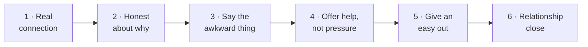

# Day 20 — Reaching Out Without Feeling Salesy

> **The one idea for today:** The silence you keep with friends isn't politeness — it's a tax on both sides. Honest outreach is the unlock.

By the time you close today you'll have a 6-step honest outreach message (connection → honesty → elephant → offer → easy-out → relationship) you can send to any warm-market contact, the 5 Steps to Build Rapport so you run the conversation without sounding like a checklist, and a follow-up rule that swaps *asking again* for *giving value* — the reframe that stops warm market from burning out.

---

## Why new FCs stay silent

Most new FCs avoid messaging friends about the business for the same reason they avoided asking anyone to prom — the fear of making things weird.

Here's what that silence actually costs:

- **Your friend** — never hears that you do work that could help them, so they find a less-qualified advisor or stay unprotected.
- **You** — your closest network, the one with the highest conversion odds, stays locked. Month 3 arrives and you're still trying to hit pipeline on strangers.

Silence isn't neutral. It's an active choice that taxes both sides. The move isn't *"message more aggressively"* — it's *"message more honestly."*

---

## The 6-step honest message

Every good warm-market text hits six beats in this order:

**1 · Real connection.** Reference *them* first. Their recent trip, their new role, their life stage. Don't jump straight to business.

> *"Hey! Hope Vietnam's been treating you well — saw the travel posts, looked like a blast."*

**2 · Honest about why.** Name that you're reaching out for a specific reason. Vulnerability beats polish every time.

> *"I've been meaning to reach out about something a bit more personal — financial planning. Honestly, I was a little scared to bring it up."*

**3 · Say the awkward thing out loud.** The friend is thinking *"wait, is this a sales pitch?"* Name it before they do.

> *"I didn't want to make things weird, or seem like I was reaching out just to pitch something."*

**4 · Offer help, not pressure.** Frame as an *invitation*, not a sales call.

> *"If you're open to it, I'd love to do a quick, no-obligation review of where you're at and share some of what I've been learning."*

**5 · Give them an easy out.** The freedom to say no is what makes yes easy.

> *"Of course, if it's not something you're keen on right now, I completely understand."*

**6 · Relationship close.** End on the friendship, not the business.

> *"Would be nice to catch up properly anyway — it's been way too long. Where are you working now?"*

---

## The full sample message

Stitched together, 6 beats in one text:

> *"Hey Amir —*
>
> *Hope Vietnam's been treating you well. Saw a few of your travel posts, looked like a blast.*
>
> *This is a little out of the blue, but I've been meaning to reach out about something a bit personal — financial planning. I'll be honest, I hesitated because I didn't want it to feel like a pitch or make things awkward between us.*
>
> *But I've been reminding myself — if I genuinely believe in the work I do, and I care about the people in my life, I shouldn't stay quiet.*
>
> *So — if you're open to it — I'd love to offer a no-pressure, no-obligation review of your current financial setup and share a few ideas that have been helpful for people in your stage. Totally understand if it's not your thing right now, no worries either way.*
>
> *Would be nice to catch up properly too — it's been too long. Still at Singtel?"*

Read it. It doesn't sound like a salesperson. It sounds like a friend being honest. That's the bar.

---

## Hook openers by life stage

If you're opening without much context, use a life-stage hook:

| Life stage | Hook opener | What it opens |
|---|---|---|
| **Working young** | *"By the way — have you started investing yet?"* | *"Want me to show you a crash course on what I've been doing for my own money?"* |
| **Engaged couple** | *"You two BTO-ing already?"* | BTO planning + household budgeting conversation |
| **Fresh grad** | *"Graduated already right?"* | *"Have you sorted out your insurance and investing?"* → *"Let me walk you through what I've been doing for my other clients."* |
| **New parent** | *"Eh — your little one's how old now?"* | Family protection + education savings |
| **Career mid-point** | *"You're at [company] for how long now?"* | Cashflow planning, tax-efficient savings |

The opener signals *"I know where you are in life and I have something relevant."* That lands every time, better than a generic *"how's life?"*

---

## The 5 Steps to Build Rapport

Once the meeting happens, the quality of rapport decides whether a Fact-Find becomes a client. Five steps, in order:

| # | Step | How to do it |
|---|---|---|
| 1 | **Eye contact & smile** | Non-verbal warmth before any words |
| 2 | **Pay compliments, not flattery** | Observation-based. *"Your desk setup looks great — did you move recently?"* — specific, honest, not generic praise |
| 3 | **Ask questions about them** | Open-ended. Hot-button-seeking. *"Why"* follow-ups to go deeper |
| 4 | **Listen attentively** | Active listening. No interrupting. The silence after they finish is where trust lands |
| 5 | **Acknowledge** | Paraphrase, clarify, compliment intent, empathise |

Step 5 is the one most new FCs skip — they hear, nod, and move to the next question. Acknowledgment is what makes the prospect feel *heard*, which is what opens them up.

---

## The Art of Acknowledging

Four moves inside Step 5. Rotate them — don't lean on just one.

| Move | How it sounds |
|---|---|
| **Paraphrase** | *"So if I'm hearing you right, you're feeling cautious because of the recent restructuring at work…"* |
| **Clarifying question** | *"When you say you want to retire comfortably — is that more about the freedom, or about being able to support your parents?"* |
| **Compliment the intent** | *"That's actually really considered — most people at your stage haven't thought that far ahead."* |
| **Empathy words** | *"I completely understand how that feels — a lot of clients I work with were in exactly that spot."* |

**Spotting hot buttons** in real time:
- Do they **elaborate** on a topic without prompting? → that's a hot button
- Do their **emotions change** — faster speech, leaning forward, brighter eyes? → that's passion

When you spot either, don't move the conversation forward. Go *deeper* on that topic. The hot button is where the close lives.

---

## Follow-up — give value, don't ask again

The biggest warm-market mistake: after silence, the follow-up is another *"can we meet?"*

That reads as pushing. The reframe: **generosity, not persistence.**

Instead of asking again, *send something useful:*

> *"Hey — just saw this 2-min video I made on the three things I check first in every Fact-Find. Thought it might be useful even if we don't end up meeting."*

Formats that work:
- Short video (you talking to camera, 60–90 seconds)
- PDF or infographic
- Carousel post link
- Case study anonymised

Repeated asks trigger the *pushy* filter. Repeated value drops trigger the *generous* filter. Same pipeline, opposite response rate.

---

## Team operations — build Project 100

The 6-step message above is the *how*. The list of names you send it to is **Project 100** — your formal warm-database build, which is this week's team deliverable.

- **Download + duplicate [the Warm Database sheet](https://docs.google.com/spreadsheets/d/1Bm0WQMPWggZ7e4o_MO-yfLxJCVvVgHd1/edit).** Fill with every name you can remember — the goal is 100 names, not 20.
- **Focus on warm/semi-warm, not "hot".** Most of your business will come from **semi-warm** — people you haven't spoken to in years. Most untapped segment.
- Watch [the Project 100 walkthrough Loom](https://www.loom.com/share/679b8b0aba404b0d80e8e446314ac51c).
- Post upcoming friend meetings to the onboarding GC so the team can support on portfolio structure and reach-out angles.

Full walkthrough: [[../_source-articles/onboarding-steps-first-30-days|Onboarding Steps — First 30 Days]] §3f.

---

## The Law of Familiarity — how many touches before they reply

The 6-step honest message is the *what*. The hidden variable is *how many* — how many touches before a given prospect type responds.

The Law of Familiarity calibrates that:

| Prospect type | Touches needed | What touches look like |
|---|---:|---|
| **Inactive customer** | 1–3 | Re-engagement message + one value-add + one ask |
| **Prospect in buying window, familiar with brand** | 1–5 | DM + value drop + soft ask |
| **Prospect familiar with brand, not in buying window** | 3–10 | Content touches + periodic check-ins |
| **Warm inbound lead** | 5–12 | Fast-follow sequence — call, text, email, social, voice note |
| **Prospect with some familiarity** | 5–20 | Multi-format nurture over 6–12 weeks |
| **Cold prospect, no prior awareness** | 20–50 | Long-horizon sequence + content + events |

**The expected-rejection reframe (Day 19 §8).** If a warm contact needs 5–12 touches on average, then the 1st DM *not* getting a reply is not rejection — it's *normal*. The 2nd through 4th touches are where conversion math actually lives.

Most new FCs quit at touch 2 because no one told them touch 1 was never going to be enough.

### Familiarity is compound, not linear

Ten isolated touches across ten different formats land harder than ten identical DMs. Rotate:

- DM → story reply → voice note → value PDF → podcast clip → event invite → personalised check-in

Each format signals *"you matter enough for me to tailor"* without you having to say it. That's familiarity *earned*, not requested.

---

## Quiz

**Q1. The 6-step honest outreach message runs in what order?**
- A) Pitch → ask → close → follow-up → pitch → close
- B) Real connection → honest about why → say the awkward thing → offer help → easy out → relationship close ✓
- C) Compliment → value proposition → ask for meeting → close
- D) Intro → credentials → offer → ask → close → thank

**Why:** Starting with *them* (real connection) lowers resistance before business comes up. Saying the awkward thing out loud disarms the "is this a pitch?" worry. The easy-out is what makes *yes* easy — freedom to say no raises conversion, not lowers it. Closing on the relationship reminds them you're a friend first, an advisor second.

**Q2. After silence on a first outreach, the stronger follow-up is:**
- A) Another *"can we meet?"* — persistence wins
- B) A value drop — send useful content without asking anything back ✓
- C) A longer pitch explaining more of your process
- D) A group message to several friends at once

**Why:** Repeated asks trigger a pushy filter that kills warm-market response rates. Value drops trigger a generous filter instead — same pipeline, opposite response. The reframe is *generosity beats persistence*. Group messages (D) burn even faster because they signal "I'm mass-texting," which destroys the real-connection opener that made outreach work in the first place.

**Q3. During a Fact-Find, the prospect suddenly leans forward and starts describing her parents' medical bills in detail. The right move is:**
- A) Politely redirect to the next section of your agenda
- B) Note it down silently and come back to it later
- C) Go *deeper* — this is a hot button, and the close lives here ✓
- D) Change topic to take the emotional pressure off

**Why:** Hot buttons announce themselves through elaboration and emotional change (faster speech, leaning forward, brighter eyes). The new-FC reflex is to stick to the agenda — *"I still have 6 more questions to ask."* The experienced move is to abandon the agenda for that moment and go deeper on the hot button with clarifying questions and acknowledgment. The agenda can resume; the hot-button moment can't be re-summoned once you've moved past it.

**Q4. Why does "staying silent" about the business with friends actively cost both sides (not just you)?**
- A) Your friend doesn't care either way
- B) Your friend either finds a less-qualified advisor elsewhere or stays unprotected, and your closest network stays locked ✓
- C) Silence is actually the best strategy
- D) Friends don't need insurance

**Why:** Silence isn't neutral. The friend who doesn't hear from you finds someone less good (or stays exposed); you lose the highest-conversion-odds segment of your network. Both sides pay a cost. The fix isn't *"message more aggressively"* — it's *"message more honestly"* via the 6-step structure.

**Q5. A 28-year-old friend just got engaged and is looking into BTO. Which life-stage hook opener lands?**
- A) *"By the way — have you started investing yet?"*
- B) *"You two BTO-ing already?"* ✓
- C) *"Eh — your little one's how old now?"*
- D) *"You're at [company] for how long now?"*

**Why:** Each hook is life-stage-specific. The engaged-couple BTO question opens an immediate, relevant thread — wedding costs, HDB deposit, joint budgeting, insurance overlaps. The others are for working young (no BTO context), new parent (wrong stage), or career mid-point (too transactional). The opener signals *"I know where you are in life."*

**Q6. The 5 Steps to Build Rapport are: (1) Eye contact + smile, (2) Compliments not flattery, (3) Ask about them, (4) Listen attentively, (5) Acknowledge. Which step do new FCs most often skip?**
- A) Step 1 — they avoid eye contact
- B) Step 2 — they over-compliment
- C) Step 3 — they talk instead of asking
- D) Step 5 — they hear, nod, move on to the next question without acknowledging ✓

**Why:** New FCs are usually competent through step 4 (they were trained to ask and listen). Step 5 — acknowledging — is where the rapport actually lands. Without acknowledgment (paraphrase / clarify / compliment intent / empathise), the prospect feels *heard but not understood*, which isn't the same thing. The step most skipped is the step that actually builds trust.

**Q7. "Clarifying question" as an Art of Acknowledging move differs from "paraphrase" because:**
- A) They're the same thing
- B) Paraphrase restates what they said; clarifying question digs one layer deeper on an unresolved detail ✓
- C) Paraphrase is for D types, clarifying is for I types
- D) Paraphrase is easier

**Why:** Paraphrase says *"so if I'm hearing you right, [restated]"* — it confirms you heard. Clarifying question says *"when you said X, did you mean Y or Z?"* — it probes the specific detail that could become a hot button. Both are acknowledging moves; they do different jobs. Rotating between them keeps you out of the paraphrase-only loop that starts sounding like a checklist after 20 minutes.

---

## Related

- Previous: [[day-19|Day 19 — Prospecting Mindset: The Master Map]]
- Next: [[day-21|Day 21 — Market Survey: The Warm-Market Framework]]
- Week 4 overview: [[README|Week 4 — Prospecting at Volume]]
- Callback: [[../week-3/day-16|Day 16 — DM Funnel Reply Scripts]] (texting rules for the 6-step message)
