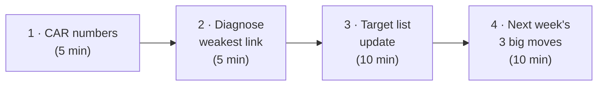
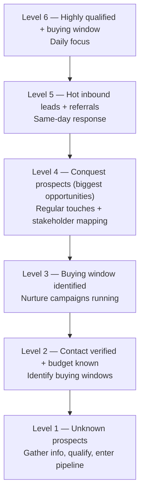

# Day 23 — Your Pipeline Board + Weekly Review

> **The one idea for today:** Not having appointments is more tiring than having them. An empty calendar kills energy; packing it — even imperfectly — sustains motion.

By the time you close today you'll have built a Strategic Target List (20 names per month, ABC + 1/2/3 segmented, trigger + approach per name), understood why Current Inventory and Recurring Inventory both matter, and run the Friday 30-minute pipeline review using the CAR diagnostic from Day 3.

---

## Why most new FCs don't have a pipeline

Ask a new FC to show you their pipeline. You'll get one of three answers:

1. *"It's in my head."*
2. A WhatsApp chat list
3. A CRM they haven't updated in 2 weeks

None of these are pipelines. A pipeline is a **single source of truth**, updated **weekly**, with **one triage action per name**. Without those three properties, it's just a contact list.

The reason Year-1 advisors burn out isn't lack of effort — it's lack of *direction*. Every Monday morning they wake up wondering *"who do I call today?"* A working pipeline board answers that question in 30 seconds.

---

## The Strategic Target List — 20 names per month

The format is deliberately simple. One sheet. Five columns:

| Column | What goes in |
|---|---|
| **Name** | Prospect or client name |
| **Tag** | A / B / C (existing clients) or 1 / 2 / 3 (prospects — Day 3 system) |
| **Trigger** | The specific reason you're reaching out to *this* person *this* month — recent life event, time since last contact, content they engaged with, referral handoff |
| **Approach** | Which script: Market Survey, Attraction, 6-step honest message, value drop, CRAB, cold DM |
| **Last contact** | Date of last substantive touch (not a LinkedIn like) |

Rules:
- **20 names minimum.** Less than 20 = you're undershooting.
- **Organise by tier.** A-clients first, then B, then 1, 2, 3. Triage energy where the odds are.
- **Trigger + approach are personalised.** Copy-pasting the same message across 20 names defeats the list.
- **Comb weekly.** Names that got contacted move out; new names move in.
- **If you have >20 names ready, make a second list** — don't cram.
- **Do it monthly at minimum, weekly if possible.**

---

## Current Inventory vs Recurring Inventory

Two types of pipeline. Both matter.

| Type | Analogy | What it is |
|---|---|---|
| **Current Inventory** | Present value | Your existing database — ABC clients, 1/2/3 prospects. What's on the books today. |
| **Recurring Inventory** | Monthly payment | The monthly flow of new leads — passive referrals, active referrals, marketing, social content, events, collaborations |

**The trap:** new FCs work Current Inventory hard in Year 1 (reactivating warm market, running Market Surveys) and neglect Recurring Inventory entirely. That works — for a while. Then Current Inventory exhausts around month 9–12, and there's no Recurring flow to replace it.

**The fix:** reserve ~20% of your weekly prospecting time for Recurring Inventory work from the start. That looks like:
- Week-3 content + stories (passive lead gen)
- Referral asks at every Fact-Find (active referrals)
- One new relationship-building activity per month — a small event, a collaboration, an outreach to a new community

The Strategic Target List handles Current. The **Recurring Inventory Budget** (20% of weekly time) handles Recurring. Both together = a pipeline that doesn't collapse at month 9.

---

## Pack-the-schedule math

The math that makes the list non-negotiable:

> **Target: 6 first-Fact-Find appointments per week × 40 working weeks = 240 appointments per year.**

Where do they come from? If you have 50 existing clients and 30% meet for annual reviews → 15 appointments. That's **2.5 weeks** of your year. The other **37.5 weeks must come from new-lead flow.**

For a Week-4 new FC, you don't have 50 clients yet. Everything is new leads. Which means:

- **Current Inventory** (your Project 100, Market Survey list) = your next 6 weeks of appointments
- **Recurring Inventory** (content, referrals, events) = what sustains you past week 6

If the Strategic Target List hits 20 names every month from day 1, and each month ~30% convert to Fact-Finds, that's **6 FHRs/month from warm market alone** — which is enough to hit the math. Not *luxurious*, but *viable*.

---

## The Friday 30-minute weekly review

One sitting. 30 minutes. Non-negotiable.

### Block 1 — CAR numbers (5 min)

Fill in your Day-3 scorecard:
- **Calls** made this week
- **Appointments** booked this week
- **Referrals** received this week
- **FYC** closed this month

Write the numbers. Don't fudge. The gap between intention and execution is the data.

### Block 2 — Diagnose the weakest link (5 min)

CAR is a loop — Calls feed Appointments feed Referrals feed back to Calls. One link is always the weakest. Find it:

- **Calls on target, Appointments low?** Your script or targeting is off. Drill Market Survey or 6-step outreach.
- **Appointments on target, Referrals zero?** You're not asking at the end of the Fact-Find. Fix the ask.
- **Calls low?** Easy one — you didn't pick up the phone enough. No script fix; just more reps.

**Pick the weakest link. Fix that one next week.** Don't try to fix all three.

### Block 3 — Target list update (10 min)

Open the Strategic Target List:
- Cross off names you contacted this week — move them to a *"contacted"* archive
- Add new names from this week's content, DMs, stories, referrals
- Make sure 20 names are ready for next week
- Re-tag anyone whose status changed (prospect → client, 1 → A, B → A)

### Block 4 — Next week's 3 big moves (10 min)

Three specific things to hit next week. Not a list of 15. Three.

Example:
- *"Deliver 3 Market Survey calls Monday morning"*
- *"Book Fri FHR with Kelly using CRAB"*
- *"Ship a Q1 testimonial post by Wednesday"*

These go in your calendar as blocks, not just intentions. Friday review → Monday execution.

---

## The *"not having appointments is more tiring"* rule

A reframe that matters more than any script in this week.

New FCs dread a calendar of 6 back-to-back Fact-Finds. It sounds exhausting. They relax on the weeks when the calendar is light.

That's backwards. **An empty calendar is the actual exhaustion.** Momentum, energy, confidence, income — all of them come from *motion*. Packing the calendar with imperfect leads sustains all four. An empty week kills all four.

The practical consequence: when you're tempted to skip the pipeline review because *"next week isn't that busy anyway,"* that's exactly the week when skipping it will break you. Do the review. Fill the list. Even if the next week's appointments are half-quality, they protect your rhythm.

---

## Team operations — log your numbers daily

The Strategic Target List above is the *input* log. The team activity tracker is the *output* log — the numbers you enter there feed the Friday review.

- **Log CAR daily** at [track.themoneybees.co/dashboard](https://track.themoneybees.co/dashboard). Don't batch at end of week — the daily habit keeps the data honest.
- **If you're on EPS**, the tracker numbers feed the monthly BTS attendance + target reviews.

Full walkthrough: [[../_source-articles/onboarding-steps-first-30-days|Onboarding Steps — First 30 Days]] §4b.

---

## The Prospecting Pyramid — 6 levels

The Strategic Target List (§2) tags prospects as A/B/C or 1/2/3. The Pyramid adds *depth* — where each name sits on the journey from unknown to buying-window.

| Level | Who they are | Daily action |
|---|---|---|
| **6** | Qualified prospect in active buying window | Daily focus — these close this month |
| **5** | Hot inbound lead / fresh referral | Same-day follow-up; enter 5–12 touch sequence |
| **4** | Conquest prospect — best/largest opportunities | Regular touches + trigger-event monitoring |
| **3** | Buying window identified | Nurture campaign (content + periodic check-in) |
| **2** | Contact details verified; budget context known | Move to Level 3 when buying window surfaces |
| **1** | Unknown prospect (thousands at the bottom) | Gather info, qualify, enter pipeline |

### How this layers on ABC/123

- **A-clients** = Level 6 equivalent (highest daily priority)
- **B-clients** + **Tier-1 prospects** = Level 4–5
- **C-clients** + **Tier-2 prospects** = Level 2–3
- **Tier-3 prospects** = Level 1

> *"Powerful lists get powerful results."* The Pyramid tells you what the *next move* is for each name — not just who to call.

**The rule:** 60% of your calling block goes to Level 5–6. 30% to Level 3–4 (nurture). 10% to Level 1–2 (qualification). Most new FCs invert this — they spend 60% on unqualified Level 1 names because it feels productive.

---

## Quiz

**Q1. The Strategic Target List is organised by:**
- A) Whoever comes to mind on Monday morning
- B) ABC / 1-2-3 tier first, then personalised trigger + approach per name ✓
- C) Alphabetical order
- D) Random — to avoid bias

**Why:** The whole point of the list is *triage*. A-clients first (highest expected revenue), then B, then 1-2-3 prospects (warmer first). Within each tier, the trigger (*why now?*) and approach (*which script?*) are personalised. "Whoever comes to mind" is the default the list is designed to replace — that default over-works Hot contacts and ignores Semi-Warm.

**Q2. Current Inventory and Recurring Inventory differ because:**
- A) Current is for new FCs, Recurring is for seniors
- B) Current is your existing database today; Recurring is the monthly flow of new leads coming in ✓
- C) Current is cold, Recurring is warm
- D) They're the same thing

**Why:** Current Inventory is your ABC + 1-2-3 database as it stands. Recurring Inventory is the monthly flow from passive referrals, content, events, and collaborations. New FCs who only work Current burn through the list by month 9 with nothing to replace it. Reserving ~20% of weekly prospecting time for Recurring from day 1 is what prevents the cliff.

**Q3. Friday's weekly review shows: Calls on target, Appointments on target, Referrals at zero. Which lever do you fix next week?**
- A) Make more Calls
- B) Book more Appointments
- C) Fix the referral ask at the end of your Fact-Finds ✓
- D) All three

**Why:** CAR diagnostic rule: fix the weakest link. Calls and Appointments are healthy — the gap is the ask stage. That means your Fact-Finds aren't ending with a referral ask, or the ask is weak. Doubling down on Calls (A) or Appointments (B) won't fix Referrals; only fixing the ask does. D spreads the repair across all three and ends up fixing none.

**Q4. The Strategic Target List has a 20-names-per-month minimum. Why not start smaller?**
- A) 20 is arbitrary
- B) Fewer names means you over-work Hot contacts, burn them, then have nothing in the pipeline — 20 enforces breadth across tiers ✓
- C) You should aim for 100
- D) 20 is the maximum

**Why:** Under-sized lists collapse to the path of least resistance — the 5 Hot names you know will respond. Those 5 burn out in weeks. 20 names forces you to include Semi-Warm and 1-2-3 prospect tiers, which is where the sustainable pipeline actually lives. If you have more than 20 ready, start a second list — don't cram.

**Q5. The pack-the-schedule math: 6 first-Fact-Find appointments × 40 working weeks = 240 per year. If you have 50 existing clients and 30% meet for annual reviews, where does the rest come from?**
- A) The same 50 clients, seeing them multiple times
- B) New-lead flow — Current Inventory covers ~2.5 weeks; the other 37.5 weeks must come from Recurring Inventory (content, referrals, events) ✓
- C) Partners sharing leads
- D) A CRM bug

**Why:** 50 × 30% = 15 review appointments = 2.5 weeks of a 40-week year. The other 37.5 weeks come from new leads. New FCs in Week 4 have 0 existing clients, so the entire 240 depends on new-lead flow — which is why the Recurring Inventory Budget (20% of weekly time for content, referrals, events) can't be postponed until *"when I have clients."*

**Q6. The Recurring Inventory Budget is:**
- A) 80% of weekly prospecting time
- B) ~20% of weekly prospecting time — reserved from Day 1 for content, referral asks, and one new relationship-building activity per month ✓
- C) A once-a-year budget review
- D) Only relevant after Month 12

**Why:** 80% of Week 4 goes to Current Inventory (your Project 100, Market Surveys, reactivations) — that's fine. The 20% you reserve for Recurring Inventory is what prevents the Month-9 cliff when Current runs out. New FCs skip Recurring because it feels unrewarding in the short run; that skip is what breaks them later.

**Q7. The "not having appointments is more tiring than having them" rule means:**
- A) You should schedule more appointments than you can handle
- B) An empty calendar kills momentum, energy, confidence, and income — packing it, even imperfectly, sustains all four ✓
- C) Appointments are physically draining
- D) The math doesn't actually favor packing

**Why:** New FCs dread a calendar of 6 back-to-back Fact-Finds — it sounds exhausting. But momentum, energy, confidence, and income all come from *motion*. The week when your calendar is light is the week when skipping the pipeline review feels safe — and that's exactly when the next week will empty out. The rule is counterintuitive but reliable: pack the calendar to protect the rhythm.

---

## Related

- Previous: [[day-22|Day 22 — Cold Prospecting + ABCD Promises]]
- Next: [[day-24|Day 24 — Practice: 30 Outreaches, 5 Appointments]]
- Week 4 overview: [[README|Week 4 — Prospecting at Volume]]
- Callback: [[../week-1/day-03|Day 3 — Your 90-Day Scorecard]] (CAR diagnostic + revenue-per-appointment math)
