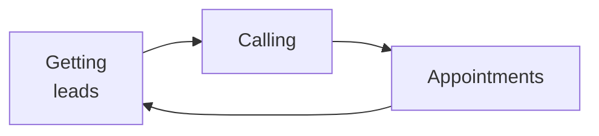
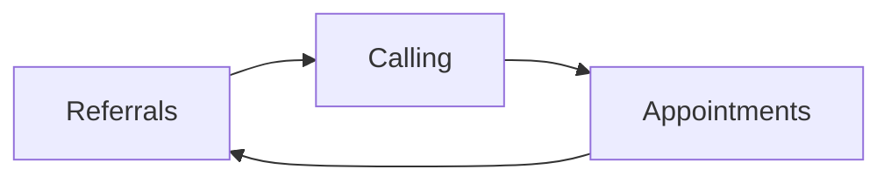

# Day 25 — Why New FCs Under-Ask

> **The one idea for today:** The silence around referrals isn't politeness. It's a compound-interest mistake paid in lost Year-2 income.

By the time you close today you'll name the 4 mental blocks that stop new FCs from asking (and which ones are culturally true for Singapore), tell apart quality referrals (personal endorsement) from cold leads dressed up as referrals (20 names with no context), and reframe the ask from *favour* to *responsibility* — the single shift that unlocks the compounding engine.

---

## The compound math

A new FC closes 10 cases in Year 1. If she asks for referrals properly, each case yields ~3 warm referrals. That's **30 warm leads** feeding Year 2.

If 40% convert, Year 2 has **12 cases from referrals alone** — before she does any new outreach. Year 3 compounds again. By Year 5, the business runs mostly on referrals.

If she *doesn't* ask, she starts Year 2 with 0. Her pipeline comes entirely from outbound effort, which caps at ~50 cases/year no matter how hard she works. Her Year-5 book looks very different.

The gap between these two advisors isn't talent. It's whether they asked. And the ask happens — or doesn't — in **Year 1**.

---

## Why new FCs don't ask

Four blocks, in roughly the order they show up:

### Block 1 — *"I'm asking for a favour."*

The reflex frame is *"I'm taking something from the client."* That framing makes the ask feel extractive, which makes it awkward, which kills delivery.

**The reframe:** you're offering a favour *to the client's friend*. If you genuinely believe your work helps, a referral is how the friend gets access. The client is the bridge — you're paying forward, not taking back.

### Block 2 — *"I haven't earned it yet."*

New FCs convince themselves they need *more proof* before asking. More time, more cases, more testimonials. They imagine a future version of themselves who deserves to ask.

**The reframe:** the moment you've just delivered a real outcome is the *best* moment to ask — not 6 months later when the feeling has faded. Proof is the outcome in front of you, not the resume behind you.

### Block 3 — *"They'll think I'm desperate."*

Desperation is a tone, not an action. The same ask — *"who else should I be talking to?"* — sounds desperate if you say it with a trailing voice, frantic pacing, or after an awkward silence. Said with Certainty tonality (Day 5), at a natural moment in the meeting, it sounds professional.

**The reframe:** this isn't whether to ask, it's how. Work on the how.

### Block 4 — *"I don't want to seem pushy."*

Pushy is a Singapore cultural read. The local norm is indirect, not extractive, and many clients *don't* refer proactively even when they're delighted — because the culture doesn't train them to. This is real.

**The reframe:** if your client has to *initiate* the referral, you're losing 90% of the revenue. Take control of the ask — don't rely on passive recommendation. Not pushy. *Responsible.*

---

## The story that breaks Block 1

A long-time advisor — 17 years in the business. Always delivered. Never asked. He hit MDRT three times through sheer outbound effort.

In year 17, he changed one thing: he started asking, every single case, using a real script with timing (Day 28's FACT Method). Hit MDRT multiple times in a row after that. Nothing else changed. Not his work. Not his products. Not his client quality. He just started asking.

He told his mentor later that what broke the block was reframing the ask as *responsibility*, not favour. *"If I actually believe my work helps people, it's my responsibility to make sure the people around my clients get access to it. The ask isn't about me."*

That's the shift. If it's about you, it feels extractive. If it's about the unnamed friend who isn't getting helped, it feels like obligation.

---

## Quality referrals vs cold leads in disguise

A common failure mode: an FC collects *"20 names"* from every client, calls all 20 cold, and converts ~1. He calls this a referral pipeline. It isn't.

| | **Quality referral** | **Cold lead in disguise** |
|---|---|---|
| **Context** | The client personally endorsed you to the contact | The client handed over a name with no endorsement |
| **Opener** | *"Hi, Amir said you might be open to a chat…"* carries the relationship in | Treated by the contact as a cold DM — often blocked |
| **Conversion** | ~40% to Fact-Find | ~5% to Fact-Find |
| **Relationship risk** | Low — Amir made the intro honestly | High — feels to the contact like Amir sold their number |

**The rule:** a referral without endorsement is a cold lead, not a warm one. You want the endorsement — even if it costs you 15 of the 20 names.

Better 3 warmly-endorsed names you can call by name than 20 cold numbers that damage relationships.

---

## The Singapore reality check

Two specific truths worth naming:

**1.** Singaporean clients typically don't refer proactively, even when delighted. The culture isn't built for it — you don't recommend a lawyer at dinner the way Americans do. The *passive* flow most advisors hope for (*"my work will speak for itself"*) doesn't arrive.

**2.** That's not a reason to give up — it's a reason to **own the ask**. If you don't run the ask actively, the referral pipeline won't appear by itself. This is the *"not pushy, responsible"* frame from Block 4.

Advisors who understand this and build an explicit referral ritual (Day 28's FACT Method script + Day 29's flywheel diagnostic) compound out of the Year-1 grind much faster than advisors who hope for passive referrals that never come.

---

## What asking actually looks like

A preview of the rest of the week — the specific mechanics are Day 26–28.

- **When** — during the admin-paperwork moment at the end of a closed case, not after the case has cooled
- **Setup** — *"Okay, I'll take 5–10 minutes to process this. While I do, let me tell you what most people do with this quiet stretch…"*
- **Ask** — specific angle (a demographic, a life stage, a personality type) rather than *"anyone you know?"*
- **Follow-up** — timeline for you to check back, locked at the moment of the ask

The short version: the ask isn't one question. It's a ritual with a setup, an anchor moment (paperwork downtime), and a specific angle. That's what Week 5 trains.

---

## The self-reinforcing vs self-destructive cycle

The compound math in §1 explains *why* to ask. This section explains why *referrals specifically* (not more outreach) are the only sustainable growth engine.

### The see-saw effect (self-destructive cycle)

New FCs face a hidden trap: every appointment *burns* a lead from the list. More appointments = more leads burned = more time needed to generate replacement leads = *less* time for appointments. The harder you push one side, the more the other side collapses.

**Left unchecked:** pipeline math goes negative. Month 6–9 the calendar empties. The FC doesn't realise the root cause — they assume they lost their touch or the market turned. Neither. They just never built the replacement engine.

### The self-reinforcing cycle

Referrals break the see-saw. When every appointment produces ≥1 warm referral, the list *refills* at the moment it gets drawn down.

Now the math inverts: more appointments → more referrals → more calls → more appointments. Each cycle grows. Year-2 FCs who run this engine barely need cold outreach. Year-5 FCs barely need active prospecting at all.

### The shift in ask priority

Which is why a counter-intuitive rule applies:

> **At every appointment, the referral ask should be as important an objective as the sale itself — sometimes more important.**

Because the sale monetises one case. The referrals monetise the *next* 5–10 cases. The compound leverage is 5–10× higher.

New FCs instinctively prioritise closing. Top producers prioritise asking. The gap between the two strategies shows up around Month 9 — the new FC's pipeline is dry; the top producer's list is full of warm-endorsed names.

### What you actually do about this

- Ask every appointment, not *"only the ones that went well"*
- Treat referral targets as pipeline KPIs, not nice-to-haves (CAR scorecard from Day 3)
- If the ask feels awkward, that's Day 26–28 territory — the mechanics fix the awkwardness

The Year-5 business is referral-driven. The Year-1 decision to treat the ask as *mandatory* is what builds the Year-5 business.

---

## Quiz

**Q1. The core reframe that breaks the *"asking is a favour"* block is:**
- A) *"The client owes me after what I did for them"*
- B) *"I'm offering a favour to the client's friend — the client is the bridge"* ✓
- C) *"Everyone does it, so I should too"*
- D) *"If I don't ask, I won't eat"*

**Why:** Frame A is extractive (client-owes-you). C is consensus-pressure, which comes across as weak. D is desperation, which kills tone. B is the shift that makes the ask feel honest: the friend doesn't yet have access to your work; the client is the person who can open that door. The ask is *"your friend would benefit,"* not *"you owe me a name."*

**Q2. Quality referrals differ from cold leads because:**
- A) Quality referrals are from HNW clients only
- B) Quality referrals carry a personal endorsement from the referring client; cold leads don't ✓
- C) Quality referrals close within a week; cold leads take months
- D) Quality referrals pay higher commission

**Why:** The endorsement is the whole difference. A name handed over with no endorsement is treated by the contact exactly like a cold DM. Better 3 warmly-endorsed names than 20 unendorsed numbers — the relationship risk of calling unendorsed contacts can damage the referring client's standing too.

**Q3. Most Singapore clients don't refer proactively even when delighted because:**
- A) The work wasn't good enough
- B) The culture doesn't train proactive recommendation the way US / AU cultures do — the passive referral flow that many advisors hope for doesn't arrive by itself ✓
- C) They're hiding wealth
- D) They don't have enough friends

**Why:** The cultural pattern in Singapore is indirect recommendation — people rarely proactively recommend service professionals at dinner the way Americans do. Advisors who rely on *"my work will speak for itself"* get passed by advisors who run an explicit, structured ask. Owning the ask isn't pushy — it's realistic.

**Q4. The compound math: if you close 10 cases in Year 1 and each produces ~3 warm referrals (40% conversion), Year 2's baseline before any new outreach is:**
- A) 0 cases — referrals don't carry across years
- B) ~12 cases from referrals alone ✓
- C) 30 cases
- D) Same as Year 1 without referrals

**Why:** 10 cases × 3 referrals × 40% = 12 Year-2 cases before you prospect a single cold lead. If you ask *zero* times in Year 1, Year 2 starts from 0 again — you're rerunning Year-1 effort forever. The gap between the two trajectories is purely whether Year 1 asks happened. This is why referral behaviour in Year 1 is compound-interest work, not a Year-2-onwards concern.

**Q5. "I haven't earned the right to ask yet" (Block 2). The reframe Day 25 offers is:**
- A) Ask anyway — clients expect to be pushed
- B) The moment you've just delivered a real outcome is the *best* moment to ask — not 6 months later when the feeling has faded ✓
- C) Wait until you've closed 10 cases
- D) Ask only after a client says thank you first

**Why:** New FCs convince themselves they need a future version of themselves to earn the ask. That future never arrives — the outcome in front of the client *is* the proof. Waiting 6 months lets the feeling fade and the ask grow awkward. Asking immediately after delivery, when the gratitude is fresh, is the lowest-friction moment you'll get.

**Q6. A new FC has closed 0 cases so far. Can they still ask for referrals this week?**
- A) No — you need closed cases first
- B) Yes — any Fact-Find, warm coffee, or substantive conversation is a legitimate ask moment ✓
- C) Only if the mentor is present
- D) Only after Week 8

**Why:** Tying referral-asking to closed cases creates a 6-month delay a new FC can't afford. Anyone you've had a substantive conversation with is fair game. *"I'm just getting started and I'm building my book — do you happen to know anyone in X stage?"* works on pre-close warm-market contacts. The ask is the rep, not the close.

**Q7. The Singapore "pushy" block (Block 4) reframes as:**
- A) Stop asking — it really is pushy
- B) Ask more softly
- C) "Not pushy. Responsible." Because if your client has to initiate the referral, you lose 90% of the revenue ✓
- D) Only ask clients from other countries

**Why:** The cultural read of "pushy" in Singapore makes advisors wait for passive recommendation that mostly doesn't come. The reframe is *responsibility* — if you genuinely believe your work helps, you can't leave that help accidentally locked behind someone else's reluctance to recommend. Owning the ask isn't pushing against culture — it's filling the gap the culture leaves open.

---

## Related

- Previous: [[../week-4/day-24|Day 24 — Practice: 30 Outreaches, 5 Appointments]]
- Next: [[day-26|Day 26 — The Referral Asking Framework]]
- Week 5 overview: [[README|Week 5 — Referrals From Day One]]
