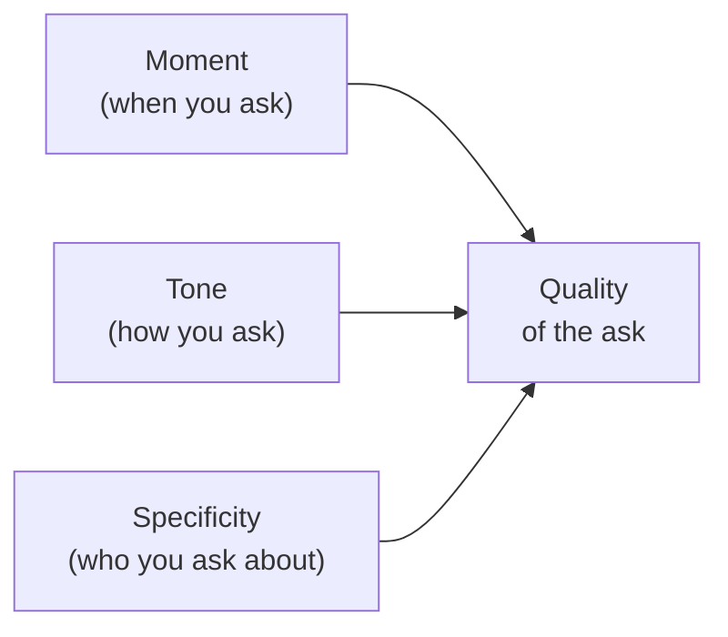

# Day 27 — Quality of the Ask

> **The one idea for today:** The same script delivered at the wrong moment, with the wrong tone, fails. The same five sentences delivered in the right context close.

By the time you close today you'll pick the right *moment* for the ask (and recognise the three moments most advisors waste), tell apart a referral ask that lands (permission to send) from one that flatlines (vague acknowledgment), and run the 3-lever context check (moment · tone · specificity) before delivering any ask.

---

## Why "what to say" isn't the bottleneck

If you interviewed 100 new FCs and asked *"do you know what to say when asking for referrals?"*, 80+ would say yes. They have a script in their head or phone.

Yet most of them barely get referrals. The bottleneck isn't the words. It's **context quality** — the three factors that decide whether the words even land.

Three levers. Get all three right and a 5-sentence ask produces 3 warm names. Miss any one and a 50-sentence ask produces zero.

---

## Lever 1 — The Moment

Most advisors ask at the worst possible moment. Three common mistakes:

### Bad moment 1 — Right after the close
*"Great — now that we've signed, who else do you know?"* reads as extractive. You've just taken their signature; asking for more immediately reads as greedy.

### Bad moment 2 — Over text, days later
*"Hey Amir — just wanted to ask, do you know anyone else who might benefit?"* — the emotional momentum from the Fact-Find is gone. The text arrives cold. They read, feel vaguely obligated, say *"let me think,"* and forget.

### Bad moment 3 — In the post-sale thank-you
*"Thanks again for trusting me — by the way, anyone else…"* blends gratitude with ask, which feels manipulative even when it isn't.

### Good moment — the admin-paperwork window

During the close, there are 5–10 minutes where you're doing admin paperwork. The client is sitting there, nothing to do, no pressure. This is the moment.

The framing: *"Okay, while I do this for you, here's what most clients do with this time…"* You're not taking time from them; you're productively using a quiet window together. This is the structural brilliance of the 10-name referral script (Day 28): it hijacks admin downtime as the ask window.

---

## Lever 2 — The Tone

Same words. Different tone. Different outcome.

### Tone that fails — the trailing ask
Voice gets quieter, sentence trails off, eye contact drops. The prospect senses hesitation and mirrors it: *"let me think about it."* Your tone taught them to hedge.

### Tone that fails — the rushed ask
You speak faster to get it over with. Your shoulders tighten. You look at the page instead of at them. They read the discomfort as *"he feels weird about this, so I should too."*

### Tone that works — Reason, grounded
This is the Day-5 tonality work. The Tone of Reason — *"end of the day, whether you choose to help or not is entirely up to you, fair?"* — makes the ask sound like the most natural part of the meeting. Steady voice. Same pace. Same eye contact. Same calm that carried the rest of the appointment.

The move: ask the referral question with the same tone you opened the meeting with. If your intent statement was calm, your referral ask should be too. Congruence is what keeps the tone invisible.

---

## Lever 3 — Specificity

*"Anyone you know?"* is a dead question. It asks the client to search their entire contact list with no filter and come up with matches. The answer is almost always *"let me think about it"* — the mental-load equivalent of *"no."*

**Specific asks work because they trigger specific memories.**

| Generic ask | Specific ask |
|---|---|
| *"Anyone you know who might benefit?"* | *"Do you know anyone in their late 30s–40s who's just started a family and is figuring out how to protect them?"* |
| *"Any friends I should chat with?"* | *"Is there a colleague in your company around your age who's probably in a similar financial stage?"* |
| *"Feel free to recommend people!"* | *"Do you know anyone who recently got promoted or moved roles? Those are the people I help most right now."* |

The specific ask cues a specific memory. *"Late 30s dad just started a family"* pulls up Aaron from accounting who just had a second kid. *"Colleague around your age in your company"* pulls up Mei Ling, three cubicles over. *"Anyone you know"* pulls up nothing.

Tomorrow's FACT Method script is built on this — Angle before Ask.

---

## Diagnostic — did the ask land?

After you deliver the ask, how do you know if it landed vs flatlined?

### Signs it landed
- They pause, tilt their head, visibly thinking *"who fits this?"*
- They name a person on the spot
- They ask a clarifying question (*"does it work for someone in their 20s too?"*)
- They commit to action (*"let me think about who fits — I'll text you"*)

### Signs it flatlined
- They nod vaguely: *"yeah sure, let me think"*
- They change topic quickly
- They say *"I don't really know anyone like that"* without pausing first
- They don't respond beyond *"mm-hmm"*

**Flatlined asks are almost always specificity failures.** The generic ask made them scan the whole contact list, come up empty, and mumble an escape. The fix isn't pushing harder — it's asking a narrower question. Try a different angle. *"What about anyone on the S profile — social, extroverted types in their 30s?"* A different angle might unlock a different memory.

---

## The honest timeline — *"when will you follow up?"*

After a referral ask, most FCs leave it at *"great, text me when you think of someone."* That never arrives. The client forgets. You lose the lead.

**The discipline:** close the ask with a timeline *you* set.

> *"Great — can you check in with those two names in the next couple of days? Let me know who's open to a chat and I'll reach out. I'll text you Saturday morning to follow up either way."*

Three moves in one line:
- **Anchor the timeline** (*"next couple of days"*) — faster commitment than *"whenever you're free"*
- **Specify the next action** (*"let me know who's open"*) — not the vague *"get back to me"*
- **Own the follow-up** (*"I'll text you Saturday"*) — takes the burden off the client

Without the timeline, 80% of soft commitments evaporate. With it, most don't.

---

## Quiz

**Q1. The three levers that decide whether a referral ask lands are:**
- A) Script · practice · confidence
- B) Moment · tone · specificity ✓
- C) Relationship · timing · reward
- D) Authority · scarcity · reciprocity

**Why:** The script matters far less than most new FCs think. What matters is *when* you ask (admin-paperwork window, not immediately post-close or over text), *how* you ask (Reason tone, not trailing or rushed), and *who you ask about* (specific demographics / life stages, not *"anyone you know"*). Miss any one and the same script produces different results.

**Q2. *"Do you know anyone who might benefit?"* tends to flatline because:**
- A) It's too long
- B) It's generic — it asks the client to search their whole contact list with no filter, which returns *"let me think"* ✓
- C) It doesn't mention money
- D) It sounds pushy

**Why:** The brain doesn't respond well to unconstrained recall. Asking someone to search 500 contacts for *"anyone who might benefit"* is a mental load the client can't fulfil on the spot — they hedge with *"let me think"* and forget. A specific filter (late-30s dads, newly promoted colleagues, small-business owners) triggers *specific memories*, which is what produces actual names.

**Q3. After the ask, the correct close is:**
- A) *"Great, let me know whenever you think of someone"*
- B) *"Can you check in with them in the next 2 days? I'll text you Saturday to follow up."* ✓
- C) *"No pressure, just let me know"*
- D) *"Thanks so much, I'll wait to hear from you"*

**Why:** Without an explicit timeline, 80% of soft referral commitments evaporate — the client intends to follow up, life happens, they forget. The correct close anchors the timeline (2 days), specifies the next action (*"let me know who's open"*), and puts the follow-up on *you*, not them. That turns a vague promise into a structured process that either converts or surfaces the *no* quickly.

**Q4. The best moment to ask for a referral is:**
- A) Immediately after the signature — use the momentum
- B) Over text, 2 days after the close — gives them time to think
- C) During the admin-paperwork window (5–10 min of quiet while you process the case) ✓
- D) At the post-sale thank-you email

**Why:** Right after signature reads as greedy (*"I took the sale, now I want more"*). Text after the close loses emotional momentum and converts to *"let me think"*. The thank-you email blends gratitude with ask, which feels manipulative. Admin paperwork is the structural sweet spot: client is already present, no pressure, time is dead — you're using it together productively.

**Q5. Signs an ask *flatlined* (vs landed) include:**
- A) They name a person on the spot
- B) They pause, tilt their head, visibly thinking
- C) They ask a clarifying question
- D) They nod vaguely with *"yeah sure, let me think"* and change topic ✓

**Why:** A, B, C are signs the ask *landed* — they triggered real recall. D is the classic flatline pattern: polite acknowledgment that's really a social-exit line. When you see it, the fix is usually specificity (narrower angle) rather than pushing harder. Try *"what about anyone on the S profile — social, extroverted types?"* A different angle cues a different memory.

**Q6. The Tone of Reason matters for the referral ask because:**
- A) It's the required tone for all financial conversations
- B) A trailing or rushed tone teaches the prospect to hedge — steady, grounded delivery makes the ask sound like a natural part of the meeting ✓
- C) It's the only tone that's polite
- D) It's specific to AIA advisors

**Why:** Same words, different tone, different outcome. A voice that gets quieter, trails off, or speeds up on the ask signals *"I'm uncomfortable asking this"* — and the prospect mirrors that discomfort with *"let me think"*. The Reason tone — calm, steady, same pace as the rest of the meeting — keeps the ask invisible-in-the-flow, which is exactly where it needs to be.

**Q7. Three specific ask examples (from the table): *"Do you know anyone in their late 30s–40s who's just started a family?"*, *"Is there a colleague around your age in your company in a similar financial stage?"*, *"Do you know anyone who recently got promoted or moved roles?"* — these all share:**
- A) They all ask about money
- B) They name a specific life-stage or identity signal the client can actually filter against ✓
- C) They mention AIA products
- D) They require the client to remember birthdays

**Why:** Each ask gives the client a specific filter — age range + life stage, or a shared attribute ("around your age in your company"), or a recent event trigger ("recently promoted"). Specific filters cue specific memories. *"Aaron just had a kid"* is recall; *"anyone you know?"* is nothing. The formula is always *{life stage / identity / trigger} + {problem you solve}*.

---

## Related

- Previous: [[day-26|Day 26 — The Referral Asking Framework]]
- Next: [[day-28|Day 28 — The Scripts Day: FACT Method + 10-Name Ask]]
- Week 5 overview: [[README|Week 5 — Referrals From Day One]]
- Callback: [[../week-1/day-05|Day 5 — Tonality]] (Reason tone for the ask)
