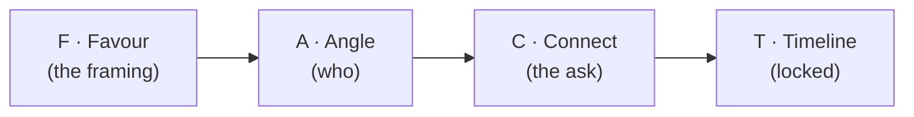

# Day 28 — The Scripts Day

> **The one idea for today:** Today is all scripts — word-for-word. Memorise two, internalise them, deliver both live before Sunday.

By the time you close today you'll deliver the FACT Method ask (Favour · Angle · Connect · Timeline) for 4 different prospect angles (retirement, young professionals, compliment-based, new parents), run the 10-Name Social-Proof script during admin paperwork (the version that produces ≥10 names almost every time), and coach the client on a sample referral text they can send on your behalf — so the intro doesn't rely on *their* phrasing.

---

## Two scripts, two moments

Two scripts matter today, each designed for a different moment:

| Script | Moment | Expected output |
|---|---|---|
| **FACT Method** | End of a Fact-Find or proposal meeting | 1–3 warm referrals, named + endorsed |
| **10-Name Social-Proof** | During admin-paperwork window at the close | 10+ names (some warm, some cold) as a batch |

Different tools for different moments. FACT is the *quality* ask — small number, high conversion. 10-Name is the *volume* ask — larger batch, converts via follow-through. Top producers run both.

---

## The FACT Method

**F**avour → **A**ngle → **C**onnect → **T**imeline

Four beats. The order matters. Angle comes before Connect because a specific angle triggers specific memory; swapping the order makes the ask generic again.

### F — Favour
Frame the question as a small favour, not a routine ask:

> *"Amir, before we wrap, I'd like to ask a quick favour…"*

### A — Angle
The specific demographic / life stage / personality type:

> *"…do you happen to know someone who's getting closer to retirement — late 40s or 50s — and might be worried about sustaining their lifestyle post-retirement?"*

### C — Connect
The specific ask — *connect us*, not *give me a name*:

> *"…I specialise in helping people like that plan their retirement. Would you be open to connecting us — ideally with a short intro text so it doesn't feel cold?"*

### T — Timeline
Lock the next move with a date:

> *"…would it be okay if you could check in with them in the next 2 days? I'll follow up with you Saturday to see where we are."*

---

## The 4 Angles — word-for-word

Rotate the angle based on who you're asking. Four proven angles:

### Angle 1 — Specific Needs (Retirement)
> *"Samantha, before you head out, I'd like to ask a quick favour. Do you happen to know someone who's getting closer to retirement — late 40s or 50s — and might be worried about sustaining their lifestyle after they stop working? I specialise in helping people like them plan for retirement, and I'd love a short conversation even if they're not sure yet. Would it be okay if you could check in with them in the next 2 days? I'll follow up with you Saturday."*

### Angle 2 — Demographics (Young Professionals)
> *"Tom, quick favour before we wrap — do you happen to know anyone in their 30s or 40s, a working professional who's just started a family and is starting to think about financial security for them? That's the exact stage I do most of my work in. Happy to chat with them, no pressure. Could you check in with them over the next 2 days? I'll text you Saturday to see where we are."*

### Angle 3 — Compliment-based (Personal Connection)
> *"Rachel — can I ask you a favour? Do you know anyone around your age — late 20s to early 30s — who has the same strong sense of responsibility and ambition that you have? Those are the people I love working with. If you think of anyone, would you be open to connecting us in the next couple of days? I'll check in with you Saturday."*

### Angle 4 — Demographics (New Parents)
> *"Linda, one last thing — do you happen to know any new parents in your circle? People who've just had a kid, or expecting their first? That's the life stage I'm doing a lot of work in right now. Happy to chat even if they're just starting to think about it. Could you check in with them in the next 2 days? I'll text you Saturday."*

**Pattern across all four:**
- Favour framing → specific angle → connect us → 2-day check-in + Saturday follow-up
- Never *"anyone you know?"*. Always a filter.

---

## The 10-Name Social-Proof Script

Different moment, different script. This one runs during the **5–10 minute admin-paperwork window** at the end of a closed case.

**Setup.** The client has just signed. You say *"give me a few minutes, I just need to process some admin — you don't need to do anything, just sit tight."* Open your laptop, start clicking things.

**Then, casually:**

> *"Right — so while I'm doing this, let me tell you what most of my clients do with this quiet stretch. Genuinely, almost 100% of the time, they end up writing down at least 10 names on this sheet. Not because I ask them hard — they just know the people they care about would benefit from the same conversation. They like me, they trust me, and they want to help their friends.*
>
> *They write down their BMT mates, platoon mates, uni friends, poly classmates, work colleagues — anyone they know, even not-super-close ones. They just spam and write as much as they can. 10 on this side, 10 on that side, 10 here — in fact they usually write more. 20, 20, 15, 20. Because they feel it's pretty useful for the people in their life.*
>
> *So while I'm doing this for you, feel free to write down at least 10 or more names. You have my word I'll do my best to help each of them."*

Hand them the sheet and a pen. Go back to admin.

**Why it works:**
- **Consensus** — *"almost 100% of the time"* normalises the behaviour
- **Reciprocity** — you're doing admin *for them* right now
- **Time arbitrage** — productive use of otherwise-dead paperwork minutes
- **Specificity anchoring** — *"20, 20, 15, 20"* raises their reference anchor
- **Permission-lowered close** — *"feel free… you have my word"* not *"you must"*

**Follow-up math.** A 10-name sheet typically yields:
- 2–3 actual warm referrals (endorsed by the client after conversation)
- 3–4 cold leads (names with no context — treat these as cold market)
- 2–3 *"actually don't talk to X"* names (exclusions)

The 10-name script *primes* the referral conversation — you still have to follow up with the client to get real endorsements on the warm names. The FACT Method is better for warm quality; 10-Name is better for volume surface.

---

## Coaching the client — a sample text they can send

Even with a great ask, the client may not know *what to say* to their friend. Give them a template they can adapt or copy-paste:

> *"Hey [friend's name], hope you're well! Quick one — I wanted to share something that's been really useful for me recently.*
>
> *You know how we all have financial advisors at some point? I used to have a couple myself, but I met my current FC, [your name], who actually took the time to look at my whole picture — not just sell me something. He/she pointed out a few gaps I'd missed that my previous advisors never did.*
>
> *Even if you feel satisfied with your current setup, it might be worth having a quick conversation with [your name]. They offer a fresh perspective and might catch something worth thinking about.*
>
> *If you're interested, I'd be happy to connect you two — just let me know."*

**Why this works:**
- **Respects their existing advisor** — the friend doesn't have to *leave* anyone
- **Frames the meeting as *adding* a perspective** — not replacing
- **Low-commitment hook** — *"if you're interested"* is an easy yes

Send this template to your client after they've agreed to refer. *"Here's a version other clients have sent — feel free to adapt to your voice."* Most clients gratefully copy-paste because they didn't want to figure out what to say.

---

## When direct asking doesn't work — events as an alternative

Some clients genuinely can't bring themselves to send a direct message. Culture, personality, awkwardness with specific friends — the reason varies.

**The workaround:** invite them (and implicitly their contacts) to an event. A talk, a small workshop, a casual gathering.

> *"Hey — I'm doing a small 30-minute session next month on retirement planning for people in their 40s–50s. If there's anyone in your life you think might find it useful, feel free to forward the invite. No pressure either way."*

Why events work for shy ambassadors:
- **Lower social cost** — forwarding a 30-minute talk is easier than recommending an advisor
- **The friend self-selects** — they attend if interested
- **You meet them in a group setting** — no one-on-one pressure

Events aren't the primary tool. They're the plan B when direct asks consistently don't work with a specific client.

---

## Quiz

**Q1. FACT Method stands for:**
- A) Friendly, Authentic, Clear, Timely
- B) Favour · Angle · Connect · Timeline ✓
- C) Focused, Accurate, Credible, Tested
- D) Family, Associates, Colleagues, Teammates

**Why:** Each letter is a specific beat of the ask. Favour frames it as a small request, not a routine one. Angle is the specific demographic / life stage (the filter that triggers specific memory). Connect is the *connect-us* ask, not *give-me-a-name*. Timeline locks the next move so the referral doesn't evaporate. Swapping the order breaks the flow — Angle must come before Connect to cue the specific memory.

**Q2. The 10-Name Social-Proof script works at the admin-paperwork moment because:**
- A) The client can't escape during paperwork
- B) It's the end of the meeting, so the ask has to happen then
- C) Consensus + reciprocity + time arbitrage + specificity anchoring all stack in that moment ✓
- D) The paperwork is intimidating, so they'll agree to anything

**Why:** Consensus — *"almost 100% of clients do this"* normalises the behaviour. Reciprocity — you're doing admin *for them* right now, so a balancing act feels natural. Time arbitrage — the paperwork window is dead time, so you're converting it to productive time *for both*. Specificity anchoring — *"20, 20, 15, 20"* raises the reference anchor for how many names is normal. All four stack in one moment.

**Q3. A client struggles to refer directly to friends. The best workaround is:**
- A) Pressure them harder
- B) Drop the referral ask with that client entirely
- C) Invite them to forward an event or small workshop you're running — lower social cost than a direct recommendation ✓
- D) Ask a different client for more names

**Why:** Some clients can't do direct recommendation — cultural, personal, or specific-to-the-friendship reasons. Pressuring them damages the relationship. Dropping the ask loses the referrer entirely. The workaround is *lower the social cost*: forwarding an event invite is easier than recommending an advisor, and the friend self-selects whether to attend. Events are plan-B, not the default — but they exist for exactly this reason.

**Q4. Day 28 uses both FACT Method and 10-Name Social-Proof. The key difference between them is:**
- A) FACT is for cold prospects; 10-Name is for warm
- B) FACT is the *quality* ask (small number, high conversion, end of Fact-Find); 10-Name is the *volume* ask (larger batch, during admin paperwork) ✓
- C) FACT is for juniors; 10-Name is for seniors
- D) They produce identical outcomes

**Why:** Different tools for different moments. FACT at the end of a warm conversation produces 1–3 named, endorsed referrals. 10-Name at the admin window produces a batch of 10–20 names (mixed warmth) that you then surface individual warm ones from. Top producers run both — quality for the converted pipeline, volume for the surface area.

**Q5. A client writes 18 names on the 10-Name admin sheet. Which of these is the correct next move?**
- A) Call all 18 cold, citing the client's name
- B) Follow up with the client: *"out of these 18, which 3 do you know best? Can I get a personal intro from you?"* ✓
- C) Ignore the list — 10-Name scripts rarely produce usable names
- D) Post the list to your team for them to divide up

**Why:** 18 names without endorsement are cold leads (with the added relationship risk that cold-calling them may damage the referrer's standing). The real warm referrals come from the *follow-up conversation* where you ask the client to pick 3 and offer to make personal introductions. That's where the 10-Name script converts from volume to quality. Calling all 18 cold (A) burns the referrer.

**Q6. The client-coaching text template ("Even if you feel satisfied with your current setup, it might be worth having a quick conversation...") works because:**
- A) It aggressively asks for the friend's business
- B) It respects the friend's existing advisor, frames your meeting as *adding* a perspective not replacing, and uses a low-commitment hook ✓
- C) It undercuts competitors on price
- D) It's translated into multiple languages

**Why:** The template solves a specific problem — most friends already have an advisor and feel uncomfortable "changing." Framing your meeting as an *additional perspective*, not a replacement, removes the emotional friction of disloyalty. *"If you're interested"* as the close makes yes easy. The template is handed to the referring client so they don't have to invent wording — most gratefully copy-paste it.

**Q7. FACT Method's "T — Timeline" beat typically closes with:**
- A) *"Let me know whenever you get a chance"*
- B) *"Would it be okay if you could check in with them in the next 2 days? I'll follow up with you Saturday to see where we are"* ✓
- C) *"No rush at all — take your time"*
- D) *"I'll wait to hear from you"*

**Why:** Vague timelines (A, C, D) produce soft commitments that evaporate. The FACT close specifies the next action ("check in with them"), the window (2 days), and owns the follow-up (I'll text Saturday). Three anchor moves in one sentence. Without them, the referral is an intention; with them, it's a structured process that either converts or surfaces the *no* quickly.

---

## Related

- Previous: [[day-27|Day 27 — Quality of the Ask: Context > Script]]
- Next: [[day-29|Day 29 — The Flywheel + CAR Diagnostic]]
- Week 5 overview: [[README|Week 5 — Referrals From Day One]]
