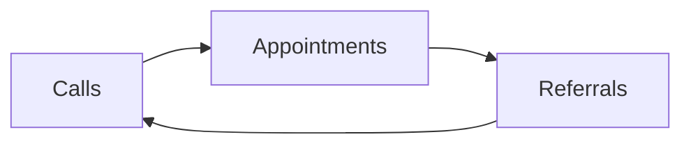

# Day 29 — The Flywheel + CAR Diagnostic

> **The one idea for today:** The sales cycle is either slow or self-regenerating. Today you learn how to move from one to the other — and how to diagnose which bottleneck is blocking the flip.

By the time you close today you'll tell apart the slow sales cycle (outbound effort) from the self-regenerating one (referrals feed next week's pipeline), diagnose using the CAR framework (Calling · Appointments · Referrals) which of the three is your weakest link today, and commit to the 3 behaviours that flip the cycle from slow to regenerating within 6–12 months.

---

## Two states of the sales cycle

Every advisor's business lives in one of two states:

| State | What drives next week's pipeline |
|---|---|
| **Slow sales cycle** | Outbound effort. You wake up, you dial, you email, you DM. If you stop, pipeline stops. |
| **Self-regenerating** | Referrals from last quarter feed this quarter's pipeline automatically. You still dial — but the base level isn't zero when you pause. |

**Every new FC starts in the slow cycle.** That's not a failure state — it's the default. The question is whether you can flip within 12 months or stay stuck in slow mode for 5 years.

The flip isn't a lightning moment. It's a gradient. Your pipeline moves from *"100% from my own outbound"* toward *"30% outbound + 70% referrals"* over 12–24 months. The FACT Method and 10-Name script from yesterday are the specific tools; CAR is the weekly diagnostic that tells you whether the flip is happening.

---

## The CAR framework — revisited with referrals integrated

Three metrics. Circular. Self-regenerating when all three are healthy.

- **C — Calls** — outreach volume. Phone calls, DMs, texts, Market Surveys.
- **A — Appointments** — Fact-Finds booked (not *"will meet soon"* — confirmed).
- **R — Referrals** — warm names received, endorsed, this week.

The loop: **Referrals feed next week's Calls.** If R is zero for 6 weeks in a row, C becomes entirely outbound (slow cycle). If R is 2–3 per week for 6 weeks, C starts to get a *warm* component on top of outbound (flip is underway).

---

## CAR diagnostic — the 3 bottlenecks

Week-to-week, one of the three is always weakest. Find it. Fix it. Don't scatter-shot.

| Bottleneck | Cascade downstream | Fix |
|---|---|---|
| **Few Calls** | Fewer Appointments → Fewer Referrals → Fewer Leads to call | Volume discipline. Block calling time. No script fix needed; just pick up the phone. |
| **Calls healthy, Appointments low** | Fewer Referrals → Fewer Leads | Script / targeting. Review Market Survey Q4 delivery. Audit the opener. |
| **Calls + Appointments healthy, Referrals zero** | Next week you'll have to re-start from outbound. Slow cycle stays slow. | The ask itself — either you're not asking, or the ask is flatlining (Day 27). |

**The rule of the weekly review:** pick the single weakest link. Fix that one link next week. Trying to fix all three at once spreads effort and fixes none.

---

## The math when the flywheel starts turning

Rough numbers when CAR is healthy:

| Metric | Value |
|---|---:|
| Hours spent calling per week | 10 |
| Appointments booked per calling hour | 1 |
| Closing ratio | 40% |
| Avg case size | $800–$1,000 |
| **Weekly income** | **$3,200–$4,000** |

Once all three links are humming, weekly income becomes a function of *hours dialed × closing ratio × case size*. No mystery, no magic — just discipline applied to a working loop.

**The trap:** new FCs see these numbers and optimise the wrong variable. They try to raise case size before they've stabilised Calls. Or they push closing ratio before they have enough Appointments to practice on. **Stabilise Calls first. Then Appointments. Then ask for Referrals on every one. Then close.** That order.

---

## Events as a systemic referral accelerant

Direct asks work. Events add *volume* to the referral engine for shy clients who can't or won't recommend directly.

**The mechanics:**
- Run a small 30-minute talk or workshop quarterly on a relevant topic (retirement, new parents, business owners)
- Invite your client base
- Tell them: *"feel free to forward to anyone you think would find it useful"*
- Count how many forwards + attendees
- Follow up individually with attendees who engaged

Small, quarterly, niche-specific events can generate 10–20 net new leads per run. Not a replacement for the 1:1 ask — a complement. The ask handles quality, events handle volume.

**Note on Week-5 expectations.** Most new FCs don't run events in month 2. This is for Quarter 2 planning — put a placeholder in the calendar now, run it when the book supports 10 invitees.

---

## The 3 behaviours that flip the cycle

Three behaviours, compound over 12 months. Get all three in place by Week 6.

### Behaviour 1 — Ask every time
Every Fact-Find ends with the FACT Method ask. Every closed case uses the 10-Name script. No exceptions. If you skip the ask on even 20% of cases, the flywheel never turns.

### Behaviour 2 — Follow through within 48 hours
When a client sends a referral, reach out to the referred name within 48 hours. Any longer and the warm introduction cools. *"Hi Aaron — [client name] mentioned you two had spoken. Happy to jump on a quick call whenever suits — Thursday or Saturday work?"*

### Behaviour 3 — Close the loop back to the referrer
After you've met the referred prospect, text the referrer back. *"Hey Amir — just met Aaron yesterday, really appreciate the intro. He's in a great spot, we'll probably do a proper planning session next month. Thanks again."*

This closes the social loop — the referrer feels acknowledged, which massively increases the chance they refer again. Most advisors skip this step, which is exactly why their referral engine stays single-use instead of compound.

---

## Systems before motivation

A quiet truth about the flywheel: motivation doesn't sustain any of the three behaviours. Systems do.

- **CRM reminder** for every new referral → 48-hour outreach
- **Post-meeting ritual** — always text the referrer within an hour of the meeting ending
- **Weekly Friday review** — check that every case closed in the week had a referral ask attempted

Motivation is fickle. Systems aren't. If you're still relying on *"I'll ask when I remember,"* you won't. Build the system.

---

## The Year-1 survivorship cut — why most who quit would have made it

Weeks 1–4 taught you the outbound engine. Week 5 is about flipping it into a self-regenerating one. That flip is a 12–24 month arc. Which means for most of your first year, you're running pure outbound — and outbound is exhausting.

The advisors who quit in Year 1 almost never quit because of the work. They quit because of the *feeling* of the work — months of effort that haven't yet produced compound returns. The flywheel is spinning but quietly. The results haven't stacked yet. It looks to them like nothing is happening, because compounding is invisible until it isn't.

**The survivorship cut runs on three distinctions.**

| What survivors do | What quitters do |
|---|---|
| Trust the math when the mirror doesn't show it yet | Trust the mirror over the math |
| Count input (asks delivered, outreaches sent) | Count output (cases closed, income received) |
| Measure themselves against their Week-1 self | Measure themselves against a Year-5 advisor |

None of the three require talent. They require a small, boring, unfashionable discipline: *believe the math this month, and the mirror will catch up by Month 9.*

**The drill.** In the front of your notebook, write two numbers each Sunday: (a) how many asks / outreaches you did last week, (b) how many your Week-1 self did. If (a) > (b), the engine is compounding. Income will catch up.

Most quitters would not have quit if they'd run this one-minute check every Sunday for 6 months. The check is the immune system for the 10pm-Wednesday fog becoming a month-long fog.

---

## Quiz

**Q1. The key difference between a slow sales cycle and a self-regenerating one is:**
- A) The slow cycle is inefficient; the fast cycle is efficient
- B) In the slow cycle, next week's pipeline comes entirely from your outbound; in the self-regenerating cycle, last quarter's referrals feed this week's pipeline ✓
- C) Slow = less money; regenerating = more money
- D) They're the same thing

**Why:** The distinction is *what drives next week's pipeline*. Slow cycle: if you stop dialing, pipeline stops. Self-regenerating: if you stop dialing, pipeline slows but doesn't hit zero — because referrals from earlier quarters are still flowing in. The flip takes 12–24 months to fully materialise, and it happens through the 3 behaviours (ask / follow through / close the loop), not through working harder.

**Q2. Your Week-5 review shows: Calls 35 (healthy), Appointments 6 (healthy), Referrals 0. Which link do you fix in Week 6?**
- A) Calls — make more
- B) Appointments — book more
- C) Referrals — the zero is the diagnostic signal ✓
- D) Wait and see

**Why:** CAR diagnostic rule: fix the weakest link. Calls and Appointments are both in a good range — the breakdown is at the referral stage. That tells you either (a) you're not asking on every Fact-Find, or (b) the ask is flatlining (Day 27 specificity / tone issue). Doubling down on Calls or Appointments won't fix R; only fixing the ask does.

**Q3. The third of the 3 flywheel-flipping behaviours (closing the loop back to the referrer) matters because:**
- A) It's polite
- B) It makes the referrer feel acknowledged, which massively raises the chance they refer again — turning a single-use referral into a compound one ✓
- C) It's required by compliance
- D) It helps with follow-up paperwork

**Why:** Most advisors reach out to the referred name and then go silent on the original referrer. That's why their referral engine stays single-use — each client might refer once, but doesn't build a *"I've referred her 3 times, she always takes care of my people"* relationship. Closing the loop is the compound move. One sentence of follow-up earns you 10 future referrals across the client's life.

**Q4. The 3 behaviours that flip the cycle from slow to self-regenerating are:**
- A) Call more, close harder, follow up longer
- B) Ask every time, follow through within 48 hours, close the loop back to the referrer ✓
- C) Track metrics, hire assistants, automate follow-up
- D) Only work with HNW clients

**Why:** Ask-every-time is the input. Follow-through-in-48h preserves the warm introduction before it cools. Close-the-loop is what turns a single referral into ongoing compound behaviour from the referrer. Skipping any one of the three breaks the flywheel: skip the ask → no names; delay follow-through → name evaporates; skip the loop-close → referrer never refers again.

**Q5. "Motivation doesn't sustain any of the three behaviours. Systems do." What's an example of a system that sustains Behaviour 2 (48-hour follow-through)?**
- A) Telling yourself to work harder
- B) A CRM reminder triggered when a new referral name is logged → pings you within 48h ✓
- C) Hiring a VA to remind you
- D) Writing the name on your hand

**Why:** Motivation comes and goes — Wednesday evening you feel like reaching out, Thursday morning you don't. A CRM reminder (or Notion / Apple Reminders / any tool) executes regardless of your mood. The first time the ping fires and you reach out because the system told you to, you realise: this is how compounding advisors run their back office. It's not discipline. It's triggers.

**Q6. The Year-1 survivorship cut says the key distinction between survivors and quitters is:**
- A) Talent
- B) Hours worked
- C) Trusting the math when the mirror doesn't show it yet — measuring input vs your Week-1 self, not output vs a Year-5 advisor ✓
- D) Luck with early clients

**Why:** Compounding is invisible until it isn't. Year-1 input (asks, outreaches, referrals-attempted) compounds into Year-2 output (cases, income). But Year-1 learners can only see Year-1 output — which looks small against a Year-5 advisor's book. The survivorship cut is: count input, measure against your own starting line, trust that Month 9 catches up with Month 3. Quitters reverse all three.

**Q7. The "close-the-loop" text after meeting a referred prospect is best sent:**
- A) A week later, after you've figured out next steps
- B) Within an hour of the meeting ending — the referrer should hear about it before the evening ✓
- C) Only if the referred prospect closes
- D) Never — the referrer doesn't need to know

**Why:** Immediacy is the signal. A same-day text (*"just met Aaron, really appreciate the intro, we'll probably do a proper session next month"*) tells the referrer their intro mattered and was taken seriously. A week-later update reads as an afterthought. Waiting until close burns the loop — most advisors do this, which is why their referral engine stays single-use. Tell the referrer *before* you know the outcome; that's what earns the next referral.

---

## Related

- Previous: [[day-28|Day 28 — The Scripts Day]]
- Next: [[day-30|Day 30 — Practice: 10 Asks Delivered, 3 Logged]]
- Week 5 overview: [[README|Week 5 — Referrals From Day One]]
- Callback: [[../week-1/day-03|Day 3 — Your 90-Day Scorecard]] (CAR scorecard setup)
